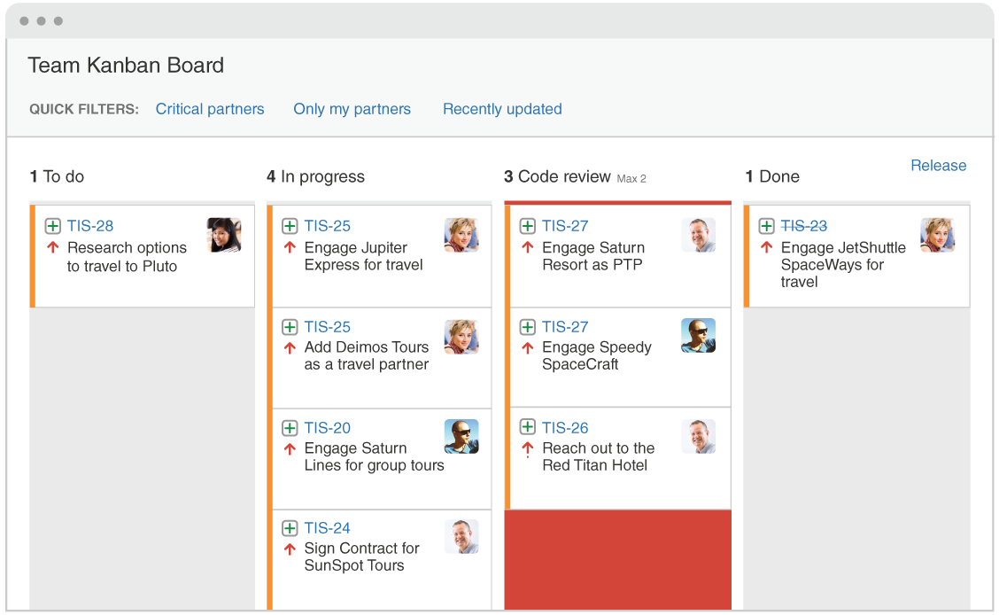
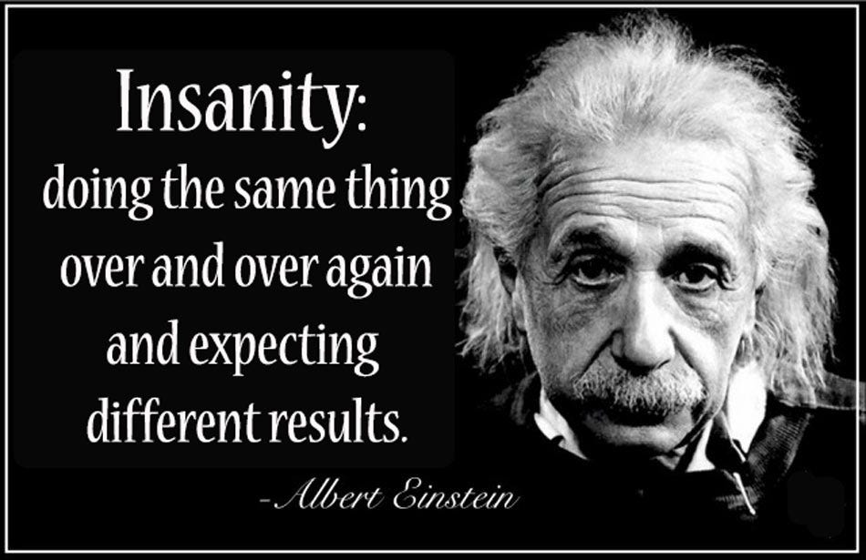

## 4 Steps to Bring Life into a Struggling Project

At the initial stages of a new business or a startup, when the future is unknown, people often opt for short-term solutions in product development. These short term solutions often result in hiring and changing contractors, delivering code with [technical debts](https://martinfowler.com/bliki/TechnicalDebt.html), constant requirements changes.

When the product finally starts getting traction by acquiring users or paying customers, the business is now ready for investment and the product is ready to scale… or not?

The short term trade-offs made once often come at a high price. With technical debts, reducing the velocity of delivering new features, the business now has a dilemma. But does the business drop the initial product version and begin a re-write that takes into consideration all the new knowledge? Or does the business continue to support older product and fix its mistakes? These are hard decisions to make: not only for the business owners, but also investors, employees, and everyone else involved.

If the business decides to invest in the improvement and growth of its existing solution, common project issues that might arise can be categorized as follows:

 1. [Darkness](#72c7): No plan, and no one knows what needs to be done.

 2. [Confusion](#fe38): Lack of documentation and process specifications.

 3. [Rust](#8e74): Developers are extremely slow to deliver work.

 4. [“Deja Vu”](#15b9): A huge number of repeated bugs exist in the product.

To move the project forward, each category needs to be permanently eliminated.

## Eliminating The Darkness

### Signs of the Darkness Problem:

 1. Can not see progress in real-time;

 2. Deadlines keep shifting;

 3. Developers do not understand the big picture, and cannot decide how to approach the new tasks.

The practices we use to solve this are based on [Lean](https://leankit.com/blog/2015/05/welcome-to-the-new-lean/) and [Kanban Methodology](https://www.atlassian.com/agile/kanban). They are simple, scalable, and are used by the best development teams across the world.

Addressing the problem and introducing the methodology, we start with [Kanban Board](https://leankit.com/learn/kanban/kanban-board/).

At a quick glance, everyone has transparency in the project and can see the following:

* What state each task is in

* Who is working on what

* What work is blocked

* Where the bottlenecks are

**Our solutions:** [GitHub](https://github.com/) with [Waffle Integration](https://waffle.io/)

## Eliminating The Confusion

### Signs of the Confusion Problem:

 1. Setting up New Production, Staging or Development instances takes too much time, especially for people who are new to the team;

 2. There are “experts” on your team who “are the only ones who understand the production configuration”.

We expect that all development processes should be clear and simple for anyone, regardless of their expertise level. Clear documentation ****is an essential way of ensuring developer productivity, ease of maintenance, and project longevity.

When we ensure the processes for product delivery, all development aspects are sufficiently documented, and new team members do not require excessive guidance from their colleagues to set up development environments, understand the technologies, and start building the product. When routine tasks can be automated, we do so. For example, automatically checking a pull request for code style violations and disabling the Merge button if there are any, is far more efficient than a written instruction “check code style before merging”.

**We automated things such as:** Setting Up Environments, Running Tests, Code Style Checking, & Auto-Deployment.

## Eliminating The Rust

### Signs of the Rust Problem:

 1. Delivering new features takes excessive time to build, integrate and verify;

 2. There is a long list of partially done features.

In software development, Rust is when you have stale issues that have not been updated for some time or issues that you cannot deliver.

### Break Big Tasks Into Smaller Pieces

Creating smaller, more manageable tasks allows the project team to avoid stress and procrastination and focus on high-quality development, testing, and collaboration.

We should not hesitate and split tasks in the middle of work.

**Our constraint:** 2 days per task

### Setup Work In Progress Limits

In combination with Kanban, we can eliminate Staled Code by limiting Work In Progress of team members. Work In Progress Limits helps teams focus on correct decisions, completion, and quality. Also, highlight bottlenecks in a team’s delivery pipeline before a situation becomes dire.

**Our Limits:** Each Person focuses on *2 Items only at a time.*

## Eliminating The “Deja Vu”

### Signs of the “Deja Vu” Problem:

 1. The same bugs frequently reappear;

 2. Changes on one part break another part of the application.

This is incredibly frustrating. Persistent bugs not only frustrate customers that run into them, but frustrate team members who constantly address them.

### Resurrect Automated Testing and Continuous Integration

Unit and small integration tests are one of the best things you can do to reduce regression, which all this should be combined with Continuous Integration. In addition, all new changes need to be covered by tests.

In addition, using a [TDD](https://martinfowler.com/bliki/TestDrivenDevelopment.html) approach can easily make changes to application — all without fear of ‘breaking’ the application and hamstringing their daily operations.

**Out tools:** [CircleCI](https://circleci.com/)

### Verify New Changes

Just like authors of novels, authors of software need their peers to review their work in detail to ensure their work is successfully published.

[Code Review](https://www.atlassian.com/agile/code-reviews) is crucial and has been repeatedly shown to accelerate and streamline the process of software development.

With Code Review, team members can verify the new changes under an isolated testing environment. It makes verification much easier and the developer will not have to review broken, co-mingled code from other members’ changes on staging.

As a result, we can eliminate several problems and:

* Deliver defect-free, readable and well-documented software;

* Facilitate the sharing of knowledge between developers.

**We found useful:** [Heroku Review App](https://devcenter.heroku.com/articles/github-integration-review-apps) and [GitHub](https://github.com/)

## Summary

These outlined practices are very simple and easy to integrate, but at the same time produce lasting and impactful results in short time.

These recommendations are amongst many requirements when integrating effective lean and agile practices. With an effective development pipeline, healthy engineering teams can be built.

Are you ready to move to bring your struggling project back to live? [Contact us](https://jetthoughts.com/contact-us/) to find out more about how we work. We’re excited to help you — as always, we’d love to hear what you think!

### See also:

* Atlassian’s Guide: [The Agile Coach](https://www.atlassian.com/agile)

* Google’s Posts: [Hackable Projects](https://testing.googleblog.com/2016/08/hackable-projects.html)

* Carbon Five’s Posts: [The 10 Practices of Healthy Engineering Teams](http://blog.carbonfive.com/2016/02/17/the-10-practices-of-healthy-engineering-teams-part-1/)

**Paul Keen** is an Open Source Contributor and a Chief Technology Officer at [JetThoughts](https://www.jetthoughts.com). Follow him on [LinkedIn](https://www.linkedin.com/in/paul-keen/) or [GitHub](https://github.com/pftg).
>  If you enjoyed this story, we recommend reading our [latest tech stories](https://jtway.co/latest) and [trending tech stories](https://jtway.co/trending).
