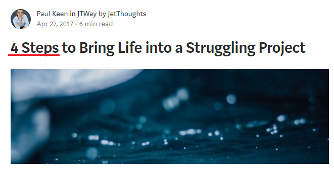

How to improve your writing, and create not just a good headline, but a catchy one? No matter what your content type is, and if you’re either writing a small post or an in-depth report.

The headline is the first thing people will see on a page. Copyblogger estimated that 8 out of 10 people read the title. However, the title doesn’t keep them reading through your blog content. With these headline writing tricks, you’ll get attention from readers immediately.

Let’s get started.

 on [Unsplash](https://unsplash.com/s/photos/article?utm_source=unsplash&utm_medium=referral&utm_content=creditCopyText)](file_0.jpeg)

### **Step #1: Use numbers & data in your headline**

Using numbers and data into your headline is an effective way to make your headlines more fascinating to readers. Several research studies have shown that headlines with numbers tend to generate 73% more social shares and engagement.

### **Step #2: Take a unique rationale into account**

Use unique rationales to write great headlines. The word “rationale” simply means “an underlying reason on why something should be done.”

***Some of the rationales that you can include in your headlines are: ***Tips, Reasons, Lessons, Tricks, Ideas, Ways, Principles, Facts, Secrets, Strategies

### **Step #3: Call for attention**

‘Attention’ simply means mental focus and serious concentration on a given task. How to get it? Here are 4 rules to follow:

* Make the headline **unique**

‘Unique’ means being one of a kind. In other words, your headline has to be different from others. But, how do you test for uniqueness?

*Simple tip:* plug it into Google and enclose the headline in double quotation marks.

* Be **ultra-specific**

Your prospects have questions and they want answers. If you can provide them with an ultra-specific headline and the answer to their questions, you will convert them into loyal readers and customers. The more precise you are, the more authority you’ll gain in your industry.

* It should convey a sense of **urgency**

Urgency-based headlines will always grab attention because it makes the reader anticipate what comes next. They don’t want to miss out on what’s on the other side of the headline, once it’s clicked.

* Your headline has to be **useful**

Useful can mean several things — practical, helpful, valuable, informative, worthwhile, beneficial, advantageous and so on. The bottom line is to help the readers experience hope, knowing that their problem can still be solved.

### **Step #4: Use headline formulas**

What makes a headline good is it’s a formula. Every content marketer has one or more formulas for writing headlines. When using formulas, make sure to include power words that will get people to buy your product or join your waiting list.

* *‘Little known ways’ *formula: How many times have you used this formula to write a catchy headline? Discovered that the *‘little known ways [put your solution here]’* formula is typically a social magnet.

* *‘Get rid of [problem] once and for all’ *formula: Who wouldn’t want to permanently get rid of an annoying problem that they’re faced with on a daily basis? When you write your headlines with this strategy in mind, you’ll captivate your audience from start to finish, because they want to know the secret, too.

**Ruslana** is a Lead Generation Manager at [JetThoughts](https://www.jetthoughts.com/). Follow her on [LinkedIn](https://www.linkedin.com/in/ruslana-brykaliuk-970016135/).
>  If you enjoyed this story, we recommend reading our [latest tech stories](https://jtway.co/latest) and [trending tech stories](https://jtway.co/trending).
