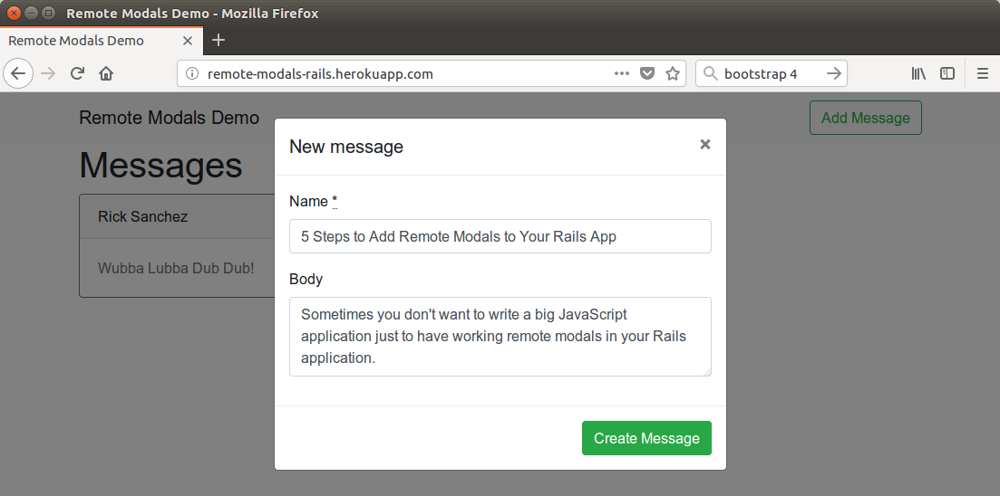

Sometimes you don’t want to write big JavaScript application just to have working remote modals in your rails application. The whole JSON-response parsing thing looks big and scary. Why can’t we simply render our views on a server and just display them as modals to users? Let’s take a look at how we can implement this with elegance.



***Note: I am using [bootstrap 4](https://getbootstrap.com/) modals here but this solution can be adapted to any JS modals implementations.***

Check out [working demo](https://remote-modals-rails.herokuapp.com/) and [source code](https://github.com/jetthoughts/remote_modals_demo).

## Step 0. Prepare your bundle

### Rails 4.2+

respond_with and the class-level respond_to methods [have been extracted](http://guides.rubyonrails.org/upgrading_ruby_on_rails.html#responders) to the responders gem. To use them, simply add gem 'responders', '~> 2.0' to your Gemfile.

### Other dependencies

You need to installbootstrap and jquery. Don’t forget to include them to asset pipeline.
```
    gem 'bootstrap'

    gem 'jquery-rails'
```
## Step 1. Modify your layout files

```html
<%# app/views/layouts/modal.html.erb %>

<div class="modal" id="mainModal" tabindex="-1" role="dialog" aria-labelledby="mainModalLabel" aria-hidden="true">
  <div class="modal-dialog">
    <div class="modal-content">
      <div class="modal-header">
        <button type="button" class="close" data-dismiss="modal"><span aria-hidden="true">&times;</span><span class="sr-only">Close</span></button>
        <h4 class="modal-title" id="mainModalLabel">
          <%= yield :title if content_for? :title %>&nbsp;
        </h4>
      </div>

      <%= yield %>
    </div>
  </div>
</div>
```

Also, we need to define a place where modals will be rendered. Let’s add it to application layout:

```html
<%# app/views/layouts/application.html.erb %>

<div id="modal-holder"></div>
```

## Step 2. Create modal.js

Now, we can move to the JavaScript part of our modals implementation. We want our links with data-modal attribute to be rendered in modal windows.

Also, we need to work on the remote forms submit. The application should properly handle redirects to the given page and form re-displays with errors. Let’s assume that if the response has Location header set, then we need to redirect the user to the given location, otherwise, we will re-display the form.

```javascript
// app/assets/javascripts/modals.js

$(function() {
  const modal_holder_selector = '#modal-holder';
  const modal_selector = '.modal';

  $(document).on('click', 'a[data-modal]', function() {
    const location = $(this).attr('href');
    // Load modal dialog from server
    $.get(
      location,
      data => { $(modal_holder_selector).html(data).find(modal_selector).modal() }
    );
    return false;
  });

  $(document).on('ajax:success', 'form[data-modal]', function(event){
    const [data, _status, xhr] = event.detail;
    const url = xhr.getResponseHeader('Location');
    if (url) {
      // Redirect to url
      window.location = url;
    } else {
      // Remove old modal backdrop
      $('.modal-backdrop').remove();
      // Update modal content
      const modal = $(data).find('body').html();
      $(modal_holder_selector).html(modal).find(modal_selector).modal();
    }

    return false;
  });
});
```

## **Step 3. Create Modal Responder**

OK, now when we have prepared our front-end, we need to implement the server-side logic.

I am widely using respond_with in my applications, so I want something similar for modals.

The respond_with method is using the ActionController::Responder class for result rendering. Let’s make our own implementation and call it ModalResponder.

```ruby
class ModalResponder < ActionController::Responder
  cattr_accessor :modal_layout
  self.modal_layout = 'modal'

  def render(*args)
    options = args.extract_options!
    if request.xhr?
      options.merge! layout: modal_layout
    end
    controller.render *args, options
  end

  def default_render(*args)
    render(*args)
  end

  def redirect_to(options)
    if request.xhr?
      head :ok, location: controller.url_for(options)
    else
      controller.redirect_to(options)
    end
  end
end
```

Here, we are overriding render and redirect_to methods to give them the new behavior when request is made via XHR.

If request is made via AJAX we want render to use our custom modal layout. And instead of redirecting we want redirect_to to return only headers with location header set which will handle our JS logic.

## **Step 4. Modify Application Controller**

Now, when we have our custom, let’s add our own helper respond_modal_with. It will call the respond_with method with ModalResponder specified as the responder:

```ruby
class ApplicationController < ActionController::Base
  protect_from_forgery with: :exception

  def respond_modal_with(*args, &blk)
    options = args.extract_options!
    options[:responder] = ModalResponder
    respond_with *args, options, &blk
  end
end
```

## **Step 5. Use it!**

OK, now we have everything to use our cool remote modals. Let’s use them!

Well, in the first place, we need to add a link to the modal:

```html
<%# app/views/layouts/_header.html.erb %>
<%= link_to 'Add Message', new_message_path, class: 'btn btn-outline-success my-2 my-sm-0', data: { modal: true } %>
```

Now, we need to modify our controller using our new respond_modal_with method instead of respond_with:

```ruby
# app/controllers/messages_controller.rb

class MessagesController < ApplicationController

  respond_to :html, :json

  def new
    @message = Message.new
    respond_modal_with @message
  end

  def create
    @message = Message.create(message_params)
    respond_modal_with @message, location: messages_path
  end

  private
    def set_message
      @message = Message.find(params[:id])
    end

    def message_params
      params.require(:message).permit(:name, :body)
    end
end
```

And, finally, you should add two attributes to your form:

```html
<%# app/views/messages/_form.html.erb %>
<%= simple_form_for(@message, remote: request.xhr?, html: { data: { modal: true } }) %>
```

`remote` is used to tell jquery_ujs to submit this form with ajax. I am using request.xhr? because I want this form be fully functional both when displayed in modal and separately.

data-modal is used to tell our script to handle this form as the modal form.

I’ve created a small [demo application](https://remote-modals-rails.herokuapp.com/) which you can find here: [source code on github](https://github.com/jetthoughts/remote_modals_demo).

UPD: Updated for Rails 5 And Bootstrap 4.

**Paul Keen** is an Open Source Contributor and a Chief Technology Officer at [JetThoughts](https://www.jetthoughts.com). Follow him on [LinkedIn](https://www.linkedin.com/in/paul-keen/) or [GitHub](https://github.com/pftg).
>  If you enjoyed this story, we recommend reading our [latest tech stories](https://jtway.co/latest) and [trending tech stories](https://jtway.co/trending).
