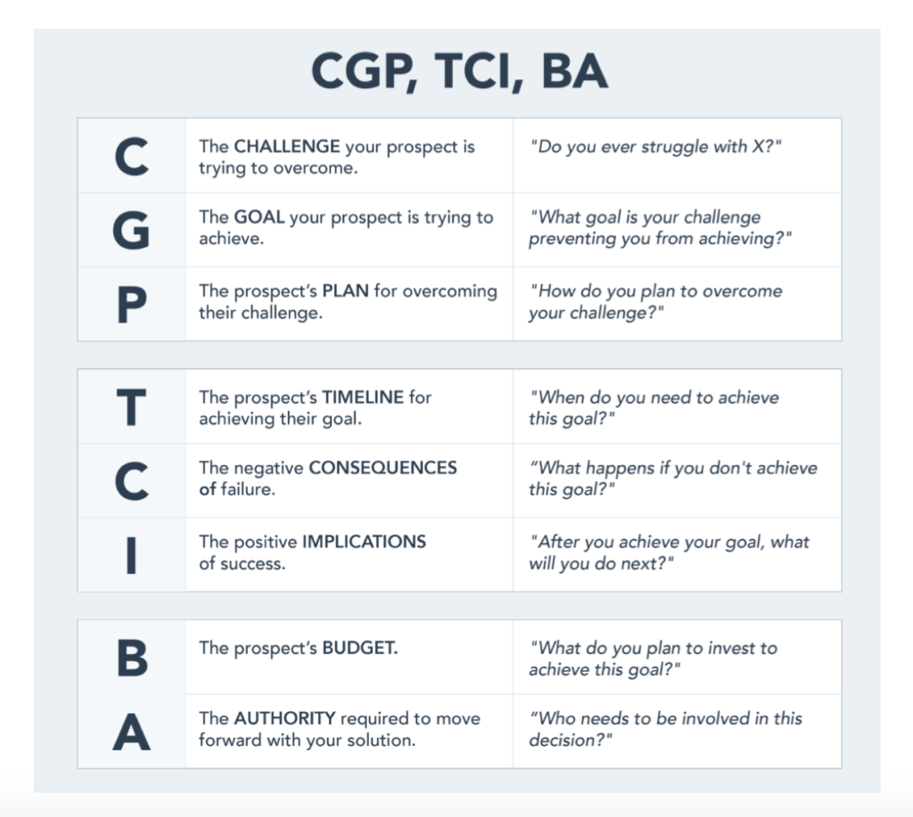

The essential part of Sales Planning is to clearly see which steps you as a sales rep should cover in order to get the results you envisioned for your company.

](file_0.png)

We created the briefest checklist to help you go through each of those steps fast while getting the most out of it:

## Prospecting

Here it’s important to decide what your ICP(Ideal Client Profile) is and where you can find people who look like it in the most efficient way.

You can create your ICP for free using this [ICP Builder](https://www.hubspot.com/make-my-persona?hubs_post=blog.hubspot.com%2Fservice%2Fhow-to-get-referrals&hubs_post-cta=Make%20My%20Persona&_ga=2.87996184.1254403287.1615146192-989053787.1572600208). After you’ve done that, decide where your ICPs are usually easily found: on Linkedin? in Facebook Groups? On Business Events lists? In different directories?

After that, you need to look for their contact information. I usually use [Hunter](https://hunter.io/email-finder) and [Rocketreach](https://rocketreach.co/).

## Connecting with Leads

After you found the potential buyers and you know their contact information, it’s time to start connecting.

If you plan to send messages and emails manually that are too customized, then I will recommend my favorite 2 bloggers for cold-email customization: 
[Josh Braun](https://www.linkedin.com/in/josh-braun/)
[Alex Berman](https://youtube.com/playlist?list=PLtkcfOqeArMa9-nmJR8wxAOfSU4kzYpBj)

In case you are sending slightly personalized messages, use automation tools such as [Expandi](https://expandi.io/worlds-safest-software-for-linkedin-automation/)(for Linkedin), [Lemlist](https://www.lemlist.com/)(for e-mails), and many others, I shared more options in my recent article [here](https://jtway.co/the-ultimate-guide-to-the-sales-onboarding-in-it-companies-6e8b4a4a473).

## Sales Qualification

Not all the leads you generated are potential buyers. To know that, you need to qualify them first. The best way to do so is during the first call/meeting.

You can trust your intuition and ask the questions that come to your mind during the conversation, but I would recommend you a better way:
>  USE SALES QUALIFICATION FRAMEWORKS!!!

There are lots and lots of them on the internet, but here is my favorite:

Remember, not everyone you talked to has to become your client. After qualifying the lead you have a clear picture of who and how you can help.

## Presenting your product

Before presenting your product make sure you understood the needs of your lead and therefore, you have an idea of how your product can be helpful in their situation.

Show them similar case study examples and focus on each step of how you solved those particular problems.

## Overcoming objections

There are 4 main objections every salesperson encounters 95% of the time. Here is my takeaway of the best answers to each of them

### 1. Too expensive/I don’t have a budget
>  “The price of our product is more expensive compared to what?”
>  “Putting price aside for a moment, were there other matters you needed me to review?”
>  “Our client testimonials are always great and we are constantly hearing from them that our product/service has been well worth the investment”

### 2. I’m not the decision-maker
>  “Could you please introduce me to the person responsible?”
>  “Who besides you is involved in making the decision?”

### 3. We are happy with what we have now
>  “What are the features that are most important to you?”
>  “What are the benefits of another offer?

### 4. No thanks/I will get back to you
>  “When you agreed to talk I thought I was prepared and knew what you need, what did I miss?”
>  “Clearly I wasn’t focused correctly. What would have been the most important thing that you wanted me to review?
>  “I’m puzzled. Usually, I get great feedback from the companies like yours. Where was I lacking in being clear about the savings we offer?
>  “ Rather than you getting back to me let’s get a date in the calendar today for me to come back and dig deeper with more specifics about the value”.

## Closing

Here are the proven techniques that are widely used in the world:

### 1. Creating an urgency

This technique is also called “Now or Never Close” and it shows your customer that the best timing for getting the most profitable deal is now:
>  “We won’t have this price anymore”.
>  “ We have a 35% discount, only for those who register today”.

### 2. Creating a value-package

You qualified your customer and presented to them, you know what their needs are and what they liked in your particular product. All you need to do now is summarize your observations in 2–3 well-sound sentences.

### 3. Asking Questions

Throughout the entire process, you need to have two main goals: Understand what their pain is and How you can eliminate this particular pain with your offering.

By asking the right questions during each step of the conversation, you can even close your sale faster.
>  “How in your opinion will my offer solve your problem?”
>  “Is there any reason why you can’t proceed with this offer?”

Even if their answer is negative this closing technique allows you to elaborate right away and see where you were lacking more explanation in your presentation. Eventually, this win-win technique will help you significantly.

### 4. Making Assumptions

This is simply asking the questions where you automatically assume that they liked your product. Make sure you have some positive facts that will support your actions. If they do, you can use the following sentences:
>  “Did my offering allign with your expectations?”
>  “Does it seem like something that will save your operational costs in the future?”

### 5. Taking the toy away

This technique is also called Take away closes. Remember how you cried when someone took your toy away? The same happens here.

Many deals don’t close because clients ask for discounts. You can take some features or services from the package and say that this is the only way you can reduce the price of your offering.

Believe me, they will be more upset about the things you took away from them rather than be happy about the price decrease, so they will most likely pay for your first offer.

### Getting Referrals

Never forget to ask for referrals.

Instead of complaining about not having enough sales, ask yourself “Who are the clients that are really happy with what we did for them?”, when you get the answer, call/email those clients and see if there are any other companies they know that might need your services.

You see, your potential clients as everybody else, trust people they know more than they trust strangers who offer them their services. Make sure you are using the referral opportunity to the fullest.

**Victoria Sakurova** is a Business Development Specialist at [JetThoughts](https://www.jetthoughts.com/). Follow her on [Linkedin](https://www.linkedin.com/in/victoriasakurova/).*
>  *If you enjoyed this story, we recommend reading our [latest tech stories](https://jtway.co/latest) and [trending tech stories](https://jtway.co/trending).*
