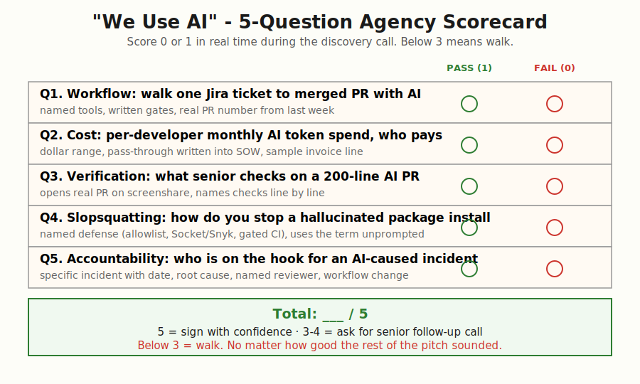
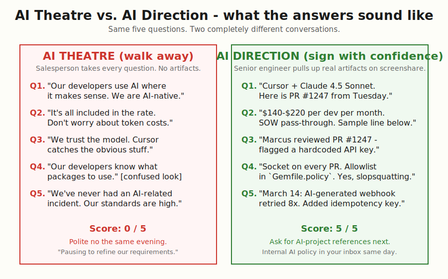
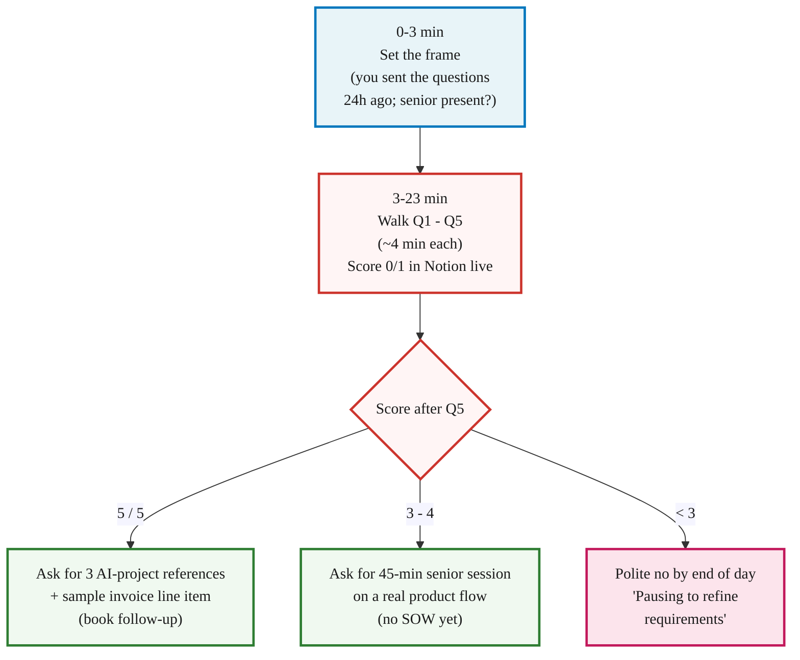

> **Module 9 · Step 1 of 3** · [Tech for Non-Technical Founders 2026](/blog/tech-for-non-technical-founders-2026/) course.
> Input: an agency claiming "we use AI to ship 3x faster." Output: a 30-minute interrogation that catches AI theatre before you sign.

> **Supplementary content.** This chapter is relevant after you've shipped (Module 5+) and your product touches AI in production. Bookmark and return when needed.

The agency's pitch deck said the weekly retainer was $14,200. The pitch deck also said "every PR ships with an `Assisted-by:` footer naming the human reviewer; AI direction is a first-class part of our delivery." A founder we picked up in Q3 2026 asked the senior engineer on the discovery call to open one such PR on screenshare. The engineer scrolled GitHub for forty seconds, then promised to email the link "by end of day." The link never arrived. Two hours of internal back-and-forth later the agency owner emailed back: the `Assisted-by:` line had been added to the pitch deck the week before the call. No PR in the repo carried it. The five questions below would have surfaced the gap inside the first 20 minutes, before any contract conversation, and saved the founder a $56,800 four-week commitment she would have unwound a month in.

## Why every agency claims AI in 2026 - and why most cannot back it up

Every agency website rewrote its homepage in 2026. "AI-augmented." "AI-native." "We ship 3x faster with AI in the loop." The term arrives in your inbox faster than the agency adopted the tools. The Stack Overflow [2025 Developer Survey](https://survey.stackoverflow.co/2025/) shows 84% of developers now use or plan to use AI tools, but [Veracode's GenAI Code Security Report 2025](https://www.veracode.com/blog/genai-code-security-report/) found 45% of LLM-generated code shipped at least one exploitable security flaw. Two populations live behind the same homepage copy: the shops that wrote a workflow, set a budget alert, and put a senior on the diff; and the shops that bought Cursor seats and changed nothing else. The five questions below are written to put both kinds of agency on the same call and watch which one shows up.

## The 5 questions

The full Pass/Fail rubric, scoring template, and "what to send 24 hours before the call" instructions live in the [companion 5-Question Script](/blog/agency-ai-five-questions/). Below is the prose explanation of why each question matters in 2026. Print the script. Read this post once.

### Q1 - The workflow question

> "Walk me through how a developer on your team takes a Jira ticket and ends up with merged code, when they use AI in the loop. Name the tools, the prompt patterns, and the human review gates. Use a real ticket your team closed last week."

A team that cannot describe its workflow does not have one. The agencies that direct AI well have a written one-page playbook: ticket, draft prompt, generate, run the failing test the developer wrote first, review the diff against the spec, open the PR with an `Assisted-by:` footer, second senior reviews, merge. They will offer to email the playbook the same afternoon. The agencies running theatre answer in slogans. The Q3 2026 founder above never saw a real PR; the senior engineer who could not produce one was not lying about AI - he was describing a workflow that did not exist. A team that cannot show one PR is the team whose senior is improvising in front of the model on every ticket. That is the team whose 200-line PRs end up in your repo unreviewed.

### Q2 - The cost question

> "What does the average developer on your team spend on AI tokens per month, and who pays it? Will it pass through to my invoice, and what should I budget for the project we just scoped?"

AI tokens are a real budget line in 2026. A Cursor Pro seat is roughly $20-$40, and the Anthropic plus OpenAI API spend on top runs $80-$300 per developer per month for a team that is actually using Claude Code or Aider on big diffs. The shops that have priced this will give you a per-developer dollar range, a sample invoice line, and a written pass-through clause in the SOW. The shops that have not will say "it is included in the rate" and then send you a five-figure surprise in month two. The [agency-ai-five-questions script](/blog/agency-ai-five-questions/) opens with a $4,800 monthly OpenAI bill nobody could attribute to a client - that founder caught it because the agency screenshared the wrong tab. You will not have that luck. Get the number in writing on the discovery call.

### Q3 - The verification question

> "When AI generates a 200-line PR, what does your senior reviewer actually check? Walk me through one PR you reviewed last week and tell me what you looked for."

The senior should pull up an actual PR on screenshare. They should read it line by line and explain what they verified: did the diff match the ticket spec, are there hardcoded secrets or API keys in the diff, are the tests genuine (written first as failing specs by the developer) or AI-generated to make CI green, did the AI introduce new gems or pip packages and do those packages actually exist on Rubygems / PyPI / npm. A reviewer who answers "we trust the model" or "Cursor catches most issues" is the reviewer whose name is going to end up next to the SQL injection vector in your incident postmortem. Linus Torvalds put the ["Assisted-by:" footer](https://lore.kernel.org/lkml/CAHk-=wjbiaa7m9aGtw2T-fbmuuiq_-noqfrjEJzbpCSk0FrFkw@mail.gmail.com/) on the kernel commit list precisely because the named human is the accountability mechanism. Ask which human's name shows up on the agency's `Assisted-by:` lines this week. If the answer is "we have not started doing that yet," you have your Q3 score.

### Q4 - The slopsquatting question

> "In April 2025 a security researcher published findings that AI assistants suggested over 200 package names across Rubygems, PyPI, and npm that did not exist. Attackers register those names and wait for developers to install the typo. How do you prevent installing a hallucinated package?"

A passing answer names a specific defense: a pre-vetted package allowlist with a written process for adding new dependencies, a scanner like [Socket](https://socket.dev/) or [Snyk](https://snyk.io/) on every PR that blocks the build until a human approves any new package, or a manual `gem info <name>` / `pip show <name>` / `npm view <name>` step before any new dependency lands. They use the word "slopsquatting" without you prompting and can cite the [Bleeping Computer writeup](https://www.bleepingcomputer.com/news/security/ai-code-suggestions-sabotage-software-supply-chain/) or the [SecurityWeek piece on AI coding agents and supply-chain risk](https://www.securityweek.com/ai-coding-agents-could-fuel-next-supply-chain-crisis/). An agency that has not heard of slopsquatting in late 2026 has not read its field's security press for over a year. The supply-chain attack moved from CVE bulletins to mainstream founder-facing risk the moment Cursor adoption crossed half the developer market.

### Q5 - The accountability question

> "When AI-generated code causes a production incident, who is on the hook? Walk me through the last AI-generated-code incident your team had - what happened, when, and what you changed afterwards."

A specific incident with a date in the last six months. A one-paragraph root cause. The named senior who reviewed the offending PR. The workflow change made the week after. The agencies that have shipped AI code in production have written at least one of these postmortems already. The agencies that have not will say "we have never had an AI-related incident" - which means either they have never shipped AI code to production or they are not telling you about the ones that landed. The [PocketOS production database wipe](/blog/ai-agent-deleted-production-database-pocketos/) was a 9-second incident on a live SaaS that the founder did not see coming because the agency had no team-level review on AI-generated migrations. Ask. If they cannot tell you, they have not built the muscle.

## Score in real time and walk if below 3

Open a Notion doc before the call. Down the left, write Q1 through Q5; down the right, write 0 or 1 per answer. Score as the senior speaks, not after. The full Pass/Fail texture sits in the [5-Question Script](/blog/agency-ai-five-questions/) - print that and lay it next to your laptop. A score of 5 means the agency directs AI; ask for three references on AI-augmented projects and the line item on their last invoice that shows the OpenAI pass-through. A score of 3-4 means partial coverage; ask for a 45-minute follow-up technical session with the senior reviewer (not the salesperson), working through one of your real product flows, before any SOW conversation. A score below 3 means the agency runs AI theatre. Send a polite "we are pausing the search to refine our requirements" email by the end of the day. Do not negotiate. The agency will argue the framing instead of fixing the four gaps you found.

## The interrogation flow on a 30-minute call

Run the call on a 30-minute Zoom block. Hold the timer.

The salesperson who keeps trying to take Q1 through Q5 from the senior is itself a Q0 fail. You wrote in the meeting invite that the senior would be on the call. If the senior is not on the call, the answer to every question is whatever the salesperson can fabricate in real time. End the call early. The agency that respects your time will reschedule with the senior; the agency that does not will keep stalling.

## What to do tomorrow

Three concrete moves for the next 24 hours, in order.

1. Block 90 minutes on your calendar for the next agency discovery call you have scheduled. Sixty minutes is for the call; the extra 30 is for the post-call score-up and the polite-no email if the score lands below 3. If you do not have a discovery call scheduled, send the screening email from the [5-Question Script](/blog/agency-ai-five-questions/) to the three agencies on your shortlist today.
2. Forward your scored Notion doc to your independent advisor or fractional CTO the same evening for a 15-minute paid sanity-check call. Under $400 and the cheapest decision insurance you will buy this year. The [Fractional CTO section](/blog/hire-track-supplementary-reference/#the-fractional-cto-bridge) explains how to find and hire one if you do not have one already.
3. Download the ["We Use AI" 5-Question Script](/blog/agency-ai-five-questions/) and send it to your next agency call as the agenda for the meeting. One sentence in the email body: "We will work through these together on Tuesday; please come prepared." Do not soften it. The agencies that decline to prepare are telling you the answer to the interview before it starts.

## Further reading

- Veracode, [GenAI Code Security Report 2025](https://www.veracode.com/blog/genai-code-security-report/) - 45% of LLM-generated code shipped at least one exploitable security flaw. The data behind Q3 (verification) and Q5 (accountability).
- Stack Overflow, [2025 Developer Survey - AI section](https://survey.stackoverflow.co/2025/) - 84% of developers now use or plan to use AI tools. The market context behind why "we use AI" became a meaningless homepage line.
- Bleeping Computer, [AI code suggestions sabotage software supply chain](https://www.bleepingcomputer.com/news/security/ai-code-suggestions-sabotage-software-supply-chain/) - the slopsquatting attack vector in plain English. The thing your agency must spot in PR review (Q4).
- SecurityWeek, [AI Coding Agents Could Fuel Next Supply Chain Crisis](https://www.securityweek.com/ai-coding-agents-could-fuel-next-supply-chain-crisis/) - the practitioner read on why hallucinated package names are now the leading AI-era attack surface.
- Linus Torvalds, ["Assisted-by:" tag on Linux kernel commits](https://lore.kernel.org/lkml/CAHk-=wjbiaa7m9aGtw2T-fbmuuiq_-noqfrjEJzbpCSk0FrFkw@mail.gmail.com/) - the kernel rule that puts a human reviewer's name in the commit log when AI is in the loop. The accountability standard referenced in Q3 and Q5.
- Anthropic, [Claude Code documentation](https://docs.claude.com/en/docs/claude-code/overview) - the official reference for one of the tools your agency should be naming in Q1. Worth skimming so you recognise the workflow language when they describe it.
- DHH, [The One-Person Framework](https://world.hey.com/dhh/the-one-person-framework-711e6318) - the Rails case for keeping the architecture small enough that one engineer can review every diff, including the AI-generated ones. The framework filter to apply before the agency search.

---

*Built by [JetThoughts](https://jetthoughts.com) as part of the [Tech for Non-Technical Founders 2026](/blog/tech-for-non-technical-founders-2026/) curriculum.*
