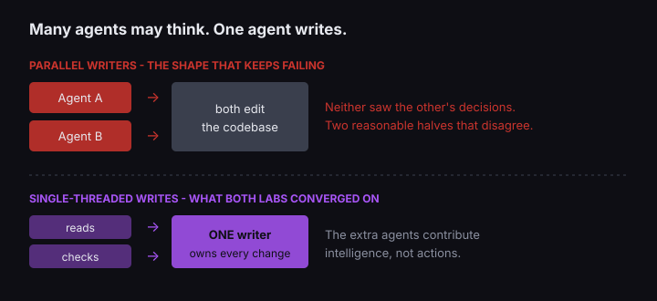

Cards on the table: we run agents in our own delivery, so I am not a neutral party on whether they work. Everything numeric below comes from three published sources that are not us, and two of them undercut the enthusiasm.

You can stand up a team of autonomous agents this afternoon. The frameworks are real, the demos are real, and the question worth asking is the one nobody puts on the landing page: how often does it work?

Somebody measured. A group at UC Berkeley - the author list includes Matei Zaharia, Joseph Gonzalez and Ion Stoica - collected execution traces from seven multi-agent frameworks and published the success rates. Across six of them, on their respective benchmarks:

| Framework | Benchmark | Success |
|---|---|---:|
| AG2 | OlympiadBench | 59.0% |
| MetaGPT | ProgramDev | 40.0% |
| Magentic-One | GAIA | 38.0% |
| ChatDev | ProgramDev | 33.3% |
| HyperAgent | SWE-Bench Lite | 25.3% |
| AppWorld | Test-C | 13.3% |

Read that as a range, not a league table. The paper's own figure caption says it plainly: "Performances are measured on different benchmarks, therefore they are not directly comparable." AppWorld is not four times worse than AG2; they are not attempting the same thing.

What the spread does tell you is the shape of the answer. On the tasks these systems were built for, the modal outcome is failure, and the paper opens by saying so: "Despite enthusiasm for Multi-Agent LLM Systems (MAS), their performance gains on popular benchmarks are often minimal."

## The failures are organisational, not mathematical

The same team built a taxonomy out of those traces. Fourteen distinct failure modes, sorted into three categories, with two expert annotators reaching a Cohen's kappa of 0.88 - which is to say the failure modes are consistent enough that different people looking at the same trace agree on what went wrong.

The three categories are worth memorising: system design, inter-agent misalignment, task verification. Notice what is missing. None of them is "the model was not smart enough." They are specification, coordination and checking - the same three things that go wrong in a team of humans who have never worked together.

## The enthusiasm was not stupid

It would be easy to stop there and write the sceptical post. The evidence does not support that either.

Anthropic published results from their multi-agent research system where a lead agent directs subagents, and reported that it "outperformed single-agent Claude Opus 4 by 90.2% on our internal research eval." Not a rounding error. For the right shape of problem, the architecture wins convincingly.

They were equally direct about the bill. "Agents typically use about 4× more tokens than chat interactions, and multi-agent systems use about 15× more tokens than chats." And on their browsing evaluation, "token usage by itself explains 80% of the variance" - most of what looks like architectural cleverness is buying compute.

Then the sentence that should decide this for most teams reading it. On why the pattern suits research and not their day job:

> most coding tasks involve fewer truly parallelizable tasks than research, and LLM agents are not yet great at coordinating and delegating to other agents in real time.

That is the company selling the agents, telling you the parallel-swarm shape is a poor fit for building software.

## Both camps arrived at the same rule

In June 2025 Cognition, the team behind Devin, published an essay called *Don't Build Multi-Agents*. Their argument was not about model quality. Two subagents each make locally reasonable choices, neither sees the other's decisions, and you get a coherent half bolted to a different coherent half.

Ten months later Walden Yan wrote the follow-up, and this is the part I find genuinely useful. They did not double down and they did not recant. They narrowed:

> we've found a narrower class of patterns that do [work]: setups where multiple agents contribute intelligence to a task while writes stay single-threaded.

Put that next to Anthropic's lead-agent-with-subagents design and the two most-cited positions in this argument are describing the same architecture in different vocabulary. **Many agents may think. One agent writes.**

The thing that keeps failing is parallel writers. The thing that works is parallel readers feeding one writer.



## What this means if you are setting one up

Start by asking whether your task actually has parallel parts. Research does: twenty sources can be read at once and nothing breaks. A feature usually does not, because step four depends on a decision made in step two, and an agent that never saw step two will contradict it confidently.

Then keep the write path single-threaded, and let the extra agents do everything that is not writing - reading, checking, disagreeing.

We run our own delivery this way, though not because we read the papers first. We arrived at it after review findings kept getting lost between agents. The rule that fixed it is four lines:

```text
One author owns the diff. Nobody else writes.
Reviewers get the artifact and the goal, never my conclusion.
Every reviewer must name one thing they would cut.
Author never reviews their own change.
```

Line one is the topology the papers describe. Lines two and three are what stops the readers from simply agreeing with you, which is the failure mode that replaces the coordination failure once you fix the topology.

If you want the implementation rather than the argument, we wrote up [our production multi-agent pipeline in Rails](/blog/multi-agent-llm-rails-rubyllm/), including where one agent turned out to be enough.

And budget for the 15×. A system that is right slightly more often and costs an order of magnitude more per run is not automatically a good trade. It depends entirely on what a wrong answer costs you, which is a question about your business rather than about agents.

## So, how many got success?

Fewer than the demos suggest, more than the sceptics claim, and the number moves a lot depending on whether you picked a shape that suits the work.

The honest read of the evidence in 2026 is that this works in a narrow configuration two competing labs converged on separately, and fails in the wide-open configuration that is easier to build and much more fun to demo.

So copy the narrow one, and hold your own setup to the standard you would hold Cemri's. If you cannot say what share of your agent runs produced something you shipped without rework, then you do not have a success rate, you have an impression. Most of us are running on the impression.

## Sources

- Mert Cemri et al., [Why Do Multi-Agent LLM Systems Fail?](https://arxiv.org/abs/2503.13657), arXiv 2503.13657, NeurIPS 2025 Datasets & Benchmarks track.
- Anthropic, [How we built our multi-agent research system](https://www.anthropic.com/engineering/multi-agent-research-system).
- Walden Yan, Cognition, [Don't Build Multi-Agents](https://cognition.com/blog/dont-build-multi-agents) (June 2025) and [Multi-Agents: What's Actually Working](https://cognition.com/blog/multi-agents-working) (22 April 2026).
