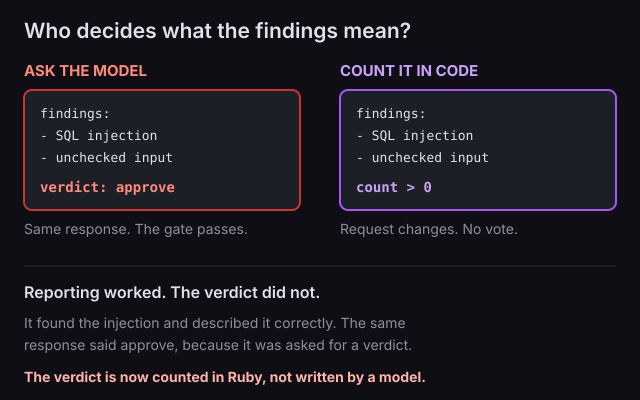

We built a code reviewer out of AI agents. Three specialists read a change in parallel, one for security, one for performance, one for style, and a fourth agent merges what they found into a single review.

The diff we gave it interpolated a customer name straight into a `SELECT`. The reviewer found the injection and described it accurately.

The same response said **approve**.

If somebody has ever told you the AI reviewed it, the sentence you were handed was the verdict. The verdict is the part that was wrong.

## Reporting and judging are different jobs

The model was good at the first one. It read a diff it had never seen, found a real injection, and said what was wrong with it. As a reporter it did the work.

Then we asked it, in the same breath, what its own findings meant. That is a different question, and approve is the answer that fits the shape of a summary.

Before you generalise from this, the model matters: it was `nvidia/nemotron-3-super-120b-a12b:free`, the free-tier default in our example. **One free model contradicting itself is not a measurement of models in general.** It does show that a verdict field gets filled in whether or not the answer is right, and that the response looks the same either way.



## The verdict moved into Ruby

Each specialist still reports findings and the synthesiser still merges them into a readable list. Two things changed.

The shared reviewer schema no longer has a `verdict` field, and the comment above it says why: models report findings, Ruby decides what they mean. The synthesiser also picked up a line in its instructions: "Do not add findings of your own and do not state an overall verdict."

What decides is five lines of ordinary Ruby counting reports:

```ruby
def headline
  blocking = @reviews.values.count { |review| Array(review['findings']).any? }
  return '**Verdict:** approve' if blocking.zero?

  "**Verdict:** request changes — #{blocking} of #{@reviews.size} specialists reported findings"
end
```

> If any specialist reported anything, changes are requested.

The bundled `sample.diff` carries a seeded injection, an N+1, and a style problem, so all three specialists have something to report against it and the run comes back asking for changes.

## What this does and does not show

We have not measured how often this happens. It happened in our own example workflow, on one free model, and we changed the design so that no model states the verdict. That is one team's finding, not a rate.

This is also not an argument against AI review. Ours found the injection, and the findings the specialists wrote were accurate and worth reading. Only the verdict was wrong, and the verdict is what gets quoted.

**What is public is the fix, not the failure.** [`examples/code_review/workflow.rb`](https://github.com/jetthoughts/ruby_llm-team/blob/master/examples/code_review/workflow.rb) in [`jetthoughts/ruby_llm-team`](https://github.com/jetthoughts/ruby_llm-team) has the computed verdict and the comment explaining why the field is gone. The failing response is not in the repo. The version that shipped cannot produce it.

If you want the questions to put to whoever runs your reviews, we wrote those up separately in [what to ask when a dev shop says the code was reviewed](/blog/dev-shop-ai-code-review-what-to-ask/).
