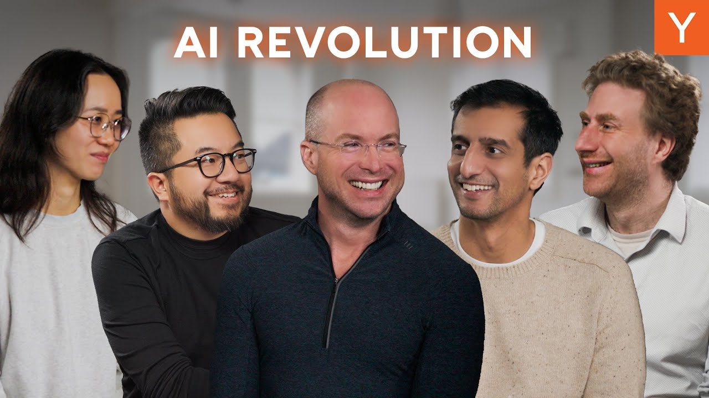

In a recent retreat, 300 top AI founders gathered to discuss the future of AI startups. The event featured insights from Paul Buchheit, creator of Gmail, who shared thoughts on the rapid growth and potential of AI technology. The conversation highlighted the unprecedented demand for AI solutions and the exciting opportunities for founders in this space.

### Key Takeaways

*   AI is creating new business opportunities that were previously impossible.
*   The demand for AI solutions is at an all-time high.
*   Startups are achieving rapid growth with fewer resources.
*   The focus is shifting from hiring large teams to leveraging AI tools for efficiency.
*   Founders are ambitious, aiming for significant revenue growth in short timeframes.

## The Current Landscape of AI Startups

The AI landscape is buzzing with excitement. Founders are no longer just dreaming big; they are achieving remarkable growth. Many startups are hitting milestones that were once considered unattainable. For instance, some companies are going from zero to millions in revenue within a year. This rapid growth is not just a fluke; it reflects a broader trend in the startup ecosystem.

### The Shift in Startup Growth

*   **Old Metrics**: Previously, a 10% week-on-week growth was a benchmark for success.
*   **New Reality**: Now, entire batches of startups are averaging this growth, with some founders reporting even more ambitious goals, like scaling from $1 million to $20 million in a year.

This shift indicates a new level of ambition among founders. The barriers that once held back innovation are crumbling, thanks to AI.

## The Power of AI in Business

AI is not just a buzzword; it’s a game-changer. The demand for AI solutions is skyrocketing, and businesses are eager to adopt these technologies. This is a stark contrast to previous tech trends where decision-makers were hesitant to embrace change.

### Why AI is Different

*   **Unprecedented Demand**: Unlike past tech revolutions, everyone is saying yes to AI.
*   **New Business Models**: Companies are now able to create products that were previously economically unviable.
*   **Efficiency Gains**: Startups are leveraging AI to do more with less, reducing the need for large teams.

## The Role of Evaluation and Testing

One interesting trend observed at the retreat was the emphasis on evaluation and testing. Founders are now prioritizing the creation of high-quality evaluation sets for their AI models. This focus on testing is crucial for ensuring that AI products meet the needs of businesses effectively.

### Key Insights on Evaluation

*   **Gold Standard**: The most valuable asset for AI companies is not just the code but the meticulously labeled evaluation sets.
*   **Iterative Development**: Rapid iteration is key. Founders are encouraged to continuously refine their products based on feedback and testing results.

## The Future of Work with AI

As AI continues to evolve, it raises questions about the future of work. Many people worry about job displacement, but the conversation is shifting towards how AI can enhance productivity and create new opportunities.

### The Positive Outlook

*   **Increased Productivity**: AI can handle tasks that were once labor-intensive, allowing humans to focus on more creative and strategic work.
*   **New Roles**: As AI takes over routine tasks, new roles will emerge that require human creativity and oversight.

## The Exciting Potential Ahead

Looking ahead, the potential for AI is immense. Founders are optimistic about the future, envisioning a world where AI enhances human capabilities rather than replacing them. The conversation at the retreat reflected a shared belief that we are on the right path.

### What’s Next?

*   **Continued Innovation**: Startups will keep pushing the boundaries of what’s possible with AI.
*   **Focus on Human Agency**: The goal is to maximize human potential and creativity in an AI-driven world.

In conclusion, the AI revolution is not just about technology; it’s about transforming how we work and live. The future is bright for those willing to embrace these changes and innovate in this exciting landscape.

Stay tuned for more insights as we continue to explore the evolving world of AI startups!
