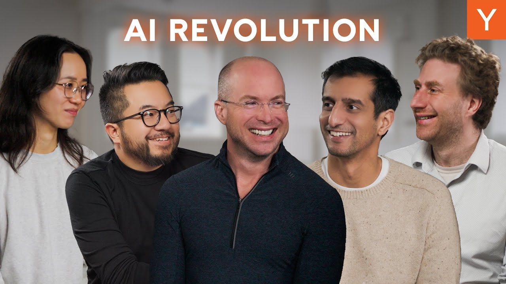

In a recent retreat, 300 top AI founders gathered to discuss the future of AI startups. The event featured insights from Paul Buchheit, creator of Gmail, who shared thoughts on the rapid growth and potential of AI technology. The conversation highlighted the unprecedented demand for AI solutions and the exciting opportunities for founders in this evolving landscape.

### Key Takeaways

*   AI is creating new business opportunities that were previously impossible.
*   Founders are achieving remarkable growth rates, often exceeding traditional benchmarks.
*   The demand for AI tools is high, with companies eager to adopt innovative solutions.
*   The focus is shifting from hiring large teams to leveraging technology for efficiency.

## The Current Landscape of AI Startups

The demand for AI is at an all-time high. Founders are no longer facing skepticism; instead, they are met with enthusiasm. This shift has opened doors for businesses that were once deemed economically unviable. The landscape is ripe for innovation, and now is the best time to be a founder.

## Growth Rates Like Never Before

Historically, a 10% week-on-week growth rate was considered exceptional. However, recent data shows that many startups are achieving this consistently. Some companies have even reported going from zero to $12 million in just a year. This rapid growth is not just a fluke; it reflects a broader trend where startups are executing faster and more efficiently than ever before.

## The Power of AI Tools

AI tools are transforming how businesses operate. Founders are leveraging these technologies to streamline processes and enhance productivity. For instance, companies are now able to automate tasks that previously required significant human effort. This shift allows startups to scale quickly without the need for large teams.

## The Importance of Testing and Evaluation

One interesting trend observed at the retreat was the emphasis on testing and evaluation. Founders are recognizing that having a well-defined evaluation set is crucial for success. This focus on quality over quantity is reshaping how products are developed and refined.

## The Shift in Hiring Practices

In the past, rapid growth often meant hiring more staff. Now, the narrative is changing. Startups are finding ways to achieve their goals with fewer employees. This shift is largely due to the efficiency gained from AI tools. Companies are prioritizing leverage over headcount, which is a significant departure from previous norms.

## The Future of Work

As AI continues to evolve, the nature of work is changing. Founders are optimistic about the potential for AI to enhance human capabilities rather than replace them. The conversation around AI is shifting from fear of job loss to excitement about new opportunities for creativity and innovation.

## Conclusion

The AI revolution is here, and it’s an exciting time for founders. With unprecedented demand and the ability to create innovative solutions, the future looks bright. As we move forward, the focus will be on leveraging technology to maximize efficiency and drive growth. The landscape is changing, and those who adapt will thrive in this new era of AI-driven business.
