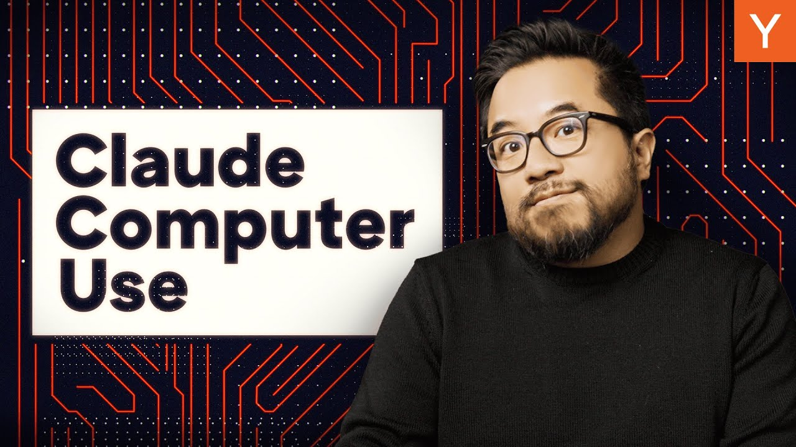

The age of AI agents is here, and Anthropic’s Claude Computer Use is leading the charge. This innovative tool allows AI to browse the web, click buttons, and type text all on its own. In this blog post, we’ll explore how Claude works, what it can do, and its potential impact on the future of AI.

### Key Takeaways

*   Claude can perform tasks by understanding images and taking actions based on what it sees.
*   It automates repetitive tasks, making life easier for users and businesses.
*   The technology is still in beta, with some bugs and limitations, but improvements are on the way.

### What Is Claude Computer Use?

In October, Anthropic made headlines with the release of Claude 3.5 and its new feature, Claude Computer Use. This tool is a significant step forward in AI technology. It allows Claude to understand images and perform actions based on what it sees on a computer screen. This means Claude can now help with tasks that require interaction with software, like filling out forms or searching for information online.

### How Does It Work?

Claude uses a process called the **agent loop**. Here’s how it works:

1.  **Analyze the Prompt**: Claude starts by looking at the user’s request.
2.  **Choose a Tool**: It decides which tool to use for the task.
3.  **Take Screenshots**: As it works, Claude takes screenshots to track its progress.
4.  **Adjust as Needed**: If something goes wrong, Claude loops back to try different actions until it completes the task.

This method allows Claude to handle complex tasks without human intervention. For example, it can help plan a hike by searching for details online and creating a calendar event.

### Real-World Applications

Anthropic has demonstrated Claude’s capabilities in various scenarios:

*   **Planning Events**: Claude can search for information and set up events in Google Calendar.
*   **Monitoring Construction Sites**: In a test, Claude analyzed a video of a construction site, looking for safety issues and compiling its findings into a spreadsheet.

These examples show how Claude can automate tasks that usually take up a lot of time and effort.

### The Future of AI Agents

Claude Computer Use is a game changer. It allows developers to create tools that fit the model instead of forcing the model to fit the tools. This flexibility opens up many possibilities:

*   **Increased Efficiency**: Businesses can automate repetitive tasks, saving time and resources.
*   **User Convenience**: Everyday tasks like booking flights or ordering food can be streamlined.

### Challenges and Limitations

While Claude is impressive, it’s not perfect. Here are some challenges it faces:

*   **Speed and Reliability**: Currently, it’s slower than typical models and can crash.
*   **Distractions**: Sometimes, Claude gets sidetracked, like when it unexpectedly searched for pictures of Yellowstone National Park during a task.
*   **Security Risks**: There are concerns about prompt injection, where Claude could be tricked into following misleading instructions.

Anthropic is aware of these issues and is working to improve Claude. They aim to make it faster, more reliable, and more useful for users.

### The Road Ahead

The future looks bright for AI agents like Claude. As technology advances, we can expect:

*   **More Startups Entering the Space**: Companies like Kura are already developing their own browser agents.
*   **Transformative Applications**: AI will change how we work, connect, and live. Tasks that once required teams may soon be handled by AI.

So, what will you build with Claude Computer Use? The possibilities are endless, and the future of AI is just beginning to unfold.

### Conclusion

Anthropic’s Claude Computer Use is a significant leap in AI technology. It’s not just an assistant; it’s a tool that can take on entire tasks. As it continues to evolve, we can expect it to reshape our daily lives and the way we interact with technology. Keep an eye on this space; the AI revolution is just getting started!
