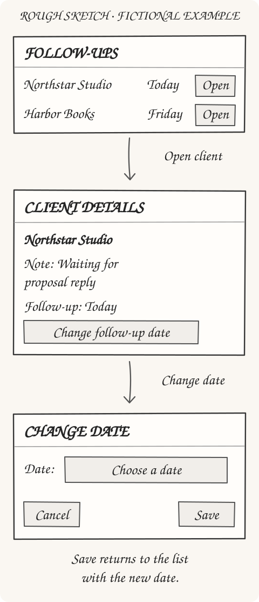

You have an app idea, but you're stuck before the first step. Should you find a developer, learn an AI tool, or write down everything the app needs to do?

Start by describing one task someone should be able to complete. A request like "build an app for freelancers" leaves too much undecided: which freelancer, what problem, and what should happen when they open it?

You can work through those decisions in ordinary language. For your first attempt, aim for a short description of the problem and a few rough screens for the approach you choose, then use an AI builder to turn them into a clickable demo.

## Describe a situation you want to improve

For a running example, take a fictional app that helps freelancers keep track of client follow-ups. "Help freelancers manage their business" could include anything from invoices to project planning, so narrow it to a situation:

> After a client call, I need to record when to contact them again. Today I leave that reminder in my notes, then have to search for it later.

Now you have something to investigate. A freelancer might already handle this well with a calendar reminder, or they might need to see the date beside their client notes.

Before choosing screens, ask someone who does this work:

> "Tell me about the last time you needed to follow up with a client. How did you remember when to do it?"

Follow their account of what happened, using [questions about past behavior](https://jetthoughts.com/course/tech-for-non-technical-founders-2026/mom-test-ask-about-past-not-future/) to get specific examples. If they mention a spreadsheet, ask them to describe how they use it or show you a version without private information.

Write down what you learn separately from what you hope is true. "They searched three places for a note" describes an observation; "they would switch to my app" is still a guess.

If you can't yet reach someone, you can ask AI for rough screens to help explain the idea. Label the unanswered questions so you don't mistake your own assumptions for customer research.

## Ask AI to interview you before it builds

Use an AI conversation to organize what you know and find the gaps. You still make the decisions, especially when the tool suggests a feature nobody has asked for.

For this walkthrough, use Lovable, an AI app builder, in **Plan mode**. Its documentation says this mode can ask clarifying questions without modifying code, with implementation following plan approval ([Lovable Plan mode](https://docs.lovable.dev/features/plan-mode)).

If you can select Plan mode before building, use it. Otherwise, run the interview below in an AI chat you already use and copy the finished concept into Lovable when you're ready to build.

Paste this prompt and add your rough idea at the bottom. Leave building for later:

```text
Help me think through an app idea before building anything.
I'm not technical. Use plain language and ask one question at a time.

Find out who has the problem, the last time it happened,
what they do today, and what they want to accomplish.
Reuse answers I've already given you.

If I don't know something, mark it as an assumption.
Don't invent customer feedback or tell me the idea is validated.

Compare a simple manual solution with a small app concept.
Help me choose one task to test. Put extra features in "Not now."

When we have enough detail, draft a one-page concept with the task,
what success looks like, and what we're leaving out.
Leave screen choices open so we can compare approaches next.

Don't build or write code yet. Stop for my corrections.
Don't ask me to choose programming languages or databases.

My idea: [describe it in your own words]
```

You don't need polished answers. "I think it's for independent designers, but I've only spoken to one" gives you a useful place to continue the conversation.

If the AI asks about colors or login options before you can explain the problem, bring it back: "We haven't chosen the task yet. Help me decide that first."

## Keep your app idea small enough to explain

Read the concept the AI drafted and correct anything that doesn't match what you know. Leave guesses marked as assumptions, and check that someone who missed the conversation could understand the task.

For the fictional follow-up app, that page might look like this:

| Question | Working answer |
|---|---|
| Who is it for? | A solo freelancer who handles their own client calls. |
| What should they accomplish? | Record the next follow-up date and find it beside the client notes. |
| What do they do in the demo? | Change a follow-up date and check that it was saved. |
| What are we assuming? | Keeping dates beside client notes is more useful than the person's current calendar or spreadsheet. |
| What won't we build yet? | Email sending, notifications, account creation, or team access. |
| What should we learn? | Can someone complete the task without help, and where would it fit into their existing work? |

The "won't build yet" answer matters when you start using the builder. If it adds a dashboard with charts, you can point to the approved task and ask for those charts to be removed.

This page also helps you notice a mismatch early. If users mainly want automatic reminders, a list with dates won't test whether those reminders help; you might try a manual reminder service before building an app.

Keep this early concept separate from a brief backed by customer research. After customer interviews and prototype sessions have supplied that evidence, the [one-page product brief lesson](https://jetthoughts.com/course/tech-for-non-technical-founders-2026/one-page-product-brief-vibe-prd/) shows how to include it in what you hand to a builder or developer.

## Ask AI to propose rough screens you can explain

You don't need to draw these yourself. Ask AI to propose two ways of completing the task. They should change what the person does, rather than just the colors.

Describe what the person sees and does at each step; add rough screens when seeing the layout would help you choose ([Shape Up: Find the Elements](https://basecamp.com/shapeup/1.3-chapter-04)).

For the fictional follow-up app, compare:

- Change the date in the list: choose a new date beside the client and save.
- Read the note first: open the client, read the note, then change the date and return to the list.

Does the person need the note to choose the date, or does opening it add a step they don't need? Treat both as proposals to test.

Continue the AI conversation with this prompt:

```text
Use the concept we've already discussed. Ask only for missing context.
Keep our one task and "Not now" limits. Don't invent customer evidence.

Only inspect existing approaches if we have a specific unanswered
question about these options and you have web access; otherwise skip browsing.
Use at most two examples. Give URLs and separate observations from suggestions.
Don't invent findings or URLs.

Propose two ways to complete the task, with rough labeled screens if you
can show them here. Otherwise give screen outlines: words, controls,
and what happens after each action. Skip visual polish.

Explain the downside of each option and one question that could change our choice.
Discuss my feedback and revise only the affected part. Wait for my approval.
Don't build the app, connect services, or publish anything.
```

You don't need another tool by default. Lovable's Plan mode lets you discuss the options without changing code and can show diagrams ([Lovable Plan mode](https://docs.lovable.dev/features/plan-mode)). If Lovable offers visual design options, wait until you're ready before submitting a direction: submitting starts the full build ([Lovable design guidance](https://docs.lovable.dev/features/design-guidance)).

If you'd rather discuss visible rough screens, Studio Lofi can draft them from a prompt and revise individual screens through chat ([Studio Lofi](https://studiolofi.com/)). Export the images and bring them into Lovable with a short brief ([Studio Lofi](https://studiolofi.com/)). Paper is still an option if you prefer it.

For the rest of this example, choose the second approach. The sketch below illustrates it; we haven't tested whether the note is needed:



Walk through it aloud: "I open the client, read the note, and change the date. When I save, I return to the list and see the new date."

Then try an incomplete action. What happens if you press Save without selecting a date? Write the answer beside the sketch: "Stay on this screen and show 'Choose a follow-up date.'"

That is useful detail to give a builder. You can postpone choosing a logo, but the person testing your demo needs to know whether their change was saved.

## Build a demo with made-up data

"Couldn't I just ask the AI to build it and figure this out afterward?" You can, especially if you already understand the problem, but the brief gives you a way to judge the result: does the app do the task you agreed on?

For a first demo, request sample data and leave real accounts disconnected. Lovable's own guide recommends starting with realistic sample data, no login, and no database, then adding those pieces later ([Lovable's idea-to-app guide](https://docs.lovable.dev/tips-tricks/from-idea-to-app)).

Keep your approved concept and chosen approach in the conversation. Screen outlines are enough; if you have a sketch, attach it. Lovable supports mockups and product briefs as attachments ([Lovable Chat](https://docs.lovable.dev/features/projects/chat)). When you're ready to build, use this instruction:

```text
Build a clickable demo of the approved concept.
Use only the agreed screens and task.

Use white backgrounds, readable text, and simple gray borders.
Keep the agreed labels. Don't add a marketing page or decoration.

Use fictional clients and sample data. Don't add real accounts,
payments, email sending, a database, or external connections.
If something is simulated, label it clearly.

The main buttons must work. Include the missing-input message
we described and a way to reset the demo.
Tell the person if their changes disappear when they refresh.

If a decision blocks the main task, ask me before building.
Don't add features to fill the gap.

After building, explain how to try the task, what is simulated,
and which checks you actually tested. Don't publish it publicly.
```

Approve the build only after the brief and chosen sketches or screen outlines describe what you want. These instructions are a request to the tool, so check what it actually creates before sharing it.

For the follow-up demo, open a client and change the date yourself. Confirm that Save updates the list, Cancel keeps the original value, and an empty date produces the agreed message.

If something fails, describe that one failure: "Saving a new date doesn't update the list. Fix that without changing the other screens."

## Watch someone try it before adding more

Ask someone who does this work to try the demo on your device while you watch, then repeat with two more people if you can. Treat this as a small test of whether the demo is understandable, not proof that you have a business.

Give each person a task rather than instructions about which buttons to press:

> "You just spoke to Northstar Studio and need to contact them again next Tuesday. Show me how you'd record that."

Watch without pointing at the screen. Note where they pause and whether they finish, then ask what they expected to happen.

Your notes should help you decide what to change:

| What you observe | What to do next |
|---|---|
| They can't find how to change the date. | Adjust the label or layout, then test that part again. |
| They complete the task but expect an automatic reminder. | Clarify the demo's limits and investigate whether reminders are necessary. |
| They finish easily but prefer their current calendar. | Ask them to show you what their calendar does better before adding features. |

Afterward, return to their actual work: "When did you last need to do this, and what did you use?" A successful click-through shows that this person could use the demo; it doesn't establish that they will switch tools or pay.

If you're ready for more structured sessions, the course's [clickable prototype lesson](https://jetthoughts.com/course/tech-for-non-technical-founders-2026/clickable-prototype-validation-2-hour-lovable/) lays out a longer test with people you've already interviewed. It assumes you've completed the earlier customer research, so treat it as a follow-up rather than a requirement for this first attempt.

Keep private customer information out of these early tests. Before turning the demo into a service people rely on, get technical help checking how real data is stored and protected, and whether the app works beyond the sample scenario.

For your next attempt, choose one thing someone couldn't do in the demo and fix it. If they completed everything but couldn't explain when they'd use it, spend your next conversation on that question.

For a guided route beyond this first demo, continue with JetThoughts' [From Idea to First Paying Customer](https://jetthoughts.com/course/tech-for-non-technical-founders-2026/) course. Start at the beginning for the full customer-research sequence, then return to your concept with what you've learned.
