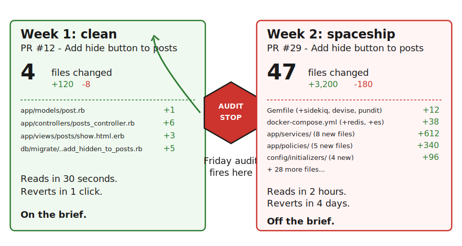
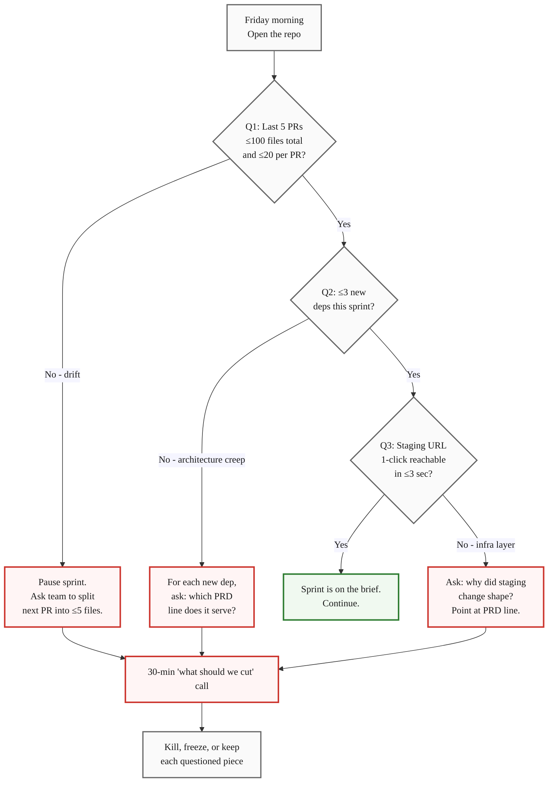
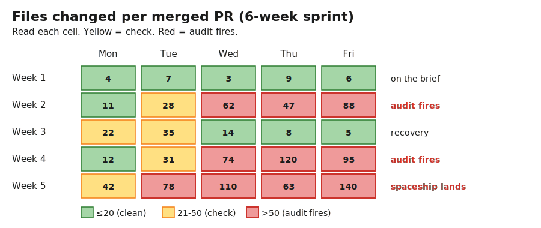

> **Module 5 · Step 6 of 6** · [Tech for Non-Technical Founders 2026](/blog/tech-for-non-technical-founders-2026/) free course.
> Input: an outcome-shaped Vibe PRD (from [Module 2.3](/blog/stop-specifying-features-start-outcomes/)) and a team mid-build. Output: a 3-question audit you run every Friday that catches over-engineering by week 2 of the sprint, not week 8 at the demo.

Open two browser tabs side by side. Left tab: the team's first PR from week one. Files changed: 4. Lines: +120, -8. The diff fits on one screen and you can read it. Right tab: the team's most recent PR from yesterday. Files changed: 47. Lines: +3,200, -180. Three new gems in the Gemfile. A new `app/services/` directory with eight files. A `docker-compose.yml` that now boots Redis, Sidekiq, Elasticsearch, and a service called `event-bus`. The PR title still says *"Add hide button to posts."*

You wrote a one-page outcome-shaped Vibe PRD in [Module 2.3](/blog/stop-specifying-features-start-outcomes/). The team agreed. Then they built a spaceship anyway. This chapter is about catching the spaceship at week two, when the diff is still small enough to reverse, instead of week eight at the demo, when the only honest move is to throw it out.

## Why teams build spaceships from clean specs

Module 2.3 fixes the spec. This chapter fixes the build, because three forces still push the team toward overbuild even when the brief is tight.

The first force is the resume. Adding a Sidekiq queue, an event bus, and a search service to a CRUD app is more interesting on a CV than adding one boolean column. A senior dev rotating off your project in six months is unconsciously building the next interview, and "I shipped the auth + permissions + audit-log system at $startup" reads better in the write-up than "I added a `hidden: boolean` column." The brief said boolean. The career path said system.

The second force is the AI agent default. Cursor and Claude Code, when handed a vague nudge in chat ("we'll need this to scale eventually"), generate the bigger thing. They were trained on millions of GitHub repos that lean enterprise, and the median Rails app in their training set has Sidekiq, Devise, Pundit, and a service layer. The agent is not lying when it suggests adding all four to your boolean-column build. It is autocompleting from the median repo it has seen. The [Veracode 2025 GenAI study](https://www.veracode.com/blog/genai-code-security-report/) flagged 45% of LLM-generated code as carrying at least one exploitable flaw - and the rate climbs in proportion to how much scope the agent had to invent. Every gem the agent adds without you asking is scope it invented.

The third force is the senior dev who can't push back fast enough. The agency you hired in [Module 4B](/blog/reading-sow-clause-by-clause/) staffed your project with a senior who is also covering four other accounts. When the junior on your project asks in Slack at 11am, "should I add Sidekiq to handle the background hide?" the senior has a meeting at 11:05 and types "yeah sounds good" instead of opening the PRD and asking why a synchronous controller action needs a queue. Two weeks later the queue is in production and removing it is a refactor.

None of these forces care about your brief. They run in parallel to it. The audit below catches them before they compound.

## The 3 mid-sprint audit questions

Run these every Friday on your repo. You do not need to read code. You need to look at three numbers and one URL. Total time: about ten minutes.

### Question 1 - How many files were touched in the last 5 PRs?

Open GitHub. Sort PRs by most recently merged. Add up "Files changed" on the last five. If the total is over 100, or if any single PR is over 20 files, your team is in scope drift.

A PR that touches 20+ files is rarely doing one thing. It is adding the feature you asked for plus a refactor the dev wanted to do plus a config change for the new gem they imported plus a test infrastructure change. Each addition is defensible alone. Together they are the spaceship growing one PR at a time, with no single PR big enough to argue about. The senior reviewer signs off because each diff "looks fine," and by the time someone asks "wait, when did we add Elasticsearch?" the answer is three PRs ago.

The fix when this number trips: ask the team to split the next PR into the smallest unit that ships value. Most large PRs split cleanly into 3 or 4 small ones, and the act of splitting forces the team to delete the parts that were never on the brief. Basecamp's [Shape Up](https://basecamp.com/shapeup/3.5-chapter-13#the-circuit-breaker) calls this the circuit breaker - cap the appetite, and the build collapses to fit.

### Question 2 - How many new dependencies were added this sprint?

Open the `Gemfile` (Rails), `requirements.txt` or `pyproject.toml` (Django), `composer.json` (Laravel), and `package.json`. Look at the git history for the file: `git log --since="2 weeks ago" --oneline -- Gemfile`. Count the lines added.

If the team added more than three new dependencies in two weeks, stop and ask what each one solves. Every dependency is a long-term cost: security patches, version bumps, supply-chain risk, removal pain. Three dependencies in two weeks is the boundary between "we needed a library" and "we are adopting an architecture." A team that adds Sidekiq, Redis, Devise, Pundit, and Elasticsearch in one sprint has just made every future deploy slower, every onboarding longer, and every salvage-vs-rebuild call harder.

The fix: for each new dependency, ask the senior dev to name the one outcome from the PRD it serves. If the answer is "we'll need it later" or "best practice," the dependency goes back out. The standard library or the framework defaults solve more than agencies admit. DHH's argument in [The One Person Framework](https://world.hey.com/dhh/the-one-person-framework-711e6318) is that Rails ships with most of what a small team actually needs, and that every gem added without a named outcome is a tax.

### Question 3 - Is the staging URL still 1-click reachable for me?

Open the staging URL the team gave you in [Module 4](/blog/friday-demo-rule-founder-progress/). Time how long it takes from "click the link" to "I am logged in and looking at the new feature."

If staging used to load in two seconds and now takes twelve, or if you now need a VPN, or if the team says "you need to ssh-tunnel through bastion to reach it," or if there is a new login screen with a TOTP step that did not exist last week, your team has added a complexity layer between you and the build. Sometimes there is a real reason - a real customer is on staging now, or a security audit demanded it. Most of the time it is the new infrastructure (the Kubernetes cluster, the service mesh, the Cloudflare Zero Trust setup) that someone added because the brief said "we'll need this to scale" and they took it as a green light.

The slowed-down staging is the leading signal that the build has acquired infrastructure that was not on the brief. The fix: ask why the staging URL changed shape this sprint, and require any answer that is not "a real customer arrived" to point back at a line in the PRD.

## What to do when the audit fires

A failing audit is not a fire-the-team moment. It is a thirty-minute "what should we cut" call, scheduled for the same afternoon.

Open the call with the PRD on the screen and the failing number on a second screen. Pick the largest PR, the loudest dependency, or the slowest staging change. Ask the team three questions in order: "Which PRD outcome does this serve? Could the cheapest version of that outcome ship without it? What would we lose if we deleted it today?" Most of the time the answer to the second question is yes and the answer to the third question is "nothing the user would notice this month."

The decision after the call is one of three labels. **Kill** - revert the PR or remove the dependency this afternoon. Cheap because the diff is two weeks old and nobody depends on it yet. **Freeze** - keep the code in the repo but turn off the feature behind a flag, defer the dependency upgrade, leave the new infrastructure unused until a real outcome demands it. **Keep** - the team makes the case that the addition is on the brief, and you accept it. Write down what changed in the PRD so the brief stays the source of truth.

The cost of the audit if everything is fine is ten minutes. The cost of skipping the audit when something is wrong is the demo at week eight where you are looking at a spaceship and the only honest options are throw it out or live with it.

## The Rails / Django / Laravel angle

A small full-stack team building inside the framework defaults is hard to overbuild. The framework limits what is easy. A Rails team using ActiveRecord, ActionController, and ActiveJob is moving fast inside a small box. A Django team using `models.py`, `views.py`, and `django-q` for the rare async job is in the same box. A Laravel team with Eloquent, controllers, and the queue facade likewise.

The spaceship signal is the day that team starts importing infrastructure the framework does not need. A Rails team that suddenly adds Sidekiq plus an event bus (Hutch, Karafka) plus Elasticsearch plus a separate authorization service is not extending Rails - they are leaving it. They have decided, usually without telling you, that your two-thousand-user CRUD app needs the architecture of a Shopify-scale system. Every audit question above will trip simultaneously: PRs grew, dependencies multiplied, staging now needs a service mesh.

The fix is not to ban the architecture forever. The fix is to ask which user-facing outcome from your PRD demands it this sprint. If the team can name an outcome - "we have 50,000 events per minute and the request thread is timing out" - the architecture is on the brief and the audit moves on. If the team cannot name an outcome, the architecture is the resume talking, and it goes into Freeze or Kill until the outcome shows up. We covered the same logic for the spec in [Module 2.3](/blog/stop-specifying-features-start-outcomes/) - the framework defaults are the simplest path the brief is allowed to take.

## Run the 5.5 ownership audit and the 5.6 build audit on different Fridays

[Module 5.5](/blog/github-aws-database-ownership-checklist/) gave you the ownership audit: GitHub admin, AWS root, Stripe owner, domain registrar, all in your name. That audit catches the political risk - the day the agency leaves and you cannot log in. This 5.6 audit catches the technical risk - the day the build is too heavy to land safely.

Run them on alternating Fridays. Week one: ownership audit. Week three: build audit. Week five: ownership again. Week seven: build again. By month three you have walked through both audits twice, which is enough to catch most of the failure modes Modules 5.1 through 5.6 have warned about. Both audits live in the same place: a repeating calendar event called *Build oversight Friday*, with the two checklists pinned in the description.

The ownership audit and the build audit have the same shape: small numbers you can read in ten minutes that tell you whether something off-brief is accumulating. Neither asks you to read code. Both prevent the month-eight surprise that is the alternative.

## What to do tomorrow

- **Open GitHub. Sort PRs by most recently merged. Add up "Files changed" on the last five.** Note the total and the largest single PR. If the total is over 100 or any single PR is over 20 files, your audit has already fired and you have not even started Friday yet.
- **Open the `Gemfile` (or `requirements.txt`, `pyproject.toml`, `composer.json`) and run `git log --since="2 weeks ago" -- <file>`.** Count new dependencies added in the last two weeks. Three or fewer is fine. Four or more goes on the next Friday call agenda.
- **Click the staging URL and time it.** Note the seconds from click to logged in. Add a calendar event called *Build oversight Friday* repeating weekly, alternating ownership audit (5.5) and build audit (5.6) in the description.

> Outcome-shaped briefs prevent the spaceship at the spec stage. The Friday build audit catches the spaceship the team is building anyway. Two numbers and one URL. Ten minutes. Every week.

Module 5 closes here. Module 6 (When Things Break) is where the Salvage vs Rebuild decision tree picks up if you ran into this chapter too late and the spaceship is already in the demo.

## Continue the course

This is **Module 5 · Step 6 of 6** in the free [Tech for Non-Technical Founders 2026](/blog/tech-for-non-technical-founders-2026/) course - 8 modules from idea to first paying users. Module 5 (Manage Your Build) closes with this post. Module 6 (When Things Break) is next.

| # | Module | Output you walk away with |
|---|---|---|
| 0 | Where Are You? | Self-assessment + your starting module |
| 1 | Validate the Problem | One-page validated problem statement |
| 2 | Design the Solution | One-page Product Brief (Vibe PRD) |
| 3 | Choose Your Build Path | Build decision: self-serve or hire |
| 4A | Ship Self-Serve (branch) | Live MVP at a staging URL |
| 4B | Hire & Ship (branch) | Signed SOW, kickoff scheduled |
| **5** | **Manage Your Build** ← you are here (now closed) | **Weekly oversight rhythm** |
| 6 | When Things Break | Salvage / rebuild decision |
| 7 | Manage AI-Era Risks | AI interrogation system |

**In Module 5 · Manage Your Build**: 5.1 [The Org Chart Your Dev Shop Won't Draw](/blog/engineering-org-chart-non-technical-founder/) · 5.2 The Friday Demo Rule · 5.3 [Three Questions That Turn a Standup Into Proof](/blog/three-questions-turn-standup-into-proof/) · 5.4 The Plain-English Weekly Dev Report · 5.5 [Who Owns Your GitHub, AWS, and Database?](/blog/github-aws-database-ownership-checklist/) · 5.6 **The Spaceship Audit: Catch Overbuild Early** ← you are here. **Module 5 is now closed.** Graduate to Module 6 when your *Build oversight Friday* calendar event has run twice.

The full course landing page (with all 11 artifacts) publishes after Module 5 ships. Until then, bookmark this post.

## Further reading

- Basecamp / Ryan Singer, [Shape Up - The Circuit Breaker](https://basecamp.com/shapeup/3.5-chapter-13#the-circuit-breaker) - the chapter on capping appetite at six weeks and killing the project rather than letting scope creep. The audit above is the founder-side version of the same circuit.
- DHH, [The One Person Framework](https://world.hey.com/dhh/the-one-person-framework-711e6318) - the case for staying inside Rails defaults so one developer can own the whole stack. The yardstick for "do we really need this gem?"
- Veracode, [GenAI Code Security Report 2025](https://www.veracode.com/blog/genai-code-security-report/) - 45% of LLM-generated code shipped at least one exploitable flaw, and the flaw rate scales with how much scope the agent had to invent. Every unaudited dependency the agent added is unaudited code in your repo.
- Martin Fowler, [Yagni](https://martinfowler.com/bliki/Yagni.html) - the canonical 2015 essay on "you aren't gonna need it." The build audit is YAGNI applied at the PR level instead of the line level.
- Stripe, [The Developer Coefficient (2018)](https://stripe.com/files/reports/the-developer-coefficient.pdf) - reports developers spend 17 hours a week on maintenance debt. Every dependency added without a named outcome is a contributor to that 17 hours.
- GitHub, [Insights: Pulse and code frequency](https://docs.github.com/en/repositories/viewing-activity-and-data-for-your-repository/viewing-a-summary-of-repository-activity) - the built-in dashboard most founders never open. The "files changed" and "code frequency" charts make the audit numbers above readable in 30 seconds without a single git command.

---

*Built by JetThoughts as part of the free Tech for Non-Technical Founders 2026 curriculum. See the full curriculum at [/blog/tech-for-non-technical-founders-2026/](/blog/tech-for-non-technical-founders-2026/).*
