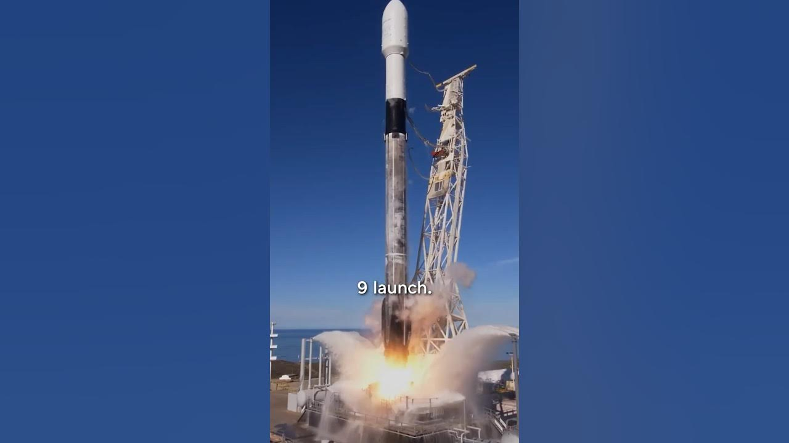

Yesterday marked a significant milestone in the world of satellite technology. Astranis successfully launched four broadband satellites aboard SpaceX's Falcon 9 rocket. This event is notable as it is the first time a commercial manufacturer has sent four of its own satellites to geostationary orbit (GEO) in a single mission. Astranis has come a long way from its humble beginnings in a small apartment to becoming a leader in satellite manufacturing.

### Key Takeaways

*   Astranis launched four satellites on a single Falcon 9 rocket.
*   The company started in a small apartment and has grown to over 400 employees.
*   They focus on a scrappy, innovative approach to satellite technology.
*   Astranis is developing next-generation systems while scaling operations.

## From Small Beginnings to Big Launches

Astranis began its journey in a tiny 1,000 square foot apartment. It was a tight space for a startup, but they made it work. With just a few Ikea desks and some basic equipment, they built their first satellites. The team kept their scrappy spirit alive, which helped them grow and innovate.

Fast forward eight years, and Astranis now operates out of a historic building at Pier 70. This area is quickly becoming a tech hub, and Astranis is at the forefront of this growth. They now have over **400 employees** working on cutting-edge satellite technology.

## The Launch of Four Satellites

Earlier this year, we got a sneak peek at their manufacturing facility. The team was busy putting the finishing touches on four brand new satellites. These satellites were in various stages of assembly, and one was almost ready for launch. The excitement was palpable as they prepared for the big day.

The launch took place aboard a **SpaceX Falcon 9**, one of the larger rockets available. Astranis secured a dedicated Falcon 9 launch, which is a big deal for a new company. This is a first in history for a commercial manufacturer to launch four satellites at once.

## Scaling Up Operations

With this launch, Astranis is not just sending satellites into space; they are also scaling up their operations. They plan to go from operating one satellite to five. This transition will bring new challenges and learning opportunities. The team is ready to tackle these head-on.

They are also working on developing their next-generation systems. This means they are balancing current operations with future innovations. It’s a busy time for Astranis, but they are excited about what lies ahead.

## The Spirit of Innovation

One of the key takeaways from Astranis's journey is that you don’t need to be a tech giant like Elon Musk to start a hard tech company. With the right mindset, domain experience, and a great co-founder, anyone can dive into this field. Astranis proves that regular people can create amazing technology with perseverance and creativity.

In conclusion, Astranis's successful launch of four satellites is a testament to their hard work and innovative spirit. As they continue to grow and develop new technologies, the future looks bright for this ambitious company. Keep an eye on Astranis; they are just getting started!
