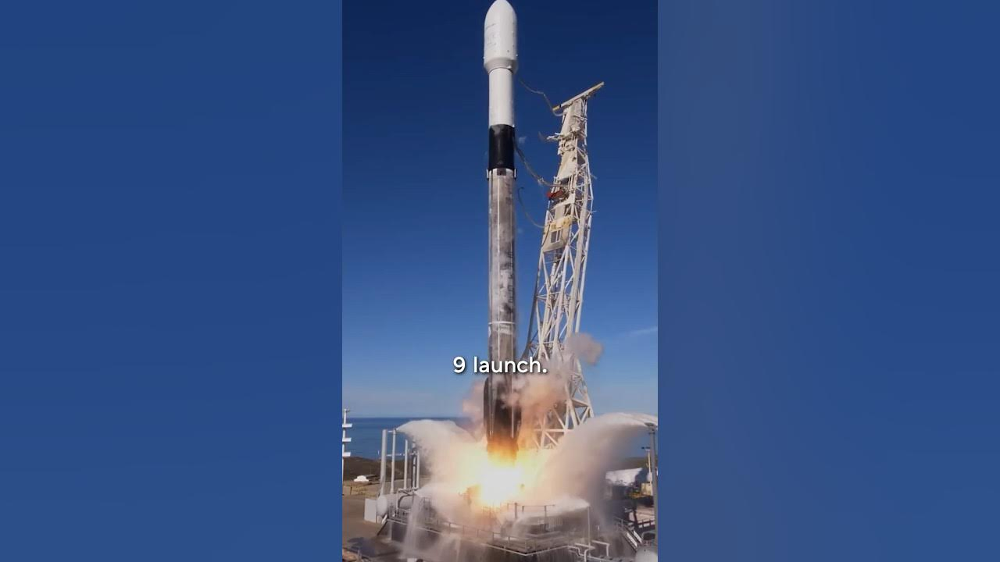

Yesterday marked a significant milestone in the world of satellite technology. Astranis successfully launched four broadband satellites aboard SpaceX's Falcon 9 rocket. This event is notable as it is the first time a commercial manufacturer has sent four of its own satellites to geostationary orbit (GEO) in a single mission. Astranis has come a long way from its humble beginnings in a small apartment to becoming a leader in satellite manufacturing.

### Key Takeaways

*   Astranis launched four satellites on a single Falcon 9 rocket.
*   The company started in a small apartment and has grown to over 400 employees.
*   They focus on a scrappy mindset and innovation in satellite technology.
*   Astranis is developing next-generation systems for future launches.

### From Small Beginnings to Big Launches

Astranis began its journey in a tiny 1,000 square foot apartment. It was a tight squeeze for all the team members and equipment. But, as they say, you don’t need a massive setup to build something great. With just some **Ikea desks** and a few essential tools, they started assembling their first satellites. The team kept their scrappy spirit alive, which helped them grow and innovate.

Fast forward eight years, and Astranis now operates out of a historic building at Pier 70. This area is quickly becoming a tech hub, and Astranis is at the forefront of that growth. They now have over **400 employees** working hard to push the boundaries of satellite technology.

### The Launch of Four Satellites

Earlier this year, we got a sneak peek at their manufacturing facility. It was buzzing with activity as the team put the finishing touches on four brand new satellites. These satellites were in various stages of assembly, and one was almost ready to launch. The excitement was palpable as they prepared for the big day.

The launch took place aboard a **SpaceX Falcon 9**, one of the bigger rockets available. Astranis secured a dedicated Falcon 9 launch, which is a big deal for a new company. This is a first in history for a commercial manufacturer to have an entire rocket dedicated to their satellites. It’s a huge step for Astranis and a testament to their hard work and determination.

### Scaling Up Operations

With this launch, Astranis is not just sending one satellite into orbit; they are sending four. This is a significant scaling up of their operations. They are moving from operating one satellite to five, which brings a whole new set of challenges and learning opportunities. The team is excited about the journey ahead, and they are ready to tackle whatever comes their way.

### Looking to the Future

But Astranis isn’t stopping here. They are also working on their next-generation systems. This means they are not just focused on the present but are also looking ahead to what’s next in satellite technology. There are many new vehicles and programs in the pipeline, and the team is balancing all these projects while keeping their innovative spirit alive.

### Conclusion

You don’t need to be a tech giant like Elon Musk to start a hard tech company. With the right mindset, some domain experience, and a great co-founder, anyone can dive into this field. Astranis is proof that regular people can achieve extraordinary things. Their journey from a small apartment to launching four satellites is inspiring. It shows that with perseverance and creativity, the sky is not the limit; it’s just the beginning.
