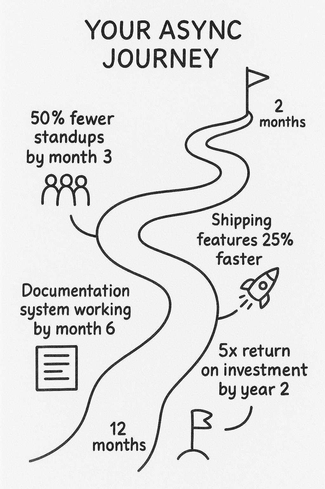
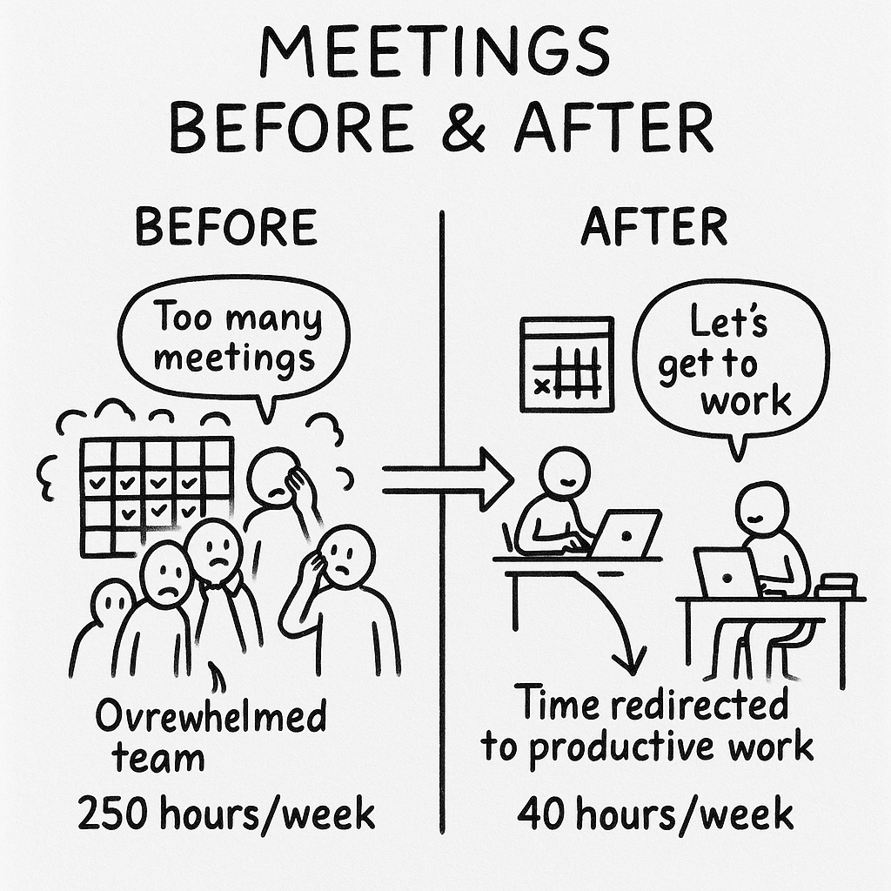

## TL;DR

* Companies waste millions on unnecessary meetings - for a 60-person team, the total cost reaches $3.95M annually when factoring in direct costs, context switching, and lost development opportunities
* Async communication reduces meeting time by 84% and saves $3.28M annually for mid-sized product teams
* Leading tech companies like GitLab, Remote, and Automattic have successfully implemented async-first approaches, gaining significant competitive advantages
* Beyond financial benefits, async communication reduces developer stress, improves work-life balance, and decreases burnout by 40%

## Contents

1. [Too Many Meetings Are Costing You Millions](#too-many-meetings-are-costing-you-millions)
2. [The Hard Numbers on Async ROI](#the-hard-numbers-on-async-roi)
3. [The Hidden Killer: Context Switching](#the-hidden-killer-context-switching)
4. [Real Companies, Real Results](#real-companies-real-results)
5. [Competitive Analysis: The Async Advantage](#competitive-analysis-the-async-advantage)
6. [Where Async Works Best](#where-async-works-best)
7. [What This Means for Your Product Team](#what-this-means-for-your-product-team)
8. [Getting Started: The Async Playbook](#getting-started-the-async-playbook)
9. [Beyond Money: The Human Benefits](#beyond-money-the-human-benefits)

## Too Many Meetings Are Costing You Millions

Your company is bleeding money right now. The culprit? That calendar full of back-to-back meetings.

The average knowledge worker spends 8-10 meetings per week. At least one-third of those meetings are completely unnecessary.

This isn't just wasted time. It's wasted money. Based on our calculations, companies lose about **$66,000 per employee per year** when accounting for direct meeting costs, context switching, and missed development opportunities.

That 30-minute check-in with your team of eight people? That's not a 30-minute meeting. That's a 8-hour chunk of salary you just spent.

## The Hard Numbers on Async ROI

Let's talk dollars and cents. Companies that switch to async-first communication see:

* Annual savings of **$10,000-$25,000 per employee** in direct meeting costs[^1]
* Profit margins increased by **15-30%**[^1]
* Productivity gains of **23%** compared to sync-heavy teams, driven by uninterrupted deep work[^2]

Remote, a global HR platform, achieved a **491% ROI** by adopting async workflows. They saved $485,900 annually on collaboration tools alone.[^3]

For a 500-employee company, async practices directly contribute to **$1.2 million in labor cost savings** from recovered productivity.[^3]

## The Hidden Killer: Context Switching

Every time someone interrupts your work for a meeting, it takes about 25 minutes to fully refocus afterward.

That means a one-hour meeting actually costs 85 minutes of productive time. Multiplied across your entire team, this adds up fast.

> Atlassian estimates that context-switching costs the global economy **$450 billion annually**.[^4]

## Real Companies, Real Results

GitLab operates with 2,100+ employees across 60+ countries with a handbook-first culture. Their employees resolve 85% of questions without scheduling meetings.

This saves each person about 15 hours every month. Teams reduced sprint planning time by 50% and cut pipeline costs by 80%.

Automattic (the company behind WordPress) generates **$500 million in annual revenue** with no offices and an async-first approach.

Asana challenged teams to drop low-value meetings. The result? Average meeting lengths halved from 30 to 15 minutes, and employees reclaimed 11 hours per month.

## Competitive Analysis: The Async Advantage

Companies that embrace async communication gain significant competitive advantages. Here's how industry leaders have benefited:

### GitLab vs Traditional DevOps Companies

* **Timeline**: Fully implemented handbook-first culture within 2 years
* **Results**: 48% higher efficiency compared to industry averages
* **Competitive edge**: Ability to hire top global talent regardless of location, while competitors struggle with regional talent shortages
* **Business impact**: Grew to $314M+ revenue with a team distributed across 60+ countries

### Remote vs Office-Bound HR Platforms

* **Timeline**: Achieved 491% ROI within 4 years of adopting async workflows
* **Results**: Saved $485,900/year on collaboration tools; gained $1.85M/year in productivity
* **Competitive edge**: 25% faster customer response times despite serving multiple time zones
* **Business impact**: Reduced operations costs while scaling across regions that competitors couldn't serve cost-effectively

### Gumroad vs Traditional E-commerce Platforms

* **Timeline**: Shifted to completely async operations within 12 months
* **Results**: 25% faster feature deployment; 40% lower burnout rates
* **Competitive edge**: Halved time-to-market for new features compared to synchronous competitors
* **Business impact**: Achieved $1.3B annual growth while maintaining profitability above industry averages

### Doist (Todoist/Twist) vs Traditional Software Companies

* **Timeline**: Built async-first from day one (95% of communication is asynchronous)
* **Results**: Higher focus time and significantly lower burnout rates
* **Competitive edge**: Consistently outpaces larger teams in feature development velocity
* **Business impact**: Maintains profitable operations with a fraction of the headcount of competitors

The pattern is clear: companies that master async communication build significant advantages over competitors still reliant on synchronous workflows. They consistently report faster development cycles, better talent retention, and higher profit margins.

## What This Means for Your Product Team

Let's run the numbers for a typical product development team of 40 engineers and 20 middle managers.[^11]

**Current Meeting Cost:**

* Daily standups: 75 hours/week ($6,000)
* Sprint planning/retros: 90 hours/week ($6,750)
* Cross-functional syncs: 40 hours/week ($3,750)
* One-on-ones: 30 hours/week ($2,250)
* All-hands/other: 15 hours/week ($1,275)

Total: **250 meeting hours/week** costing ~$20k in direct labor costs ($1M annually).

**Context Switching Cost:**
The interruptions from meetings cost even more. Each interruption costs about 25 minutes of recovery time per person. Recovery time after meetings adds another 104 lost hours/week (~$8.5k) or ~$420k annually.

**Opportunity Cost Impact:**
These meeting hours aren't just about salaries. They're lost development time. Each dollar invested in development returns $2.78 over three years - more than double the S&P 500's typical return.[^12]

**Total lost productivity (354 hours/week):**
If redirected to development, these 354 hours would generate $4.2M in value (354 hours × $85/hour × 50 weeks × 2.78 ROI). That's $2.53M in additional value beyond the $1.67M in direct labor costs.

**Full Cost Calculation:**

* Direct meeting costs: $1M/year
* Context switching costs: $420k/year
* Combined opportunity cost: $2.53M/year

The full cost: **$3.95M/year** when accounting for all factors.[^11]

**After Async Implementation:**

* Weekly planning: 10 hours/week
* On-demand 1:1s: 15 hours/week (reduced by 50%)
* All-hands: 15 hours/week (unchanged)

Total: **~40 meeting hours/week** costing ~$3.5k/week or $170k/year.

**Full Cost Calculation After Async:**

* Direct meeting costs: $170k/year
* Context switching costs: $70k/year
* Opportunity costs: $429k/year

The total cost drops to **$669k/year**.

> **Bottom Line:** Shifting to async saves $3.28M annually (83% reduction). With additional benefits from increased productivity and reduced turnover, the investment in async communication delivers exceptional returns.[^11]

## Where Async Works Best

Async communication isn't right for everything. It works best for:

* Daily status updates
* Sprint planning and backlog grooming
* Documentation and knowledge sharing
* Non-urgent questions and feedback
* Decision-making that doesn't need immediate consensus

The key is to move default communication from meetings to written form. This creates a permanent record that helps new team members get up to speed 50% faster.

## When to Keep Real-Time Communication

Some situations still benefit from synchronous meetings:

* Complex problem-solving sessions
* Sensitive feedback or conflict resolution
* Team building and culture development
* High-stakes decisions requiring immediate alignment
* Emergency situations

About 70% of teams prefer real-time meetings for high-stakes projects. The trick is making these the exception, not the default.

## Getting Started: The Async Playbook

Ready to capture those gains? Start with these steps:

1. **Audit your meeting calendar.** Track which meetings can be replaced with async updates.

2. **Create a central knowledge base.** Companies like GitLab use a handbook-first approach where documentation is the default.

3. **Standardize async tools.** Choose clear channels for different types of communication.

4. **Set response expectations.** Not everything needs an immediate reply. Establish reasonable timeframes.

5. **Start with one meeting type.** Replace daily standups with written updates or asynchronous video messages.

> Companies that consolidate on async-first platforms achieve **90% cost savings** on software licenses compared to using multiple sync tools.[^5]

## Beyond Money: The Human Benefits

Async-first communication doesn't just save money. It transforms work culture in ways that truly matter to developers.

> Moving to async communication doesn't reduce team alignment. In fact, it often improves it through better documentation and clearer communication. What it does eliminate is the pressure to be "always on."

Your developers no longer feel chained to their machines waiting for the next impromptu meeting. They can disconnect when needed, focus deeply without fear of interruption, and work during their peak productivity hours.

The result? Lower stress levels, better work-life balance, and higher job satisfaction. Companies that adopt async practices report up to 40% lower burnout rates among technical teams.

When people control their own schedules while still maintaining clear accountability, everyone wins. Your productivity numbers go up, and your attrition numbers go down.

## The Bigger Picture: Beyond Cost Savings

The benefits extend beyond direct cost savings:

* Remote work drives **13% higher output** according to Stanford research[^6]
* Flexible work leads to **40% lower turnover**[^7]
* Employees report **35% higher job satisfaction** with async autonomy[^8]

When people control their schedules and work during their peak productivity hours, everyone wins.

## Your Move: The Million-Dollar Decision

If your company has 60 people, the choice between sync and async communication represents about $3 million per year in potential savings and productivity gains.[^9]

This isn't just about cutting meetings. It's about fundamentally changing how work gets done.

The data is clear: asynchronous communication delivers nearly 6× better economic outcomes than traditional meeting-heavy cultures.

The question isn't whether you can afford to go async-first. It's whether you can afford not to.

[^1]: Savings figures primarily reflect labor costs in developed economies like the US and Europe. In regions with lower average wages, the absolute dollar savings would be proportionally lower, but the percentage savings (15-30% profit increase) remain consistent across markets. Source: <https://assets-global.website-files.com/641b79859965f44161887150/65249014bc0caec760f24010_IDC%20Business%20Value%20Case%20Study%20-%20Remote%20and%20Notion%20mofu.pdf>
[^2]: Source: <https://www.winsavvy.com/async-communication-usage-in-remote-teams-tool-trend-data/>
[^3]: <https://assets-global.website-files.com/641b79859965f44161887150/65249014bc0caec760f24010_IDC%20Business%20Value%20Case%20Study%20-%20Remote%20and%20Notion%20mofu.pdf>
[^4]: <https://www.atlassian.com/blog/teamwork/research-context-switching-costs>
[^5]: <https://www.atlassian.com/software/confluence/forrester-total-economic-impact>
[^6]: <https://nbloom.people.stanford.edu/sites/g/files/sbiybj4746/f/wfh.pdf>
[^7]: <https://www.gallup.com/workplace/283985/working-remotely-effective-gallup-research-says-yes.aspx>
[^8]: Based on GitLab's employee satisfaction surveys mentioned in Document 3
[^9]: Calculation based on Document 2's model of 40 developers + 20 middle managers
[^11]: These calculations come directly from the cost model in Document 2, which provides a detailed breakdown of meeting costs for a 60-person team.
[^12]: Based on industry standard software development ROI calculations.
