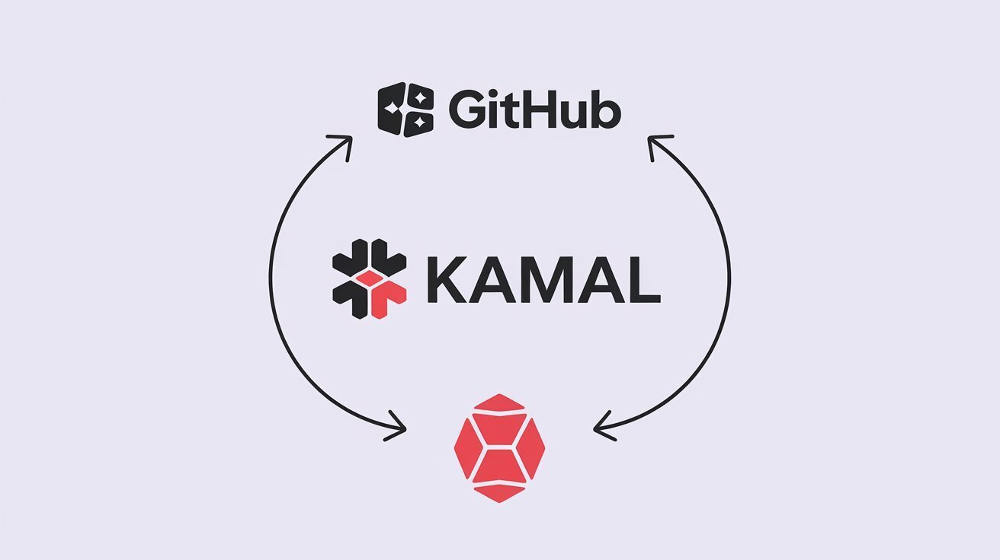

Deployments shouldn’t be complex. You don’t need a lot of complicated configurations. That’s where Kamal 2 helps. It makes setting up servers and deploying easy.

We’ll use Kamal 2 to set up auto-deployments from GitHub Actions.



## Here are step-by-step instructions to set up Kamal and create an auto-deploy process

1\. Start by adding Kamal to your `Gemfile`

```ruby
group :tools do
  gem “kamal”, “~> 2”
end
```

2\. Install and generate binstub for Kamal:

```shell
bundle install && bundle binstub kamal
```

3\. Update `config/deploy.yml` with your server details and setup caching:

```yaml
# Configure builder setup.
builder:
  arch: amd64
  cache:
    type: gha
    options: mode=max
    image: app-build-cache
  secrets:
    - RAILS_MASTER_KEY # if your build depends on credentials
```

4\. Set up secrets in `.kamal/secrets`

```
KAMAL_REGISTRY_USERNAME=$KAMAL_REGISTRY_USERNAME
KAMAL_REGISTRY_PASSWORD=$KAMAL_REGISTRY_PASSWORD
RAILS_MASTER_KEY=$RAILS_MASTER_KEY
```

5\. Create a new GitHub Actions workflow to run the deployment with Kamal using `.github/workflows/release.yml`

```yaml
name: Release

on:
  workflow_dispatch:
  push:
    branches:
      - main

concurrency:
  group: ${{ github.workflow }}-${{ github.event.pull_request.number || github.ref }}
  cancel-in-progress: false # Prevents ongoing deployments from being canceled

env:
  SERVER_ADDR: “HERE IS YOUR PRODUCTION SERVER ADDR”

jobs:
  deploy:
    runs-on: ubuntu-latest

    permissions:
      contents: read
      packages: write
      attestations: write
      id-token: write

    env:
      DOCKER_BUILDKIT: 1
      RAILS_ENV: production
      BUNDLE_WITHOUT: “default development test production profiling”
      BUNDLE_WITH: tools

    steps:
      - name: Checkout code
        uses: actions/checkout@v4

      - name: Set up Ruby
        uses: ruby/setup-ruby@v1
        with:
          ruby-version: 3.3.0
          bundler-cache: true
          cache-version: "tools-v1-${{ runner.os }}"

      - name: Set up Docker Buildx for cache
        uses: docker/setup-buildx-action@v3

      - name: Expose GitHub Runtime for cache
        uses: crazy-max/ghaction-github-runtime@v3

      - name: Set up SSH connection
        run: |
          # Create SSH directory and write the private key
          mkdir -p ~/.ssh && echo "$SSH_PRIVATE_KEY" > ~/.ssh/id_rsa && chmod 600 ~/.ssh/id_rsa
          # Enable current SSH key
          eval $(ssh-agent -s) && ssh-add ~/.ssh/id_rsa
          # Add the server to known_hosts (use `-p 2222` for custom port if needed)
          ssh-keyscan $SERVER_ADDR >> ~/.ssh/known_hosts
        env:
          SSH_PRIVATE_KEY: ${{ secrets.SSH_PRIVATE_KEY }}

      - name: Deploy with Kamal
        run: bin/kamal deploy
        env:
          RAILS_MASTER_KEY: ${{ secrets.RAILS_PRODUCTION_MASTER_KEY }}
          KAMAL_REGISTRY_PASSWORD: ${{ secrets.GITHUB_TOKEN }}
          KAMAL_REGISTRY_USERNAME: ${{ github.actor }}
```

6\. Provide secrets on GitHub Settings -> Secrets and variables:

All secrets need to be added to the GitHub Actions secrets manager. You need to provide `SSH_PRIVATE_KEY` and `RAILS_PRODUCTION_MASTER_KEY`. Here’s [GitHub’s guide on how to add them](https://docs.github.com/en/actions/security-guides/encrypted-secrets).

## Let me explain what each part does and why it’s needed.

```yaml

name: Release

on:
  workflow_dispatch:
  push:
    branches:
      - main
```

This part sets up our GitHub Action to run. We use `workflow_dispatch` for manual deployments and `push` to the `main` branch for automatic deployments when changes are made.

```yaml
concurrency:
  group: ${{ github.workflow }}-${{ github.event.pull_request.number || github.ref }}
  cancel-in-progress: false # We don’t want to cancel ongoing deployments
```

`concurrency` makes sure that deployments don’t overlap. The group is set dynamically, and we don’t cancel in-progress deployments to avoid issues from partial releases.

```yaml
jobs:
  deploy:
    runs-on: ubuntu-latest

    permissions:
      contents: read
      packages: write
      attestations: write
      id-token: write
```

The `deploy` job runs on an Ubuntu machine. The permissions allow it to interact with the package registry and use the ID token for authentication.

```yaml
    env:
      DOCKER_BUILDKIT: 1
      RAILS_ENV: production
      BUNDLE_WITHOUT: “default development test production profiling”
      BUNDLE_WITH: tools
```

The environment variables do a few things. They enable Docker BuildKit, set the Rails environment to `production`, and control which dependencies to include or exclude during bundling.

```yaml
    steps:
      - name: Checkout code
        uses: actions/checkout@v4
```

The first step is to check out your code. This is necessary to access your application files.

```yaml
      - name: Set up Ruby
        uses: ruby/setup-ruby@v1
        with:
          ruby-version: 3.3.0
          bundler-cache: true
          cache-version: "tools-v1-${{ runner.os }}"
```

Next, we set up Ruby. We use version 3.3.0, and bundler caching helps speed up future runs by saving installed gems.

```yaml
      - name: Set up Docker Buildx for cache
        uses: docker/setup-buildx-action@v3
```

We use Docker Buildx to handle advanced builds, including caching, and keep things efficient.

```yaml
      - name: Expose GitHub Runtime for cache
        uses: crazy-max/ghaction-github-runtime@v3
```

This step is for caching. It helps Docker use the GitHub runner’s internal state to speed up builds.

```yaml
      - name: Setup SSH connection
        run: |
          # Create SSH directory and write the private key
          mkdir -p ~/.ssh && echo "$SSH_PRIVATE_KEY" > ~/.ssh/id_rsa && chmod 600 ~/.ssh/id_rsa
          # Enable current SSH key
          eval $(ssh-agent -s) && ssh-add ~/.ssh/id_rsa
          # Add the server to known_hosts
          ssh-keyscan SERVER_IP_ADDRs >> ~/.ssh/known_hosts
        env:
          SSH_PRIVATE_KEY: ${{ secrets.SSH_PRIVATE_KEY }}
```

This step sets up SSH. It creates the SSH directory, adds the private key, and sets the correct permissions. We start `ssh-agent` to manage the keys and add our server to `known_hosts` to prevent prompts during deployment.

```yaml
      - run: bin/kamal deploy
        env:
          RAILS_MASTER_KEY: ${{ secrets.RAILS_PRODUCTION_MASTER_KEY }}
          KAMAL_REGISTRY_PASSWORD: ${{ secrets.GITHUB_TOKEN }}
          KAMAL_REGISTRY_USERNAME: ${{ github.actor }}
```

Finally, we run the Kamal deploy command. The `RAILS_MASTER_KEY` is used to decrypt credentials, and we authenticate with the Docker registry using GitHub secrets for username and password.

### Next, let’s look at the deploy configuration file at `config/deploy.yml`:

```yaml
# Configure builder setup.
builder:
  arch: amd64
  cache:
    type: gha
    options: mode=max
    image: app-build-cache
  secrets:
    - RAILS_MASTER_KEY
```

This configuration helps Kamal manage the build process. It sets the architecture (`amd64`), uses GitHub Actions for caching, and stores secrets like `RAILS_MASTER_KEY` securely.


That’s it! This setup gives you an easy, repeatable deployment process using Kamal 2 and GitHub Actions.

---

If you follow along and set this up, you’ll save time on deployments. Let me know if you have issues or want to customize this further. I’d love to hear about your experience with Kamal.
