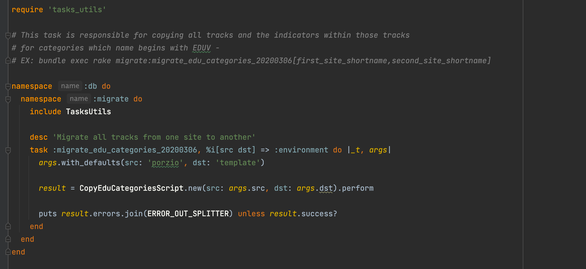

## Avoid data migrations in the schema migrations for Rails

Could you re-run all migrations in the project? How often were you required to fix them while production was under fire? What can you do to prevent problems with migration and not waste much time on it?

## Solution

Do not mess with schema and data migrations! Separate those problems. There is a pretty common strategy for this:

- Use migrations only for schema changes.
- Use one-off tasks to seed, transform, or import data.
- Drop outdated migrations and join redundant tasks into efficient workflows.

### How can you onboard it?

As usual, there are ready solutions with a lot of helpers to make this work:

* [https://github.com/ilyakatz/data-migrate](https://github.com/ilyakatz/data-migrate)

* [https://github.com/theSteveMitchell/after_party](https://github.com/theSteveMitchell/after_party)

But you can also do this without gems by following a simple convention.

### DIY Algorithm

 1. Add Service to migrate data. More details about Services you can find on [How to use a Transaction Script (aka Service Objects) in Ruby on Rails](https://jtway.co/how-to-use-a-transaction-script-aka-service-objects-in-ruby-on-rails-simple-example-161b7e228942?source=friends_link&sk=6b96a97ea4ec3ab4fa62e6e27fb39e9e).

 2. (Optional) If you are using [the TDD way](https://jtway.co/why-and-how-to-use-tdd-main-tips-976b3a6edebb), you should also add tests for it. Ensure that this migration does not corrupt production data.

 3. Create a one-off rake task with the timestamp. The timestamp will simplify finding unrelated tasks and cleaning them up.

 4. In the task, you should run Service. No need to have any logic there. Run and output.

 5. On release: invoke the rake task.

 6. Schedule removes the rake task and obsolete code following success.

## More details about the problem

It’s not common for Ruby on Rails developers to re-run migrations. But migrations are the most “perishable product” in the project.

Models schema, methods, or in general logic at all in the migrations, as usual, are not relevant in a very short time. We do not use them on an everyday basis, so we would not find a problem faster.

As a result, once you have a situation in which you need to run a migration. And you will find that you broke them. It will need some time and energy to clean up and make them work.

But as usual, you have production on the fire now, and last what you would like to fix are the migrations.

### Other solutions

To make migrations work as long as possible, avoid direct Model references, method calls, and Active Record Queries. Use raw SQL instead.

Also, you can do regular migration cleanups and squashes, but as usual, we do not care about them much as soon as we have delivered them to production.
