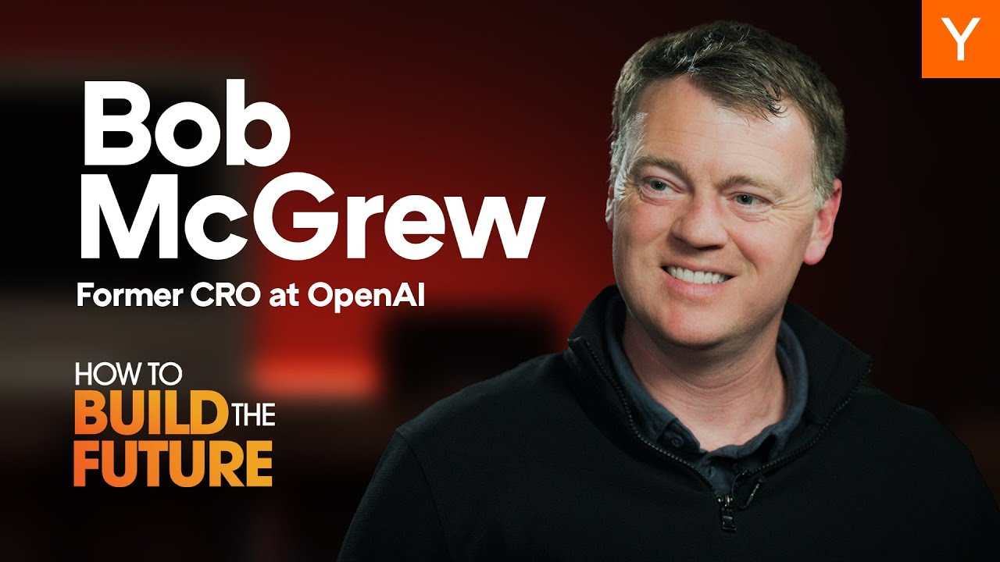

In a recent episode of "How To Build The Future," Garry Tan interviews Bob McGrew, former Chief Research Officer at OpenAI. They discuss the evolution of AI, the journey towards Artificial General Intelligence (AGI), and the future of jobs in an AI-driven world. McGrew shares insights from his time at OpenAI, touching on scaling laws, reasoning in AI, and advice for startups.

### Key Takeaways

*   Reasoning and test-time compute are key to developing reliable AI agents.
*   Early projects at OpenAI focused on robotics and gaming to improve AI capabilities.
*   Scaling laws play a crucial role in AI development and performance.
*   The future of jobs will involve humans working alongside AI, focusing on creativity and management.

## The Early Days at OpenAI

Bob McGrew's journey into AI began unexpectedly. He initially aimed to start a robotics company but found himself at OpenAI, a place filled with brilliant minds and ambitious goals. He learned deep learning by teaching a robot to play checkers, which laid the groundwork for his future work.

At OpenAI, the mission was clear: build AGI. Early projects included teaching a robot hand to solve a Rubik's Cube and developing AI to play Dota 2. These projects were not just for fun; they were crucial in proving that scale and experience could significantly enhance AI learning.

## The Role of Scaling Laws

Scaling laws became a cornerstone of OpenAI's approach. McGrew explains that the secret to improving AI lies in feeding vast amounts of experience into neural networks. This principle was evident in both gaming and robotics projects. The success of these projects led to the development of language models like GPT-1, which used a simple objective of predicting the next word to generate coherent text.

### Key Projects at OpenAI

1.  **Robotics**: Teaching a robot hand to solve a Rubik's Cube.
2.  **Gaming**: Developing AI to play Dota 2, showcasing the importance of scale in learning.
3.  **Language Models**: The creation of GPT-1, which relied on predicting the next token to generate text.

## The Shift Towards Reasoning

As AI technology advanced, McGrew noted a shift from merely scaling models to incorporating reasoning. This new approach allows AI to think longer and more deeply about problems, leading to more reliable outcomes. The ability to reason is seen as a critical step towards achieving AGI.

### The Importance of Reliability

For AI agents to be trusted, they must demonstrate reliability. McGrew emphasizes that increasing the reliability of AI actions is essential. This involves not just scaling models but also improving their reasoning capabilities. The goal is to create AI that can perform tasks on behalf of users with a high degree of accuracy.

## The Future of Jobs

One of the most intriguing discussions in the interview revolves around the future of work. McGrew believes that while AI will automate many tasks, it will also create new opportunities. The roles of **creators** and **managers** will become more prominent, as humans will need to guide and collaborate with AI systems.

### Potential Job Roles in an AI-Driven World

*   **Creators**: Innovators who leverage AI to develop new ideas and products.
*   **Managers**: Individuals who oversee AI systems and ensure they align with human goals.

## Advice for Startups

For those looking to start AI companies, McGrew advises focusing on the best models available. Startups should aim to build products quickly and iterate based on user feedback. The key is to harness the power of AI effectively without getting bogged down in lengthy development cycles.

## The Road Ahead

As AI continues to evolve, McGrew is optimistic about the future. He believes that breakthroughs in robotics and AI will lead to significant advancements in various fields. However, he also acknowledges that challenges remain, particularly in integrating AI into real-world applications.

In conclusion, the conversation between Garry Tan and Bob McGrew sheds light on the exciting developments in AI and the path towards AGI. With a focus on reasoning, scaling, and collaboration between humans and AI, the future looks promising. The journey is just beginning, and the potential for innovation is vast.
