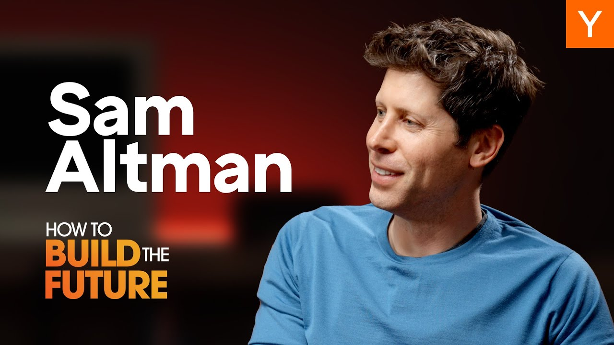

In a recent conversation, Sam Altman, CEO of OpenAI, shared his thoughts on the future of technology and the exciting opportunities for startups. He discussed the rapid advancements in AI, the importance of conviction in pursuing ambitious goals, and the potential for a new age of abundance driven by technology. This dialogue is a must-read for anyone interested in the tech landscape and the future of innovation.

### Key Takeaways

*   **Best Time for Startups**: Altman believes we are in the best era yet for starting tech companies, with rapid advancements in technology creating new opportunities.
*   **Conviction Matters**: Having a strong belief in your vision can be a game-changer, especially when others doubt your ideas.
*   **The Age of Abundance**: The potential for abundant energy and intelligence could lead to significant advancements in various fields, including climate change and space exploration.
*   **Learning from Failures**: Altman emphasizes the importance of learning from mistakes and adapting quickly in the startup world.
*   **AI's Future**: The development of Artificial Super Intelligence (ASI) is closer than many think, with Altman predicting it could be just a few thousand days away.

### The Best Time To Start A Tech Company

Altman kicked off the discussion by stating that this is the best time to start a tech company. He believes that with each major technological revolution, the potential for impactful companies increases. The current wave of innovation, particularly in AI, presents unique opportunities for startups to thrive.

### The Power of Conviction

One of the most compelling points Altman made was about the power of conviction. He noted that many in the tech industry still do not grasp the value of having a strong belief in a singular vision. This conviction can drive startups to succeed, even when faced with skepticism from others. Altman’s own journey with OpenAI exemplifies this, as they pursued ambitious goals in a field that many deemed impossible.

### The Age of Abundance

Altman discussed the concept of an age of abundance, where advancements in AI and energy could lead to significant improvements in quality of life. He highlighted the potential for solving major global issues, such as climate change and energy scarcity, through technological innovation. The idea of limitless intelligence and energy is not just a dream; it’s a possibility that could be realized sooner than we think.

### Learning From The Journey

Reflecting on his experiences, Altman shared that the startup journey is filled with ups and downs. He emphasized the importance of learning from failures and being adaptable. Many successful founders have faced setbacks, but those who can pivot and learn from their mistakes often find greater success in the long run.

### The Future of AI

Altman’s predictions about AI are bold. He believes that ASI is on the horizon, and the advancements in AI technology are accelerating at an unprecedented rate. He encourages founders to embrace this technology and leverage it to create innovative solutions. The potential for AI to transform industries is immense, and those who can harness its power will be at the forefront of the next wave of innovation.

### Conclusion

Sam Altman’s insights provide a glimpse into the future of technology and the exciting opportunities that lie ahead for startups. With a focus on conviction, learning from failures, and embracing the advancements in AI, aspiring founders can position themselves for success in this dynamic landscape. The future is bright, and it’s an exciting time to be part of the tech world.