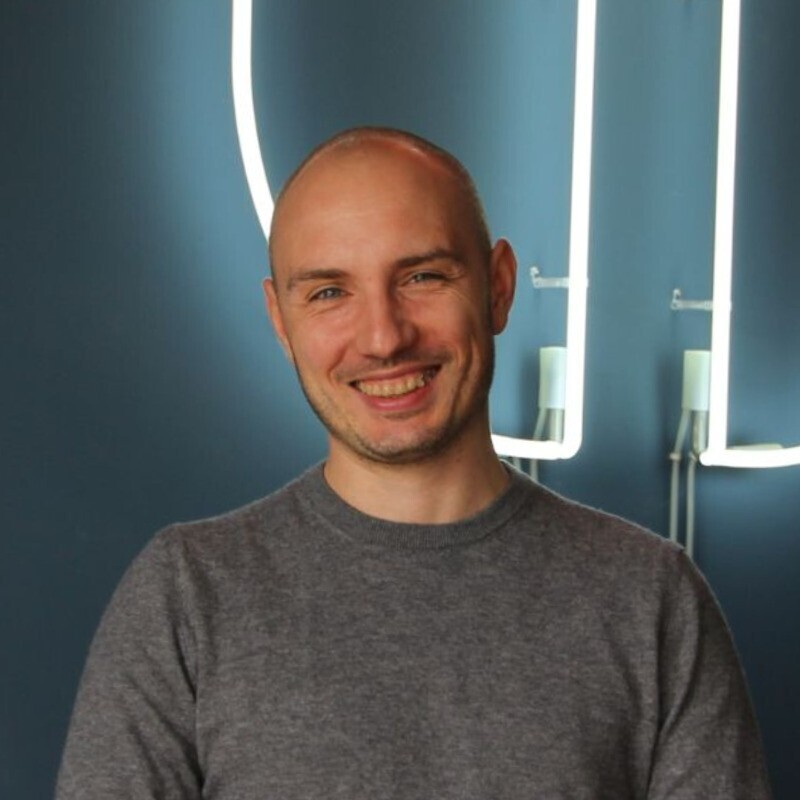
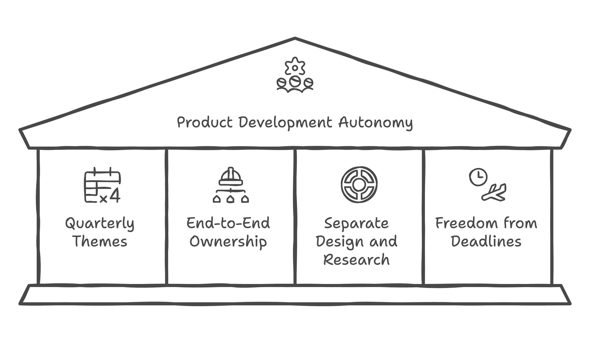
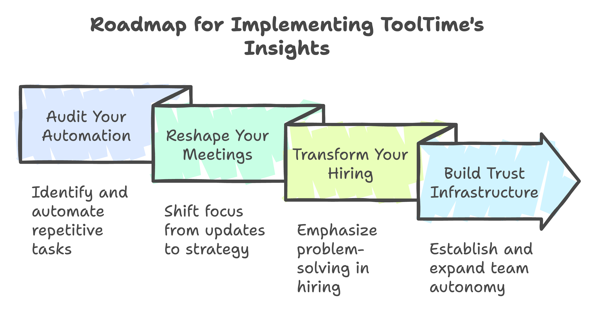

If you're an engineering leader wrestling with scaling teams while preserving autonomy, this story will transform how you think about trust and technical leadership. 

I've spent months exploring how Berlin's top tech companies handle growth. But what I found at ToolTime wasn't just another management philosophy – it was a masterclass in building self-sustaining engineering cultures.

Picture this: 76 microservices, 20 developers, no dedicated SRE team, and zero traditional managers. Impossible? That's what I thought too. But ToolTime's approach challenges everything we assume about technical leadership and team scaling.

## Trust as Infrastructure: The Foundation of High-Performing Teams

"It's like being thrown into deep and cold water," Slawomir Smiechura, VP of Engineering at ToolTime, told me about their onboarding process. "We watch to make sure you don't drown, but you need to swim."

This isn't reckless abandon – it's calculated trust. While most Berlin companies build walls of specialization and strict role boundaries, ToolTime builds bridges. Their engineers move fluidly between mobile, backend, and web development as business needs shift.

The safety nets? They're there. But they're designed to catch, not constrain.

## The Seven-Month Search: Why Hiring Takes Time but Saves Years

"We want developers who can articulate why they do things," Slawomir emphasized. Forget the typical checklist of programming languages and frameworks. ToolTime hunts for something rarer: engineers who see software as a craft, not just a skill.

Their hiring process averages seven months. Excessive? Consider this: in five years, they've built a team where the VP of Engineering role has become "redundant" – by design, not by accident.

## Microservices Without the Chaos: A Blueprint for Scalable Architecture

When most teams hear "76 microservices," they imagine a maintenance nightmare. But ToolTime turned conventional wisdom on its head through four key principles:

1. Four-tier architecture with strict top-to-bottom communication
2. Automated boilerplate generation (5 minutes from idea to production)
3. Contract-first development using OpenAPI
4. Zero cross-service spaghetti dependencies

"What's there to maintain?" Slawomir asked when I probed about operational overhead. Their contracts don't break because they've automated the mundane and standardized the complex.

## The Zero Bug Philosophy: Quality as a Cultural Cornerstone

Forget bug backlogs and technical debt meetings. ToolTime treats every bug like a small fire that needs immediate attention:

- Any squad can pick up any bug
- Bugs move straight to the front of the Kanban board
- Everyone owns quality – no separate maintenance team

This isn't just process – it's freedom. When teams know issues won't accumulate, they build with confidence.

## Engineering Leadership Reimagined: From Command to Cultivation

Six squads, zero traditional managers. ToolTime's engineering leaders function more like gardeners tending to an ecosystem than commanders issuing orders.

"If teams know what they're doing, I don't interfere," Slawomir explained. His role? Create fertile ground where good engineering practices grow naturally.

Their product development thrives on this autonomy:
- Quarterly themes replace detailed specifications
- Teams own solutions end-to-end
- Design and research flow separately from implementation
- Creative work breathes free from arbitrary deadlines

## Strategic Alignment: The Power of Shared Vision

Five years ago, ToolTime made what seemed like a radical bet: hire engineers without dictating their every move. It worked because they aligned three critical elements:

- Leadership trust in team autonomy
- Technical excellence through automation
- Clear business vision (currently focused on ToolTime Pay, their first financial product)

## From Philosophy to Practice: Building Your Trust-Based Engineering Culture

Here's your roadmap for implementing ToolTime's insights, starting tomorrow:

1. **Audit Your Automation (Week 1)**
   - List your three most repetitive development tasks
   - Prototype one automated solution
   - Measure time saved and share results

2. **Reshape Your Meetings (Month 1)**
   - Replace status updates with strategy discussions
   - Give teams space to present their architectural decisions
   - Listen more than you direct

3. **Transform Your Hiring (Quarter 1)**
   - Rewrite job descriptions to emphasize problem-solving over specific tech stacks
   - Add "why" questions to your technical interviews
   - Create space for candidates to demonstrate architectural thinking

4. **Build Trust Infrastructure (Year 1)**
   - Start with small autonomous decisions
   - Document and share successful team-led initiatives
   - Gradually expand the scope of team authority

## The Berlin Breakthrough

Berlin's tech scene stands at a crossroads between traditional German engineering and startup agility. ToolTime shows us a third path: structured autonomy.

The journey requires patience. Seven months to hire the right people. Five years to build the right culture. But ask yourself: would you rather spend the next five years pushing people to perform, or creating an environment where performance emerges naturally?

The water might be deep, but now you have a map for swimming.

---

_Ready to transform your engineering culture? Start with one practice from the roadmap above and share your results. This post is part of my ongoing exploration of technical leadership in Berlin. If you're a tech leader with a story to share, [reach out](https://jetthoughts.com/contact-us/)._

---

**Author:** [Paul Keen](https://www.linkedin.com/in/paul-keen/) is a Fractional CTO and Engineering Leader who has helped multiple startups go from idea to market.
