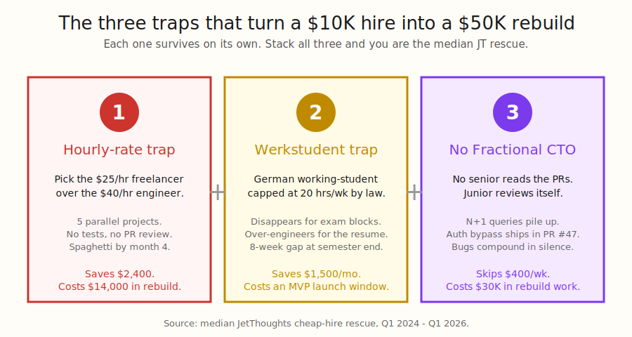
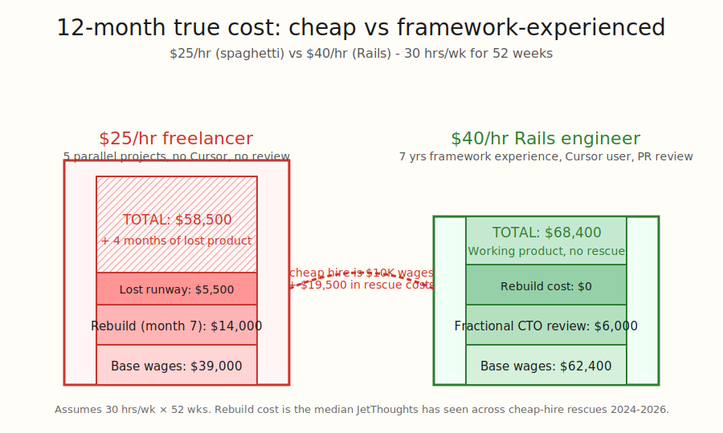
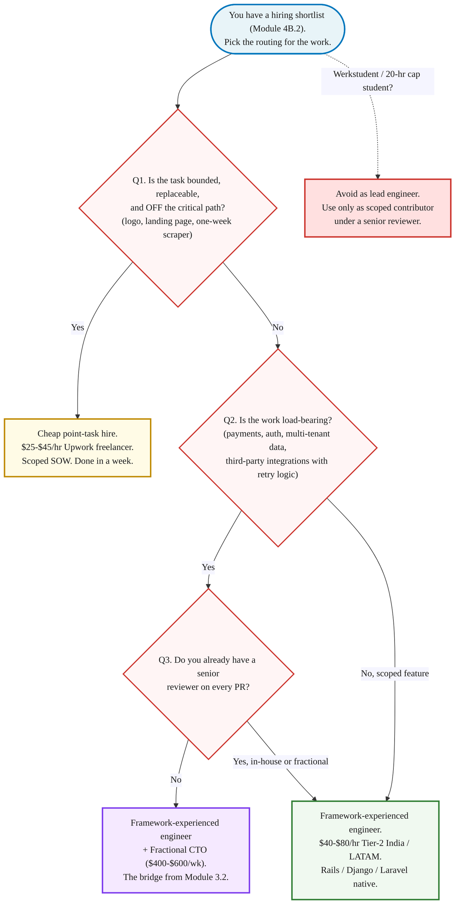

> **Module 4B · Step 3 of 4** · [Tech for Non-Technical Founders 2026](/blog/tech-for-non-technical-founders-2026/) free course.
> Input: a hiring shortlist (from Module 4B.2 interviews). Output: a clear-eyed view of what "cheap" actually costs over 12 months.

**EUR 10,800 in invoices over twelve weeks. EUR 47,000 to make the codebase shippable.** A Berlin founder paid a TU Berlin Werkstudent EUR 18/hr and a Pakistan Upwork freelancer $22/hr until mid-July, when the student vanished into Klausurenphase for six weeks and the freelancer's "quick refactor" broke checkout. The cheap hires were not the cause of the rebuild. The missing Fractional CTO PR-review hour was.

## Why this matters in 2026

The 2026 hire market gives a non-technical founder a real choice between a $25/hr generalist on Upwork, a $40/hr Tier-2 India engineer with seven years of Rails, a $400/wk Fractional CTO who reads every PR, and a $185K San Francisco Senior who has never opened Cursor. The cheap-end options look survivable on a 12-week budget spreadsheet. They stop looking survivable the day a senior engineer opens the codebase. The [Russian-source ecosystem research](https://medium.com/predict/offshore-software-development-in-2026-the-definitive-guide-d81f3e822c95) and [Veracode's GenAI Code Security Report 2025](https://www.veracode.com/blog/genai-code-security-report/) line up on the same point: 45% of LLM-generated code ships at least one exploitable security flaw, and the cost of a wrong-fit cheap hire compounds across rebuild, lost runway, and the founder hours spent firefighting. Three traps catch most pre-seed founders. One scenario makes cheap the right answer.

## Trap 1: hourly-rate-only thinking

The cheapest column in the spreadsheet wins the role. The founder picks the $25/hr Upwork freelancer over the $40/hr Tier-2 India engineer because the math reads "save $15 an hour times 30 hours a week times 52 weeks equals $23,400 a year." The math is correct. The math is also irrelevant.

A $25/hr freelancer in 2026 is almost always running 5 parallel projects to keep their effective income above $4,000 a month. They context-switch hourly. They write code that compiles, ships, and breaks two weeks later. The Russian-source research summarises the failure mode in one sentence: a cheap hire produces working code that one senior engineer eventually has to rebuild in full because the architecture cannot hold a second feature.

The $40/hr Rails engineer in Coimbatore or Indore at the same 30 hrs/wk does three things the $25/hr freelancer does not. They run failing tests before they write code. They open one project at a time. They direct Cursor or Claude Code with a `.cursorrules` file the founder can read. The 60% rate premium buys 4x the architectural longevity. The math the founder should run is twelve-month total cost, including the rebuild, not the line-item hourly rate.

The chart looks close on the bottom-line dollar number. The product outcome is not close. The cheap-hire column ends month seven with a rebuild quote and a four-month gap in the roadmap. The $40/hr column ends month seven with a working product and a paying user list. The founder who optimises for the hourly rate buys the spreadsheet, not the product.

## Trap 2: working-student / Werkstudent

The Werkstudent contract in Germany caps a working student at 20 hours per week during the lecture period under the [Werkstudentenprivileg rules](https://www.bmas.de/EN/Topics/Foreign-Workers-and-Migrants/working-students.html), with the social-insurance exemption hinged on staying under 20 hrs/wk averaged across the semester. The student also disappears for two to four weeks during Klausurenphase (exam blackout) at the end of each semester. A founder who hires a Werkstudent as the lead engineer is signing up for two known service interruptions per year, each timed to coincide with the worst possible point in the product calendar. The same trap exists outside Germany under different names: the UK [Tier 4 visa 20-hour cap](https://www.gov.uk/student-visa/work) for international students, the US F-1 visa 20-hour on-campus cap, the French RAFP cap.

The second failure mode is structural. A computer-science student who has never shipped to production over-engineers everything for resume value. They build the contractor-match service as three microservices because they want to put "microservices architecture" on their CV. They pick MongoDB over Postgres because "NoSQL" sounds modern. They wire Kafka into a 200-user app because the YouTube tutorial they watched used Kafka. The founder cannot push back because the founder does not have the senior judgment in the room. The student ships an MVP that looks impressive on a screenshare and falls apart the day the second engineer joins the codebase.

The cap, the blackouts, and the resume-padding all compound. A Werkstudent at EUR 18 an hour saves the founder EUR 1,500 a month versus a EUR 40 an hour Tier-2 India engineer. The Werkstudent also costs the founder a six-week gap mid-summer, a microservices migration that nobody asked for, and an MVP that an actual senior engineer has to rewrite in Rails before it can hold a paying customer. The salvage cost dwarfs the saved wages.

## Trap 3: no Fractional CTO bridge

A junior engineer reviewing their own pull requests catches nothing. A $25/hr freelancer reviewing their own PRs catches less. A Werkstudent reviewing their own PRs is a code-review process where the most senior person in the room is a third-year undergraduate. The founder is non-technical by definition. Without a senior reader on the codebase, the bugs compound in silence.

The compounding is the part founders underestimate. An n+1 query in line 47 of `ContractorsController#match` does not break anything in week one when there are eight rows in the contractors table. It breaks in week eighteen when there are 1,800 rows and the page takes nine seconds to load. The auth bypass on the admin route shipped in PR #47 does not break anything until a curious user types `/admin` into the URL bar. The hardcoded API key in `config/database.yml` does not break anything until a junior engineer pushes the repo public to demo a side feature. None of these are caught by tests because nobody is writing tests. None of these are caught by review because nobody is doing review.

The [Fractional CTO bridge from Module 3.2](/blog/fractional-cto-bridge-5-hours-week/) is the structural fix. $400 to $600 a week buys two hours of PR review per week, one hour of architecture review on Monday, one hour of founder coaching on Friday, plus one flex hour for hiring screens. The Veracode report's [45% security-flaw rate in LLM-generated code](https://www.veracode.com/blog/genai-code-security-report/) is the rate at which a senior reviewer earns their week. The fractional cost is roughly equivalent to one extra week of the cheap freelancer's wages per month. The reduction in rebuild risk is the difference between shipping the product and shipping the rebuild.

## When the cheap hire IS right

Three scoped cases. None of them are "build my product."

- **A logo or brand mark.** Find the $35/hr Upwork designer with five-star reviews and ship in a week.
- **A single Carrd or Framer landing page.** A $40/hr freelancer with portfolio receipts, three days, done. The page is not load-bearing infrastructure.
- **A scoped one-week feature with a written acceptance criterion.** A nightly Notion-to-Slack bridge. A one-off scraper that pulls 200 rows out of an FAQ and dumps them into a CSV. A Stripe checkout that uses Stripe's hosted page so your contractor does not need to touch your auth system.

The pattern is simple: the cheap hire is right when the work is bounded, replaceable, and not on the critical path. Anything load-bearing (payments, auth, multi-tenant data, a third-party integration with retry logic, a database migration) goes to the framework-experienced engineer reviewed by the Fractional CTO. The Upwork hire ships the logo. The $40/hr Rails engineer ships the product. They are not interchangeable.

## The Rails / Django / Laravel angle

A $40 an hour Rails-experienced engineer in Indore beats a $25 an hour resume-padding generalist in any geography. Framework experience is the load-bearing variable, not the geography or the rate. A 7-year Rails engineer who has shipped 12 production apps directs Cursor against your codebase by lunchtime on day one. A generalist who learned React from a YouTube playlist last year takes three weeks to figure out where the routes live and ships a microservices proposal at the end of week one because that is the only architecture they know how to draw.

DHH calls Rails the [one-person framework](https://world.hey.com/dhh/the-one-person-framework-711e6318) for a reason: when the framework hides the plumbing, one engineer ships in a week what the resume-driven path ships in a month. Django and Laravel work the same way. The framework filter belongs upstream of the rate filter. We covered the same shape in [Five Tech Words to Stop Nodding At](/blog/five-tech-words-stop-nodding-at/): the bigger the architecture word the cheap hire proposes, the smaller the validated problem they are usually building it for.

## Decision: cheap, framework-experienced, or framework-experienced + Fractional CTO?

Run the work through the routing below before posting the role on Upwork.

Most pre-seed founders read this and route into the framework-experienced + Fractional CTO branch on the right because most pre-seed work is load-bearing. That is the correct answer. The cheap-hire branch on the left is for the logo, the landing page, and the nightly scraper. The Werkstudent branch is for the optional contributor sitting under a senior reviewer, never as the lead engineer on the MVP.

## What to do tomorrow

Three actions.

- **Run your shortlist through the decision flowchart above.** For each candidate, write one sentence: "This person is routed to [cheap point-task / framework-experienced / framework-experienced + Fractional CTO]." If you cannot place them, the candidate is not concrete enough; ask for two more references and a portfolio walkthrough before the next call.
- **Compute the 12-month true cost for your top two candidates.** Wages plus your estimated rebuild risk plus the Fractional CTO line. The cheaper hourly rate often loses the 12-month total. The [agency 5-question script](/blog/agency-ai-five-questions/) is the companion artifact for the rate-and-review conversation; reuse the workflow and accountability questions on the individual candidates.
- **If you do not have a Fractional CTO yet, schedule three intro calls this week.** [Module 3.2](/blog/fractional-cto-bridge-5-hours-week/) walks the 5-criteria filter and the $400-$600/wk budget. The Fractional CTO is the structural fix that makes the cheap hire safe AND makes the framework-experienced hire sustainable. Skipping the bridge is the trap that compounds the other two.

> Cheap hires are not the cause of $50K rebuilds. The missing Fractional CTO PR-review hour is. $400/wk on a senior reader prevents the $30K of bugs the cheap hire ships in silence. The 12-month math is not close.

The companion artifact for this post is the [Agency AI 5-Question Script](/blog/agency-ai-five-questions/). The five questions transfer directly to individual candidate vetting: workflow, AI cost ownership, verification, slopsquatting defense, accountability. Reuse the same Pass/Fail scoring on every contractor, freelancer, and Werkstudent before you hand them a credential.

If your shortlist clears the routing flowchart, [Module 4B.4 - Reading the SOW Clause by Clause](/blog/reading-sow-clause-by-clause/) is the next read. The SOW is what binds the agreement on rate, scope, acceptance, and termination so the cheap-hire trap cannot reopen mid-engagement.

## Continue the course

This is **Module 4B · Step 3 of 4** in the free [Tech for Non-Technical Founders 2026](/blog/tech-for-non-technical-founders-2026/) course - 8 modules from idea to first paying users. Module 4B (Hire and Ship) starts at platform selection and ends with a signed SOW + kickoff scheduled.

| # | Module | Output you walk away with |
|---|---|---|
| 0 | Where Are You? | Self-assessment + your starting module |
| 1 | Validate the Problem | One-page validated problem statement |
| 2 | Design the Solution | One-page Product Brief (Vibe PRD) |
| 3 | Choose Your Build Path | Build decision: validate / self-serve / fractional CTO / hire |
| 4A | Ship Self-Serve (branch) | Live MVP at a staging URL |
| **4B** | **Hire & Ship (branch)** ← you are here | **Signed SOW, kickoff scheduled, code in YOUR GitHub org** |
| 5 | Manage Your Build | Weekly oversight rhythm |
| 6 | When Things Break | Salvage / rebuild decision |
| 7 | Manage AI-Era Risks | AI interrogation system |

**In Module 4B · Hire & Ship**: 4B.1 [Who You're Hiring in 2026 and Where to Find Them](/blog/who-where-hire-developer-2026-ai-augmented-offshore/) · 4B.2 [The Hiring Interview That Catches AI Theater](/blog/hiring-interview-catches-ai-theater/) · 4B.3 **When Cheap Developers Get Expensive** ← you are here · 4B.4 [Reading the SOW Clause by Clause](/blog/reading-sow-clause-by-clause/) (next).

The full course landing page (with all 11 artifacts) publishes after Module 5 ships. Until then, bookmark this post.

## Further reading

- Veracode, [GenAI Code Security Report 2025](https://www.veracode.com/blog/genai-code-security-report/) - 45% of LLM-generated code shipped at least one exploitable security flaw. The data behind the "no Fractional CTO is expensive" trap.
- Megha Verma, [Offshore Software Development in 2026: The No-BS Guide](https://medium.com/predict/offshore-software-development-in-2026-the-definitive-guide-d81f3e822c95) - Tier-2 India hub shift (Jaipur, Kochi, Indore, Coimbatore) and the $15-$70/hr rate band that beats the $25/hr generalist on every axis.
- DHH, [The One-Person Framework](https://world.hey.com/dhh/the-one-person-framework-711e6318) - the Rails case for keeping the architecture small enough that one engineer ships outcomes end-to-end. The framework filter that rules out resume-driven cheap hires.
- German Federal Ministry of Labour and Social Affairs, [Working Students in Germany (Werkstudenten)](https://www.bmas.de/EN/Topics/Foreign-Workers-and-Migrants/working-students.html) - the official Werkstudentenprivileg rules, including the 20-hour weekly cap during lecture periods that founders consistently underestimate.
- UK Government, [Student Visa: Work Rules](https://www.gov.uk/student-visa/work) - the Tier 4 / Student Visa 20-hour weekly work cap during term time. The international-student version of the Werkstudent trap.
- AI Magic X, [The 2026 AI Job Disruption Report](https://www.aimagicx.com/blog/ai-job-disruption-report-roles-eliminated-created-2026) - the AI-Augmented Developer profile at $85K-$120K Junior with Senior productivity. The salary band that makes the framework-experienced hire competitive against the $25/hr cheap freelancer over twelve months.
- Bolster, [Fractional CTO Marketplace](https://bolster.com/marketplace/fractional-cto/) - the $80-$120/hr fractional rate range that makes the $400-$600/wk Fractional CTO bridge pencil out for pre-seed founders.
- Stackademic, [How to Hire AI Developers: The Complete 2026 Guide](https://stackademic.com/blog/how-to-hire-ai-developers-the-complete-2026-guide) - the vetting platforms and screening rubric that separate the framework-experienced engineer from the resume-padding generalist on the same shortlist.

---

Built by JetThoughts as part of the free Tech for Non-Technical Founders 2026 curriculum. See the full curriculum at [/blog/tech-for-non-technical-founders-2026/](/blog/tech-for-non-technical-founders-2026/).
