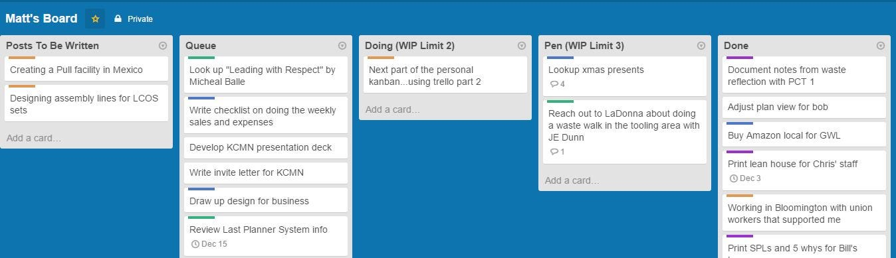

 on [Unsplash](https://unsplash.com/search/photos/non-tech?utm_source=unsplash&utm_medium=referral&utm_content=creditCopyText)](file_0.jpeg)

If either agency, dev shop, or offshore team is building a product for you, it’s important to know how it goes. Without prior experience, it’s extremely hard to understand.

The development process, in general, is something that’s not easy to have control of, but there are some rules and workflow scenarios to follow in order to understand how things going and avoid numerous problems related to product delivery itself.

Here are some common rules when you’re starting the project:

**Be an owner — **it’s important to have admin access to the code your team is working on, you will always be able to grant access to your team members, it gets you in charge of who has access to what. Have this approach towards every tool you are using for development, starting from GitHub to any of SaaS accounts, Clouds, AppStore, GooglePlay, etc.

**Know your tech stack **— you might think that the newest tools and libraries are really good for development, but it’s not always like this, it might get some hype at the beginning but be abandoned 6 months later, so it’s better to use common tech stacks rather than going with pretty old or super modern ones, it’s all about the balance.

The tech stack should be stable and widely used, it is easier to find developers and cheaper building and supporting the product with commonly used ones. Ruby on Rails and React are great to build your app on, and this stack allows you to scale it to a more complex system in the future.

Apart from that, there are a lot of important things to check when it comes to the development itself.

In [JetThoughts](https://www.jetthoughts.com) we built a checklist which brings you the answers to the most common questions:
> # How to know if my team is not going the wrong direction, how to remove uncertainty in the development process?

### 1. GitHub Сommits is everything

* **Regular Git commits **of developers — that’s what helps the tasks to be done and the best way to understand if development flow is going fine.

* You might have difficulties to understand what this or that part of the code means, but you’re definitely able to see commits frequency and observe the path from the feature to just appear in a list to its full implementation.

* One commit **every 2–3 hours** ensures that there are no blockers, no issues with production and the code is being written and delivered with no blockers.

* Make sure the process is regular and stable — the team should push to

### 2. Daily Standups

* You should always keep track of how things are going, it’s highly recommended to conduct [daily standups](https://jtway.co/a-typical-day-at-jetthoughts-460b84eeb9c6). 10–15 minutes to spend talking over plans for the day getting feedback from every team member would save you tons of time figuring out what went wrong by not having this routine in your habit list.

* Get a chatting solution like Slack or Discord, etc. where your team would provide you with daily reports chatting on what was done, problems raised, solutions chosen and so on. All communications should be public and easily accessible for transparency and a better understanding of who is doing what.

### 3. Visualize Progress by Kanban Board

* Confirm there are **no blockers and uncertainty every single day**. It would be great if you use a Kanban board to track all the progress where you can look at what’s happening at a certain point of time, how tasks are taken care of, etc.

* Address important updates and move your communication flow to a call-to-action manner. It’s always better to address your question/concerns to specific team members rather than just writing it in a general way.

### 3. Clear weekly goals

* When you’re planning your sprints, set up weekly goals — this is how you may track the progress and address issues on time.

* Split big features to smaller ones and try to understand how much time it takes to deliver them. The recommended time is about 2–3 days for a small/medium task.

* When planning your sprint, make sure to have written notes available and a person to write down everything while the team is discussing it.

### 4. Regular staging updates

* The project your team is building should be online from day one, that’s another way to observe changes and see if the project is stable and evolves.

* Every two days staging needs to be updated to get all the pretested features examined and ready to use including the latest changes.

### 5. Demos and Screencasts

* Every week you should be able to see results: it can be done by screencasts of new features in action, bugs that are fixed, etc. represented by a team.

* If there is no live version, screencasts and demos with progress should be provided every 2 days

### 6. Production flow and proactivity:

* Problems should be proactively taken care of, ‘post factum’ approach is a no go.

* Make sure acceptance criteria (here we mean are a clear and explicit explanation of how to test the task by the product owner in GitHub card)— when developers implemented the feature, you need to have everything to verify how it works — know the way to test it, click through it and understand if everything is fine.

* Make sure that you know your timings — it is important to understand how much time your team typically spends on planning, feature delivery, maintenance, etc. — just try to stick to a constant schedule, if it generally takes like 3 days to deliver small feature, if it’s more than that — there might be a blocker.

* [Zero Bug Policy](https://medium.com/qualityfaster/the-zero-bug-policy-b0bd987be684) is a top priority. If things are not working, this is something needed to be taken care of right away. Strive to the bug-free environment to concentrate on new features and customer requests.

### 7. Kanban and Agile:

We highly recommend using these methodologies in your company for product delivery, and a lot of things in this checklist would get a new meaning once you understand the principles to follow.

* 1 task per developer — make sure your team is not going circles from one feature to another and developer is concentrated on a certain task — this would help to remove the uncertainty in 90% of cases

* Max of 2 issues totals in “Ready”, “In Progress”, “Verify” per PR author — that is a general recommendation we are following in JetThoughts ourselves.

### 8. Production health monitoring

* Make sure you got the system monitoring that catches errors, handles requests with issues, etc.

* Once such system catches a bug, it should be fixed as a top priority — as soon as possible

### 9. Every task should be tested in the real environment

* [Make sure](https://jtway.co/prepare-the-pull-request-before-asking-to-review-42df362a5c8e) you have a staging which is filled with real data and is as close to the original app as it’s possible

* If not, make sure devs adds a screencast where they touch on tested features to check on

### 10. Your task is your responsibility

* Once the task is finished and ready to be put to production — the person who was doing the task should make sure it passes all the checkups and is fully ready to go live.

### 11. The Product Backlog is full

* The [backlog](https://www.agilealliance.org/glossary/backlog/#q=~(infinite~false~filters~(postType~(~'page~'post~'aa_book~'aa_event_session~'aa_experience_report~'aa_glossary~'aa_research_paper~'aa_video)~tags~(~'backlog))~searchTerm~'~sort~false~sortDirection~'asc~page~1)) should be booked-up with the features for 1 month upfront.

That’s the basic flow that allows you as a founder and/or a project manager to deal with development.

**Paul Keen** is an Open Source Contributor and a Chief Technology Officer at [JetThoughts](https://www.jetthoughts.com). Follow him on [LinkedIn](https://www.linkedin.com/in/paul-keen/) or [GitHub](https://github.com/pftg).
>  *If you enjoyed this story, we recommend reading our[ latest tech stories](https://jtway.co/latest) and trending [tech stories](https://jtway.co/trending).*
