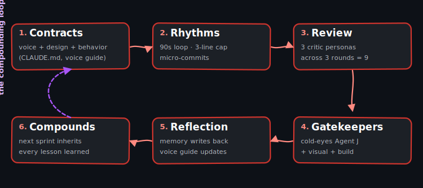

A solo Claude Code agent runs the whole product cycle inside one process. The diff compiles, tests stay green, but the feature solves a problem nobody actually has. We covered this founder pain in [Vibe Coding Crisis](/blog/vibe-coding-crisis-ai-code-debt/). After that we wrapped the agent in the rest of a product team and what got shipped changed.

## The roles we replicated

Driver-plus-tests is not a team. Each role we added closed a gap that solo agents kept reproducing on every ticket.

| Role | What it does | Where it lives |
|------|--------------|----------------|
| Business Strategist | Sets the north star - markets, customers, where we don't compete | Founder plus a strategy doc the agents read |
| Product Manager | Runs Shape Up pitches, manages the bet portfolio, defines acceptance criteria | PM agent (in our setup, `lead-shaper`) reading the strategy doc |
| Business Analyst | Confirms the data signal supports each bet, builds the metric tree | Analyst capability bundled into the discovery agent |
| Customer Representative | Holds the user voice - what they said, meant, and what frustrates them | Interview transcripts and jobs-to-be-done docs the agent quotes back |
| UX Researcher | Keeps assumptions paired against real signals, runs synthetic-user walkthroughs | Discovery agent (in our setup, `critic-discovery`) plus interview templates |
| UI/UX Designer | Produces the screen flow before any code lands | Google Stitch as the canvas, design-system rules in CLAUDE.md |
| Tech Lead | Calls feasibility risk and surfaces the architectural patterns the solution must fit | Tech-lead agent reading the codebase and ADRs |
| Driver / Navigator pair | Writes the code, reviews each micro-step before commit | Two Claude Code agents on the same diff |
| Critic Panel | Catches scope creep, design drift, premature abstractions | PM, Designer, Rails, Simplicity critics in parallel |
| QA / Visual Verifier | Confirms the change works in a browser, not just in tests | chrome-devtools MCP screenshots desktop and mobile |
| DevOps Gates | Runs the full test suite, type-check, lint, build, then opens the PR | CI plus auto-reviewer reading the diff |
| Reflection / Kaizen | Captures repeated failures into rule updates and skills | Incident log feeding the rule files and skills.sh |

Solo agents fill one seat and act like the rest don't exist.

## How the team works together

The seats above link into actual team behavior through a sequence of formations - each one owns a specific artifact and refuses to ship without it.

### Pitch and bet (Business Strategist + PM + Tech Lead)

We use [Shape Up](https://basecamp.com/shapeup) for shaping work. The PM writes a pitch in `docs/pitches/<slug>.md` (Problem, Appetite, Rough solution, Out-of-scope, Risks). The bet decision goes through three lenses - Tech (feasibility), Product (which ICP segment), Design (which patterns to reuse) - each producing SIMPLE / MEDIUM / COMPLEX with one-sentence rationale. The PM consolidates: lowest-complexity path with highest-impact outcome.

### Slicing and design (PM + Designer + Tech Lead)

The bet gets sliced into vertical AC items, with [Mikado method](https://www.manning.com/books/the-mikado-method) decomposition for blocked dependencies. Designer sketches the solution shape in Google Stitch; Tech Lead writes a file map and boundary notes. Disagreement gets resolved by the artifact, not by whoever talks loudest.

### Delivery (Driver/Navigator + Critic Panel)

XP shows up here as pair programming, [test-driven development](/blog/test-driven-development-tdd-in-ruby-step-by-guide-tutorial-bestpractices/), and [refactor-step-tdd](/blog/refactor-step-tdd-three-line-discipline-ruby/) micro-commits. RED test commits before each GREEN feat commit (we verify commit order in CI). Tidy-first refactor commits land before behavior changes. The critic panel runs after every test pass, not at PR time.

### QA gates and shipping (QA + DevOps Gates)

Visual verification happens in a real browser via chrome-devtools MCP - screenshots desktop and mobile, console clean, network clean. CI runs the full test suite, type-check, lint, and build. The auto-reviewer reads the diff against project conventions. WIP=1 is enforced: one slice ships before the next slice starts.

### Reflection (every role)

Every repeated failure becomes a rule update or a new skill published to skills.sh. Next sprint inherits the lesson. Roles that don't feed reflection drift; roles that do compound.

## The cadences we run

The sprint cycle runs the outermost loop - pitch, betting, slicing, design, delivery, QA, wrap-up. Cadence: one to two weeks per shaped bet.

The development cycle runs inside the sprint - Driver/Navigator pair on a slice, micro-commits ship behind tests, the critic panel runs after every test pass. Cadence: minutes to hours per slice.

The [Ralph loop](https://ghuntley.com/ralph/) runs the tightest. A single agent iterates on its own output until a quality bar is met - retrying the same prompt with a stricter rubric until the diff passes the simplicity critic. Geoffrey Huntley named the technique after Ralph Wiggum's persistent iteration, and Anthropic ships it as the [ralph-wiggum plugin](https://github.com/anthropics/claude-code/blob/main/plugins/ralph-wiggum/README.md). Cadence: seconds to minutes per attempt.

Each cadence nests inside the larger one - sprint scope informs development tickets, and Ralph catches small failures inside development without escalating to a human.

## Tools that make this possible

Claude Code provides the runtime and the rule files in CLAUDE.md and .claude/ that each role pulls from. Google Stitch holds the design-system tokens and screen flows - Designer paints there, coding agents read constraints back from the same canvas. chrome-devtools MCP gives QA actual eyes through screenshots, console logs, and mobile emulation; without it, tests go green on builds that are visibly broken in the browser.

Semantic search through claude-context finds existing patterns before agents reinvent them - stale training data wants to write Rails 7 inside a Rails 8 app. The skill marketplace at [skills.sh](https://skills.sh/) lets us publish a pattern once (database resets, payment-diff test enforcement) and every project pulls it. CI runs the full test suite, type-check, lint, and build, with an auto-reviewer reading the diff against project conventions before a human ever sees the PR.

## Team mode beats solo mode

The dysfunction we keep seeing in product teams is one role swallowing another's job. A PM writes acceptance criteria the engineer ignores, a Designer's Figma gets reinterpreted by front-end without anyone flagging the drift, QA finds bugs the team ships anyway. Each handoff loses signal.

Solo agents inherit all of that, compressed into one process. One agent makes the product call, the design call, the code call, and the self-review in a single shot - nobody to disagree, no record of what got skipped.

Team mode splits those decisions across collaborative agents, each holding one job, accountable through a written rule set. A PM agent blocks tickets without acceptance criteria, a simplicity critic stops unrequested abstractions before the diff lands, and a mobile screenshot agent flags any merge that looks broken at 375px (the width of an iPhone). Disagreement gets resolved by the rules, not by whichever agent happened to run last.

## Agile and flexibility are non-negotiable for AI

A rigid rule set ships yesterday's bias. Strategy docs get revised when the market signal changes. Rule files change when reflection surfaces a failure the current rules let through. And sprint goals shift mid-sprint when discovery surfaces new evidence about what users actually need.

Agile becomes the agents' operating environment. Standups happen at the agent level: the discovery agent posts what it learned from this week's interviews, the simplicity critic logs which abstractions it blocked, and the customer voice agent surfaces new pain points from fresh transcripts. Decisions get re-opened when evidence demands it.

## Where to start

You don't need every role from day one. Begin with a strategy doc the agent reads at session start, a critic panel that blocks merges, and a reflection log that turns failures into rules. From there, add a designer when the UI starts drifting, a discovery agent when scope keeps creeping, a customer voice when feature requests stop matching real user pain.

Setup eats one sprint of overhead. Rule files need writing, agent definitions need configuring, and the team needs convincing. From sprint two the time disappears.

Cost on a typical ticket runs $4-6 on Sonnet or $20-30 on Opus, plus 30-45 minutes of wall-clock time when critics run in parallel - cheaper than the rework on a vibe-coded PR that ships the wrong feature.

## Free audit

If a Claude Code agent is shipping code for you and the team is stuck in solo mode, we run a free 45-minute audit of the missing roles. Send the repo URL plus a paragraph on what is breaking, and within two business days you get back a one-page assessment naming which seats to staff first. [Book the audit at /contact-us/](/contact-us/).

<!-- Reference cadence: capability map (not how-to), team-replication framing, Shape Up + XP + Mikado as actual methodologies (not Teresa Torres - we use Shape Up), why team-mode beats solo-mode is load-bearing thesis, paragraphs capped at 3 sentences. -->
