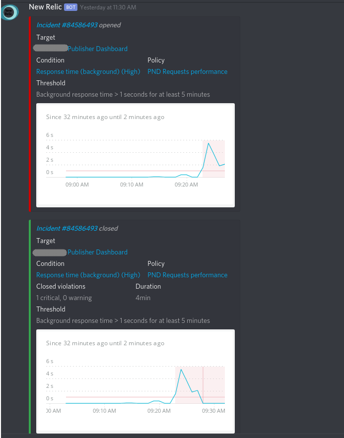
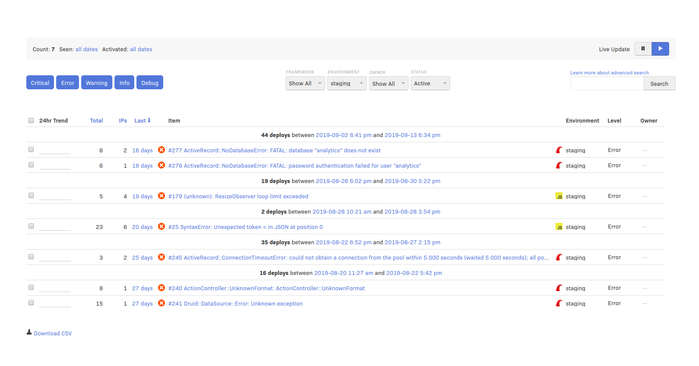

 on [Unsplash](https://unsplash.com/search/photos/clean?utm_source=unsplash&utm_medium=referral&utm_content=creditCopyText)](file_0.jpeg)

How to manage problems with your project? How to understand how buggy it is and address the issues properly? In [JetThoughts](undefined), we build our own process of handling those problems, and here is how…

### **Know your enemy**

In order to understand what issues might be crucial and threaten project stability, it’s not enough to just rely on users’ feedback. It’s important to have a monitoring system that would inform your team on possible issues in advance before the client encounters the bug, glitch, or slow performance of the app. For our project, we use several tools for such purposes

[**1. New Relic **](https://newrelic.com/)— it’s a tool to check on the slow performance of your app. If any action of the user takes longer than usual, NewRelic will inform you about that.

We use it as a part of a Discord chat flow, where bot informs us about any problems directly to the channel, which is really comfortable since every team member is notified. We also tuned the bot so that it won’t spam too much.

[**2. Rollbar](https://rollbar.com/) **is an error-tracking system that tells you if there are any errors occurring and if the app is functioning a-okay.

Our team checks the Rollbar console every day a week to address bugs. If there are any, we analyze them and add to the tech backlog using the rules below.

## How to keep zero-bug policy?

It’s not enough to only track those bugs and issues, but also fix them in a timely manner. We got an algorithm on how to do it fast and painless.

1. Setup email/chat notifications and check the rollbar the issues on and GitHub before standup

2. Rollbar — look and compare to the issues on Github — if errors reoccur and are not present on Github, add them to the Maintenence backlog once a week

3. Check the reoccurring errors and warnings and add the most recent issues to GitHub once a week

4. Every sprint planning: take at least 2–3 tissues to the current sprint to work on.

That’s how you maintain your project bug-free and reliable.
>  *If you enjoyed this story, we recommend reading our[ latest tech stories](https://jtway.co/latest) and trending [tech stories](https://jtway.co/trending).*
