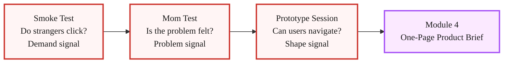
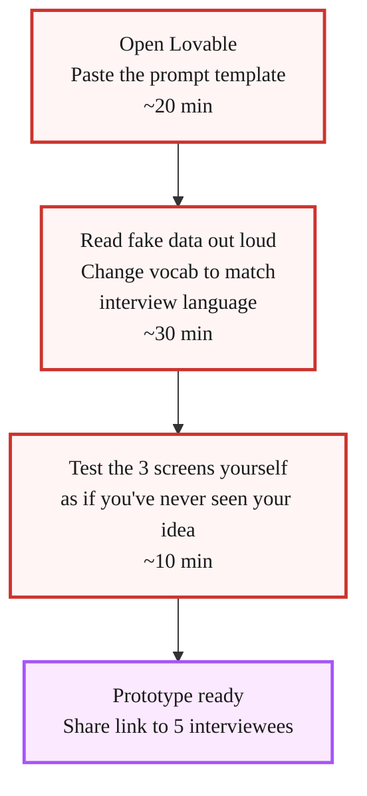

> **Module 3 · Step 4 of 4** · [Tech for Non-Technical Founders 2026](/blog/tech-for-non-technical-founders-2026/) course.
> Input: 10 Mom Test interview subjects from Module 3. Output: 5 of them watched navigating a 2-hour clickable prototype, with pass/fail per session.

The [Mom Test](/blog/mom-test-ask-about-past-not-future/) tells you whether the problem is real and felt. A clickable prototype tells you something the Mom Test cannot: whether the user knows what to do when you hand them a solution.

Those are different signals. A founder we joined in January 2026 ran 8 strong Mom Test interviews. Problem validated. She had workaround evidence, cost numbers, frustration language. She moved to Lovable and spent 3 weeks building an MVP. When the first 5 users logged in, none of them got past the second screen without asking "wait, what am I supposed to do here?" The problem was real. The shape of the solution was invisible.

A 2-hour throwaway prototype run in front of 5 of your interview subjects would have surfaced that on day 2, not week 3. That is the purpose of this chapter.

This prototype is throwaway. You will discard it after validation. Do not invest in production polish, real auth, or payment integration. The MVP in Module 5 is built differently.

## Why a Clickable Prototype Catches What Interviews Miss

Mom Test interviews are backward-looking. You are asking the interviewee to relive their past. The question is: "Tell me about the last time this happened." The signal is: "Did the problem actually occur, and how badly did it hurt?"

A prototype session is forward-looking. You are watching the interviewee navigate a possible future. The question is: "Does the user know what to do next?" The signal is: "Can they figure out the SHAPE of the solution without you explaining it?"

Three things break at the prototype stage that looked clean in interviews.

First, the workflow is backward. The founder designed the three screens in the order she thought about the problem. The user thinks about the problem in the opposite order. The first screen asks for the wrong piece of information. The user stalls.

Second, the vocabulary is wrong. The founder calls it "reconciliation." The user's accountant calls it "matching." When the button says "Reconcile" the user clicks everything else on the screen first.

Third, the scope is wrong. The user opens the prototype, sees three screens, and immediately asks "where do I upload the CSV?" That feature is in Module 5. The founder had not thought to include it in the prototype because she considered it obvious context. It is not obvious to the user.

None of those three failures show up in a Mom Test interview. They appear the moment a real person touches the interface. This is not a criticism of the Mom Test - it is an argument for running both.

The prototype session is the third validation pillar. The [smoke test](/blog/smoke-test-landing-page-300-dollar-validation/) proves demand (strangers click). The Mom Test proves the problem is felt (specific past stories). The prototype session proves solution legibility (a user can navigate without coaching).



## This Is Throwaway

Before you open Lovable, read this once and accept it as the operating assumption for the next two hours.

This prototype is throwaway. You will discard it after validation. Do not invest in production polish, real auth, or payment integration. The MVP in Module 5 is built differently.

That constraint has a reason. Founders who build "a prototype they can polish into the MVP later" spend 3-5x longer on the prototype. They add a login screen because "it'll be in the MVP anyway." They add real Supabase tables because "I'll need them eventually." They spend a Saturday wiring Stripe because "the user will want to see pricing." All of that work invalidates the prototype test: the user is now navigating a half-built product, not a clean three-screen shape test.

The throwaway constraint keeps you honest. You are not building a product. You are building a question: "Does the user know what to do?" That question needs three screens, not fifteen. It needs fake data hard-coded in, not a real database. It needs a CTA that looks like a button, not a button wired to any backend.

When the prototype session ends on Saturday, you have your answer. You archive the Lovable project. You do not touch it again. The insights from the session feed your [One-Page Product Brief](/blog/one-page-product-brief-vibe-prd/). The brief feeds the actual MVP stack in [Module 5](/blog/self-serve-mvp-stack-lovable-supabase-stripe-2026/), which is built fresh - not polished from this prototype.

Founders who resist the throwaway constraint usually say "but I already did the work." That is the sunken cost talking. A throwaway prototype used for 5 sessions has done its job. Promoting it to the MVP means carrying every compromise you made in the original 2 hours into production. The [Module 5 Lovable build](/blog/self-serve-mvp-stack-lovable-supabase-stripe-2026/) starts fresh with a proper Vibe PRD, real auth, and a real database. The prototype starts fresh with a goal: three screens, two hours, five sessions.

## Build 3 Screens in 2 Hours with Lovable

Three screens is the constraint. Not five. Not ten. Three.

**Screen 1: The entry point.** This is whatever the user sees first when they open your product. For a workflow tool it is usually a dashboard or an upload screen. For a booking product it is a calendar or a search bar. Keep it to one dominant action. The user should be able to answer "what does this screen want me to do?" in 5 seconds.

**Screen 2: The core action.** This is the step where the value is delivered. For the reconciliation tool: the screen where matched transactions appear. For a booking product: the screen where the user picks a time. For a document tool: the screen where the user sees the processed output. This screen is where users stall if the vocabulary or the layout is wrong.

**Screen 3: The confirmation or result.** What does the user see after the core action succeeds? A confirmation message, a summary, a next-step prompt. This screen is what the user walks away holding in their memory. If they cannot describe it 10 minutes after the session, the outcome of the product is not clear.

### The Lovable Prompt Template

Open [Lovable](https://lovable.dev), create a new project, and paste the following. Replace all `[PLACEHOLDERS]` with your specific problem and solution.

---

**Prompt to paste into Lovable:**

```
Build a 3-screen clickable prototype for a [PRODUCT CATEGORY] tool targeting [TARGET USER].

This is a throwaway validation prototype. Use hard-coded fake data only. No backend, no auth, no database. All buttons should navigate between screens or show a static success state.

SCREEN 1 - [ENTRY POINT NAME]:
- [PRIMARY ACTION the user takes on this screen]
- Show [FAKE DATA EXAMPLE - e.g. "3 uploaded files listed: Q1-report.csv, march-invoices.csv, stripe-export.csv"]
- One prominent CTA button: "[BUTTON LABEL]"

SCREEN 2 - [CORE ACTION NAME]:
- [WHAT THE USER SEES after taking the Screen 1 action]
- Show [FAKE DATA EXAMPLE - e.g. "12 matched transactions, 3 flagged for review"]
- [KEY VOCABULARY the user must understand - e.g. "use the word 'match' not 'reconcile'"]
- One action: "[BUTTON LABEL]"

SCREEN 3 - [RESULT/CONFIRMATION NAME]:
- [WHAT SUCCESS LOOKS LIKE - e.g. "A summary card showing '12 transactions matched, $4,320 reconciled'"]
- Next step prompt: "[WHAT YOU WANT THE USER TO DO NEXT - e.g. 'Download report' or 'Go to dashboard']"

Design: Clean, minimal. Dark sidebar, white content area. [YOUR COLOR] accent. No login screen. No settings. No navigation beyond these 3 screens. Make it look functional, not finished.
```

---

That prompt reliably produces a navigable 3-screen prototype in Lovable in under 20 minutes. Spend the remaining 100 minutes on one thing: reading the fake data out loud and asking yourself "does this make sense to someone who has never heard my idea?" If you hesitate, change the wording.

Two rules for the Lovable session itself.

First, use the vocabulary you heard in Mom Test interviews, not the vocabulary you use when you describe the problem to other founders. If 7 of your 10 interviewees called it "matching" and you call it "reconciliation," the prototype uses "matching."

Second, resist adding a fourth screen. The constraint is the test. If you feel the prototype needs a fourth screen to "make sense," that is a finding: your solution has more steps than a single session can validate. Note it and keep the prototype to three screens. You are testing legibility of the shape, not the completeness of the product.



## Run a Silent-Observation Session with 5 Interviewees

Choose 5 of the 10 interviewees whose Mom Test scores were 7 or higher. You already have a relationship with them. They already confirmed the problem is real. Now you are asking them one hour of a different kind of time: watching them navigate, not answering your questions.

Book the sessions as 30-minute video calls. Send the Lovable prototype link 10 minutes before. Do not send it earlier - you do not want them exploring it solo before you can observe.

### Prototype Session Script

**Opening (read verbatim, do not paraphrase):**

"Thank you for your time. I'm going to share a link with you - I'm sending it now in the chat. It's a very early rough prototype, not a real product. I want to watch you use it and understand where it's clear and where it's confusing. Please don't try to be kind to me. The most useful thing you can do is think out loud while you navigate and tell me when you're confused or when something doesn't make sense. I won't explain anything while you use it. Just start from Screen 1 and try to do what the screen is asking. I'll stay quiet."

**[Paste the Lovable link in the chat. Start your screen recording. Say nothing.]**

**While they navigate:**

- Start a timer when they first touch the interface.
- Write down: the first 3 things they click or try to click.
- Note the first moment they pause for more than 5 seconds.
- Note any words they say out loud ("what does this mean", "where do I", "I thought it would").
- Do not respond to questions. Say "I'd love to hear what you're thinking, just keep going" if they ask you a direct question. Do not explain. Do not coach.

**After they reach Screen 3 (or after 10 minutes, whichever is first):**

"Thank you. Can you describe to me in one sentence what that tool just did for you?"

Write down their exact words. Do not prompt. If they give a vague answer, say: "Say more about that." If they stall, say: "What would you tell a colleague this does?"

**Closing questions (pick 2, not all 4):**

- "What was the moment you felt most lost?"
- "What did you expect to see on the second screen that wasn't there?"
- "If you used this every week, what would you call the thing it does for you?"
- "What would have to be true for you to pay [your target price] for this?"

Thank them. End the call. Score the session immediately.

**What to do when a user struggles:**

When the user pauses on Screen 2 for 8 seconds and clicks the wrong button, you will want to help. Do not. The pause and the wrong click are the signal you came for. Write down exactly which button they clicked and how long they paused. That is the data.

If the user says "I give up" or "I have no idea what this wants me to do" - that is a fail. Thank them, ask the closing questions, end the call. A session where the user cannot get past Screen 1 is a strong signal: the entry point is wrong.

## Pass/Fail Scoring

Score each session immediately after the call ends. Use three signals.

| Signal | Pass | Fail |
|---|---|---|
| Gets to Screen 3 without coaching | Yes, under 5 minutes | No, or needs explanation |
| Describes the product accurately in 1 sentence | Names the core action correctly | Vague ("it does something with data") or wrong |
| First 3 clicks are correct | Navigates toward the CTA | Clicks UI elements that aren't the intended path |

A session is a **pass** if all three signals are green. A session is a **fail** if any signal is red.

The prototype gate:

- **4 or 5 passes out of 5 sessions:** Shape is legible. Advance to [Module 4 - One-Page Product Brief](/blog/one-page-product-brief-vibe-prd/).
- **2 or 3 passes:** Revise one element (vocabulary, Screen 1 layout, or CTA label) and run 2 replacement sessions. One iteration only.
- **0 or 1 pass:** The shape is wrong. The problem statement may be right but the solution concept needs a different starting point. Return to Module 3.3 before writing any brief.

The common fixable failures:

**The vocabulary fail.** The user understands the goal but uses a different word than your interface. Fix: run a word-swap on Screen 2. Match the vocabulary you heard in the sessions. Test with one new session before advancing.

**The wrong first click.** The user clicks a secondary element on Screen 1 first - a logo, a link, a visual that looks interactive. Fix: remove everything on Screen 1 that is not the primary CTA. Prototype UI clutter is a signal that the real product will have the same problem.

**The "what am I supposed to do?" question.** The user asks you what the product does before touching it. Fix: add one line of microcopy above the primary CTA on Screen 1 that names the action in the user's vocabulary. Not a headline about the product. One instruction sentence.

The throwaway nature of the prototype matters here too. When you find a vocabulary fail on Screen 2 of session 3, you fix the Lovable prototype in 5 minutes, run 2 more sessions, and discard the whole project by Saturday. You do not carry the prototype forward. You carry the insight forward - into the [One-Page Product Brief](/blog/one-page-product-brief-vibe-prd/), where it becomes a vocabulary constraint that shapes the real build.

## What to Do With Results

After 5 sessions you have a pass count, a set of failure notes, and specific vocabulary from the "describe in one sentence" closing question.

**4-5 passes: advance to Module 4.**

Your validation stack is complete: demand signal from the smoke test, problem signal from the Mom Test, shape signal from the prototype sessions. Write the [One-Page Product Brief](/blog/one-page-product-brief-vibe-prd/) using the vocabulary from the "describe in one sentence" answers. Those words - the exact words 5 real users chose to describe what the product does - are worth more than any marketing copy you will write. Use them in the brief's problem statement and in the Module 5 Lovable prompt when you build the real MVP.

**2-3 passes: revise and re-test once.**

One revision, two replacement sessions. Fix the single highest-impact element first (usually Screen 1 or the vocabulary on Screen 2). If the second round yields 4+ passes across 5 total sessions, advance. If it does not, treat as 0-1 and reconsider the solution shape.

**0-1 passes: the hypothesis may be right but the solution shape is wrong.**

This is not the same as the problem being invalidated. The Mom Test told you the problem is real. The prototype session is telling you that the solution you imagined does not match how users think about solving it. Before restarting, read the "what did you expect to see" answers from the closing questions. Those answers are the user's mental model of the solution. They may point to a completely different three screens - sometimes a different product category entirely.

If the mismatch is large (users expected an email tool, you built a dashboard tool), return to Module 3.3 before writing the brief. If the mismatch is smaller (users expected a different starting step), revise and re-test.

The throwaway nature of the prototype is an asset here. You have spent two hours and five sessions on a project you will discard. The cost of being wrong is two hours. The cost of skipping this step and discovering the shape is wrong in Module 5 is three weeks. This is exactly what throwaway prototypes are for.

---

The artifacts from this chapter carry into Module 4 as two inputs: the pass/fail log from 5 sessions, and the exact vocabulary from the "describe in one sentence" closing answers. Both go into the [One-Page Product Brief](/blog/one-page-product-brief-vibe-prd/). The brief goes into [Module 5's fresh Lovable build](/blog/self-serve-mvp-stack-lovable-supabase-stripe-2026/). Nothing from the throwaway prototype carries forward except what you learned.

## Further Reading

- Rob Fitzpatrick, [The Mom Test (book site)](https://www.momtestbook.com/) - the problem-signal validation this prototype session builds on.
- Steve Krug, [Don't Make Me Think](https://sensible.com/dont-make-me-think/) - the thinking-aloud usability test that the silent-observation session above is adapted from.
- IDEO, [The Field Guide to Human-Centered Design](https://www.designkit.org/resources/1) - prototyping-for-learning methodology at the source.
- Y Combinator, [How to Talk to Users (Startup Library)](https://www.ycombinator.com/library/6g-how-to-talk-to-users) - how the prototype observation fits into the broader customer-discovery arc.
- [Lovable](https://lovable.dev) - the AI builder used in this chapter's 2-hour prompt-to-prototype workflow.

---

*Built by [JetThoughts](https://jetthoughts.com) as part of the [Tech for Non-Technical Founders 2026](/blog/tech-for-non-technical-founders-2026/) curriculum.*
