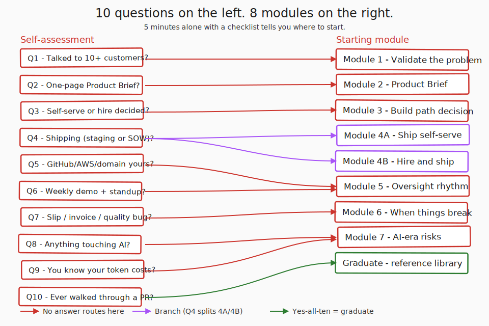
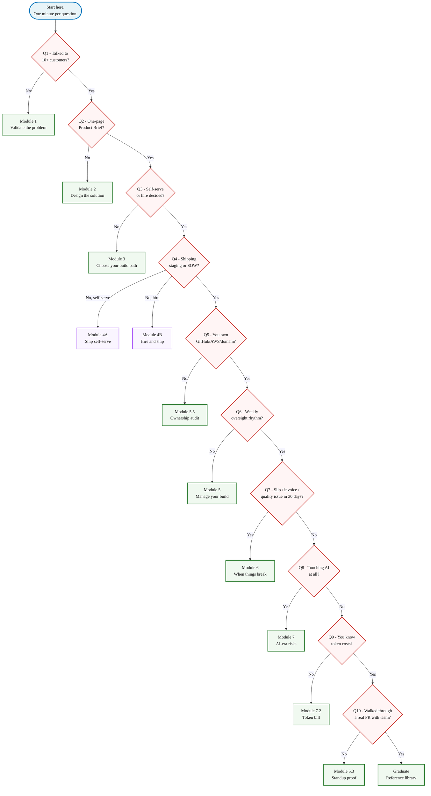
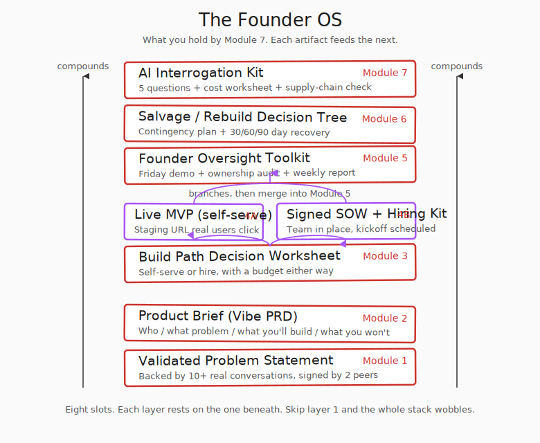

> **Module 0 · Step 1 of 1** · [Tech for Non-Technical Founders 2026](/blog/tech-for-non-technical-founders-2026/) free course.
> Input: an idea, instinct, or ongoing project that feels stuck. Output: a self-diagnosis of which of the 8 modules to start with.

Three founders we picked up recently all opened with the same sentence: "help my team ship." We ran each through the 10 questions below, and they routed to Module 1, Module 5, and Module 6 - one had not validated her problem, one had no way to see whether her team was shipping, one was being lied to about missed milestones. **Same words on the phone, $29K of combined monthly burn, three different starting points.** The 10-question diagnostic below is the entry filter that picks the right module for each of them in 5 minutes.

## Why this matters in 2026

Most non-technical founder courses are linear. You start at Day 1 and finish on Day 60. That works if every founder lands at the same starting point. They don't. A founder who Googles "fire my dev shop" at 11pm shouldn't have to read four weeks of customer-discovery content before reaching the rescue module. A founder who has never spoken to a customer shouldn't be reading SOW clauses. The 10 questions below are the entry filter. They tell you where to start so the rest of the course stops being homework and starts being the next thing you actually need.

## Take the 10-question diagnostic

Sit down with a pen and 5 minutes. Answer each question yes or no, then read the routing line. You don't need to think hard - the gut answer is the right one. The Self-Assessment Worksheet artifact (linked below) is the printable version.

| # | Question | If you answer... |
|---|---|---|
| 1 | Have you talked to 10+ potential customers about the problem you want to solve? | **No** → Module 1. **Yes** → Q2. |
| 2 | Do you have a one-page written Product Brief (what you're building, for whom, why now)? | **No** → Module 2. **Yes** → Q3. |
| 3 | Have you decided whether to ship self-serve or hire a team? | **No** → Module 3. **Yes** → Q4. |
| 4 | Are you actively shipping software (you have a staging URL real users can click, OR a signed contract with a team)? | **No** → Module 4A (self-serve) or 4B (hire) based on Q3. **Yes** → Q5. |
| 5 | Do you own the GitHub org, AWS root account, domain registrar, and database under your company email? | **No** → Module 5 (start with 5.5 Ownership Audit). **Yes** → Q6. |
| 6 | Are you running a weekly oversight rhythm (Friday demo + standup with the 3 questions + plain-English weekly report)? | **No** → Module 5. **Yes** → Q7. |
| 7 | In the last 30 days, has your team had a milestone slip, a runaway invoice, or a quality issue you can't diagnose? | **Yes** → Module 6. **No** → Q8. |
| 8 | Does your product or team touch AI (Cursor, ChatGPT, vibe coding, AI agents, LLM calls in production)? | **Yes** → Module 7. **No** → Q9. |
| 9 | Do you understand the AI token costs your team is passing through to your invoice? | **No** → Module 7.2. **Yes** → Q10. |
| 10 | Have you ever asked your team to walk you through a real PR they reviewed last week? | **No** → Module 5.3. **Yes** → graduate; the curriculum is your reference library now. |

Questions 1 through 10 walk you from earliest stage (Q1, you have a hunch) to latest (Q10, you can interrogate your own team's pull requests). Most readers stop somewhere between Q1 and Q4. Founders who got burned land in the Q5-Q7 range. If your team or product is touching AI in production, you'll branch to Q8.

Write your starting module at the top of a fresh Notion doc. That doc is now your course tracker.

## The 8 modules at a glance

Module 0 is the door. The other 8 are the journey.

**Module 1 - Validate the problem.** A hunch becomes a one-page validated problem statement, backed by 10+ real conversations. You walk away with permission to keep building, or hard evidence that the idea is the wrong one. The first three posts cover outreach in 2026 (Reddit, Clay, Lindy, paid panels), the Mom Test interview script, and how to write down what you heard.

**Module 2 - Design the solution.** A validated problem becomes a one-page Product Brief (some people call this a Vibe PRD). Six fields: who, what problem, what they currently do, what you'll build, what you won't, how you'll know it worked. Module 2 also covers the [five tech words every founder should stop nodding at](/blog/five-tech-words-stop-nodding-at/) before they sit in another standup.

**Module 3 - Choose your build path.** Your Product Brief plus your bank balance picks one of two doors: self-serve (you ship it with AI tooling) or hire (you bring in a team). The fractional-CTO bridge ([5 hours a week beats a co-founder](/blog/fractional-cto-vs-full-time-cto-complete-comparison-2025/)) lives in this module.

**Module 4A - Ship self-serve (branch).** Lovable plus Supabase plus Stripe. What each tool does in plain English, how they connect, and the 5 signals that tell you when your AI build has hit its architectural ceiling and it is time to switch to Module 4B.

**Module 4B - Hire and ship (branch).** Who you're hiring in 2026 (the AI-Augmented Developer profile, $85-120K junior with senior productivity), the interview script that catches AI theater, the dev-shop economics behind cheap-then-expensive, and [reading the SOW clause by clause](/blog/reading-sow-clause-by-clause/).

**Module 5 - Manage your build.** A weekly oversight rhythm that catches stalling without reading code. Six posts: [the org chart your dev shop won't draw](/blog/engineering-org-chart-non-technical-founder/), the Friday demo rule, [the three questions that turn a standup into proof](/blog/three-questions-turn-standup-into-proof/), the plain-English weekly dev report, the GitHub/AWS/database ownership audit, and the spaceship-admin-panel cautionary tale.

**Module 6 - When things break.** A failed Friday demo, a dropped milestone, or a runaway invoice triggers this module. You walk away with a documented salvage / freeze / rebuild decision plus a 30/60/90 day recovery plan. The [dev-shop red flags checklist](/blog/dev-shop-red-flags-checklist/) is the entry diagnostic.

**Module 7 - Manage AI-era risks.** A system for interrogating any AI claim in 5 minutes, predicting your monthly AI bill within ±20%, and catching supply-chain attacks that vibe coding created. Three posts including the slopsquatting writeup.

The full list and slugs live in the table at the bottom of every post. Bookmark the [course landing page](/blog/tech-for-non-technical-founders-2026/) once it ships post-Module-5.

## What you walk away with by Module 7

By Module 7 you hold what we call a Founder OS. It is not software. It is a stack of filled-in artifacts that, taken together, document where you are and what you can prove.

The OS schema has 8 slots, one per module output: (1) Validated Problem Statement from Module 1, (2) Product Brief / Vibe PRD from Module 2, (3) Build Path Decision Worksheet from Module 3, (4) Live MVP at a staging URL from Module 4A (self-serve), (5) Signed SOW + Hiring Kit from Module 4B (hire), (6) Founder Oversight Toolkit from Module 5, (7) Salvage / Rebuild Decision Tree from Module 6, and (8) AI Interrogation Kit from Module 7. Slots 4 and 5 are the build-phase branches - most founders walk one branch and leave the other slot marked n/a; the schema keeps both seats so the OS reads the same way whether you self-served or hired.

Each layer compounds the one beneath it. Your validated problem from Module 1 becomes the input to the Product Brief in Module 2. That Brief feeds your build path decision in Module 3, which produces either a live self-serve MVP (4A) or a signed SOW with a hired team (4B). Once you are shipping, the Module 5 oversight toolkit watches the build week by week, and Module 6 kicks in when Module 5 detects trouble. Module 7 sits on top because in 2026 nobody escapes AI tooling - even a Lovable build that never opens a Cursor window still depends on model providers. Skip the Validated Problem layer at the bottom and the whole stack wobbles - that is why Q1 routes a No straight to Module 1 with no Q2.

By the time you graduate you can hand an investor eight filled-in artifacts (or seven plus an n/a for the branch you skipped) and answer their questions from the artifacts alone. That is the entire goal of the course.

## The simplest path

Notice what the diagnostic above does not mention: workshops, canvases, sprints, or frameworks. That is deliberate. The main reading path teaches the simplest method that works for a solo non-technical founder. JTBD Canvas, Foundation Sprint, Shape Up, Continuous Discovery, Empathy Mapping, Design Sprint, User Story Mapping, Lean Inception - all real tools used by teams with capacity to run a workshop. You don't have that capacity yet.

Each of those frameworks lives in an "Advanced (optional)" sidebar at the bottom of Modules 1, 2, and 5 for the day you bring in a Fractional CTO, a co-founder, or a junior product hire. Until then, the simple path is enough to ship a validated problem, a Brief, a build decision, and a live MVP. [Over-engineered codebases mid-rescue](/blog/vibe-coding-crisis-ai-code-debt/) usually trace back to founders trying to run agency frameworks before they had a team to run them with.

> **Going further (optional, for teams with capacity)**
> When you have a Fractional CTO, a co-founder, or a junior product hire, the frameworks below scale what the main path covered. None of them are required to ship your first product.
> - **Continuous Discovery** (Teresa Torres, *Continuous Discovery Habits*) - weekly customer interviews continue past Module 1
> - **Foundation Sprint** (Jake Knapp / John Zeratsky, *Click*, April 2025) - the 2-day version of Module 2
> - **Shape Up** (Ryan Singer, Basecamp) - 6-week cycles and appetites; sharpens Module 5
> - **JTBD Canvas 2** (Jim Kalbach, 2023) - structured Jobs-to-be-Done discovery
>
> All four are free to read. The simple path in this course is enough.

## What to do tomorrow

Three things. In order.

- **Print the Self-Assessment Worksheet** ([artifact below](#the-self-assessment-worksheet-artifact)) and fill it in 5 minutes alone. Pen, paper, no laptop, no team in the room. Mark yes / no for each question.
- **Your next move belongs in a Notion doc**: starting module + the deliverable you're producing (validated problem statement, Product Brief, build decision, signed SOW, ownership audit clean, salvage / rebuild decision, AI cost worksheet filled), both written at the top. That sentence is your course contract with yourself.
- **Tonight: read that module's first post.** One post, 15 minutes on the couch, no skipping ahead. The course works because each module's first post tells you the one thing to do this week, not all the things to do over a quarter.

In 60 days, retake this quiz. If you have moved one module forward, you are running the course correctly. If you have stayed put, the issue is not the curriculum - it is the time you are not giving yourself.

## The Self-Assessment Worksheet artifact

A printable version of the 10 questions plus the routing flowchart is at **[Self-Assessment Worksheet](/blog/self-assessment-worksheet/)** — a public template page. Print it, fill it in 5 minutes, paste your starting module at the top of your Notion doc. The artifact carries the same questions verbatim plus the Mermaid flowchart, so you can reread it offline.

## Continue the course

This is **Module 0 · Step 1 of 1** in the free [Tech for Non-Technical Founders 2026](/blog/tech-for-non-technical-founders-2026/) course - 8 modules from idea to first paying users.

| # | Module | Output you walk away with |
|---|---|---|
| **0** | **Where Are You?** ← you are here | **Self-assessment + your starting module** |
| 1 | Validate the Problem | One-page validated problem statement |
| 2 | Design the Solution | One-page Product Brief (Vibe PRD) |
| 3 | Choose Your Build Path | Build decision: self-serve or hire |
| 4A | Ship Self-Serve (branch) | Live MVP at a staging URL |
| 4B | Hire & Ship (branch) | Signed SOW, kickoff scheduled |
| 5 | Manage Your Build | Weekly oversight rhythm |
| 6 | When Things Break | Salvage / rebuild decision |
| 7 | Manage AI-Era Risks | AI interrogation system |

**In Module 0 · Where Are You?**: 0.1 **Where Are You in the Founder Journey?** ← you are here. (Module 0 has only one post; once you've taken the diagnostic, move to your routed module.)

The full course landing page (with all 11 artifacts) publishes after Module 5 ships. Until then, bookmark this post.

## Further reading

- Eric Ries via Lean Startup Co., [What Is an MVP?](https://leanstartup.co/resources/articles/what-is-an-mvp/) - the validated-learning framing that anchors Modules 1 and 2.
- Rob Fitzpatrick, [The Mom Test (book site)](https://www.momtestbook.com/) - the past-behavior interview technique used in Module 1.2.
- Teresa Torres, [Continuous Discovery Habits](https://www.producttalk.org/continuous-discovery-habits/) - the optional Module 1 sidebar for teams with capacity.
- Jake Knapp & John Zeratsky, [Click and the Foundation Sprint](https://www.jakeknapp.com/foundationsprint) - the 2-day version of Module 2 for teams with capacity.
- DHH, [The One Person Framework](https://world.hey.com/dhh/the-one-person-framework-711e6318) - the Rails case for one founder shipping end-to-end (Modules 4A and 4B).
- Veracode, [GenAI Code Security Report 2025](https://www.veracode.com/blog/genai-code-security-report/) - 45% of LLM-generated code shipped at least one exploitable flaw; anchors Module 7.
- Y Combinator, [Startup School](https://www.startupschool.org/) - the canonical free fundraising-and-ops curriculum, complementary to this one (we cover what they don't: hiring and managing engineering).

---

Built by JetThoughts as part of the free Tech for Non-Technical Founders 2026 curriculum. See the full curriculum at [/blog/tech-for-non-technical-founders-2026/](/blog/tech-for-non-technical-founders-2026/).
