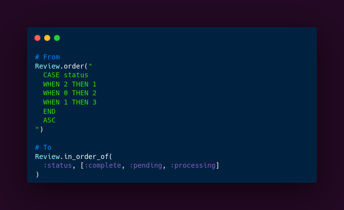

**The problem**
It's a common case for Rails applications to have `enum` fields on a model like:
```ruby
class Review < ApplicationRecord
  enum status: [:pending, :processing, :completed]
end
```
All's good until we need to sort records by their status in a specific order. For example, on reviews page records should be ordered by status in alphabetical order, but internally in DB status values are stored as integers.
We can't just add `order(status: :asc)`. Previously we'd have to write some custom SQL for the task:
```ruby
Review.order("
  CASE status
  WHEN 2 THEN 1
  WHEN 0 THEN 2
  WHEN 1 THEN 3
  END
  ASC
")
```

**The solution**
Ruby on Rails 7.0 provides a new query method `#in_order_of` which accepts as arguments a column name and an array of values in order we want the records to be ordered by:
```ruby
Review.in_order_of(
  :status, [:complete, :pending, :processing]
)
```
Which translates to SQL query like:
```sql
SELECT "reviews".* FROM "reviews" 
WHERE "reviews"."status" IN (2, 0, 1) 
ORDER BY CASE "reviews"."status"
  WHEN 2 THEN 1 
  WHEN 0 THEN 2 
  WHEN 1 THEN 3 
END ASC
```
This works well, as long as we don't have/care about reviews with `NULL` as their status.
If we try to pass `nil` to the values array:
```ruby
Review.in_order_of(
  :status, [nil, :complete, :pending, :processing]
)
```
Following SQL would be created:
```sql
SELECT "reviews".* FROM "reviews" 
WHERE "reviews"."status" IN (NULL, 2, 0, 1) 
ORDER BY CASE "reviews"."status"
  WHEN NULL THEN 1
  WHEN 2 THEN 2
  WHEN 0 THEN 3
  WHEN 1 THEN 4
END ASC
```
But since `NULL` in SQL is a special value and `NULL != NULL`, then this query simply won't return records with `NULL` as a status at all.

**The improvement**
Ruby on Rails 7.0.7 further improves the method: now it correctly handles the `NULL` values, so the resulting query would be:
```sql
SELECT "reviews".* FROM "reviews" 
WHERE (
  "reviews"."status" IN (2, 0, 1)
  OR "reviews"."status" IS NULL
)
ORDER BY CASE 
  WHEN "reviews"."status" IS NULL THEN 1
  WHEN "reviews"."status" = 2 THEN 2
  WHEN "reviews"."status" = 0 THEN 3
  WHEN "reviews"."status" = 1 THEN 4
END ASC
```
Now it does exactly what we need without writing any custom SQL queries.