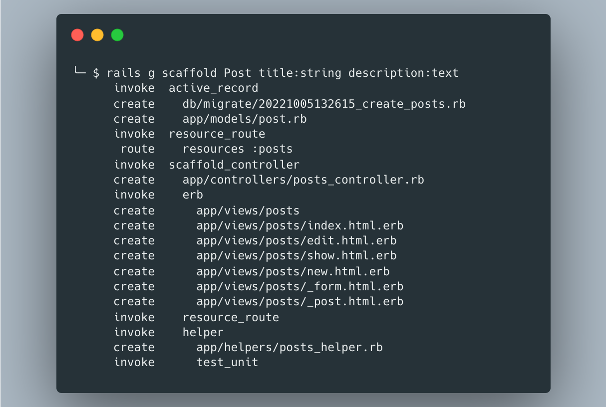

Rails has a very handy tool for rapid development called scaffolding. Often programmers ignore it, because some things have to be written by hand anyway. I will tell you how you can minimize manual coding by using custom templates.

We need to override the templates provided by the Rails. You can find them in this way:

```
╰─ $ bundle show railties
/Users/sampleuser/.rbenv/versions/3.1.1/lib/ruby/gems/3.1.0/gems/railties-7.0.2.3
```

It means that the files we are interested in are located in this path:

```
/Users/sampleuser/.rbenv/versions/3.1.1/lib/ruby/gems/3.1.0/gems/railties-7.0.2.3/lib/rails/generators/erb/scaffold/templates
```

In order to override these files, we need to copy them to our application directory:

```
$ cp -a /Users/sampleuser/.rbenv/versions/3.1.1/lib/ruby/gems/3.1.0/gems/railties-7.0.2.3/lib/. ~/projects/custom-templates-app/lib
```

```
$ ls -la ~/projects/custom-templates-app/lib/rails/generators/erb/scaffold/templates
total 48
drwxr-xr-x  sampleuser  staff   256 Apr  7 10:56 .
drwxr-xr-x  sampleuser  staff   128 Apr  7 10:56 ..
-rw-r--r--  sampleuser  staff  1247 Apr  7 10:56 _form.html.erb.tt
-rw-r--r--  sampleuser  staff   343 Apr  7 10:56 edit.html.erb.tt
-rw-r--r--  sampleuser  staff   465 Apr  7 10:56 index.html.erb.tt
-rw-r--r--  sampleuser  staff   239 Apr  7 10:56 new.html.erb.tt
-rw-r--r--  sampleuser  staff   762 Apr  7 10:56 partial.html.erb.tt
-rw-r--r--  sampleuser  staff   413 Apr  7 10:56 show.html.erb.tt
```

So, now we have templates that we can adapt to our design.

Lets try to generate new resource with using default templates:
```
$ rails g scaffold Post title:string description:text
$ rails db:migrate
```
As a result, we get standard templates, which now need to be manually adjusted to fit the site design.


It’s time to update the templates to use custom styles. I suggest using Bootstrap.

**_form.html.erb.tt:**
```
<%%= form_with(model: <%= model_resource_name %>) do |form| %>
  <%% if <%= singular_table_name %>.errors.any? %>
    <div id="error_explanation">
      <h2><%%= pluralize(<%= singular_table_name %>.errors.count, "error") %> prohibited this <%= singular_table_name %> from being saved:</h2>
      <ul>
        <%% <%= singular_table_name %>.errors.each do |error| %>
          <li><%%= error.full_message %></li>
        <%% end %>
      </ul>
    </div>
  <%% end %>
<% attributes.each do |attribute| -%>
  <div class="form-group mb-3">
<% if attribute.password_digest? -%>
    <%%= form.label :password, class: "form-label" %>
    <%%= form.password_field :password, class:"form-control" %>
  </div>
<div class="form-group mb-3">
    <%%= form.label :password_confirmation, class: "form-label" %>
    <%%= form.password_field :password_confirmation, class:"form-control" %>
<% elsif attribute.attachments? -%>
    <%%= form.label :<%= attribute.column_name %>, class: "form-label" %>
    <%%= form.<%= attribute.field_type %> :<%= attribute.column_name %>, multiple: true %>
<% elsif attribute.type == :boolean -%>
    <%%= form.label :<%= attribute.column_name %>, class: "form-check-label" %>
    <%%= form.<%= attribute.field_type %> :<%= attribute.column_name %>, class:"form-check-input" %>
<% elsif attribute.reference? -%>
    <%%= form.label :<%= attribute.column_name %> %>
    <%%= form.collection_select :<%= attribute.column_name %>, <%= attribute.name.camelize %>.all, :id, :name, { prompt: true }, { class: "form-select" }  %>
<% else -%>
    <%%= form.label :<%= attribute.column_name %>, class: "form-label" %>
    <%%= form.<%= attribute.field_type %> :<%= attribute.column_name %>, class:"form-control" %>
<% end -%>
  </div>
<% end -%>
  <div class="form-group mb-3">
    <%%= form.submit class: 'btn btn-primary' %>
  </div>
<%% end %>
```
**edit.html.erb.tt:**
```
<div class="container-fluid">
  <h1>Editing <%= singular_table_name.titleize %></h1>
  <%%= render 'form', <%= singular_table_name %>: @<%= singular_table_name %> %>
  <%%= link_to 'Show', @<%= singular_table_name %>, class: "btn btn-light min-width-btn" %> |
  <%%= link_to 'Back', <%= index_helper %>_path, class: "btn btn-light min-width-btn" %>
</div>
```
**index.html.erb.tt:**
```
<div class="container-fluid">
  <p id="notice"><%%= notice %></p>
  <h1><%= plural_table_name.titleize %></h1>
  <table class="table">
    <thead>
      <tr>
  <% attributes.reject(&:password_digest?).each do |attribute| -%>
        <th><%= attribute.human_name %></th>
  <% end -%>
        <th colspan="3"></th>
      </tr>
    </thead>
<tbody>
      <%% @<%= plural_table_name %>.each do |<%= singular_table_name %>| %>
        <tr>
  <% attributes.reject(&:password_digest?).each do |attribute| -%>
          <td><%%= <%= singular_table_name %>.<%= attribute.column_name %> %></td>
  <% end -%>
          <td><%%= link_to 'Show', <%= model_resource_name %> %></td>
          <td><%%= link_to 'Edit', edit_<%= singular_route_name %>_path(<%= singular_table_name %>) %></td>
          <td><%%= link_to 'Destroy', <%= model_resource_name %>, method: :delete, data: { confirm: 'Are you sure?' } %></td>
        </tr>
      <%% end %>
    </tbody>
  </table>
  <br />
  <%%= link_to 'New <%= singular_table_name.titleize %>', new_<%= singular_route_name %>_path, class: "btn btn-success min-width-btn" %>
</div>
```
**new.html.erb:**
```
<div class="container-fluid">
  <h1>New <%= singular_table_name.titleize %></h1>
  <%%= render 'form', <%= singular_table_name %>: @<%= singular_table_name %> %>
  <%%= link_to 'Back', <%= index_helper %>_path, class: "btn btn-light min-width-btn" %>
</div>
```
**show.html.erb:**
```
<div class="container-fluid">
  <p id="notice"><%%= notice %></p>
<% attributes.reject(&:password_digest?).each do |attribute| -%>
  <% if attribute.attachment? -%>
  <div class="form-group mb-3">
    <p><strong><%= attribute.human_name %>:</strong></p>
    <%%= link_to @<%= singular_table_name %>.<%= attribute.column_name %>.filename, @<%= singular_table_name %>.<%= attribute.column_name %> if @<%= singular_table_name %>.<%= attribute.column_name %>.attached? %>
  </div>
  <% elsif attribute.attachments? -%>
  <div class="form-group mb-3">
    <p><strong><%= attribute.human_name %>:</strong></p>
    <%% @<%= singular_table_name %>.<%= attribute.column_name %>.each do |<%= attribute.singular_name %>| %>
      <div><%%= link_to <%= attribute.singular_name %>.filename, <%= attribute.singular_name %> %></div>
    <%% end %>
  </div>
  <% else -%>
  <div class="form-group mb-3">
    <p><strong><%= attribute.human_name %>:</strong></p>
    <div>
      <%%= @<%= singular_table_name %>.<%= attribute.column_name %> %>
    </div>
  </div>
  <% end -%>
<% end -%>
<%%= link_to 'Edit', edit_<%= singular_table_name %>_path(@<%= singular_table_name %>), class: "btn btn-primary min-width-btn" %>
  <%%= link_to 'Back', <%= index_helper %>_path, class: "btn btn-light min-width-btn" %>
</div>
```
Now let’s delete the files created by the previous generator and generate using the new templates:
```
$ rails d scaffold Post title:string description:text
$ rails g scaffold Post title:string description:text
```
Result:


