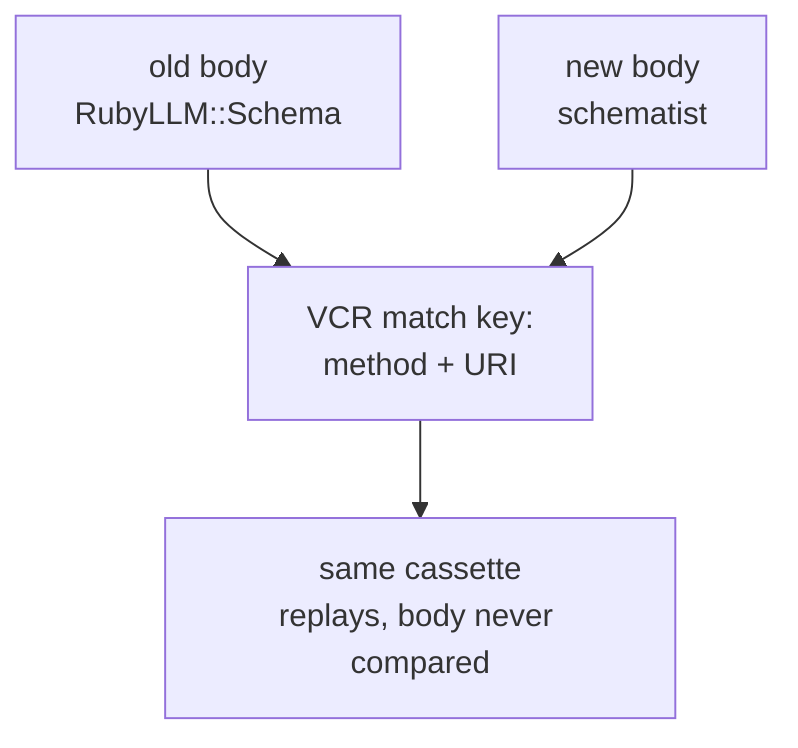

Debugging RubyLLM agents in Rails keeps landing me on the same question: what is a green test suite actually asserting when the thing under test lives on someone else's server?

Last week we moved all nine schemas in the talent-matching pipeline we run onto a different schema library. Every request body we send changed shape. All 1549 tests stayed green, and by the rules they had been given, they were right to.

Only one of the three incidents below was ever a test's job to catch. That test had to measure something strange before it worked.

## Nine schemas swapped, 1549 tests green

VCR's default request matcher is `[:method, :uri]`. `DEFAULT_MATCHERS = [:method, :uri]` sits at line 9 of `request_matcher_registry.rb` in vcr 6.4.0, and `configuration.rb` hands that array to every cassette that never sets its own [`match_requests_on`](https://benoittgt.github.io/vcr/#/configuration/default_cassette_options).

Ours never set one.

So moving off `RubyLLM::Schema` onto the [`schematist`](https://github.com/crmne/schematist) gem was invisible to the suite. ruby_llm duck-types the schema object - [`with_schema` calls `to_json_schema`](https://github.com/crmne/ruby_llm/blob/1.16.0/lib/ruby_llm/chat.rb) on anything that responds to it - so on our side it read as a base-class change with an identical DSL ([how the pipeline is wired](/blog/multi-agent-llm-rails-rubyllm/)).

Underneath, the payload changed. schematist emits a bare Draft 2020-12 document, so `$schema` and `title` now ride inside the strict schema we send, and the json_schema name collapsed to `"response"`. Same method, same URI, so every cassette replayed and every assertion passed.

We found out the new payload was accepted the slow way, by making live strict-mode calls against two hosted models by hand before merging. The suite had no opinion.



Answer quality is a different measurement entirely; we get that from a [per-iteration audit trail](/blog/evaluating-rubyllm-agents-rails/).

## What the cassette setup still protects

Two habits in `test_helper.rb` do hold up.

```ruby
VCR.configure do |c|
  c.allow_http_connections_when_no_cassette = false

  c.filter_sensitive_data("<OPENROUTER_KEY>") { ENV["OPENROUTER_API_KEY"] }
  c.filter_sensitive_data("<OPENROUTER_KEY>") { |i| i.request.headers.to_s[/sk-or-v1-[0-9a-f]{64}/] }
  c.filter_sensitive_data("<BEARER_JWT>") { |i| i.request.headers.to_s[/Bearer [\w-]+\.[\w-]+\.[\w-]+/] }
  # same shape filter again for sk-ant- and AIza
end
```

That first line means no test can quietly reach a paid API; a request with no cassette raises instead of dialing out.

Filtering only on `ENV["OPENROUTER_API_KEY"]` misses a key that arrived some other way, hardcoded on a branch, pasted into a fixture, or exported in a teammate's shell. So the scrubbing also matches shapes: `sk-or-v1-` plus 64 hex, `sk-ant-` plus 95 characters, `AIza` plus 35, and the three-segment `Bearer` JWT.

Cassette names come from the test class name through a small concern (`name.underscore.sub("_test", "")`), so nobody hand-names a cassette or typos one into a silent re-record.

## The model went away and no test noticed

On August 16 every LLM feature in production started erroring at once: candidate scoring, query expansion, filter evaluation, reflection, job-description analysis.

I ran the smallest thing the gem has, `.ask("say ok")` with no schema and no tools ([the basics](/blog/rubyllm-rails-getting-started/) if you haven't used it), and back came a deprecation notice where the answer should have been. A registry refresh confirmed it: the provider had retired the model our agents ran on.

No test could have caught that, because every AI test in the suite replays a cassette recorded while the model still existed.

The replacement cost more per token and had a shorter context window, with no like-for-like tier to step across to. Nothing in our code was wrong. The afternoon went into re-tuning prompts for the shorter window and re-recording cassettes.

A cassette is a recording of a conversation that is no longer happening. Nothing in the suite tells you when the recording has gone stale, so re-recording has to sit on somebody's calendar. Catching a retirement while it happens belongs to [monitoring](/blog/testing-monitoring-llm-applications-production/).

## Measure something the test harness can't flatten

The third incident is the one a test could have owned. A deploy wrapped each scoring call in `with_connection`, which holds a connection for the whole block, and that block sat waiting on the model for several seconds. The fibers [fanning the scoring out](/blog/fibers-async-ruby-llm-streaming-rails/) drained the pool into `ActiveRecord::ConnectionTimeoutError` - [the outage itself is written up here](/blog/multi-agent-llm-rails-rubyllm/). Scoring issues no queries of its own, so it should hold no connection at all.

Deleting the wrapper took a minute. I wanted the test that fails the next time someone re-adds it.

Counting busy connections in the pool cannot see this. Transactional tests call `pin_connection!`, which pins one shared connection for the whole test (`connection_pool.rb:366`), so every checkout inside the test hands back that same connection and the busy count never moves.

`ActiveRecord::Base.connection_pool.active_connection?` survives the pinning. It's public API, [documented](https://api.rubyonrails.org/classes/ActiveRecord/ConnectionAdapters/ConnectionPool.html) at `connection_pool.rb:419`, and it returns `connection_lease.connection`: the connection for the current execution context, or nil.

Two caveats the Rails docs state right there. It only sees connections taken through `lease_connection` or `with_connection`, never `checkout`. And it hands back a connection object rather than a boolean, which is why the assertion below reads `assert_nil` instead of `assert_not`.

Every strategy here gets swapped through config rather than by stubbing gem internals ([fakes over mocks](https://martinfowler.com/articles/mocksArentStubs.html)), so the test setup does `RAG.scorer = RAG::FakeCandidateScorer`. The fake is where we hang the observation.

```ruby
# test/support/rag/fake_candidate_scorer.rb
def score(candidate, role)
  calls << {
    candidate: candidate,
    role: role,
    leased_connection: ActiveRecord::Base.connection_pool.active_connection?
  }
  stubbed_score
end

# test/rag/scoring_test.rb
assert_nil scorer.calls.first[:leased_connection]
```

The commit message says what the test is for: `test(rag): pin the invariant that scoring leases no DB connection` (`f95c0d3ec`).

## When you don't need any of this

One agent making one call needs nothing here.

A `.ask` with a schema and a stubbed client covers you, plus a calendar reminder to re-record the cassettes every so often.

All of it starts paying off when several agents run inside one request and a failure has more than one plausible cause.

If the request payloads are the thing you actually care about, put `:body` into `match_requests_on` and accept the cassette re-recording that follows every prompt tweak. And check model availability on a schedule, because the suite will never raise a hand about it.

If several agents run per request in your Rails app and nobody can name which one changed last Tuesday, [that untangling is what our team gets hired for](/services/app-web-development/).

Further reading:

- [VCR default cassette options](https://benoittgt.github.io/vcr/#/configuration/default_cassette_options) - `match_requests_on` and the rest of the cassette defaults
- [VCR on GitHub](https://github.com/vcr/vcr) - source, including `request_matcher_registry.rb`
- [ActiveRecord ConnectionPool API](https://api.rubyonrails.org/classes/ActiveRecord/ConnectionAdapters/ConnectionPool.html) - `active_connection?`, `lease_connection`, `with_connection`
- [ruby_llm `chat.rb` at 1.16.0](https://github.com/crmne/ruby_llm/blob/1.16.0/lib/ruby_llm/chat.rb) - the duck-typed `with_schema`
- [schematist](https://rubygems.org/gems/schematist) - the JSON Schema DSL we moved onto
- [RubyLLM configuration guide](https://rubyllm.com/configuration/) - where the model and provider get named, in one place
- [Mocks Aren't Stubs](https://martinfowler.com/articles/mocksArentStubs.html) - Martin Fowler on fakes, stubs, and what each one can observe

<!-- Reference cadence: jvns.ca -->
