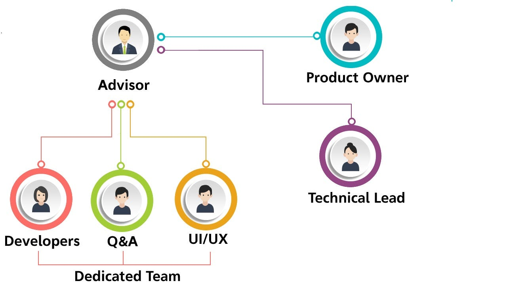
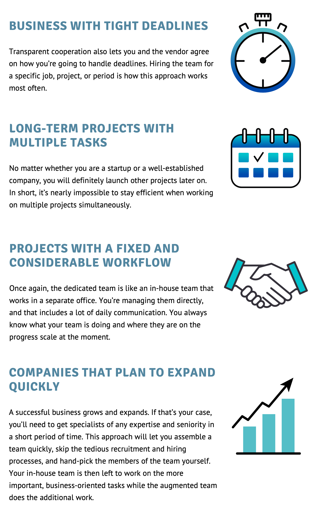

## Dedicated Software Development Teams

*We’ve compiled everything you need to know about dedicated software development teams into an extensive guide you’ll definitely need to read before hiring a dedicated team for your project. Let’s take a look!*

 on [Unsplash](https://unsplash.com/s/photos/teamwork?utm_source=unsplash&utm_medium=referral&utm_content=creditCopyText)](file_0.jpeg)

## What is it?

**A dedicated team** is a business model of collaboration when the client gets a team of professionals meticulously selected according to a specific project’s requirements. The client may decide to manage the team from his side or assign the service provider’s advisor to coordinate the communication process.

This model is best fit for long-term projects, where requirements are unclear initially, scope changes frequently, and scalable projects. The project’s total cost will depend on the tasks assigned to the team, the size of it, and the potential scaling of the team as the project develops.

## How does it look?

The dedicated team approach in JetThoughts is divided into several stages:

### **SCOPING**

We gather all requirements, specify the client’s problems, ideas, and business goals. On this stage, we create a team that suits clients’ demands and structure.

### **SETTING UP**

We search for proactive developers with the appropriate knowledge and sets up a suitable environment and tools.

***Note: **If we have fit guys in-house, let’s get started. In case we don’t have the desired talent, we make a talent selection for around two weeks. You are authorized to interview team members and choose the best for your internal team.*

### **LAUNCHING**

Based on years of practice, we smoothly and painlessly integrate our team into your ongoing project. They continuously work only for your project, get to know its specifics, and see the general idea behind each separate task.

You can choose the preferred management approach. Team members become part of your company and, with the others, adhere to the client’s corporate culture, management style, and project methodologies.

### **SUCCEED**

You get the needed specialists under your complete control, just as with your in-house team. Our self-managed, flexible senior Ruby on Rails developers will take care of all aspects throughout the project’s development when you want to scale the business fast and don’t lose client or time spent recruiting and onboarding activities.

## Who needs a dedicated team?

This model is usually used for long-term projects, where requirements are unclear and scope changes frequently. It is also used when a client’s own team lacks skills or expertise in specific areas. The dedicated team’s main aim is to work seamlessly as part of the client’s team to provide quality, unique and project-specific solutions.

## Why us?

We are Developers who helped to grow successful products. We offer a fully managed dedicated tech team consisting of full-stack Ruby on Rails, Vue.js, React software engineers.

* We take all the candidates through the highly effective **4-Step interview process** where they are tested in all the aspects of their job.

* Our engineers worked together as a team on different projects so the onboarding is shortened significantly

* By Integrating **transparency**, **flexibility**, and **work culture** into our internal processes during the past 15 years, we’ve developed our own **unique framework** for the remote distributed teams.
**Ruslana** is a Lead Generation Manager at [JetThoughts](https://www.jetthoughts.com/). Follow her on [LinkedIn](https://www.linkedin.com/in/ruslana-brykaliuk-970016135/).
>  If you enjoyed this story, we recommend reading our [latest tech stories](https://jtway.co/latest) and [trending tech stories](https://jtway.co/trending).
