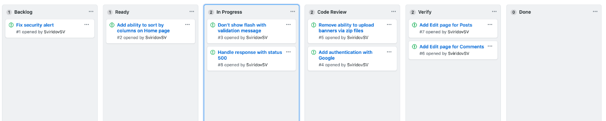
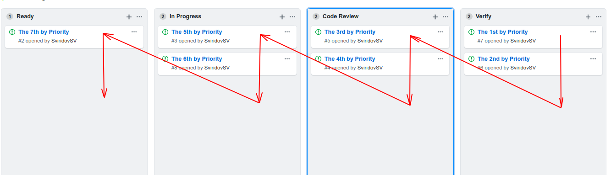
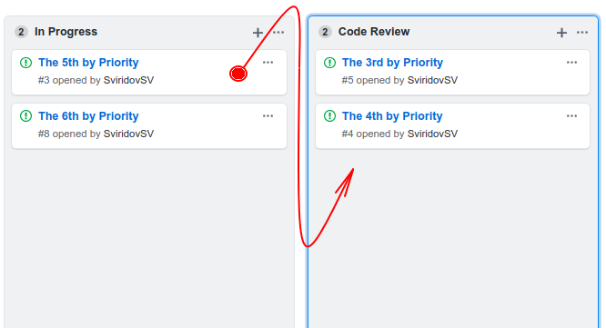
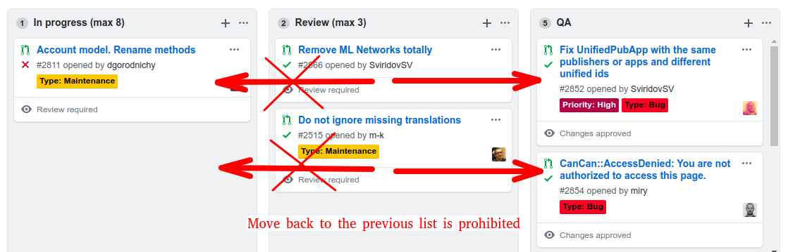
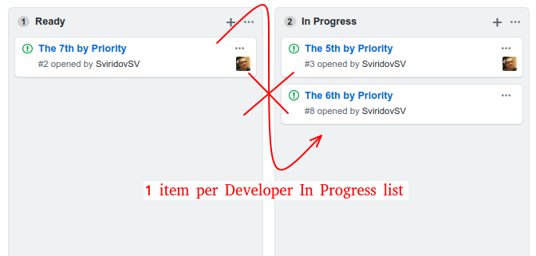
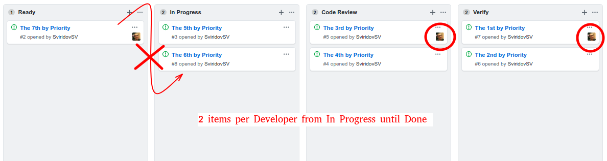

> # Process which help the team make effective decisions to better live up to expectations while prioritizing, visualizing progress, and preventing bottlenecks.

## Kanban Delivering Lists

We use several lists: *Backlog, Ready, In Progress, Code Review, Verify, Done*

On the Board, issues are listed as Kanban Cards. Each list represents *status/progress* in the Development Pipeline.

The lifecycle of the Card takes its place in *Backlog* and finishes in *Done *row.

Members are responsible for checking the appropriate list for a new card, take necessary actions, and move it to the next stage.
>  The Developer is personally responsible for the Card and needs to do everything he can to reach the Done for his Card.

## Prioritization

Default conventions for priority are: work on Cards based on their position in Pipeline.
> # From the Right to the Left List and from the Top to the Bottom in the List

*Code Review* list is more ‘prioritable’ than *Ready*. And the top card in the list has a more priority than the bottom one.

## Correct Card Moving

Moving Card to the bottom of the List helps to support the Prioritization. This way the 10th issue will be still the 10th.

There is label **High**, which means to move card not to the bottom but to the top of the next List.

## Lists Descriptions

## Backlog List

Issues which has been added and ordered by the product owner or decision-makers.

## Ready List

Purpose of the list to show how much will be delivered till the end of the week/Sprint.
>  All team members should build this list on week/sprint kickoff review: by confirming that backlog issues have everything needed, filled out in detail and splitting backlog top issues into two days’ tasks.

## In Progress

The Developer takes the top issue/card from the ***Ready list***, assigns it to himself and move into ***In Progress*** list.
>  One issue per Developer on the list — is the primary constraint.

## Code Review

As soon as the card/issue comes to ***Code Review***, someone takes it and adds the feedback.
>  Because this list has higher priority and as soon as the Developer will reach the WIP limits: we have to clean up this list before **Ready **or **In Progress **lists.

## Verify/QA List

Before merging any changes, we should have confirmation from QA that features have been implemented like it was requested, and the UI changes are still consistent.

## Done

Merge PR to master and run auto-deploy to production/staging.

## WIP (Work In Progress) Limits

The key feature of Kanban is to reduce WIP. By violating those limitations, show us bottlenecks, which we should clean up.

 1. **Moving items back to the previous lists is prohibited:** You could move cards only to the next lists in the row. For example, you could not return a card from ***Verify*** to ***Backlog***.

2. **In Progress list limit:** 1 item per Developer

3. **Developer’s issue limit:** 2 items per Developer from ***In Progress*** until ***Done***

4. **Time limit per issue:** 2 days per issue from ***In Progress*** until ***Done***

When we have spent too much time on the issue: we should split it into several issues in the middle of progress to accomplish this rule.

## Workarounds

## For more than two days per Issue: Split Issues in Progress

On long issues in progress, we need to take action to split it into 2+ parts.

One part will be left and merged in the current issue. Another (Left) part from the expected issue should be extracted into one or more issues. The separated part should be moved to ***Backlog*** and re-prioritized.

2 days rule is more like **Alert** then deadline. This item requires attention for Developer and from other team members.

## Developer have reached WIP Limits

There is a good introduction what can Developer do while he reached limits in [What to do for the developer when the WIP limit is reached](https://jtway.co/what-to-do-for-the-developer-when-the-wip-limit-is-reached-d28694676364)

When Developer provided 2 PRs for review, he could not start a new one. Instead, he should help others to push their issues through the flow by:

 1. Review staled issues on the Board. Help to finish them by proposing solutions, asking for clarifications or fixing them himself.

 2. Help with cleaning the Board and Issues: remove redundant and stale issues, confirm specification and ask for clarifications if needed for the next issues.

 3. Update Project Documentation and Agreements to be up to date and cover with the last questions that appeared in the project.

 4. Open small **not critical Pull Requests** which could be closed and deleted without any doubts. This is the last resort and should be very rare. As usual good to cleanup reformats code, run some experiments while you have time or upgrade dependencies.

## Handle Bugs — Bugs Zero Environment

**Critical bugs that required hotfixes should be fixed ASAP**, with stopping all pipelines.

Bug fixing should have the same stages: ***Ready***, ***In Progress***, ***Verify,*** and ***Code Review***. But we treat them like **High Priority**.

All Card with High Priority instead of moving to the end of the next list should be placed to the top of the list.

## Handle Stale Issues

Issues that have not been updated for a long time are staled. And should be prioritized to be closed. Stale issues are a waste of time in Lean Principles.

How to find stale issues:

* two days without updates (code, comments) for in-progress issues

* there is no status, who is responsible for performing the next action

* for the backlog issues without updates for the 2–3 months

## Workflow violation

If you find yourself in a situation where you have to violate the workflow, you must report this in advance along with the reason for doing it.

## References

* [5 Right Reasons to Apply Kanban](https://www.targetprocess.com/blog/2009/08/5-right-reasons-to-apply-kanban/)

* [4 BENEFITS OF WIP LIMITS](https://leankit.com/learn/kanban/benefits-of-wip-limits/)

* [Checklist for the non-tech founder](https://jtway.co/checklist-for-the-non-tech-founder-5c638133f899)

**Paul Keen** is an Open Source Contributor and a Chief Technology Officer at [JetThoughts](https://www.jetthoughts.com). Follow him on [LinkedIn](https://www.linkedin.com/in/paul-keen/) or [GitHub](https://github.com/pftg).
>  *If you enjoyed this story, we recommend reading our [latest tech stories](https://jtway.co/latest) and [trending tech stories](https://jtway.co/trending).*
