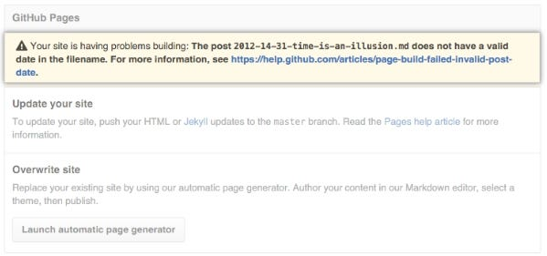
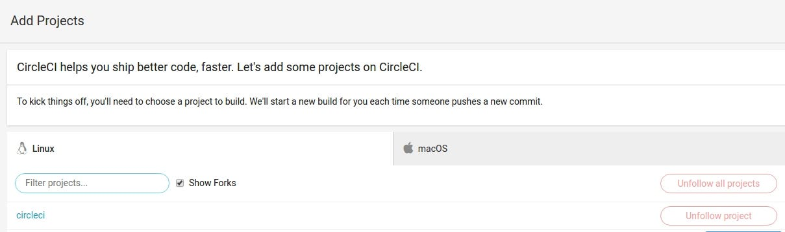
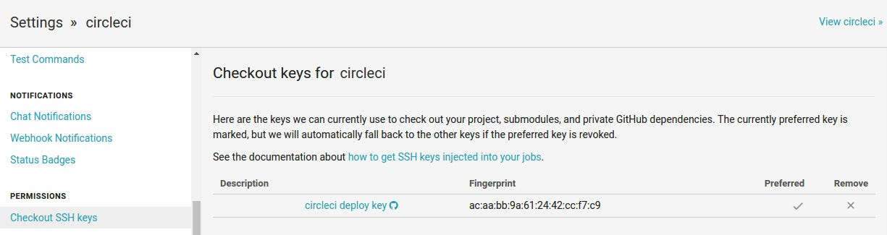
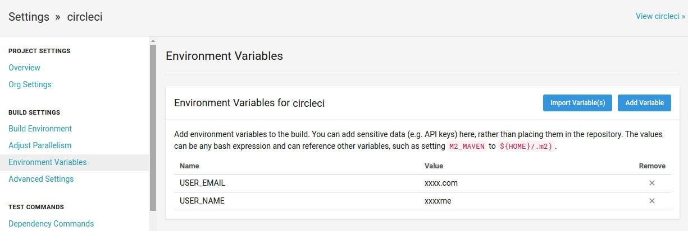

Have you ever seen this error when you tried to deploy your Jekyll site to GitHub Pages?



One of the reasons is that some of the gems in your Gemfile are not supported by GitHub Pages. There is a way to have custom gems by setting up your own continuous delivery. In this post we will use CircleCI to solve the problem.

With CircleCI, auto-publishing your site on GitHub Pages is as easy as drinking a coffee.

## Requirements:

* GitHub account (you obviously have one already)

* Repository with the name {username}.github.io

## Next steps:

 1. Create repository on GitHub

 2. Create configuration file config.yml

 3. Create a file for automated deploy setup-github.sh

 4. Connect and add the CircleCI to our repository

And it’s all! Your site is auto-generated and pushed to master branch each time you commit to develop branch.

## **Setup Github repository to support new strategy**

We need to create a branch with the name develop. Here we will store the source code of the site and also run Jekyll to build our site. Store site, we will be to branch master. Because GitHub uses master branch by default for publication.

You can use another branch for deployed to GitHub Pages. But you will need to make the changes in our code (replace master branch with another branch in build script)

## Add GitHub Delivery Integration

Make sure you enable your repository on CircleCI.



Now add deploy key in “Checkout SSH keys”



Also, need to create two values in “Environment Variables”:

 1. USER_EMAIL (your email)

 2. USER_NAME (your username)



## CircleCI configuration

Create configuration file inside your project .circle/config.yml

```yaml

version: 2
jobs:
  deploy:
    docker:
      - image: circleci/ruby:2.4.3-node-browsers
    steps:
      - checkout
      - run: npm install
      - run: bundle install
      - run: bundle exec jekyll build
      - deploy:
          name: Deploy Release to GitHub
          command: |
            if [ $CIRCLE_BRANCH == 'develop' ]; then
              bash .circleci/setup-github.sh
            fi
workflows:
  version: 2
  build:
    jobs:
      - deploy
```

As you can see we install all project dependencies and generate our site. Then execute deploy script.

## Add build script

Copy the following automated script next to the configuration file .circle/setup-github.sh

```bash
git config user.name "$USER_NAME"
git config user.email "$USER_EMAIL"

git checkout master
git pull origin master

find . -maxdepth 1 ! -name '_site' ! -name '.git' ! -name '.gitignore' -exec rm -rf {} \;
mv _site/* .
rm -R _site/

git add -fA
git commit --allow-empty -m "$(git log develop -1 --pretty=%B)"
git push origin master

echo "deployed successfully"
```

This script does the following things:

* First, we set the Git Configuration. We will receive a data from the settings, which we define in the next step
```
    git config user.name "$USER_NAME"
    git config user.email "$USER_EMAIL"
```
* Switches the branch to master and update branch
```
    git checkout master
    git pull origin master
```
* Next, we will remove all files except the generated site directory and required git folders
```
    find . -maxdepth 1 ! -name '_site' ! -name '.git' ! -name '.gitignore' -exec rm -rf {} \;
```
* When our folder is stripped from unrequired files we move our generated site in the root folder and remove the empty generated site folder
```
    mv _site/* .
    rm -R _site/
```
* Our project is ready for deploying! So we are running git commands for deploying to the master branch
```
    git add -fA
    git commit --allow-empty -m "$(git log develop -1 --pretty=%B)"
    git push origin master
```
You can change the configuration above to do great things using CircleCI. Remember, automating something is always more difficult than doing it manually. But it’s worth taking the time up front to figure it out, as it will save you lots of work and frustration in the long run.

## Conclusion

That’s it, from now on when you commit to develop branch it will automatically run its tests and on success, it will deploy your website to GitHub Pages!
>  *If you enjoyed this story, we recommend reading our [latest tech stories](https://jtway.co) and [trending tech stories](https://jtway.co/trending).*
