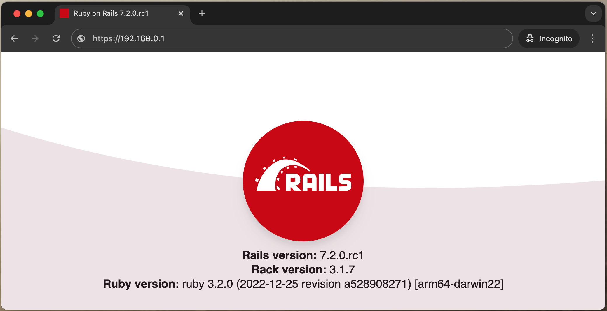

With the release of Rails 8, [Kamal will be the default tool for deploying Rails applications](https://jetthoughts.com/blog/kamal-integration-in-rails-8-by-default-ruby/), simplifying the process for developers. This change is significant as it standardizes deployment, making it easier for both new and experienced developers to get their applications up and running. Utilizing a VPS for hosting your Rails applications is also a cost-effective alternative to platforms like Heroku, providing greater flexibility and control over your infrastructure. 

In this guide, we will walk you through the steps to deploy a new Rails application on a VPS server using Kamal.

## Creating new application
```bash
╰─ $ rails -v
Rails 7.2.0.beta3

╰─ $ rails new sample_app --database=postgresql
      create
      create  README.md
      create  Rakefile
      create  .ruby-version
      create  config.ru
      create  .gitignore
      create  .gitattributes
      ...
```

```bash
╰─ $ ls -a
.              .gitignore     README.md      db             tmp
..             .rubocop.yml   Rakefile       lib            vendor
.dockerignore  .ruby-version  app            log
.git           Dockerfile     bin            public
.gitattributes Gemfile        config         storage
.github        Gemfile.lock   config.ru      test
```

As you can see, the new Ruby on Rails application generates a Dockerfile that we will use in our Deployment process:
```Dockerfile
# syntax = docker/dockerfile:1

# This Dockerfile is designed for production, not development. Use with Kamal or build'n'run by hand:
# docker build -t my-app .
# docker run -d -p 80:80 -p 443:443 --name my-app -e RAILS_MASTER_KEY=<value from config/master.key> my-app

# For a containerized dev environment, see Dev Containers: https://guides.rubyonrails.org/getting_started_with_devcontainer.html

# Make sure RUBY_VERSION matches the Ruby version in .ruby-version
ARG RUBY_VERSION=3.2.0
FROM docker.io/library/ruby:$RUBY_VERSION-slim AS base

# Rails app lives here
WORKDIR /rails

# Install base packages
RUN apt-get update -qq && \
    apt-get install --no-install-recommends -y curl libjemalloc2 libvips postgresql-client && \
    rm -rf /var/lib/apt/lists /var/cache/apt/archives

# Set production environment
ENV RAILS_ENV="production" \
    BUNDLE_DEPLOYMENT="1" \
    BUNDLE_PATH="/usr/local/bundle" \
    BUNDLE_WITHOUT="development"

# Throw-away build stage to reduce size of final image
FROM base AS build

# Install packages needed to build gems
RUN apt-get update -qq && \
    apt-get install --no-install-recommends -y build-essential git libpq-dev pkg-config && \
    rm -rf /var/lib/apt/lists /var/cache/apt/archives

# Install application gems
COPY Gemfile Gemfile.lock ./
RUN bundle install && \
    rm -rf ~/.bundle/ "${BUNDLE_PATH}"/ruby/*/cache "${BUNDLE_PATH}"/ruby/*/bundler/gems/*/.git && \
    bundle exec bootsnap precompile --gemfile

# Copy application code
COPY . .

# Precompile bootsnap code for faster boot times
RUN bundle exec bootsnap precompile app/ lib/

# Precompiling assets for production without requiring secret RAILS_MASTER_KEY
RUN SECRET_KEY_BASE_DUMMY=1 ./bin/rails assets:precompile

# Final stage for app image
FROM base

# Copy built artifacts: gems, application
COPY --from=build "${BUNDLE_PATH}" "${BUNDLE_PATH}"
COPY --from=build /rails /rails

# Run and own only the runtime files as a non-root user for security
RUN groupadd --system --gid 1000 rails && \
    useradd rails --uid 1000 --gid 1000 --create-home --shell /bin/bash && \
    chown -R rails:rails db log storage tmp
USER 1000:1000

# Entrypoint prepares the database.
ENTRYPOINT ["/rails/bin/docker-entrypoint"]

# Start the server by default, this can be overwritten at runtime
EXPOSE 3000
CMD ["./bin/rails", "server"]
```

Let's take a look at the Kamal configuration file **sample_app/config/deploy.yml**:

```yml
# Name of your application. Used to uniquely configure containers.
service: my-app

# Name of the container image.
image: user/my-app

# Deploy to these servers.
servers:
  - 192.168.0.1

# Credentials for your image host.
registry:
  # Specify the registry server, if you're not using Docker Hub
  # server: registry.digitalocean.com / ghcr.io / ...
  username: my-user

  # Always use an access token rather than real password when possible.
  password:
    - KAMAL_REGISTRY_PASSWORD

# Inject ENV variables into containers (secrets come from .env).
# Remember to run `kamal env push` after making changes!
# env:
#   clear:
#     DB_HOST: 192.168.0.2
#   secret:
#     - RAILS_MASTER_KEY

# Use a different ssh user than root
# ssh:
#   user: app

# Configure builder setup.
# builder:
#   args:
#     RUBY_VERSION: 3.2.0
#   secrets:
#     - GITHUB_TOKEN
#   remote:
#     arch: amd64
#     host: ssh://app@192.168.0.1

# Use accessory services (secrets come from .env).
# accessories:
#   db:
#     image: mysql:8.0
#     host: 192.168.0.2
#     port: 3306
#     env:
#       clear:
#         MYSQL_ROOT_HOST: '%'
#       secret:
#         - MYSQL_ROOT_PASSWORD
#     files:
#       - config/mysql/production.cnf:/etc/mysql/my.cnf
#       - db/production.sql:/docker-entrypoint-initdb.d/setup.sql
#     directories:
#       - data:/var/lib/mysql
#   redis:
#     image: redis:7.0
#     host: 192.168.0.2
#     port: 6379
#     directories:
#       - data:/data

# Configure custom arguments for Traefik. Be sure to reboot traefik when you modify it.
# traefik:
#   args:
#     accesslog: true
#     accesslog.format: json

# Configure a custom healthcheck (default is /up on port 3000)
# healthcheck:
#   path: /healthz
#   port: 4000

# Bridge fingerprinted assets, like JS and CSS, between versions to avoid
# hitting 404 on in-flight requests. Combines all files from new and old
# version inside the asset_path.
#
# If your app is using the Sprockets gem, ensure it sets `config.assets.manifest`.
# See https://github.com/basecamp/kamal/issues/626 for details
#
# asset_path: /rails/public/assets

# Configure rolling deploys by setting a wait time between batches of restarts.
# boot:
#   limit: 10 # Can also specify as a percentage of total hosts, such as "25%"
#   wait: 2

# Configure the role used to determine the primary_host. This host takes
# deploy locks, runs health checks during the deploy, and follow logs, etc.
#
# Caution: there's no support for role renaming yet, so be careful to cleanup
#          the previous role on the deployed hosts.
# primary_role: web

# Controls if we abort when see a role with no hosts. Disabling this may be
# useful for more complex deploy configurations.
#
# allow_empty_roles: false

```

Lets update this config step by step:

- Update service name. It should be the same as your application 
name: 
```yml
service: sample_app
```

- Servers. Here you must set your VPS IP.
```yml
servers:
  - 192.168.0.1
```

- Registry. Here you can set your username and password on 
DockerHub. During deploy your docker image will be upload on 
DockerHub.
```yml
registry:
  username: sample-user
  password:
    - KAMAL_REGISTRY_PASSWORD
```
`KAMAL_REGISTRY_PASSWORD` you need to set in `.env` file:
```bash
╰─ $ cat .env

KAMAL_REGISTRY_PASSWORD=<your dockerhub password>
RAILS_MASTER_KEY=<rails master key>
POSTGRES_PASSWORD=<your postgres password>
```

Note: All security-sensitive information you need to set in `.env` file. Then this data will be accessible in `secrets`. 

- Set ENV variables
```yml
env:
  clear:
    HOST: sample-app.com
    DB_HOST: <your VPS IP>
    RAILS_ENV: production
    POSTGRES_USER: <postgres user>
    POSTGRES_DB: <database name>
    POSTGRES_HOST: <your VPS IP>
  secret:
    - RAILS_MASTER_KEY
    - POSTGRES_PASSWORD
```
`RAILS_MASTER_KEY` should be stored in `.env`.

- Setup deployment user
```yml
ssh:
  user: deploy
```

- Setup postgres container:
```yml
accessories:
  db:
    image: postgres:15
    host: 192.168.0.1
    port: 5432
    env:
      clear:
        POSTGRES_USER: <your postgres user>
        POSTGRES_DB: <your database name>
        POSTGRES_HOST: 192.168.0.1
      secret:
        - POSTGRES_PASSWORD
    files:
      - db/production.sql:/docker-entrypoint-initdb.d/setup.sql
    directories:
      - data:/var/lib/postgresql/data
```

At this stage, we've finished configuring Kamal. Now, let's move on to the steps we need to take on our VPS server to ensure a successful deployment.

## Configure VPS.
The only thing we need to do on the VPS is to create a user that we will use for deployment. To do this, login by SSH into your VPS server and follow these steps:

```bash
sudo useradd --create-home -s /bin/bash deploy
sudo adduser deploy sudo
sudo passwd deploy
sudo usermod -aG docker deploy
```

## Deployment
At this stage, everything is ready for configuring the server and performing the first deployment.

Run the following command in your project's folder on your local machine:

```bash
kamal setup
```
Next, enter the password for your deploy user. After a few minutes, you will have a production-ready application deployed. You can access it in your browser using the IP address of your VPS.

Once your project is set up, you can view more detailed information about the status of your application using the `kamal details` command.

```bash
╰─ $ kamal details
  INFO [03354f9c] Running docker ps --filter name=^traefik$ on 192.168.0.1
  INFO [03354f9c] Finished in 2.271 seconds with exit status 0 (successful).
Traefik Host: 192.168.0.1
CONTAINER ID   IMAGE           COMMAND                  CREATED       STATUS       PORTS                                                                      NAMES
ff0a1fb71197   traefik:v2.10   "/entrypoint.sh --pr…"   11 days ago   Up 11 days   0.0.0.0:80->80/tcp, :::80->80/tcp, 0.0.0.0:443->443/tcp, :::443->443/tcp   traefik

  INFO [b111be6c] Running docker ps --filter label=service=sample_app --filter label=role=web on 192.168.0.1
  INFO [b111be6c] Finished in 0.334 seconds with exit status 0 (successful).
App Host: 192.168.0.1
CONTAINER ID   IMAGE                                                                   COMMAND                CREATED      STATUS                PORTS      NAMES
609d2c0e7d26   username/sample_app:71237c1***ee69f1f7   "./bin/rails server"   4 days ago   Up 4 days (healthy)   3000/tcp   sample_app-web-71237c1***69f1f7

  INFO [5ed6f6da] Running docker ps --filter label=service=sample_app-db on 192.168.0.1
  INFO [5ed6f6da] Finished in 0.343 seconds with exit status 0 (successful).
Accessory db Host: 192.168.0.1
CONTAINER ID   IMAGE         COMMAND                  CREATED       STATUS       PORTS                                       NAMES
a55b30ab8a29   postgres:15   "docker-entrypoint.s…"   11 days ago   Up 11 days   0.0.0.0:5432->5432/tcp, :::5432->5432/tcp   sample_app-db
```
As we can see, three containers have started:

- [traefik](https://traefik.io/traefik/)
- sample_app-web
- sample_app-db

This means that our application has been successfully deployed.


&nbsp;

## Bonus: Frequently Used Kamal Commands
`kamal deploy`: This command deploys your application to the specified environment. It builds the Docker image, pushes it to the container registry, and then updates the services on your VPS to run the new version of the application.

`kamal env push`: This command pushes your local environment variables to the remote server. It ensures that your application on the VPS has the correct environment variables set, which are necessary for it to run properly.

`kamal app logs`: This command retrieves and displays the logs of your application running on the server. It is useful for monitoring your application's behavior and troubleshooting any issues that may arise.

`kamal app exec -i 'bin/rails console'`: This command allows you to execute the Rails console directly on the server. The -i flag runs the command in an interactive mode, giving you direct access to the Rails environment on your VPS.

`kamal app exec --reuse "bin/rails runner 'puts Rails.version'"`: This command runs a specific Rails command on the server without starting a new container. The --reuse flag tells Kamal to reuse an existing container, which can save time and resources. In this case, the command outputs the Rails version used by the application.

`kamal app exec --reuse -i "/bin/bash"`: This command provides you with an interactive bash shell on one of your application's containers.