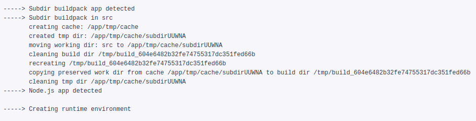

When you want to deploy to Heroku a project located in a Git subdirectory, simply running git push heroku master will likely fail, because Heroku buildpacks won’t be able to detect your project files location. There are two simple solutions which will help you make it work.

Project source code can reside in a subdirectory due to various reasons:

* It’s a monorepo containing different project services: backend API, frontend, background processing worker, etc. that could be deployed independently.

* The repository contains a bunch of example applications illustrating the usage of some library or tool.

* The repository has some specific build or meta configuration in the repository root.

* The resulting project for deployment gets built into a repository subdirectory.

### **Solution 1: Git way**

So you create a Heroku app as usual, but do not connect it with the repository. Then from the root of your repository execute

    git subtree push --prefix path/to/app-subdir heroku master

This will push path/to/app-subdir subtree to the Heroku master branch which initiates a deploy process.

Another variation of the same method would be using git subtree split.

    git subtree split --prefix src -b deploy
    git push heroku deploy:master

The first command will create a new branch deploy containing only src subdirectory content. The second command will push the newly created branch to Heroku. Or you can connect the Heroku app with your GitHub repository and enable automated deploy using thedeploy branch.

This solution can be used for updating a site generated by blog engines like Jekyll and deploying it to GitHub pages. First build the site, for Jekyll resulting site files will be located in the _site directory. Then run

    git subtree split --prefix _site -b site-build
    git push origin site-build:master

You can configure this to be executed on CircleCI for release builds. You can take a peek [here](https://jtway.co/deploying-jekyll-to-github-pages-with-circleci-2-0-3eb69324bc6e) for an example.

Pros:

* Easy;

* No need for additional app configuration, or any changes in the existing repository;

Cons:

* For automated app updates need to set up CircleCI workflow;

* No Heroku Review Apps support;

This solution is perfect when you need a simple manual deploy to Heroku or if you can configure an automated workflow using CI service like CircleCI. But what if you don’t have CI or you want to utilize Review Apps provided by Heroku which are deployed for each new Pull Request. Then you’ll need some help from Heroku buildpacks.

### **Solution 2: Heroku way (inline buildpack)**

Create a Heroku app as usual and connect it with your GitHub repository. Add the https://github.com/heroku/heroku-buildpack-inline.git buildpack as first for your application. After that, create the bin directory in the repository root and create compile, detect, release files. You can leave detect and release files are basically empty, all logic will reside in compile:

 <iframe src="https://medium.com/media/eee533bca9b638d4349e9af2b6b3c183" frameborder=0></iframe>

All it does is copying all source files from the specified subdirectory to the build directory, removing everything else. You can adjust this behavior to your needs.

Congratulations! You’ve just implemented your own buildpack. You can find more about Heroku buildpack development [here](https://devcenter.heroku.com/categories/buildpacks).

If you don’t need any specific configuration you can use one of the existing [buildpacks](https://elements.heroku.com/search/buildpacks?q=subdir) which requires some minimal configuration like specifying the subdirectory path.

Now you can enable Heroku Review Apps, you’ll need to add an app.json file for your project.

Pros:

* No need in changes in source code of the app itself;

* No Heroku related files/code in project source files;

* Automated updates managed by Heroku, no need for CI service setup;

* Can be used with Heroku Review Apps;

Cons:

* Requires additional setup;

From our perspective, this solution is preferable because it provides the ability for finer configuration and allows us to utilize Heroku Review Apps which is a great part of our development [process](https://jtway.co/make-master-stable-again-b15c9ff3b129).

**Dmitry Tsvetkov** *is a Software Engineer at JetThoughts. Follow him on [LinkedIn](https://www.linkedin.com/in/dmitry-tsvetkov-a374095a/) or [GitHub](https://github.com/vlaew).*
>  *If you enjoyed this story, we recommend reading our [latest tech stories](https://jtway.co/latest) and [trending tech stories](https://jtway.co/trending).*
