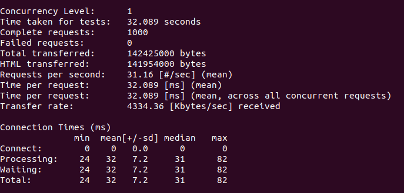

> ### Caching can reduce load time and increase the throughput of your API endpoints without in-depth optimization. But there are certain design principles you should follow to make your endpoints cacheable and gain all benefits caching can provide for your app.

There is a common use case which can be found in many apps when you need to implement an API returning a list of posts and each post having a flag indicating whether a post was liked by the current user or not.

Consider Post and Like models:

 <iframe src="https://medium.com/media/975150f1dac7cd335fd9ff581c487a23" frameborder=0></iframe>

There are a few things we can do to increase the performance of our /posts endpoint:

 1. Limit the number of records returned via pagination.

 2. Add response payload caching.

 3. Add conditional get which will return 304(not modified) response for subsequent requests if nothing has changed.

Since we want our endpoint cacheable we need /posts responses to be the same for as many users as it can be. To achieve that you should remove user-specific data from the response. In our case, it’s the liked_by_me flag, which will be retrieved via a separate endpoint, used only for signed-in users.

 <iframe src="https://medium.com/media/9d221f2dd995cca460c52b3a516bffc2" frameborder=0></iframe>

 <iframe src="https://medium.com/media/266fe7808ada58408aa8306cd22f0601" frameborder=0></iframe>

 <iframe src="https://medium.com/media/c6aab5bf0bdf3aa9d7fb76391895ffbe" frameborder=0></iframe>

### Make Pagination cacheable

Since we have some kind of feed of posts showing most recent posts first and going further into the past cursor based pagination can be used here:

 1. It’s faster than offset based pagination for large datasets.

 2. It produces more consistent pages, meaning a set of posts returned for a certain page stays the same regardless of how many new posts were added. This way we can capitalize on caching responses for separate pages.

Though, there are some limitations:

 1. Attribute used for cursor must be sequential and unique.

 2. Records scope should be ordered using that field.

For simplicity id field can be used in this case.

Also a fixed number of entries per page can be used, that way every page will be of the same size and contain the same posts for all users. It’s better to set up this number to be as large as it makes sense for your use case since 1 big request is better than tens of small requests. In this example, it’s set to 500 posts per page.

 <iframe src="https://medium.com/media/07153002bfc51e373161166a7c24cb57" frameborder=0></iframe>

 <iframe src="https://medium.com/media/5d6e3281a81ff3c06be7b81bdcfecf70" frameborder=0></iframe>

### Cache response payload

Each posts page should be cached separately and when posts change (added/updated/removed) cache should be invalidated. Luckily it can be easily done with some help from Rails.

Firstly add configuration allowing cache versioning in *application.rb*:

 <iframe src="https://medium.com/media/10db0f2e896dac80cf493c21208886dc" frameborder=0></iframe>

And add cache_key, cache_version delegation to the page scope:

 <iframe src="https://medium.com/media/9db64cf523a4976ee4a9f4a90b9d7c72" frameborder=0></iframe>

Then add fetching from the cache and recalculating response data on cache miss:

 <iframe src="https://medium.com/media/b75beacda88bdb90c7e1b04d6e402ab0" frameborder=0></iframe>

### Add Conditional GET

Is there a way to make it even faster than retrieving prepared response payload from cache? There is, just don’t send data at all when the user already has fresh data. Instead 304 Not Modified HTTP Status Code is returned, indicating that cached (in browser/proxy/middleware) response can be safely used instead.

For that just wrap response rendering with [stale?](https://apidock.com/rails/ActionController/ConditionalGet/stale%3F) method which will add appropriate headers and status code to the response. Also, it can be called with public: true (which will set Cache-Control: public header) indicating that the response can be cached by anyone in the request-response chain (intermediate proxies, ISP relays, etc).

 <iframe src="https://medium.com/media/83bae7b1ac5e46906c4b8a40d0b04968" frameborder=0></iframe>

### Questions to keep in mind when designing API endpoints

 1. Should it be cached?

 2. For whom it can be cached?

 3. When cached data should be invalidated?

Caching is a great way to increase the performance of your API. But it also adds an extra layer of complexity and a responsibility to keep the cache fresh and consistent.

**Dmitry Tsvetkov** *is a Software Engineer at JetThoughts. Follow him on [LinkedIn](https://www.linkedin.com/in/dmitry-tsvetkov-a374095a/) or [GitHub](https://github.com/vlaew).*
>  *If you enjoyed this story, we recommend reading our [latest tech stories](https://jtway.co/latest) and [trending tech stories](https://jtway.co/trending).*
