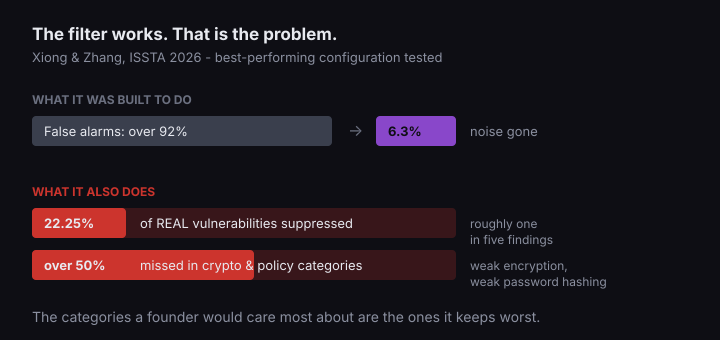

"It's been reviewed" used to mean a person read it.

That is no longer a safe assumption, and the change happened fast enough that most founders never got told. GitHub published the number in March: Copilot code review usage "has grown 10X, now accounting for more than one in five code reviews on GitHub." If your shop works on GitHub, there is a reasonable chance the reviewer on your last release was software.

## The case for the machine is stronger than the case against

Uber built an AI reviewer called uReview and published what it does. The system now analyses over 90% of the roughly 65,000 diffs that land at Uber each week, inside a median of four minutes.

They publish three numbers about comment quality. By Uber's measurement, "only 51% of human-written comments are considered as bugs by the author and addressed in the same changeset." uReview gets "over 65% of its posted comments addressed." And "engineers who interact with the tool" mark 75% of its comments useful.

It is tempting to read the first two as a scoreboard, and they are not one. The 51% is a human author's verdict. The 65% is the system scoring itself - Uber checks whether a comment was addressed by re-running uReview five times on the final commit and seeing whether it still fires. Two different instruments, and only one of them involves a person deciding the comment was right.

What the numbers do support is narrower and still worth knowing: at Uber's scale, nobody has produced evidence that the machine reviewer is the weak link. Anyone who tells you AI review is uniformly sloppy is arguing against a measurement they have not read.

A separate benchmark on C# code found language models beating the established scanners at finding real vulnerabilities. The researchers were careful about what that means: "their noisier output and imprecise localisation limit their standalone use in safety-critical audits."

## Noise is the problem everyone actually solved for

An AI reviewer that comments on everything gets ignored, then switched off. So deployments filter. Uber's own write-up describes pruning low-confidence alerts, merging duplicate comments, and automatically suppressing whole categories with "historically low developer value."

That is sensible engineering. It is also where the risk moves, and a paper accepted to ISSTA 2026 measured what that kind of filtering costs. Their subject is a neighbouring tool - LLM agents triaging security-scanner alerts rather than an AI reviewer's comments - so read it as evidence about the filtering decision, not about uReview.

Yunpeng Xiong and Ting Zhang at Monash University tested three agent frameworks against the OWASP Benchmark and real Java vulnerabilities. The filtering works: an initial false-positive rate above 92% fell to as low as 6.3% in the best configuration. Then they checked what went missing along with the noise. Their third stated lesson:

> Aggressive FP suppression risks hiding real vulnerabilities and should not be fully automated.

The measurement behind it: even the best-performing configuration "incorrectly suppresses 22.25% of real vulnerabilities on the OWASP Benchmark positives." Roughly one in five genuine findings on a synthetic benchmark, quietly reclassified as noise.

It gets worse in a specific place. The miss rate is close to nothing for the injection-style bugs everyone knows about, and it "exceeds 50% for cryptography- and policy-related categories" - weak encryption, weak password hashing, trust boundaries. Those are the failures a founder would care most about, and they are the ones the filter is worst at keeping.



## Why this lands harder on AI-written code

A study at ISSRE 2025 compared more than 500,000 code samples, human-written against output from ChatGPT, DeepSeek-Coder and Qwen-Coder. Machine code and human code turn out to fail in different directions. AI-generated code is "generally simpler and more repetitive," while human-written code "exhibits greater structural complexity and a higher concentration of maintainability issues."

And then: "AI-generated code also contains more high-risk security vulnerabilities."

Put the two results next to each other. AI writes code that carries more high-risk security problems. AI review is weakest at exactly the security categories where suppression is worst. If your shop uses AI to write and AI to review, the gap in the reviewer lines up with the weakness in the writer.

## Four things you can check without reading code

None of these require you to evaluate a line of anything. They are artifacts - either they exist or they do not, and asking for them tells you something either way.

| Ask for | What a good answer looks like |
|---|---|
| The review configuration | Which categories are suppressed, and who decided. **Somebody chose the filter deliberately instead of accepting a default.** |
| A recent review with comments | Real comments, some disagreed with, some acted on. **Reviews are read rather than rubber-stamped.** |
| The security scan, separately | A named tool, run on a schedule, with its own output. **Security is not delegated to the same filter that optimises for quiet.** |
| Who signs off | A person's name, and what they check that the tool does not. **Accountability did not evaporate into the pipeline.** |

Run something deterministic for the security categories, and do not let the tool that was tuned for developer patience be the only thing standing between you and a weak hashing bug.

If you want it as something to paste into an email, this is the whole thing:

```text
Four questions about our review process, no rush:

1. What categories does our AI reviewer suppress, and who chose them?
2. Can you send me a recent review with its comments, including
   any the author disagreed with?
3. Do we run a separate security scan that is not the same tool?
   Which one, and on what schedule?
4. Who signs off on a merge, by name, and what do they check that
   the tooling does not?
```

## What this does not tell you

The suppression study is Java, against a benchmark and one real-world dataset. The scanner comparison is C#. Neither is Rails, or Python, or whatever your product is built in, and a number measured on one stack does not transfer to another just because it is inconvenient to re-measure.

The headline numbers also look like they disagree. An industry study at Tencent found hybrid static-analysis-plus-LLM methods eliminating 94-98% of false positives "while maintaining high recall," which sounds like the suppression problem solved. It is a smaller result than that phrasing suggests - 433 alarms, three bug types, one company's advertising software.

Read to the end of that paper and it lands where the Monash one does: "recall remains below the enterprise-expected threshold of 90%, indicating that some degree of manual review is still necessary to guarantee absolute safety." Do not run this unattended.

The filter is a decision, somebody made it, and you are allowed to ask what it was.

## The question for your next status call

Not "was the code reviewed." You will get a yes, it will be true, and it will not mean what you wanted it to mean.

Ask what the review was configured to ignore, and who decided that.

I have been on the other side of this question, and the honest thing to say is that a good shop will not be offended by it. The ones who bristle are usually the ones who set the filter to default and never looked at it again. If the answers send you looking for the exit, [there is a way to leave without losing the codebase](/blog/switch-dev-shops-safely-transition-guide/).

## Sources

- GitHub, [60 million Copilot code reviews and counting](https://github.blog/ai-and-ml/github-copilot/60-million-copilot-code-reviews-and-counting/), 5 March 2026.
- Uber Engineering, [uReview: Scalable, Trustworthy GenAI for Code Review at Uber](https://www.uber.com/us/en/blog/ureview/).
- Yunpeng Xiong and Ting Zhang, [Sifting the Noise: A Comparative Study of LLM Agents in Vulnerability False Positive Filtering](https://arxiv.org/abs/2601.22952), Proc. ACM Softw. Eng. (ISSTA 2026).
- [Large Language Models Versus Static Code Analysis Tools: A Systematic Benchmark for Vulnerability Detection](https://arxiv.org/abs/2508.04448), arXiv 2508.04448.
- Domenico Cotroneo, Cristina Improta and Pietro Liguori, [Human-Written vs. AI-Generated Code: A Large-Scale Study of Defects, Vulnerabilities, and Complexity](https://arxiv.org/abs/2508.21634), IEEE ISSRE 2025.
- Xueying Du et al., [Reducing False Positives in Static Bug Detection with LLMs: An Empirical Study in Industry](https://arxiv.org/abs/2601.18844), arXiv 2601.18844.
