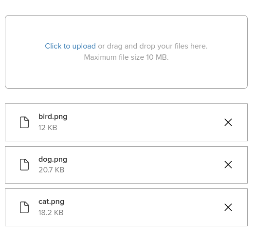

Configuring direct file uploads in Rails is now easier than ever. In this article, I'll show you how to create a file upload component in Rails 7. We'll use Active Storage, Stimulus, and Dropzone.js to make the process smooth and user-friendly.



## Prerequisites
Before you begin, make sure you have the following set up:

1. **Install Active Storage**: If you haven't already, run `rails active_storage:install` and then migrate your database.
2. **Add Active Storage Dependency**: Include Active Storage by running `yarn add activestorage`
3. **Configure CORS for Your Storage Service**: If you use a cloud storage service like AWS S3, configure Cross-Origin Resource Sharing (CORS). This allows your frontend to communicate with the storage service securely. For details on setting up CORS for Active Storage, see the [Rails documentation](https://edgeguides.rubyonrails.org/active_storage_overview.html#cross-origin-resource-sharing-cors-configuration).

## Step 1: Setting Up the Dropzone Controller
First, create a `dropzone_controller.js` file. This Stimulus controller manages file uploads and integrates with Dropzone.js and Active Storage's Direct Upload.

**Key Features**:

- **Event Binding**: The controller binds events like file addition, removal, and upload completion.
- **Direct Upload Handling**: When a file is added, it creates a `DirectUpload` instance to handle the upload process.
- **Custom Headers**: CSRF tokens are included in the upload request headers for security.

Here’s how our `dropzone_controller.js` looks:

```javascript
import { Controller } from "@hotwired/stimulus"
import { DirectUpload } from "@rails/activestorage"
import Dropzone from "dropzone"

Dropzone.autoDiscover = false

export default class extends Controller {
  static targets = ["input", "previewsContainer", "previewTemplate"]

  connect() {
    this.dropZone = createDropZone(this)
    this.bindEvents()
  }

  bindEvents() {
    this.dropZone.on("addedfile", (file) => {
      setTimeout(() => { file.accepted && createDirectUploadController(this, file).start() }, 200)
    })

    this.dropZone.on("removedfile", (file) => {
      file.controller && this.removeElement(file.controller.hiddenInput)
    })

    this.dropZone.on("canceled", (file) => {
      file.controller && file.controller.xhr.abort()
    })
  }

  get headers() {
    const csrf = document.querySelector(`meta[name="csrf-token"]`).getAttribute("content")
    return { "X-CSRF-Token": csrf }
  }

  get url() { return this.inputTarget.getAttribute("data-direct-upload-url") }

  get maxFiles() { return this.data.get("maxFiles") || 1 }

  get maxFileSize() { return this.data.get("maxFileSize") || 256 }

  get acceptedFiles() { return this.data.get("acceptedFiles") }

  get previewsContainer() { return `#${this.previewsContainerTarget.id}` }

  get previewTemplate() { return this.previewTemplateTarget.innerHTML }

  removeElement(el) {
    if (el && el.parentNode) {
      el.parentNode.removeChild(el);
    }
  }

  removeExisting(event) {
    this.removeElement(event.target.parentNode)
  }
}

class DirectUploadController {
  constructor(source, file) {
    this.directUpload = createDirectUpload(file, source.url, this)
    this.source = source
    this.file = file
  }

  start() {
    this.file.controller = this
    this.hiddenInput = this.createHiddenInput()
    this.directUpload.create((error, attributes) => {
      if (error) {
        this.source.removeElement(this.hiddenInput)
        this.emitDropzoneError(error)
      } else {
        this.hiddenInput.value = attributes.signed_id
        this.emitDropzoneSuccess()
      }
    })
  }

  createHiddenInput() {
    const input = document.createElement("input")
    input.type = "hidden"
    input.name = this.source.inputTarget.name
    this.file.previewTemplate.append(input)

    return input
  }

  directUploadWillStoreFileWithXHR(xhr) {
    this.bindProgressEvent(xhr)
    this.emitDropzoneUploading()
  }

  bindProgressEvent(xhr) {
    this.xhr = xhr
    this.xhr.upload.addEventListener("progress", event => this.uploadRequestDidProgress(event))
  }

  uploadRequestDidProgress(event) {
    const progress = event.loaded / event.total * 100
    document.querySelector(".dz-upload").style.width = `${progress}%`
  }

  emitDropzoneUploading() {
    this.file.status = Dropzone.UPLOADING
    this.source.dropZone.emit("processing", this.file)
  }

  emitDropzoneError(error) {
    this.file.status = Dropzone.ERROR
    this.source.dropZone.emit("error", this.file, error)
    this.source.dropZone.emit("complete", this.file)
  }

  emitDropzoneSuccess() {
    this.file.status = Dropzone.SUCCESS
    this.source.dropZone.emit("success", this.file)
    this.source.dropZone.emit("complete", this.file)
  }
}

function createDirectUploadController(source, file) {
  return new DirectUploadController(source, file)
}

function createDirectUpload(file, url, controller) {
  return new DirectUpload(file, url, controller)
}

function createDropZone(controller) {
  return new Dropzone(controller.element, {
    url: controller.url,
    headers: controller.headers,
    maxFiles: controller.maxFiles,
    maxFilesize: controller.maxFileSize,
    acceptedFiles: controller.acceptedFiles,
    addRemoveLinks: false,
    autoQueue: false,
    createImageThumbnails: false,
    previewsContainer: controller.previewsContainer,
    previewTemplate: controller.previewTemplate
  })
}

```

## Step 2: Creating the Dropzone HTML Template
Next, create a template `_dropzone_files_input.html.erb`, which will be rendered in your form.
**Key Features:**

- **Dynamic Attributes**: Set max file size and file count dynamically.
- **Previews Container**: A container for file previews with customizable templates.
- **File Input**: The file input is hidden and managed through Stimulus and Dropzone.

Here's the HTML template:

```html
<% max_size ||= 10 %>
<% max_files ||= 10 %>
<% file_input_name ||= :file %>
<% data ||= {} %>

<div
  class="my-dropzone"
  data-controller="dropzone"
  data-dropzone-max-file-size="<%= max_size %>"
  data-dropzone-max-files="<%= max_files %>">

  <%= form.file_field(
        file_input_name,
        direct_upload: true,
        class: 'hidden',
        multiple: true,
        disabled: true,
        data: data.merge({target: 'dropzone.input'})
      ) %>

  <div class="dz-message needsclick drop-container">
    <div class="message-container">
      <div>
        <a>Click to upload</a> or drag and drop your files here.
      </div>
      <div>Maximum file size <%= max_size %> MB.</div>
    </div>
  </div>

  <div id="dz-previews-container" data-target="dropzone.previewsContainer" class="previews-container">
    <% attachments.each do |attachment| %>
      <div class="dz-preview dz-file-preview preview-file">
        <%= form.hidden_field(file_input_name, value: attachment.signed_id, multiple: true) %>

        <div class="dz-progress"><div class="dz-upload" data-dz-uploadprogress style="width: 100%;"></div></div>

        <i class="fa-light fa-file file-icon"></i>
        <div class="dz-details file-details">
          <div class="dz-filename"><span><%= attachment.filename %></span></div>
          <div class="dz-size"><%= localize_filesize(attachment.byte_size) %></div>
        </div>

        <i class="fa-light fa-times file-remove-icon" data-action="click->dropzone#removeExisting"></i>
      </div>
    <% end %>
  </div>

  <div class="hidden">
    <div data-target="dropzone.previewTemplate">
      <div class="dz-preview dz-file-preview preview-file">
        <div class="dz-progress"><div class="dz-upload" data-dz-uploadprogress style="width: 0;"></div></div>

        <i class="fa-light fa-file file-icon"></i>
        <div class="dz-details file-details">
          <div class="dz-filename"><span data-dz-name></span></div>
          <div class="dz-size" data-dz-size></div>
        </div>
        <div class="dz-error-message"><span data-dz-errormessage></span></div>

        <i class="fa-light fa-times file-remove-icon" data-dz-remove></i>
      </div>
    </div>
  </div>
</div>
```

## Step 3: Adding Styles
To give the dropzone a clean and modern look, add some CSS styles:

```scss
.my-dropzone {
  .drop-container {
    border: 1px #999 solid;
    border-radius: 8px;
    padding: 20px;
    cursor: pointer;
  }

  .message-container {
    margin: 2em 0;
    text-align: center;
    display: flex;
    flex-flow: column;
    align-items: center;
    justify-content: center;
    color: #999;
  }

  .previews-container {
    margin-top: 30px;
  }

  .preview-file {
    position: relative;
    display: flex;
    align-items: center;
    justify-content: center;
    border: 1px #999 solid;
    padding: 15px 30px;
    background-color: #ebebeb;

    &:not(:first-child) {
      margin-top: 10px;
    }

    .file-icon {
      font-size: 24px;
      z-index: 2;
    }

    .file-details {
      flex-grow: 1;
      margin-left: 20px;
      z-index: 2;

      .dz-filename {
        font-weight: 600;
      }

      .dz-size {
        color: #7c7c7c;

        strong {
          font-weight: 100;
        }
      }
    }

    .file-remove-icon {
      color: black;
      font-size: 24px;
      cursor: pointer;
      z-index: 2;
    }

    .dz-progress {
      z-index: 1;
      position: absolute;
      width: 100%;
      height: 100%;

      .dz-upload {
        background-color: #fff;
        height: 100%;
      }
    }

    .dz-error-message {
      color: red;
    }
  }
}
```

## Step 4: Using the Component in a Form
Finally, render the component inside your form like this:

```ruby
<%= render(
      'dropzone_files_upload',
      form: form,
      file_input_name: :files,
      max_size: 5,
      max_files: 10,
      attachments: @post.files
    ) %>
```
This rendering adds file upload functionality to your form. You can customize it further by adjusting parameters for file size, file count, and more.

## Possible Improvements

#### Add Image Thumbnails
To show image thumbnails, set `createImageThumbnails` to `true` when creating a `Dropzone` instance. Then, modify the preview template to render the [thumbnail](https://www.adobe.com/express/create/thumbnail/youtube) image:

```html
<div class="dz-preview dz-file-preview">
  ...
  
  <div class="dz-details file-details">
    <div class="dz-filename"><span data-dz-name></span></div>
    <div class="dz-size" data-dz-size></div>
  </div>
  ...
</div>
```

#### Invoke `change` Events
If you have a `form_controller.js` with custom validation logic, and you need to validate each time a file is added or removed, you can use this approach:

```javascript
<%= render(
      'dropzone_files_upload',
      form: form,
      file_input_name: :files,
      data: {action: 'change->form#validate'}
    ) %>
```

To support this, define a helper function that triggers the change event:

```javascript
invokeChangeEvent() {
  this.inputTarget.dispatchEvent(new Event('change'))
}
```

Invoke this function when adding or removing files:

```javascript
bindEvents() {
  ...
  this.dropZone.on("complete", (file) => {
    this.invokeChangeEvent()
  })
}

removeElement(el) {
  if (el && el.parentNode) {
    el.parentNode.removeChild(el)
    this.invokeChangeEvent()
  }
}
```

## Conclusion
By integrating Rails 7 with Active Storage, Stimulus, and Dropzone.js, you can create a powerful and flexible file upload component. This setup provides users with features like drag-and-drop, progress bars, and easy file management.