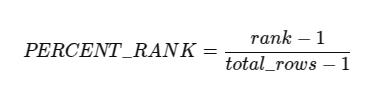

When analyzing data, percentiles help us understand the relative ranking of records within a dataset. In PostgreSQL, we can compute percentiles efficiently using the `PERCENT_RANK() OVER` window function. 

## Understanding Percentiles

The `PERCENT_RANK()` function calculates the relative rank of a row within a partitioned dataset. The formula used internally is:





This results in values ranging from 0.0 (for the lowest-ranked row) to 1.0 (for the highest-ranked row), providing a useful measure of distribution.

## Example Data Structure
Let's assume we have a simple posts table:

```sql
CREATE TABLE posts (
    id SERIAL PRIMARY KEY,
    title TEXT NOT NULL,
    body TEXT NOT NULL
);
```

And for each post we can have multiple comments:

```sql
CREATE TABLE comments (
    id SERIAL PRIMARY KEY,
    post_id INT NOT NULL,
    comment_text TEXT NOT NULL
);
```

And we have visits table, where we keep track of each post visits:

```sql
CREATE TABLE visits (
    id SERIAL PRIMARY KEY,
    post_id INT NOT NULL,
    visit_time TIMESTAMP DEFAULT now()
);
```

The goal is to find out each post performance based on the number of visits/comments compared to all other posts.

## Querying Percentiles

For that we can calculate two separate percentiles for each post:

1. Based on the number of comments
2. Based on the number of visits


### Visits Percentile
First, we need to calculate number of visits for each post:

```sql
SELECT post_id, COUNT(*) AS visit_count
    FROM visits
    GROUP BY post_id
```
Then we join it with the posts:

```sql
SELECT 
    p.id, 
    p.title,
    COALESCE(vc.visit_count, 0) AS visit_count,
    PERCENT_RANK() OVER (ORDER BY COALESCE(vc.visit_count, 0)) AS visit_percentile
FROM posts p
LEFT JOIN (
SELECT post_id, COUNT(*) AS visit_count
    FROM visits
    GROUP BY post_id
) vc ON p.id = vc.post_id
```

A few things to note here:

1. We use `LEFT JOIN` because some posts might not have visits yet, but we want them to be present in our performance report.
2. For the same reason we use `COALESCE(vc.visit_count, 0)` instead of `vc.visit_count` - we want zeros instead of `NULL` there.

The line which calculates the percentile:
```sql
PERCENT_RANK() OVER (ORDER BY COALESCE(vc.visit_count, 0)) AS visit_percentile
```

### Comments Percentile
To calculate percentile based on the number of comments follows the same pattern: calculate number of comments for each post, join them with posts, and use window function `PERCENT_RANK()` to get the percentiles.

```sql
SELECT post_id, COUNT(*) AS comment_count
    FROM comments
    GROUP BY post_id
```

We'll omit the intermediate query and show the final version which returns posts with both percentiles:

```sql
SELECT 
    p.id, 
    p.title,
    COALESCE(vc.visit_count, 0) AS visit_count,
    COALESCE(cc.comment_count, 0) AS comment_count,
    PERCENT_RANK() OVER (ORDER BY COALESCE(vc.visit_count, 0)) AS visit_percentile,
    PERCENT_RANK() OVER (ORDER BY COALESCE(cc.comment_count, 0)) AS comment_percentile,
FROM posts p
LEFT JOIN (
SELECT post_id, COUNT(*) AS visit_count
    FROM visits
    GROUP BY post_id
) vc ON p.id = vc.post_id
LEFT JOIN (
SELECT post_id, COUNT(*) AS comment_count
    FROM comments
    GROUP BY post_id
) cc ON p.id = cc.post_id
```

## Conclusion

By leveraging `PERCENT_RANK()`, we can easily determine how each post ranks relative to others based on different metrics. This approach is highly efficient and useful for analytics in PostgreSQL.