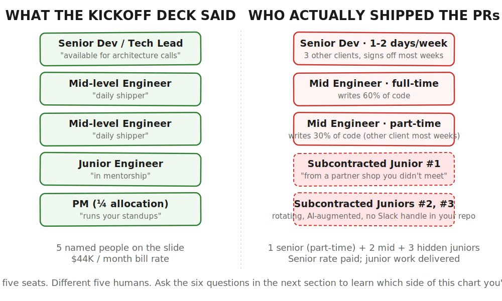
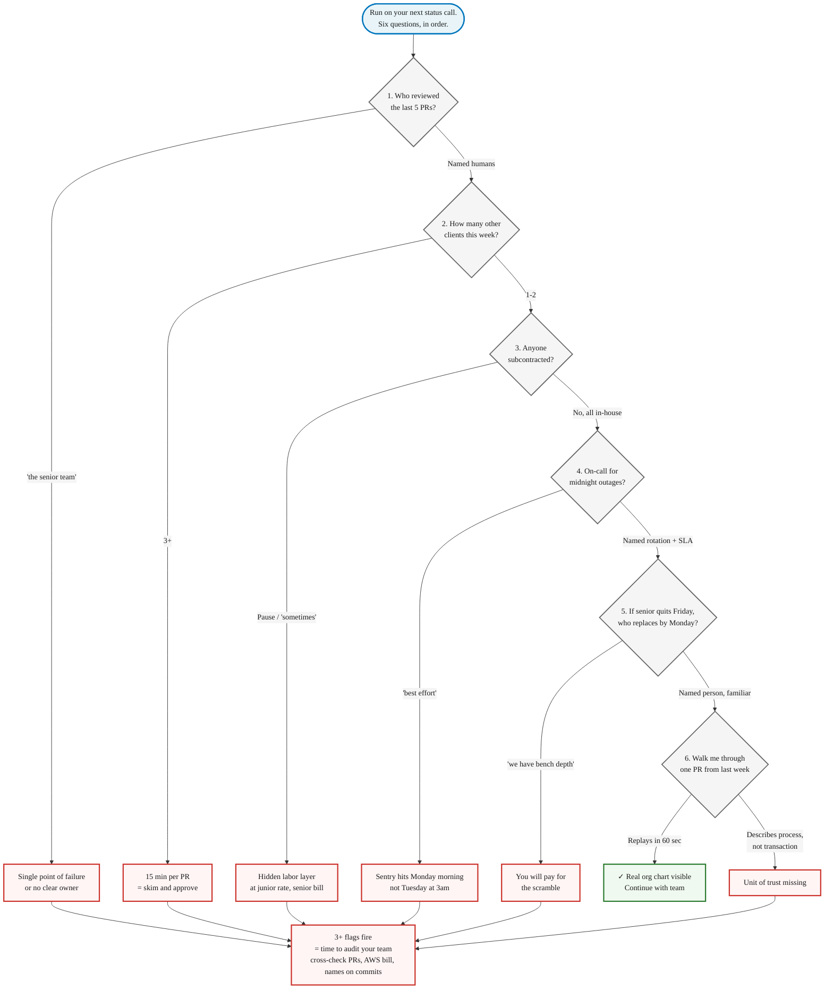

> **Module 5 · Step 1 of 6** · [Tech for Non-Technical Founders 2026](/blog/tech-for-non-technical-founders-2026/) free course.
> Input: a team in place + a signed SOW. Output: a weekly oversight rhythm running by month 3.

A FinTech founder we picked up in Q1 2026 had been billing **$44K a month for "a team of four."** Three months in, her new fractional CTO asked who had written the last twelve pull requests. The answer: one senior reviewer who signed off most weeks, two mid-level shippers, and three rotating juniors paid by a sub-contracted shop she had never heard of. She had been paying senior rates for code one junior wrote and another junior reviewed.

The agency had not lied, exactly. The kickoff deck just did not say which names touched the repo on which weeks, who reviewed whose pull requests, or who picked up the phone at 2am when production was down.

## Why this matters more in 2026

The vibe-coding wave made the org chart even fuzzier. Agencies that pitch "AI-augmented teams" route work through three layers: a senior who runs the demo, a mid-level who prompts Cursor or Claude Code, and a junior who reviews whatever falls out. The labor cost dropped; the bill rate did not. [TechTIQ Solutions' 2026 staff augmentation report](https://techtiqsolutions.com/it-staff-augmentation-cost-breakdown-and-pricing-models/) flags that hidden costs add 15-30% on top of base rates, with 10-18% already going to vendor margin. The shops we rescue in 2026 are charging the same and paying less, with the gap going to subcontracted juniors and AI tooling the founder never approved as a line item.

## The five-person team your shop pitched

The kickoff deck almost always shows a tidy stack. From the top:

- **One senior dev or "tech lead."** Usually the salesperson on calls. Strong on architecture conversations, weak on weekly availability. Their actual job is to win the next contract.
- **One or two mid-level engineers.** The daily shippers. They write most of the code that ends up in your repo and run the standup when the lead is busy on another pitch.
- **One or two juniors.** Often AI-augmented now. In a healthy shop they are paired with the mid-levels and grow into them. In an unhealthy shop they ship straight to your main branch with one rubber-stamp review.
- **A quarter of a project manager.** Shared across three or four projects. Their Slack is yours on Mondays and Wednesdays, gone the rest of the week.
- **A tenth of a CTO.** The founder of the agency, "available for escalation," which means available if you escalate loudly enough.

That is a 4.35-person team on the spreadsheet, billed as five. The Rails version works when the senior actually reviews - she catches the `before_action` that bypasses auth, the missing Sidekiq retry, the migration that locks the orders table. It collapses when the senior is on three other projects and the juniors are reviewing each other. [Our MVP team-structure note](/blog/our-mvp-team-structure-startup-management/) describes the alternative: two full-stack developers and one frontend, with a product owner in your meetings, not three others'.

## The questions that surface the real org chart

These six questions belong in your next status call. Ask them in this order. Watch which ones the team answers fast and which ones get a "let me get back to you."

**1. "Who specifically reviewed the last five pull requests on my repo? Name them."**

A healthy answer names two or three humans whose handles you can find in GitHub. A failing answer is a role ("the senior team"). One reviewer for all five means single point of failure; five different reviewers means no consistent owner. [Will Larson at Carta](https://review.firstround.com/unexpected-anti-patterns-for-engineering-leaders-lessons-from-stripe-uber-carta/) treats the pull request funnel as the load-bearing signal for engineering health. Founders should too.

**2. "How many other clients does that reviewer have this week?"**

A senior carrying three other projects gives your PRs about fifteen minutes each. That is enough to skim a diff and click approve. It is not enough to catch the auth regression or the N+1 query in the dashboard endpoint. JT's [60-day playbook for slow teams](/blog/fixing-slow-engineering-teams-an-extended/) starts by figuring out where the senior's attention actually is.

**3. "Is anyone on my project subcontracted - paid by you but employed elsewhere?"**

Ask flat. Watch the pause. [DataToBiz describes the practice plainly](https://www.datatobiz.com/blog/subcontracting-in-it-staff-augmentation/): the agency you signed with can route work through a partner shop you never met. Subcontracting is not automatically bad - the question is whether you knew. If your contract does not say "no subcontracting without written approval," it can happen and probably is.

**4. "Who is on-call if production breaks at midnight, and what is the handoff?"**

A shop with a real on-call rotation can tell you the schedule, the escalation path, and the SLA in under a minute. Without one, you get "best effort" coverage - which means your senior sees the Sentry email when she opens her laptop on Monday. [Team Coherence on code ownership and accountability](https://www.teamcoherence.com/code-ownership-and-accountability/) makes the point: ownership without a named person is not ownership. JT's [remote team accountability writeup](/blog/remote-team-accountability-non-technical-founders/) covers the same ground in plain English.

**5. "If your senior reviewer quits Friday, who replaces them on my project Monday?"**

A real answer names a person, their familiarity with your repo, and their existing client load. "We have bench depth" means the agency will scramble and you will pay for the scramble in slower velocity and missed reviews. This is the question covered in [our 15-minute engineering team health check](/blog/how-to-assess-engineering-team-health-15-minutes-non-technical-founder/).

**6. "Walk me through one PR from last week. Who wrote it, who reviewed it, what they checked."**

This catches what the first five missed. A team that ships well can replay a PR in a minute: "Marcos opened a 40-line change in the `OrdersController`, Priya pushed back on the missing test for the refund branch, Marcos added the test, she approved, CI went green, we merged at 3pm Wednesday." A team that does not ship well will describe a process instead of a transaction. JT's note on [small PRs as the unit of team productivity](/blog/how-small-pr-improves-team-productivity-development/) explains why the transaction is the trust signal; if your team cannot point at one, the unit does not exist.

## The Rails / Django / Laravel angle: small full-stack teams ship faster

[DHH wrote in 2022](https://world.hey.com/dhh/the-one-person-framework-711e6318) that Rails 7 had become a one-person framework: Hotwire, Stimulus, Turbo, and import maps in the default box mean one developer can ship a complete application. Basecamp has run as a [majestic monolith](https://signalvnoise.com/svn3/the-majestic-monolith/) since 2003 - around 100,000 lines, 420 screens, small team. The same logic applies to Django and Laravel. Two full-stack developers shipping a Django monolith move faster than five specialists arguing over service boundaries.

[Amazon's two-pizza team rule](https://aws.amazon.com/executive-insights/content/amazon-two-pizza-team/) is the same idea wearing different clothes. Bezos' implicit warning was that excessive cross-team communication is dysfunction, not progress. The Spotify squad model that tried to scale this up has aged badly: [Jason Yip's critique](https://jchyip.medium.com/my-critique-of-the-spotify-model-part-1-197d335ef7af) and the [broader agile community writeup](https://agilepainrelief.com/blog/the-spotify-model-of-scaling-spotify-doesnt-use-it-neither-should-you/) point out that Spotify itself does not run the Spotify model anymore. Agencies pitching squads, tribes, and chapters to a 12-month-old startup are selling structure for a problem you do not have yet.

For a pre-Series-A founder the right answer is the boring one: one Rails, Django, or Laravel monolith, two or three full-stack developers, one product owner in your meetings. JT's notes on [ideal startup team structure](/blog/ideal-tech-startup-team-structure-for-rapid-growth/) and [vetting engineers as a non-technical founder](/blog/how-vet-hire-engineers-as-non-technical-founder-startup-developers/) circle the same conclusion. Microservices, four squads, and a platform team exist because somebody wanted to build them, not because your product needed them.

## What to do tomorrow

Email your agency tonight. One line: "Please send me the current org chart with names, roles, and FTE allocation for everyone touching my code this month. Include any subcontracted resources." Forward the response to your fractional CTO or developer-friend - if you do not have one, [our note on fractional CTO ROI](/blog/fractional-cto-vs-full-time-cto-complete-comparison-2025/) explains the shape. Cross-check against [our dev-shop red flags checklist](/blog/dev-shop-red-flags-checklist/) and the [non-technical founder checklist](/blog/checklist-for-non-tech-founder-agile/). If the reply has fewer named humans than the kickoff deck promised, the deck was the pitch and the reply is the truth.

## When the org chart shows you've got a problem

If the answers came back vague, contradictory, or missing, that is the signal. The fix is putting numbers next to the names before the next agency conversation: how many PRs each reviewer touched last month, how many days the senior was actually on your project, which juniors shipped which features. Cross-reference the [eight red flags checklist](/blog/dev-shop-red-flags-checklist/) and the [15-minute team-health assessment](/blog/how-to-assess-engineering-team-health-15-minutes-non-technical-founder/) to know what good looks like.

## Continue the course

This is **Module 5 · Step 1 of 6** in the free [Tech for Non-Technical Founders 2026](/blog/tech-for-non-technical-founders-2026/) course - 8 modules from idea to first paying users.

| # | Module | Output you walk away with |
|---|---|---|
| 0 | Where Are You? | Self-assessment + your starting module |
| 1 | Validate the Problem | One-page validated problem statement |
| 2 | Design the Solution | One-page Product Brief (Vibe PRD) |
| 3 | Choose Your Build Path | Build decision: self-serve or hire |
| 4A | Ship Self-Serve (branch) | Live MVP at a staging URL |
| 4B | Hire & Ship (branch) | Signed SOW, kickoff scheduled |
| **5** | **Manage Your Build** ← you are here | **Weekly oversight rhythm** |
| 6 | When Things Break | Salvage / rebuild decision |
| 7 | Manage AI-Era Risks | AI interrogation system |

**In Module 5 · Manage Your Build**: 5.1 **The Org Chart Your Dev Shop Won't Draw** ← you are here · 5.2 The Friday Demo Rule · 5.3 Three Questions That Turn a Standup Into Proof · 5.4 The Plain-English Weekly Dev Report · 5.5 Who Owns Your GitHub, AWS, and Database? · 5.6 You Asked for a Simple Admin Panel; You Got a Spaceship.

The full course landing page (with all 11 artifacts) publishes after Module 5 ships. Until then, bookmark this post.

## Further reading

- DHH, [The One Person Framework](https://world.hey.com/dhh/the-one-person-framework-711e6318) - the Rails case for shipping with a small team.
- DHH, [The Majestic Monolith](https://signalvnoise.com/svn3/the-majestic-monolith/) - why Basecamp ran on one codebase since 2003.
- AWS Executive Insights, [Amazon's Two-Pizza Teams](https://aws.amazon.com/executive-insights/content/amazon-two-pizza-team/) - Bezos' rule on team size and what it actually optimised for.
- Jason Yip, [My critique of "the Spotify Model"](https://jchyip.medium.com/my-critique-of-the-spotify-model-part-1-197d335ef7af) - an ex-Spotify coach explaining what the model is and is not.
- Agile Pain Relief, [The Spotify Model of Scaling - Spotify doesn't use it, neither should you](https://agilepainrelief.com/blog/the-spotify-model-of-scaling-spotify-doesnt-use-it-neither-should-you/) - the broader agile-community position on cargo-culted squad structures.
- Will Larson (interviewed by First Round Review), [Engineering leadership anti-patterns from Stripe, Uber, Carta](https://review.firstround.com/unexpected-anti-patterns-for-engineering-leaders-lessons-from-stripe-uber-carta/) - on review processes and the PR funnel as the productivity signal.
- TechTIQ Solutions, [IT Staff Augmentation Cost Breakdown 2026](https://techtiqsolutions.com/it-staff-augmentation-cost-breakdown-and-pricing-models/) - hidden costs of staff-augmented teams.
- DataToBiz, [The Strategic Advantage of Subcontracting in IT Staff Augmentation](https://www.datatobiz.com/blog/subcontracting-in-it-staff-augmentation/) - plain description of the subcontracting layers founders rarely see.
