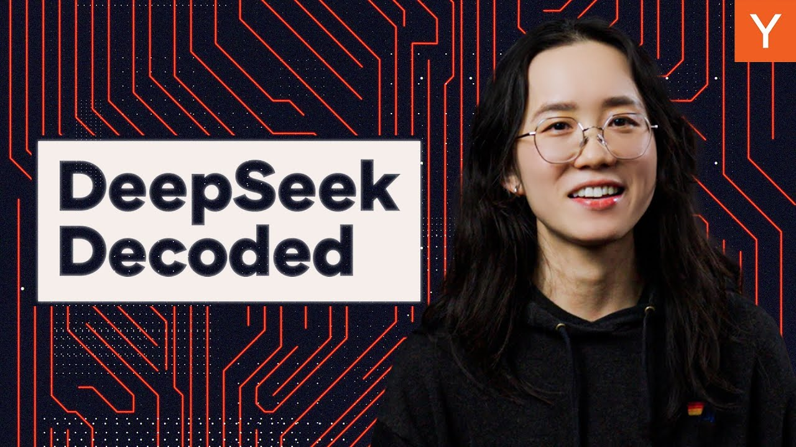

DeepSeek, a Chinese AI company, recently announced R1, an open-source reasoning model. They claim it performs like OpenAI's o1 but costs much less. This news caused a stir, even affecting stock markets. But for those watching AI, DeepSeek and R1 are not new. The company has shared its research and models for months, like Meta's Llama.

## DeepSeek's Models: V3 and R1

It is important to know about two models: DeepSeek R1 and DeepSeek V3. DeepSeek V3 came out in December. It is a general model that works as well as other models like OpenAI's GPT-4o. DeepSeek R1 came out in January. It is a reasoning model built on DeepSeek V3. DeepSeek improved V3 to make R1 better at reasoning. R1 performs like OpenAI's o1 on some complex tasks.

Many ideas for R1's performance were in V3's paper from December, or even V2's paper from May 2024. V3 combines these ideas. They focus on compute and training efficiency.

## Efficiency and Hardware

DeepSeek made V3 efficient by training it in 8-bit floating point format. This saves memory without losing performance. Their FP8 accumulation fix helps prevent small errors. This makes training across many GPUs more efficient. It cuts costs and keeps model quality.

Efficiency matters because of hardware limits and US export controls on GPUs to China. DeepSeek needed to get more from their GPUs. GPUs are often idle. At FP8, GPUs are only used about 35% of the time. The rest of the time, they wait for data. Nvidia's advantage is its integrated system, including networking and software. This lets AI researchers use GPU clusters like one big GPU.

DeepSeek also uses a mixture of experts architecture. DeepSeek V3 has 671 billion parameters, but only 37 billion are active for each token. This saves a lot of computation. Mixture of experts is not new, but training models with it has been hard. DeepSeek found ways to make it stable and use GPUs better.

V3 also uses multi-head latent attention (MLA). DeepSeek showed MLA in their V2 paper. MLA solves KV cache storage limits. It compresses key and value matrices. This reduced KV cache size by 93.3% and boosted throughput by 5.76 times.

Finally, V3 uses multi-token prediction (MTP). MTP lets V3 guess many future tokens at once. This makes training signals stronger and learning faster. It also helps the model plan sequences for smoother outputs. MTP modules can also speed up generation.

## The Secret Sauce: Reasoning Models

Most large language models (LLMs) get better by thinking step-by-step. Reasoning models are trained to break down hard problems. OpenAI showed this with o1. DeepSeek used a similar method for R1. They use reinforcement learning (RL) to shape the LLM's behavior. Modern LLMs use RL with human feedback (RLHF) or AI feedback (RLAIF). Reasoning models use RL to think step-by-step through problems.

DeepSeek used RL to make a reasoning model. They gathered problems with correct answers, especially in math and coding. They designed a training process to make the model think and give correct answers. They did not give the model examples of how to think. The grading was simple. They used simple rules to check the model's output for accuracy. They used these scores to update the model with a new method called Group Relative Policy Optimization (GRPO).

With this, DeepSeek saw reasoning appear. The model learned skills like extended Chain of Thought. It even recognized its own mistakes. This model was R1-0. It was one of the first large models to get top results only through RL. Pure RL has been studied in labs like DeepMind. OpenAI also used RL for a robotics hand and competitive gaming.

R1-0's thinking steps were hard to read. They switched between English and Chinese. DeepSeek added a fine-tuning phase on structured reasoning examples before RL. This fixed the language mixing and made outputs clearer. R1 performs like o1 on some math and coding tasks.

## Why the Hype?

The pace of innovation is fast. Two weeks after R1, OpenAI released o3-Mei, which performs better than R1 and o1.

So, why the hype for R1? One reason is DeepSeek's model is easy to get. R1 is free on their website and app. You can download it and use it locally. It also costs less to run than other reasoning models. Another reason for the hype was wrong ideas about V3's training cost. The $5.5 million figure is only for V3's final training run. It does not include R1's training or other costs. Given the optimizations, $5.5 million for training seems possible. This work is also reproducible. A UC Berkeley lab used R1-0's methods to make complex reasoning in a smaller model for just $30.

DeepSeek shows there is still room for new players in AI. There is room to rebuild the stack, optimize GPU work, improve software, and develop AI-generated kernels. This is good for AI applications. It means the cost of intelligence keeps going down.

### Key Takeaways

*   DeepSeek's R1 model offers strong performance at a lower cost.
*   Efficiency in training and hardware use is key to DeepSeek's success.
*   Reinforcement learning is a powerful tool for developing reasoning models.
*   The accessibility and cost-effectiveness of DeepSeek's models contribute to their impact.
*   Innovation in AI continues at a rapid pace, creating new opportunities.