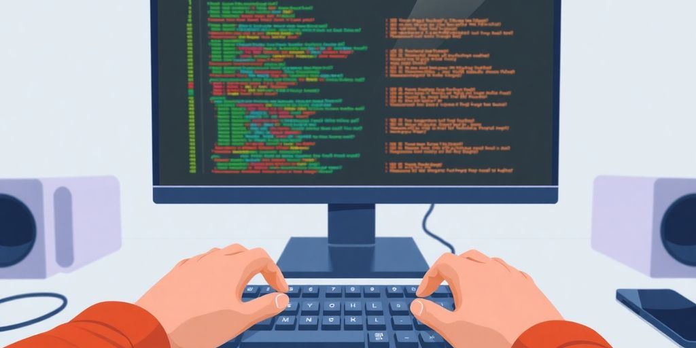

So, you want to be a top-tier front end designer? That's a great goal! This job is all about making websites and apps look good and work well for people. It's a mix of art and code, where you take designs and turn them into something interactive that users can actually click and enjoy. This guide will walk you through what a front end designer does, the skills you'll need, and how to get started in this exciting field. We'll cover everything from the basic tools to getting your first job, helping you become a really good front end designer.

### Key Takeaways

*   A front end designer builds the parts of a website or app that users see and interact with.
*   Learning HTML, CSS, and JavaScript is a must for anyone wanting to be a front end designer.
*   Understanding how to make websites work on different devices is a big part of the job.
*   Knowing about things like Git for code control helps a lot in teamwork.
*   Making sure websites load fast and are easy for everyone to use is really important.
*   There are many tools and frameworks that help front end designers do their work better.
*   Building a good collection of your work is key to getting hired.
*   The front end world changes often, so always learning new things is a good idea for a front end designer.

## What Exactly Does a Front End Designer Do?

### Bringing Designs to Life

Front end designers take visual ideas and make them real. You get a picture or a sketch. Then, you write code to build that picture on a screen. It is like being a digital architect. You build the _structure_ users see and touch. This means turning static images into dynamic web pages. You make sure everything looks just right.

### Making Websites Interactive

Websites are not just pretty pictures. They need to do things. Users click buttons, fill out forms, and scroll through content. A front end designer makes these actions happen. You add the code that responds to user input. This makes the website feel alive. It is about creating a conversation between the user and the site.

### The User's Best Friend

Your main goal is to make things easy for the user. You think about how people will use the site. Is it simple to find information? Can they complete tasks without trouble? You are the advocate for the user. You ensure the site is clear and intuitive. A good user experience means happy users.

### Bridging Design and Code

Front end designers sit between two worlds. One world is visual design. The other is computer code. You understand both. You can talk to graphic designers about colors and layouts. You can also talk to developers about programming logic. You translate design concepts into functional code. This makes you a vital link in any project.

### Crafting Digital Experiences

Think about every website you visit. Each one offers an experience. Some are smooth and enjoyable. Others are frustrating. You craft these experiences. You decide how elements appear and behave. You control the flow of information. Your work shapes how people feel when they use a website.

### Ensuring Smooth User Journeys

Users follow paths on a website. They might go from a homepage to a product page. Then they might go to a checkout page. You make sure these paths are smooth. There should be no bumps or dead ends. You guide the user through the site. This makes their journey easy and efficient. You want them to reach their goal without hassle.

### Building the Visible Web

When you open a web browser, you see the front end. This is your domain. You build everything visible. This includes text, images, buttons, and menus. You are responsible for the entire visual layer. Without you, the web would just be data. You give it form and function. [A Front End Developer](https://ca.indeed.com/hire/job-description/front-end-developer) builds the parts of a website users interact with.

### From Concept to Click

Your work starts with an idea. It ends with a user clicking something. You take that initial concept. You then turn it into a working part of the web. This involves many steps. You plan, code, and test. You see the project through from start to finish. It is a rewarding process. You bring ideas to life, one click at a time.

## Must-Have Skills for a Stellar Front End Designer

Becoming a top front end designer means you need a good set of skills. It's more than just knowing a few coding languages. You need to understand how users interact with websites. You also need to make sure your creations work well for everyone.

### Mastering HTML, CSS, and JavaScript

These three are the _foundation_ of all front end work. HTML gives your web pages structure. CSS makes them look good. JavaScript adds all the interactive parts. You need to know these inside and out. Think of them as your main tools. Without them, you can't build anything.

### Understanding Responsive Design

People use all kinds of devices to view websites. Phones, tablets, laptops – you name it. Your designs must look good and work well on every screen size. This is what responsive design is all about. It means your website adapts to the user's device. **A good front end designer makes sure their work looks great everywhere.**

### Diving into Front End Frameworks

Frameworks are like pre-built toolkits. They help you build websites faster and more efficiently. React, Angular, and Vue.js are popular ones. Learning at least one of these is a smart move. They simplify complex tasks and help you organize your code.

### Version Control with Git

Imagine working on a project with a team. How do you keep track of everyone's changes? That's where Git comes in. It's a system that tracks changes to your code. It lets multiple people work on the same project without problems. Git also lets you go back to older versions of your code if something goes wrong. It's a must for any serious developer. You can find developers for your startup who are already proficient in Git.

### Debugging Like a Pro

Code rarely works perfectly the first time. You will make mistakes. Debugging is the process of finding and fixing those mistakes. It's like being a detective for your code. You need to be patient and methodical. Good debugging skills save you a lot of time and frustration.

### Performance Optimization Know-How

No one likes a slow website. Users expect pages to load quickly. Performance optimization means making your website fast. This involves things like:

*   Making images smaller.
*   Reducing the amount of code.
*   Using efficient loading techniques.

Fast websites keep users happy. They also rank better in search engines.

### Accessibility Matters

Websites should be usable by everyone. This includes people with disabilities. Accessibility means designing and building websites so they are easy to use for all. This might involve:

*   Using clear text.
*   Providing keyboard navigation.
*   Ensuring good color contrast.

It's not just a good idea; it's often a legal requirement.

### Cross-Browser Compatibility

Websites need to work the same way in different web browsers. Chrome, Firefox, Safari, Edge – they all interpret code slightly differently. You need to test your work across these browsers. This ensures a consistent experience for all users. It can be tricky, but it's a vital part of the job.

## Getting Cozy with Core Front End Technologies

## Picking Your Front End Framework Playground

## Making Your Designs Look Awesome with CSS

CSS is how you make your web pages look good. It controls colors, fonts, spacing, and how elements are placed. Mastering CSS means your designs will stand out. You will learn to make layouts that adapt to any screen. This section covers the key parts of CSS.

### Flexbox for Layout Mastery

Flexbox helps you arrange items in a container. It is great for one-dimensional layouts. Think of rows or columns. You can align items, distribute space, and control their order. It makes building navigation bars or card layouts simple. **Flexbox simplifies complex alignment tasks.**

### Grid for Two-Dimensional Layouts

CSS Grid is for two-dimensional layouts. It handles both rows and columns at once. You can create complex page structures. Imagine a magazine layout. Grid lets you place items precisely. It is powerful for overall page design. [CSS for styling](https://www.weweb.io/blog/front-end-design-guide) is a core skill.

### CSS Preprocessors: Sass and Less

Preprocessors extend CSS. They add features like variables, nesting, and mixins. Sass and Less are popular choices. They make CSS more organized and reusable. This saves time and reduces errors. You write less code with preprocessors.

### CSS-in-JS: Styling with JavaScript

CSS-in-JS lets you write CSS directly in your JavaScript code. This is common in component-based frameworks. It keeps styles tied to their components. This can make managing styles easier for large applications. It offers dynamic styling options.

### Animations and Transitions

Animations and transitions add movement to your designs. Transitions create smooth changes between states. Animations allow for more complex sequences. They make user interfaces more engaging. Use them to guide user attention or provide feedback.

### Responsive Design Techniques

Responsive design means your website looks good on any device. This involves using flexible units and media queries. Your layout adjusts based on screen size. This ensures a consistent user experience. _Mobile-first_ is a common approach here.

### Typography on the Web

Typography is about how text looks. This includes font choice, size, line height, and spacing. Good typography makes text readable and appealing. It impacts the overall feel of your design. Choose fonts that match your brand.

### Color Theory for Designers

Color theory guides your color choices. It helps you create harmonious palettes. Colors evoke emotions and convey meaning. Understanding color relationships is key. It ensures your designs are visually balanced and effective.

## Unlocking Interactivity with JavaScript

## Building Responsive Designs for Every Device

Making your websites look good on any device is a big deal. People use phones, tablets, and huge desktop screens. Your site needs to adapt. If it doesn't, users will leave. This section covers how to make your designs flexible.

### Mobile-First Approach

Start designing for the smallest screens first. This is the _mobile-first_ approach. It forces you to focus on core content and functionality. You add more complex layouts and features for larger screens. This method often leads to better performance on mobile devices. It also helps you prioritize content.

Here's why mobile-first works:

*   It simplifies design decisions early on.
*   It improves loading times for mobile users.
*   It makes you think about essential elements.

### Media Queries Explained

Media queries are CSS rules. They apply styles based on device characteristics. These include screen width, height, and orientation. You can change layouts, font sizes, and image displays. This lets your design adapt to different screen sizes.

    @media (max-width: 600px) {
      .container {
        flex-direction: column;
      }
    }
    

This code snippet shows a basic media query. It changes the flex direction for screens up to 600 pixels wide.

### Fluid Grids and Images

Fluid grids use relative units like percentages. This makes layouts stretch or shrink with the screen. Images should also be fluid. Set their `max-width` to 100%. This prevents them from overflowing their containers. **Fluid designs ensure your content scales proportionally.**

> Using fixed pixel values for layouts and images can break your design on smaller screens. Embrace flexibility to avoid layout issues.

### Viewport Units

Viewport units relate to the browser window's size. `vw` (viewport width) and `vh` (viewport height) are common. `1vw` is 1% of the viewport width. `1vh` is 1% of the viewport height. These units are great for typography and spacing. They help elements scale with the screen. You can use them for responsive typography.

### Relative Units vs. Absolute Units

Relative units (like `em`, `rem`, `%`) are better for responsive design. They scale based on other elements or the viewport. Absolute units (like `px`, `pt`) are fixed. They do not change size. Use relative units for text, padding, and margins. This makes your design more adaptable. For example, `font-size: 1.2rem` adjusts based on the root font size.

### Testing Across Devices

You must test your designs on many devices. Use browser developer tools. They have device emulation modes. Also, test on actual phones and tablets. This helps you catch layout issues. Different browsers and operating systems can display things differently. [Cross-browser testing](https://developer.mozilla.org/en-US/docs/Learn_web_development/Core/CSS_layout/Responsive_Design) is important.

### Performance on Mobile

Mobile users often have slower connections. Optimize images. Minimize code. Use lazy loading for off-screen content. Fast loading times keep users engaged. A slow mobile site means users leave quickly. Performance is a key part of the user experience.

### Accessibility for All Screen Sizes

Responsive design also means accessibility. Ensure keyboard navigation works on all screen sizes. Text should be readable. Buttons should be large enough for touch. Consider users with different needs. An accessible site serves everyone.

## Optimizing Performance: Making Your Site Fly

Making your website fast is a big deal. Nobody likes a slow site. Think of it like waiting in a long line at the grocery store. You just want to get in and out. Your users feel the same way about your website. A fast site keeps people happy and coming back. It also helps with search engine rankings. So, let's make your site _zoom_.

### Image Optimization Techniques

Big images slow things down. It's like trying to carry a huge suitcase when you only need a small bag. You want to make your images as small as possible without losing quality. This means using the right file format. JPEG is good for photos. PNG works for graphics with transparency. SVG is great for logos and icons. You can also compress images. Tools exist that shrink file size. **Always resize images to their display dimensions.** Don't load a 4000px wide image if it only shows up as 400px.

### Minification and Bundling

Think of your code like a messy room. Minification cleans it up. It removes extra spaces, comments, and shortens variable names. This makes the file size smaller. Bundling is like putting all your clean clothes into one drawer. It combines multiple JavaScript files or CSS files into one. This means the browser makes fewer requests to your server. Fewer requests mean faster loading.

### Lazy Loading Assets

Imagine you're reading a book. You don't need to see every page at once. You only need the page you're on. Lazy loading works the same way for your website. It only loads images or videos when they are about to appear on the screen. This saves bandwidth and speeds up initial page load. It's especially good for long pages with lots of media.

### Browser Caching Strategies

Browsers are smart. They can remember things. When a user visits your site, their browser can store copies of certain files, like your CSS or JavaScript. This is called caching. The next time they visit, the browser doesn't have to download those files again. This makes repeat visits super fast. You tell the browser how long to keep these files. It's like giving them a temporary memory.

### Critical CSS and JavaScript

When a page loads, the browser needs some CSS and JavaScript right away to show the top part of your site. This is called the "above the fold" content. Critical CSS and JavaScript are the bare minimum needed for that first view. You put this small amount of code directly into your HTML. This way, the browser doesn't have to wait to download external files. It renders the visible part of the page quickly. The rest of the code can load later.

### Web Font Optimization

Custom fonts look nice, but they can be heavy. Each font file is another download. You can optimize them. Only load the font weights and styles you actually use. For example, if you only use regular and bold, don't load italic. You can also use font display properties. This tells the browser how to handle the font while it's loading. Sometimes, a system font shows first, then your custom font swaps in. This prevents a blank page while waiting for fonts.

### Measuring Performance with Tools

How do you know if your site is fast? You measure it! Tools like Lighthouse, PageSpeed Insights, and WebPageTest help you. They give you scores and tell you what's slowing things down. They point out specific issues. These tools are like a doctor for your website. They diagnose problems and suggest fixes. Use them often to track your progress.

### Reducing HTTP Requests

Every time your browser asks for a file (an image, a CSS file, a JavaScript file), that's an HTTP request. More requests mean more time. You want to keep these requests low. Bundling files helps. Using CSS sprites for small icons also helps. A CSS sprite combines many small images into one big image. Then, CSS shows only the part of the image you need. This reduces the number of image requests. You can also use [managed hosting for WordPress](https://sematext.com/blog/improve-website-performance/) to improve server response times, which indirectly reduces the perceived time for HTTP requests.

## Ensuring Accessibility for Everyone

## Version Control: Your Code's Safety Net

Imagine you are building a complex LEGO castle. You add a tower, then a wall, then a drawbridge. What if you decide the tower is too tall? Or the wall is in the wrong spot? Without a way to undo your steps, you might have to tear down the whole castle and start over. That is where version control comes in for your code. It is like having a magic undo button for every change you make. It also lets you work with others without stepping on their toes. **Version control systems track every change to your code.** This means you can always go back to an earlier version if something breaks. It also makes teamwork much easier. You can see who changed what and when. This prevents chaos when multiple people work on the same project.

### Git Basics: Commit, Push, Pull

Git is the most popular version control system. Think of it as your code's personal diary. When you make changes, you _commit_ them. This saves a snapshot of your code at that moment. It is like taking a photo of your LEGO castle at different stages. Then, you _push_ your changes to a central place, like GitHub. This shares your work with your team. When others make changes, you _pull_ them down to your computer. This updates your local code with their work. It keeps everyone on the same page.

### Branching and Merging Strategies

Branches are like parallel universes for your code. You can create a new branch to work on a new feature without messing up the main project. It is like building a new section of your LEGO castle on a separate table. Once your new feature is ready, you _merge_ your branch back into the main code. This combines your changes with the main project. It is a powerful way to manage different tasks at once.

### Resolving Merge Conflicts

Sometimes, two people change the same part of the code. When you try to merge these changes, Git gets confused. This is a _merge conflict_. It is like two people trying to put different LEGO bricks in the same spot. You need to tell Git which change to keep. This involves looking at the conflicting code and deciding what the final version should be. It takes practice, but it is a normal part of teamwork. To minimize conflicts, regularly sync feature branches with the main branch. Resolve conflicts locally before pushing, and involve relevant team members for complex conflict resolution.

### Using GitHub/GitLab/Bitbucket

These are online platforms that host your Git repositories. Think of them as cloud storage for your code. They provide a central place for teams to collaborate. They also offer tools for code reviews, issue tracking, and project management. GitHub is very popular. GitLab and Bitbucket are also good options. They all help you manage your code and work with others.

### Collaborating with Teams

Version control makes team collaboration smooth. Everyone works on their own branch. They push their changes to the central repository. Then, they pull down updates from others. This ensures everyone has the latest code. It also makes it easy to see who did what. This transparency helps teams work together effectively.

### Reverting Changes

Made a mistake? No problem. Git lets you revert to an earlier commit. It is like going back in time to an older version of your code. This is a lifesaver when you introduce a bug or break something. You can undo bad changes quickly. This saves a lot of time and stress.

### Understanding .gitignore

Not all files belong in your version control. Some files are temporary. Others contain sensitive information. The `.gitignore` file tells Git which files to ignore. It is like telling Git, "Don't track these files." This keeps your repository clean. It also prevents you from accidentally sharing private data.

### Git Workflow Best Practices

Following a good Git workflow helps teams stay organized. Here are some common practices:

*   **Feature Branches:** Create a new branch for each new feature or bug fix.
*   **Small Commits:** Make frequent, small commits with clear messages. Each commit should represent a single logical change.
*   **Regular Pulls:** Pull changes from the main branch often to stay updated.
*   **Code Reviews:** Have teammates review your code before merging. This catches errors and improves code quality.
*   **Descriptive Commit Messages:** Write clear and concise commit messages. They should explain _what_ changed and _why_.

| Practice | Benefit |
| --- | --- |
| Feature Branches | Isolates work, prevents conflicts |
| Small Commits | Easier to track changes, revert if needed |
| Regular Pulls | Stays updated, reduces merge conflicts |
| Code Reviews | Improves code quality, catches bugs |
| Descriptive Messages | Provides clear history, aids debugging |

## Testing Your Code: Catching Bugs Early

## Mastering the Front End Designer Workflow

### Setting Up Your Development Environment

Getting your workspace ready is the first step. You need the right tools. This means picking a good code editor. It also means installing necessary software. Think about your operating system. Make sure everything works together. **A well-set-up environment saves time later.**

### Using Browser Developer Tools

Your browser has powerful tools built in. You can inspect elements. You can see how CSS applies. You can debug JavaScript. These tools help you understand what your code does. They show you errors. They help you fix problems quickly. Learn to use them well.

### Debugging Techniques

Bugs happen. Knowing how to find them is key. Use breakpoints in your code. Look at console messages. Understand error types. Is it a syntax error? A logic error? Practice makes you better at this. _Effective debugging_ speeds up your work.

### Code Editors and IDEs

Choosing your editor is a personal choice. Some are simple text editors. Others are full Integrated Development Environments (IDEs). They offer features like code completion. They can highlight syntax. They help you organize your files. Pick one that fits your style. Learn its shortcuts.

### Command Line Interface (CLI) Skills

The command line is a powerful tool. You can run scripts. You can manage files. You can install packages. It might seem scary at first. But basic commands are easy to learn. Many front end tasks use the CLI. It makes you more efficient.

### Project Management Tools

Keeping track of tasks is important. Tools help you organize your work. They let you set deadlines. You can track progress. They help you collaborate with others. This keeps projects on schedule. It makes sure nothing gets missed.

### Collaboration Best Practices

Working with a team needs good communication. Use version control. Share your progress often. Give clear feedback. Be open to feedback yourself. A good team works together smoothly. This leads to better projects.

### Staying Organized and Efficient

Good habits make a difference. Keep your files tidy. Name things clearly. Break down big tasks into smaller ones. Take breaks. Review your own code. These practices help you work smarter. They prevent burnout. They make you a better designer. A strong [front-end development workflow](https://onix-systems.com/blog/front-end-development-process) helps you stay on track.

## Staying Current in the Ever-Evolving Front End World

The front end world moves fast. New tools and methods pop up all the time. To stay good at your job, you need to keep learning. It is not a one-time thing. It is a constant effort. You must adapt to new trends. This helps you stay relevant and effective.

### Following Industry Blogs and Newsletters

Reading blogs and newsletters keeps you informed. Many experts share their knowledge this way. You can learn about new technologies and best practices. **Find a few good sources and check them often.** This helps you see what is new. It also shows you what others are doing.

### Attending Conferences and Meetups

Conferences and meetups are great for learning. You hear from leaders in the field. You also meet other designers. This helps you build your _network_. You can share ideas and get advice. Many events offer workshops too. These give you hands-on experience.

### Online Courses and Tutorials

Online courses offer structured learning. They cover specific topics in depth. Tutorials give you quick guides for new skills. You can learn at your own pace. Many platforms offer free and paid options. Pick ones that fit your learning style.

### Experimenting with New Technologies

Try out new tools and frameworks. Do not just read about them. Build small projects. This helps you understand how they work. It also shows you their limits. Hands-on practice makes new concepts stick.

### Contributing to Open Source

Working on open source projects is a good way to learn. You see how others code. You also get feedback on your work. It is a chance to help the community. This can also boost your portfolio. It shows you can work with a team.

### Networking with Other Developers

Connect with other front end developers. Join online groups or local meetups. Share your experiences. Ask questions. Offer help when you can. Building relationships can lead to new opportunities. It also provides support when you face challenges.

### Reading Documentation

Documentation is your friend. When you use a new tool, read its docs. They explain how it works. They also show examples. This saves you time. It helps you use tools correctly. Good documentation is a sign of a good tool.

### Continuous Learning Mindset

> Always be ready to learn. The front end world changes fast. What is new today might be old tomorrow. Embrace new challenges. See mistakes as chances to grow. This mindset helps you stay sharp. It keeps you excited about your work. It also helps you adapt to new demands. This is key for long-term success in web development. For more on how Ruby can integrate with modern front end tools, explore Ruby web development.

## Building Your Killer Front End Designer Portfolio

### Showcasing Your Best Projects

Your portfolio is your chance to show what you can do. Don't just list projects. _Show_ them. Pick your strongest work. These are the projects that make you proud. They should highlight your skills. Think about what makes each project special. Did you solve a hard problem? Did you use a new technology? Make sure each project has a clear purpose. Explain your role in it. What did you build? Why did you build it that way? **A good portfolio tells a story about your work.**

### Highlighting Your Skills

Your portfolio needs to scream "I have these skills!" Don't just say you know HTML, CSS, and JavaScript. Show it. Did you build a responsive layout with Flexbox? Point it out. Did you make a cool animation with CSS? Show the code. If you used a framework like React, make sure that's clear. Every project should demonstrate specific abilities. Think about the skills a company wants. Then, show them you have those skills. You can even have a dedicated section for your skills. List them out. Maybe even rate your comfort level.

### Explaining Your Process

It's not just about the final product. Companies want to see how you think. Explain your design process. How did you start? What challenges did you face? How did you overcome them? Did you sketch ideas first? Did you get feedback? Did you iterate? This shows you can think critically. It shows you can solve problems. It also shows you can work through a project from start to finish. This is important for [modern software projects](https://jetthoughts.com/blog/essential-development-best-practices-for-modern/).

### Including Live Demos

Static screenshots are okay. Live demos are better. If your project is a website, host it. Give people a link to click. Let them interact with your work. This is especially true for interactive elements. If you built a cool JavaScript game, let them play it. If you designed a complex form, let them fill it out. This makes your portfolio come alive. It shows your work actually works. It also shows attention to detail.

### Adding a Personal Touch

Your portfolio is also about you. Let your personality shine through. What are your interests? What drives you? This can be subtle. Maybe it's in your writing style. Maybe it's in the design of your portfolio site itself. A personal touch makes you memorable. It helps you stand out from others. It shows you are a real person. Not just a code machine.

### Getting Feedback on Your Portfolio

Don't launch your portfolio without feedback. Show it to friends. Show it to other designers. Ask for honest opinions. Is it easy to navigate? Is the content clear? Does it showcase your best work? Fresh eyes can spot things you missed. They can give you ideas for improvement. Take their suggestions seriously. Then, make changes. This makes your portfolio stronger.

### Tailoring for Specific Jobs

One size does not fit all. When applying for a job, tailor your portfolio. Look at the job description. What skills do they want? What kind of projects do they do? Then, highlight the projects in your portfolio that match. You might even reorder your projects. Put the most relevant ones first. This shows you did your homework. It shows you are serious about _that_ job. It makes you a better fit.

### Beyond Just Code: Design Thinking

Front end design is more than just code. It's about design thinking. Can you understand user needs? Can you create intuitive interfaces? Can you solve user problems? Your portfolio should show this. Talk about the user experience. Explain your design choices. Why did you pick that color? Why is that button there? This shows you think about the user. It shows you are a well-rounded designer.

## Nailing the Front End Designer Interview

Interviews can feel like a big test. But with good preparation, you can show your best self. Think of it as a chance to talk about what you know and what you can do.

### Preparing for Technical Questions

Technical questions are a big part of front end interviews. You will get questions about HTML, CSS, and JavaScript. You might also get questions about frameworks like React or Angular. Practice coding problems. Understand data structures and algorithms. Be ready to explain your thought process. **Show how you solve problems, not just the answer.**

### Behavioral Interview Tips

Behavioral questions check how you work with others. They also check how you handle tough situations. Think about past experiences. Use the STAR method: Situation, Task, Action, Result. Tell a clear story. Show your communication skills. Be honest and confident.

### Whiteboard Coding Challenges

Whiteboard challenges test your coding skills live. You write code on a whiteboard or shared document. This is not about perfect syntax. It is about your logic and problem-solving. Talk through your steps. Ask clarifying questions. Think out loud. This helps the interviewer see how you approach problems.

### Portfolio Presentation Strategies

Your portfolio is your visual resume. Pick your best projects. Explain your role in each project. Talk about the challenges you faced and how you solved them. Show live demos if you can. Highlight your design choices and technical decisions. Make it easy for them to see your _skills_.

### Asking Smart Questions

At the end of an interview, you get to ask questions. This is your chance to learn about the company and the role. Ask about the team, the work culture, or future projects. This shows your interest and engagement. It also helps you decide if the job is a good fit for you.

### Demonstrating Problem-Solving Skills

Interviewers want to see how you think. When you get a problem, break it down. Explain your approach. Consider different solutions. Talk about trade-offs. Even if you do not know the answer, show your process. This is often more important than getting the right answer.

### Showcasing Your Passion

Your passion for front end design can set you apart. Talk about side projects. Mention new technologies you are learning. Discuss articles or books you have read. Show that you love what you do. This enthusiasm is contagious.

### Follow-Up Etiquette

After the interview, send a thank-you note. Do this within 24 hours. Reiterate your interest in the role. Mention something specific from your conversation. This shows professionalism and attention to detail. It leaves a good final impression. For businesses looking to hire, choosing the right [frontend development agency](https://jetthoughts.com/blog/choosing-right-frontend-development-agency-for/) can make a big difference in finding passionate candidates.

## Landing Your Dream Front End Designer Gig

### Crafting an Awesome Resume

Your resume is your first impression. Make it count. Keep it clear and concise. Highlight your relevant skills and projects. Use action verbs. Quantify your achievements when possible. **A strong resume opens doors to interviews.**

### Leveraging LinkedIn and Job Boards

LinkedIn is a powerful tool. Optimize your profile. Connect with recruiters and other designers. Share your work. Job boards like Indeed and Glassdoor are also good. Set up alerts for new postings. Check them often.

### Networking for Opportunities

Networking helps you find jobs. Attend local meetups. Go to online events. Talk to people in the industry. You never know who might have a lead. _Personal connections_ often lead to hidden opportunities.

### Freelancing vs. Full-Time

Consider both options. Freelancing offers flexibility. Full-time jobs provide stability. Think about your lifestyle and goals. Both paths have pros and cons. Many designers start freelancing to build experience.

### Negotiating Your Salary

Do your research before you negotiate. Know your worth. Be confident. Practice your pitch. Don't be afraid to ask for more. The worst they can say is no. A good negotiation can mean thousands more per year.

### Understanding Company Culture

Company culture matters. It affects your daily work. Research the company. Read reviews. Ask questions during interviews. A good fit makes you happier and more productive. You want to enjoy where you work.

### Preparing for Onboarding

Onboarding is your first few weeks. Be ready to learn. Ask questions. Meet your team. Understand expectations. A smooth onboarding sets you up for success. It helps you integrate quickly.

### Continuous Professional Development

The front end world changes fast. Keep learning new things. Read articles. Take courses. Experiment with new tools. Stay curious. This keeps your skills sharp. It also makes you more valuable. [Formal education](https://www.indeed.com/career-advice/career-development/how-to-become-a-front-end-web-developer) can also help you stay current.

## Beyond Code: The Soft Skills You Need

Being a great front end designer is not just about writing code. You also need to work well with people. These skills help you communicate, solve problems, and get along with your team. They make you a better designer overall.

### Communication is Key

Good communication means you can explain your ideas clearly. You need to talk to designers, other developers, and even clients. You should also listen well. This helps avoid misunderstandings. Clear communication makes projects run smoother. It helps everyone stay on the same page.

### Problem-Solving Prowess

Front end design often involves solving problems. You might face bugs or design challenges. You need to think logically. Break down big problems into smaller parts. Then, find solutions for each part. This skill helps you overcome obstacles quickly.

### Attention to Detail

Details matter a lot in front end design. A small pixel error can ruin a whole layout. You need to notice these small things. This helps you create polished and accurate work. It also prevents mistakes from reaching users.

### Time Management Skills

Projects have deadlines. You need to manage your time well. Prioritize tasks. Estimate how long things will take. This helps you finish work on time. It also reduces stress for you and your team.

### Collaboration and Teamwork

Most design work happens in teams. You need to work with others. Share your knowledge. Help your teammates. Be open to feedback. Good teamwork makes the whole project better. It creates a positive work environment.

### Adaptability and Flexibility

The web changes fast. New tools and methods appear all the time. You need to be ready to learn new things. Be flexible when plans change. This helps you stay current. It also keeps your skills sharp.

### Empathy for Users

Your designs are for people. You need to understand their needs. Think about how they will use your website. This helps you create user-friendly designs. It makes the experience better for everyone.

### Curiosity and Initiative

Always be curious. Ask questions. Look for new ways to do things. Take initiative to improve your skills. This shows you are engaged. It helps you grow as a designer. You can also [enhance your skills](3f5a) by exploring open-source projects.

## The Future of Front End Design: What's Next?

### WebAssembly's Growing Role

WebAssembly, or _Wasm_, is changing how web applications work. It lets you run code written in languages like C++ or Rust directly in the browser. This means web apps can get much faster. Imagine complex games or video editing tools running smoothly in your browser. **Wasm makes web applications perform better.** It opens doors for web development that were once only possible with desktop applications. This technology will keep growing, making web experiences richer.

### AI and Machine Learning in UI

AI and machine learning are not just for data scientists anymore. They are coming to front end design. Think about smart interfaces that adapt to users. AI can personalize content or suggest design changes. It can even automate parts of the design process. Chatbots are already common, but AI will make them smarter. They will understand user needs better. This means more intuitive and helpful user interfaces. AI will help designers create more dynamic and responsive experiences.

### Progressive Web Apps (PWAs)

PWAs are websites that act like mobile apps. They offer offline access, push notifications, and fast loading times. They combine the best parts of web and native apps. Many companies already use PWAs to reach more users. They are easy to install and update. **PWAs will become even more common.** They provide a good user experience without needing an app store. This trend will continue to grow, blurring the lines between websites and apps.

### Server-Side Rendering (SSR) Trends

SSR is about rendering web pages on the server before sending them to the browser. This makes initial page loads faster. It also helps with search engine optimization. Frameworks like Next.js and Nuxt.js make SSR easier. More developers are using SSR for better performance. It improves the user experience, especially on slower connections. This approach will remain important for modern web development. It helps deliver content quickly and efficiently.

### Jamstack Architecture

Jamstack is a modern web development architecture. It stands for JavaScript, APIs, and Markup. It focuses on pre-built sites and serverless functions. This makes websites fast, secure, and scalable. Developers build sites with static generators and connect to APIs for dynamic content. **Jamstack simplifies deployment and maintenance.** It is a popular choice for many new projects. This architecture will continue to gain traction. It offers a robust way to build high-performance web applications.

### Low-Code/No-Code Platforms

Low-code and no-code platforms let people build applications with little or no coding. They use visual interfaces and drag-and-drop tools. This makes web development more accessible. Designers can create prototypes faster. Even non-developers can build simple websites. These platforms are not replacing traditional coding. Instead, they are expanding who can build for the web. They will continue to evolve, offering more features and flexibility.

### Metaverse and Web3 Implications

The metaverse is a virtual world where people can interact. Web3 is about decentralized web applications. These concepts will change front end design. Designers will create immersive 3D experiences. They will build interfaces for virtual reality and augmented reality. Web3 will bring new ways to interact with digital assets. This includes NFTs and decentralized finance. **Front end designers will build the interfaces for these new digital spaces.** This area is still new, but it holds much potential.

### Green Software Development

Green software development focuses on making software more energy-efficient. This means writing code that uses less power. It also involves optimizing infrastructure. As technology grows, so does its environmental impact. Front end developers can help by optimizing code and assets. This reduces server load and energy consumption. **Sustainable practices will become more important.** This trend reflects a growing awareness of environmental issues. It will influence how we build and deploy web applications.

## Resources for Your Front End Designer Journey

Starting your journey as a front-end designer is exciting! There's so much to learn and create. To help you along, we've put together some great resources. These tools and tips can make your learning path smoother and help you build awesome websites. Want to see how we can help you grow even more? [Check out our website](https://jetthoughts.com) for more information.

## Conclusion

So, there you have it! Becoming a top-notch front end designer isn't some magic trick. It's about putting in the work, learning new stuff all the time, and just getting your hands dirty with code. You'll hit some walls, for sure, but that's part of the fun. Keep at it, stay curious, and you'll be building awesome web experiences in no time. Seriously, just start making things, even if they're a bit messy at first. That's how everyone gets good.

## Frequently Asked Questions

### What does a front end designer actually do?

A front end designer is like a digital artist and builder all rolled into one. They take ideas and drawings for websites and apps and turn them into real, working things you can see and click on. They make sure everything looks good and is easy to use for everyone.

### What are the most important skills for a front end designer?

You'll definitely need to know HTML, CSS, and JavaScript inside and out. These are the basic building blocks of the web. It's also super helpful to understand how to make websites work well on phones and tablets (responsive design) and how to use tools like Git for teamwork.

### Can you explain HTML, CSS, and JavaScript simply?

HTML is like the skeleton of a webpage, giving it structure. CSS is the clothing and makeup, making it look pretty. JavaScript is the brain, adding all the cool interactive parts like buttons that do things or animations.

### What are front end frameworks and why are they important?

Frameworks are like pre-made toolkits that help you build websites faster and more easily. Popular ones include React, Angular, and Vue.js. They each have their own way of doing things, so you pick the one that fits your project best.

### What does 'responsive design' mean?

Responsive design means making sure your website looks and works great no matter what device someone is using – whether it's a big computer screen, a tablet, or a small phone. It's about making the design flexible.

### Why is website performance important?

It's about making your website super fast so that people don't get bored waiting for it to load. This involves things like making images smaller without losing quality, and making sure the code is tidy and loads efficiently.

### What is web accessibility?

Accessibility means making sure your website can be used by everyone, including people with disabilities. This could mean making sure screen readers can understand your content, or that people who can't use a mouse can still navigate with their keyboard.

### What is Git and why do I need it?

Git is a system that helps you keep track of all the changes you make to your code. It's like having a super-smart undo button for your entire project. It also makes it easy for many people to work on the same project without messing each other's work up.

### Why is testing my code important?

Testing your code means checking for mistakes and making sure everything works as it should. There are different kinds of tests, from checking small pieces of code (unit tests) to making sure the whole website works together (end-to-end tests).

### What should I put in my front end designer portfolio?

A portfolio is like your personal art gallery for your web projects. It's where you show off your best work to potential employers. Make sure to include live examples, explain what you did, and show off your unique style.

### How do I keep up with new trends in front end design?

The front end world changes really fast! To stay current, you should read blogs, go to online classes, try out new tools, and connect with other designers. Always be curious and ready to learn new things.

### What are 'soft skills' and why do they matter?

Soft skills are things like being a good communicator, solving problems, paying attention to details, and working well with others. These are just as important as your coding skills because you'll be working with teams and clients a lot.