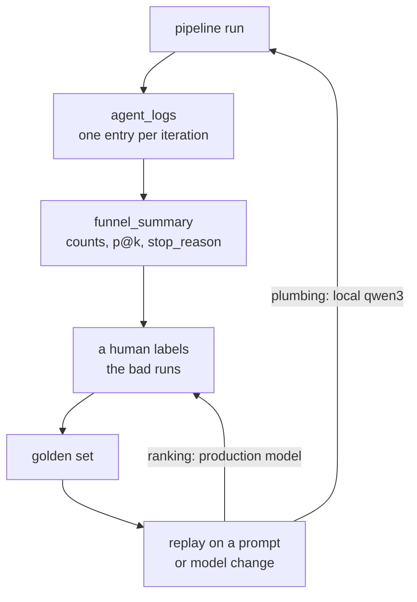

The most useful question about our talent-matching pipeline usually arrives weeks late: why did it stop on this role after two iterations? Today we can answer that by reading one database row, and getting there took more deliberate work than any prompt did.

Evaluating LLM agents in Rails turned out to be mostly a record-keeping problem. There is a Rails engine for this now - [`ruby_llm-evals`](https://github.com/sinaptia/ruby_llm-evals) mounts a UI that grades prompt outputs against a dataset with exact-match, regex, or human review - and it still would not have answered that question. It grades finished answers. It never sees the iterations.

## Make every agent return a schema

Every agent in the pipeline returns a schema instead of free text. Our scorer emits six bounded integer subscores, and Ruby sums them with `.fetch` (a missing key raises) and clamps the total - [the multi-agent post](/blog/multi-agent-llm-rails-rubyllm/) walks through that schema in detail, so we won't repeat the code here.

That `.fetch` is the part that matters for evaluation. Swap it for a silent default and the scorer adds four subscores out of six, returns a number in the normal range, and nothing downstream can tell it apart from a real one.

## One jsonb column, keyed by iteration

There is no second table. Each run already had a metrics row, and the trail is one `jsonb` column on it, keyed by iteration and then by which agent spoke:

```ruby
context[:agent_logs][iteration]["reflector"] = {
  "used_queries"     => context[:used_queries],
  "candidates_count" => context[:candidates].size,
  "decision"         => decision["stop"] ? "STOP" : "CONTINUE",
  "reasoning"        => decision["reasoning"]&.slice(0, 200)
}
```

`used_queries` shows whether iteration two explored new ground or re-ran iteration one with a synonym. `candidates_count` tells you whether retrieval starved before scoring ever got a chance. The decision and the reflector's reasoning, cut at 200 characters, say why the run ended - enough to read intent, short enough to scan a hundred iterations without paging.

The metrics row came first, which is the honest order of operations: we stored what runs produced before we stored how they got there.

Ask the model a month later why a run stopped and it has no idea; it never saw the run. The funnel numbers and the labeled cases both read back out of this column.

Someone still has to decide how long to keep it, because one entry per iteration per run adds up. Cutting the reasoning at 200 characters keeps entries scannable and limits what a talent-matching pipeline stores about the people in it.

## One hash tells you which stage failed

On top of the per-iteration entries sits `funnel_summary`, which collapses a run into per-stage candidate counts, precision-style ranking metrics, and the stop reason:

```ruby
run.funnel_summary
# => {
#   stages: { retrieved: ..., reranked: ..., scored: ... },
#   precision_at_5: ...,
#   precision_at_10: ...,
#   stop_reason: "..."
# }
```

If retrieval returned three candidates for a role, that is a [retrieval](/blog/building-rag-applications-rails-pgvector/) problem, and no prompt tuning downstream fixes the shortlist. The stage counts say so before you spend an afternoon on the scorer. (Scoring fans out across async fibers, [covered in the fibers post](/blog/fibers-async-ruby-llm-streaming-rails/).)

The p@5 and p@10 numbers carry an asterisk. Precision-at-k needs a list of which candidates were actually right for the role, and the ranking cannot also be the answer key. Charting these over time and alerting on them is monitoring, [a different job](/blog/testing-monitoring-llm-applications-production/).

## Golden sets grow out of the log

A golden set is a list of inputs with the outputs you already know are right, replayed whenever a prompt or model changes. You build it yourself. `ruby_llm-evals` will happily run one once it exists; it cannot tell you which of your runs belong in it.

Your trail already flagged them. A run that stopped early for a reason that reads wrong, or a shortlist someone corrected by hand, arrives with its queries, counts, and stop decision preserved.

That is most of a test case. Add the human judgment - which candidates were relevant, what the stop decision should have been - and freeze it.



Hamel Husain's [Your AI Product Needs Evals](https://hamel.dev/blog/posts/evals/) makes the underlying argument: remove all friction from looking at your data, because the failures you'll want to test for are sitting in your own traces. [OpenAI's evals guide](https://developers.openai.com/api/docs/guides/evals) covers the mechanics of datasets, testing criteria, and eval runs once you have labeled cases to feed them.

Labeling is the expensive part, and it is human time. Sample runs at random and most of that time buys you confirmation that a run nobody doubted was fine.

## Eval loops on a 523MB model

Replaying anything gets slow and costly if every iteration means a hosted-model call. Dev and test point at a local [`qwen3:0.6b`](https://ollama.com/library/qwen3), 523MB on disk, through the same [configuration seam](https://rubyllm.com/configuration/) production uses ([install and chat basics](/blog/rubyllm-rails-getting-started/) first, if the gem is new to you):

```ruby
# config/initializers/ruby_llm.rb
RubyLLM.configure do |config|
  config.ollama_api_base = "http://localhost:11434/v1" if Rails.env.local?
end

# app/agents/base_agent.rb
# locally: LLM_MODEL=qwen3:0.6b LLM_PROVIDER=ollama
class BaseAgent < RubyLLM::Agent
  model ENV.fetch("LLM_MODEL"), provider: ENV.fetch("LLM_PROVIDER")
  temperature 0.0
end
```

`Rails.env.local?` is true in development and test only, and every agent inherits from `BaseAgent`, so no agent class names a model or a provider.

Setting `config.default_model = "qwen3:0.6b"` and stopping there does not work. A bare model id goes through the gem's registry, `qwen3:0.6b` is not in it, and `Chat` raises `ModelNotFoundError`. Naming the provider makes the gem ask that provider instead, and because Ollama reports itself as local, the registry lookup is skipped rather than failed. Name a hosted provider and an unknown id still raises.

The `temperature 0.0` above has to be a literal. `instructions`, `tools`, `schema`, `params`, and `headers` all accept a lazy block; `temperature` and `model` take a plain value ([`agent.rb`](https://github.com/crmne/ruby_llm/blob/1.16.0/lib/ruby_llm/agent.rb) at 1.16). A block handed to `temperature` is ignored and the literal stands.

`model` is the one that bites. It assigns `@chat_kwargs` unconditionally, so a bare block form - which passes no `model_id` and no options - assigns an empty hash and wipes the model and provider the class inherited. The agent then runs on whatever `config.default_model` is, which in production is not the local model you thought you had pinned.

Even pinned, a 0.6b model wanders, so be clear about what the local loop proves. It exercises the plumbing: schema parsing, log writes, loop termination. Ranking quality gets judged by replaying the golden set against the production model. The local loop catches those three in CI, without a hosted call anywhere.

## A `Rails.logger.info` covers most apps

A single agent making a single call needs none of this. Log the parsed response, keep the schema, and move on; a per-iteration trail for a summarizer is ceremony. Add the column when one run makes three or four decisions someone will ask you about later.

Free-text chat is out of scope too. Everything above leans on structured output being checkable by code, and conversational quality needs human or LLM-judge grading instead.

Start with the schema, because it's one gem and an afternoon. Then add the one column, and let its entries tell you what your golden set should contain.

If your Rails app already runs LLM agents and nobody can say whether last month's prompt change made them better or worse, that's the [work we get called into](/services/app-web-development/), and the trail is where we start.

Further reading:

- [RubyLLM agents guide](https://rubyllm.com/agents/) - the `Agent` class: instructions, schemas, tools
- [RubyLLM configuration guide](https://rubyllm.com/configuration/) - provider endpoints, timeouts, retries
- [ruby_llm on GitHub](https://github.com/crmne/ruby_llm) - source and changelog
- [Your AI Product Needs Evals](https://hamel.dev/blog/posts/evals/) - Hamel Husain on building evals from your own traces
- [OpenAI evals guide](https://developers.openai.com/api/docs/guides/evals) - datasets, testing criteria, and eval runs
- [ruby_llm-evals](https://github.com/sinaptia/ruby_llm-evals) - a mountable Rails engine for grading prompt outputs against a dataset
- [qwen3 on Ollama](https://ollama.com/library/qwen3) - the model sizes, 0.6b included

<!-- Reference cadence: jvns.ca -->
