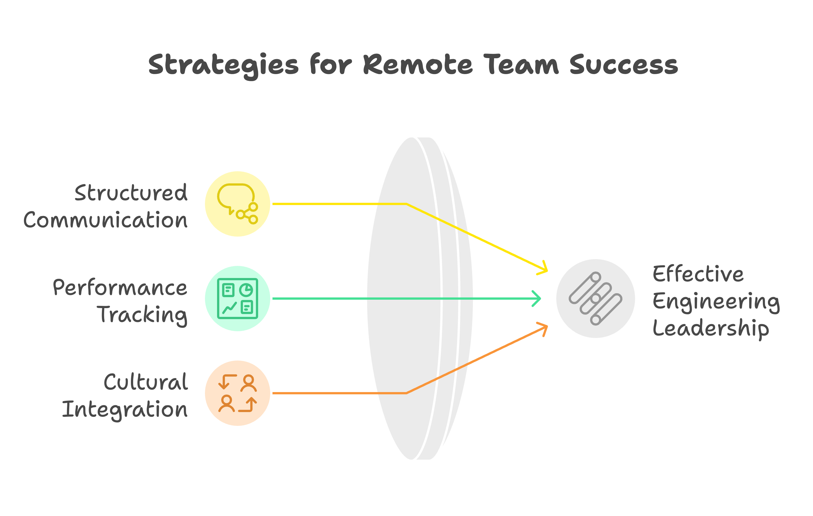

With Berlin's startup ecosystem growing 28% in the first half of 2024, the path to engineering leadership is transforming alongside this expansion. As part of my ongoing exploration of technical leadership in Berlin, I recently had an insightful conversation with [Matan Eylon, VP of Engineering](https://www.linkedin.com/in/mataneylon/) at [Nostos Genomics](https://www.nostos-genomics.com/). His journey from test automation specialist to executive leadership offers valuable perspectives on how engineering management is evolving in Germany's leading innovation hub.

## The Unconventional Path: From Test Automation to Executive Leadership

### Breaking Traditional Patterns

Matan's career trajectory challenges conventional wisdom about engineering leadership. His story begins not with traditional software development, but in test automation and build engineering – areas often overlooked in traditional leadership paths. "I was making people more efficient," Matan reflects on his early career. "I was building frameworks for people that they could do in a fraction of time what they used to be able to do before."

### The Cultural Shift: From Israel to Berlin

One of the most striking insights from Matan's experience is the fundamental difference in how engineering management is viewed across tech cultures. "In Israel, management is a vertical promotion. Whereas in Germany, it's a horizontal promotion," he explains. This distinction is particularly relevant given Berlin's position as Germany's largest tech hub, where 82% of information economy companies now embrace flexible working models.

## Building and Transforming Engineering Teams

### The Current Challenge: Leading Through Complexity

At Nostos Genomics, Matan leads a distributed team that reflects Berlin's international tech landscape. With 24.1% of German workers now operating remotely at least part-time, his experience managing a 15-person team across eight countries offers valuable insights for modern engineering leadership:

#### 1. Structured Communication
- Regular one-on-ones (minimum 30 minutes biweekly)
- Transparent information flow between engineering and product teams
- Digital-first communication strategies adapted for remote work

#### 2. Performance Tracking and Metrics
- Data-driven dashboards monitoring key performance indicators
- T-shirt sizing for estimation instead of traditional story points
- Sprint velocity and predictability metrics

#### 3. Cultural Integration
- Cross-functional collaboration across distributed teams
- Integration strategies for multicultural teams
- Building cohesive culture across time zones

## The Reality of Modern Engineering Leadership

### Navigating Remote Work Dynamics

The shift toward remote work presents unique challenges and opportunities. While larger companies show 32.1% remote work adoption compared to 20.5% in smaller firms, Matan's approach focuses on finding the right balance:

"We're fully distributed across eight countries, but I'm consolidating the team in Berlin," he shares. This strategic decision reflects a growing trend among Berlin tech companies to create hybrid work environments that combine remote flexibility with in-person collaboration.

### Building Team Autonomy and Initiative

In Berlin's competitive tech market, where companies are actively competing for talent with rising salaries and flexible work arrangements, fostering genuine autonomy becomes crucial. Matan describes the ideal state: "When I was at Clue, I remember walking into a room, having a theoretical conversation, and two weeks later someone would come back saying 'remember that idea? I experimented with it.'"

## The Berlin Advantage: A Unique Engineering Culture

### Professional Management as a Discipline

Berlin's tech scene stands out in its approach to engineering management as a distinct profession. This perspective has contributed to the city's success in attracting international talent and fostering innovation:

1. **Intentional Leadership Development**
   - Focus on management as a separate career track
   - Investment in leadership training and development
   - Balance of technical and people management skills

2. **Cultural Integration**
   - Adaptation to diverse team structures
   - Integration of German organizational principles with startup agility
   - Focus on sustainable team development

3. **International Perspective**
   - Successfully managing distributed teams across time zones
   - Adapting to multicultural team dynamics
   - Implementing global best practices locally

## Key Learnings for Aspiring Technical Leaders

### Essential Skills and Approaches

1. **Technical Foundation**
   - Maintain technical credibility while stepping back from daily coding
   - Use technical background to inform strategic decisions
   - Balance technical depth with leadership breadth

2. **People Leadership**
   - Develop strong communication skills
   - Build systems for team growth
   - Foster autonomy and ownership

3. **Strategic Thinking**
   - Align technical decisions with business goals
   - Balance immediate needs with long-term vision
   - Create scalable organizational structures

## Looking Forward: The Future of Engineering Leadership in Berlin

As Berlin's tech ecosystem continues to grow, with startup funding reaching record levels and talent pools expanding, several key trends are shaping the future of engineering leadership:

### Emerging Trends

1. **Hybrid Work Models**
   - Integration of remote and local collaboration
   - Focus on team culture across distributed environments
   - Development of new collaboration patterns

2. **Sustainable Growth**
   - Long-term team development strategies
   - Investment in leadership pipelines
   - Balance between growth and stability

3. **Cultural Evolution**
   - Blend of different management approaches
   - Adaptation of global best practices
   - Development of unique Berlin leadership styles

## Conclusion

The evolution of engineering leadership in Berlin represents a unique blend of traditional German organizational principles with modern tech culture. As demonstrated by the city's impressive growth metrics and rising salaries, Berlin's approach to technical leadership is proving successful in building and scaling effective engineering teams.

For those aspiring to technical leadership roles in Berlin, the path forward requires a combination of technical expertise, people skills, and strategic thinking. The city's treatment of engineering management as a distinct profession, coupled with its strong market growth, creates unique opportunities for career development and impact.

---

*Paul Keen is a technical leader and consultant exploring engineering leadership practices in Berlin. This post is part of a series examining how different organizations and leaders approach technical leadership in Berlin's growing tech ecosystem.*