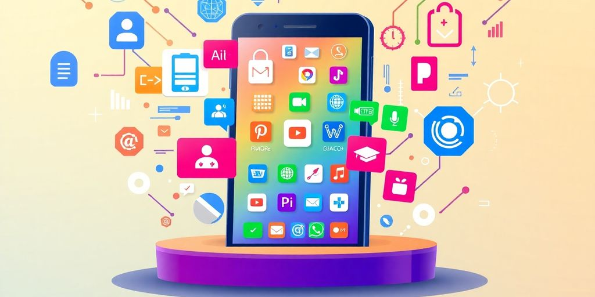

As we look ahead to 2025, the landscape of software development is evolving rapidly. With new technologies and tools emerging, developers need to stay informed about the best platforms for software development. This guide will explore various platforms that are set to shape the future of development. From low-code solutions to AI-driven tools, we'll cover what you need to know to make the best choice for your projects.

### Key Takeaways

*   Low-code platforms are gaining traction for their ability to speed up development and reduce costs.
*   AI tools are transforming how developers work, making it easier to integrate smart features into applications.
*   Mobile app development is focusing on user experience and cross-platform compatibility.
*   Blockchain is becoming more relevant, especially for secure transactions and data integrity.
*   Community support is crucial; choose platforms with active user bases for better resources and troubleshooting.

## The Rise of Low-Code Platforms

Low-code platforms? They're kind of a big deal right now. Instead of writing mountains of code, you get to use visual tools. Think drag-and-drop interfaces and pre-built components. It's like building with LEGOs, but for software. Seriously, who wouldn't want that?

### Why Low-Code Is Taking Over

Why are [low-code platforms](https://jetthoughts.com/blog/develop-minimalistic-process-for-development-teams-innovate-startup-productivity/) so popular? A few reasons:

*   _Speed_. You can build apps way faster. Like, up to 10x faster. That's not a typo.
*   _Cost_. Less code means fewer developers. Fewer developers mean less money spent. Simple math.
*   _Accessibility_. Non-techy people can build apps. Seriously. It's called _citizen development_, and it's empowering.
*   _Scalability_. From simple tools to complex systems, low-code can handle it.

> Low-code platforms are changing how we make software. They make it faster and cheaper. They also let more people get involved. It's a win-win-win.

### Top Low-Code Platforms to Watch

Okay, so which platforms should you keep an eye on? Here are a few:

*   OutSystems: Great for enterprise-level apps. Think big, think scalable.
*   Mendix: Another solid choice for complex applications. Lots of features and integrations.
*   Appian: Focuses on business process management. If you need workflow automation, check it out.

### Benefits of Using Low-Code Solutions

Let's break down the good stuff about low-code:

*   Faster development cycles: Get your apps out the door quicker.
*   Reduced development costs: Save money on developer salaries.
*   Increased agility: Adapt to changing business needs faster.
*   Improved collaboration: Tech and non-tech teams can work together more easily.
*   Democratization of development: More people can build apps, not just developers.

It's not magic, but it's pretty close. Low-code is changing the game, and you should probably pay attention.

## AI-Driven Development Tools

AI is changing how we build software. It is not just about fancy algorithms. It is about making your life as a developer easier. Think of AI as your coding buddy, always ready to help.

### How AI Is Changing the Game

AI is not coming for your job. It is here to help. It can automate tasks, suggest code, and even find bugs. This means you can focus on the fun stuff: designing cool features and solving tough problems. AI can help you write code faster and with fewer errors. It is like having a super-smart assistant that knows all the coding tricks. **AI can analyze code, predict errors, and suggest improvements.**

*   Automated Code Generation
*   Intelligent Debugging
*   Predictive Code Completion

### Best AI Platforms for Developers

There are many AI platforms out there. Some are great for code completion, while others excel at debugging. Here are a few to keep an eye on:

*   GitHub Copilot: This tool is like having an AI pair programmer. It suggests code as you type. It learns from your style and the context of your project. It is pretty cool.
*   [Codeium](https://www.synthesia.io/post/ai-tools): Codeium is another AI assistant that helps with code completion and generation. It supports many languages and integrates with popular IDEs. It is a solid choice if you want a reliable AI coding partner.
*   Tabnine: Tabnine uses deep learning to predict and suggest code. It learns from your coding patterns and provides personalized suggestions. It is like having a coding guru that knows your every move.

### Integrating AI into Your Workflow

Adding AI to your workflow does not have to be hard. Start small. Try using an AI code completion tool in your IDE. See how it goes. You might be surprised at how much it helps. The key is to find tools that fit your style and needs. Do not try to force it. Let AI enhance your work, not take over. Think of AI as a tool, not a replacement. Use it to make your coding life easier and more productive. You might even have some fun along the way. Who knows, maybe AI will help you write the next killer app.

> AI is not magic. It is a tool. Use it wisely. Experiment with different platforms and find what works best for you. Do not be afraid to try new things. The future of software development is here, and it is powered by AI.

## Mobile App Development Trends

### Key Features to Look For

So, you're thinking about getting into mobile app development? Cool! Let's talk about what's hot right now. Users want apps that are fast, secure, and easy to use. No one has time for slow loading screens or confusing menus. Think about these things:

*   _Personalization_ is key. People love apps that feel like they were made just for them.
*   Security matters. No one wants their data leaked.
*   Offline access is a plus. Not everyone is always connected.

> Focus on user experience. A smooth, intuitive app will always win.

### Popular Mobile Development Platforms

Okay, so which platforms should you be looking at? You have a few choices. Each has its pros and cons. It really depends on what you're trying to build. Here's the lowdown:

*   React Native: Great for cross-platform development. Write once, run everywhere (almost).
*   Flutter: Another solid choice for cross-platform. Known for its fast performance.
*   Native (Swift/Kotlin): If you want the best performance and access to all device features, go native. But, you'll need to write separate code for iOS and Android.

Choosing the right [mobile app development](https://www.adjust.com/resources/ebooks/mobile-app-trends-2025/) platform can make or break your project.

### Future of Mobile App Development

What's next for mobile apps? A lot, actually. Expect to see more AI, more AR, and more focus on _wearable devices_. Mobile gaming will continue to grow, especially in emerging markets. Also, keep an eye on low-code/no-code platforms. They are making app development more accessible to everyone. **The future is bright, and it's mobile.**

Here's a quick look at what's coming:

*   AI-powered features will become standard.
*   AR/VR integration will create new experiences.
*   5G will enable faster and more reliable connections.

## Blockchain Development Platforms

### Why Blockchain Matters in 2025

Okay, so why should you even care about blockchain in 2025? It is not just about crypto anymore. _Blockchain tech_ [best practices](https://jetthoughts.com/blog/essential-development-best-practices-for-modern/) is changing how we think about security, transparency, and trust. Think about supply chains. You can track products from start to finish, making sure everything is legit. Plus, it is great for keeping data safe and sound. It is like having a super secure digital ledger that everyone can see but no one can mess with.

### Top Blockchain Platforms to Explore

Ready to jump in? Here are a few platforms you should check out:

*   Ethereum: Still the big dog for smart contracts and decentralized apps.
*   Corda: Great for business stuff, especially in finance.
*   Hyperledger Fabric: Another solid choice for enterprise-level blockchain solutions.

> Blockchain platforms let you build secure apps for industries like finance and supply chain.

### Use Cases for Blockchain Development

So, what can you actually do with blockchain? Here are some ideas:

*   Secure voting systems: Imagine voting without worrying about fraud.
*   Supply chain management: Track goods and materials easily.
*   Digital identity: Control your personal data [blockchain development company](https://jetthoughts.com/blog/essential-development-best-practices-for-modern/) like never before.

Blockchain is not just a buzzword. It is a real tool that can solve real problems. Give it a shot!

## Emerging Technologies in Software Development

Software development changes fast. What's new today is old news tomorrow. Let's look at some tech that will shape how we build software in 2025. Buckle up; it's gonna be a wild ride!

### The Impact of AR/VR

AR and VR are not just for games anymore. They change how we interact with software. Imagine apps that let you _virtually_ try on clothes before you buy, or training programs that simulate real-world scenarios. **AR/VR offers immersive experiences.** This changes how we design and build software. It's not just about screens anymore; it's about spaces.

### How IoT Is Shaping Development

IoT connects everything. Your fridge, your car, even your toothbrush. This means software needs to talk to all these devices. Think about apps that control your home's temperature or track your fitness. IoT development means dealing with tons of data and making sure everything works together. It's a big challenge, but also a big opportunity. You can use [software development tools](https://jetthoughts.com/blog/10-essential-developer-best-practices-for/) to help you manage the complexity.

### Trends in Cloud-Native Development

Cloud-native is the new normal. It means building apps that live in the cloud. This lets you scale up or down as needed and makes it easier to update your software. Cloud-native development uses containers, microservices, and other cool tech. It's all about being flexible and fast. Plus, who doesn't love the cloud? It's like having a giant computer in the sky.

> Cloud-native development is not just a trend; it's a new way of thinking about software. It requires a different mindset and a different set of tools. But the benefits are worth it. You can build apps that are more scalable, more resilient, and more agile.

Here are some key aspects of cloud-native development:

*   **Microservices:** Breaking down apps into smaller, independent services.
*   **Containers:** Packaging software into standardized units.
*   **DevOps:** Automating the software development lifecycle.

## Choosing the Right Platform for Your Project

So, you're ready to pick a platform? Awesome! It can feel like choosing between a million different flavors of ice cream. Let's break it down to make it easier. No one wants a melted mess, right?

### Factors to Consider When Selecting

Okay, first things first. What are you _actually_ trying to build? A simple website? A complex app? Your project's scope is key. Think about these points:

*   **Project Size:** A small project doesn't need a huge, complicated platform. Keep it simple.
*   **Features:** Do you need specific features like user authentication or database integration? Make sure the platform supports them.
*   **Scalability:** Will your project grow? Choose a platform that can handle more users and data later on. For feature-rich applications, consider platforms [offering robust APIs](https://jetthoughts.com/blog/essential-steps-launching-successful-software-development/) and scalable solutions.

### Common Mistakes to Avoid

People mess this up all the time. Don't be one of them! Here are some common pitfalls:

*   **Ignoring Your Team's Skills:** If your team only knows JavaScript, don't pick a platform that requires C++. Seriously.
*   **Forgetting About Budget:** Some platforms are expensive. Factor in licensing costs, training, and other fees.
*   **Not Testing:** Always, always, _always_ test the platform before committing. Free trials are your friend.

> Choosing the right platform tailored to your project’s goals can make the difference between a good app and a great one. Evaluate your needs carefully.

### How to Evaluate Platform Performance

So, how do you know if a platform is any good? Here's what to look for:

*   **Speed:** How fast does the platform run? Slow performance can kill a project.
*   **Reliability:** Does the platform crash a lot? Stability is crucial.
*   **Security:** Is the platform secure? Protect your data and your users.

Think of it like test driving a car. You wouldn't buy a car without driving it first, would you? Same goes for development platforms!

## Community and Support in Development Platforms

Let's be real, coding alone can feel like shouting into the void. That's where community and support come in. A strong community can be a lifesaver when you're stuck on a bug or just need some advice. Plus, knowing others are using the same platform can give you confidence. It's like having a team, even if you're a solo developer.

### Importance of Community Support

Why is community support so important? Well, for starters, it's a great place to find answers. Instead of banging your head against the wall, you can ask a question and get help from experienced developers. Think of it as free tech support, but with more personality. Plus, a good community can help you learn new things and stay up-to-date with the latest trends. It's like a never-ending learning experience. **A vibrant community ensures continuous learning and problem-solving.**

*   Get unstuck faster.
*   Learn new skills.
*   Stay updated on trends.

### Top Platforms with Strong Communities

Okay, so which platforms have the best communities? GitHub is a classic. With millions of developers using it, you're bound to find someone who can help. Stack Overflow is another great resource, especially for specific coding questions. And don't forget about platform-specific forums and [developer resources](https://jetthoughts.com/blog/checklist-for-non-tech-founder-agile/). These can be goldmines of information and support. Here's a quick look at some top contenders:

| Platform | Community Size | Support Channels |
| --- | --- | --- |
| GitHub | Massive | Issues, Discussions, Forums |
| Stack Overflow | Huge | Q&A, Tags |
| React | Large | Forums, Chat groups, Conferences |

### How to Leverage Community Resources

So, you've found a platform with a great community. Now what? Start by participating! Ask questions, answer questions, and share your own knowledge. Don't be afraid to look silly; everyone starts somewhere. Also, check out the platform's documentation and tutorials. These can often answer common questions and help you get up to speed. _Engage actively to maximize benefits._

> Remember, the community is there to help you, but you also need to contribute. The more you give, the more you'll get back. It's like karma, but for developers. So, get out there and start connecting!

In the world of development platforms, having a [strong community and support system is key](https://jetthoughts.com). These resources help developers connect, share ideas, and solve problems together. If you're looking for expert guidance and a supportive network to boost your projects, visit our website today! We’re here to help you succeed in your development journey.

## Wrapping It Up

So, there you have it! We’ve taken a good look at the best software development platforms for 2025. Whether you’re a seasoned pro or just starting out, there’s something here for everyone. From low-code options that let you whip up apps without breaking a sweat to powerful tools for those big projects, the choices are pretty exciting. Just remember, the right platform can make all the difference in your development journey. So, take your time, weigh your options, and pick what feels right for you. Happy coding!

## Frequently Asked Questions

### What are low-code platforms?

Low-code platforms are tools that let you create apps with little or no coding. They use simple drag-and-drop features and templates, making it easy for anyone to build software.

### Why are low-code platforms becoming popular?

They are popular because they speed up the development process, cost less, and allow people without technical skills to create apps.

### What is AI-driven development?

AI-driven development uses artificial intelligence to help developers write code, find bugs, and improve their work. It makes the development process faster and smarter.

### What are some popular mobile app development platforms?

Some popular mobile app development platforms include Flutter, React Native, and Xamarin. These tools help developers create apps for both Android and iOS.

### How is blockchain used in software development?

Blockchain technology is used to create secure and transparent applications, especially in industries like finance and supply chain, where trust is essential.

### What should I consider when choosing a development platform?

When picking a development platform, think about your project's needs, the skills of your team, and the support available for the platform.