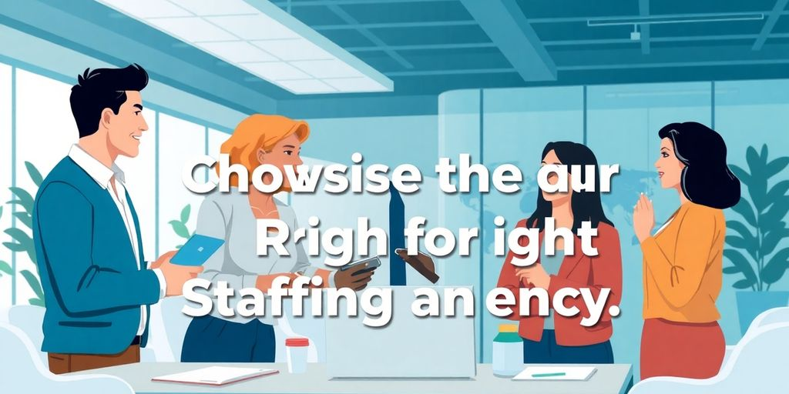

Finding the right talent for your business can be a real challenge. With so many different staffing agencies out there, it can feel overwhelming to choose the best one for your needs. These agencies specialize in connecting employers with qualified candidates, which can save you time and help you fill positions more efficiently. In this article, we’ll break down what staffing agencies are, the benefits of using them, and how to find the right fit for your workforce needs.

### Key Takeaways

*   Staffing agencies help connect businesses with a wider range of qualified candidates.
*   Choosing the right staffing agency involves looking at their industry focus and reputation.
*   Using a staffing agency can save you time and resources during the hiring process.
*   Be aware of red flags like poor communication or lack of personalized support when selecting an agency.
*   Ask potential staffing agencies about their candidate screening processes and success rates.

## Understanding Different Staffing Agencies

### What Exactly Is A Staffing Agency?

Ever wonder how companies find the right people for the job? That's where staffing agencies come in. Think of them as matchmakers, but for businesses and job seekers. **A staffing agency is a company that connects employers with potential employees.** They work with various companies to fill open positions, from temporary gigs to permanent roles. It is like a [recruitment agency](https://jetthoughts.com/blog/comprehensive-list-of-recruitment-agencies-in/) for companies.

*   They help companies find qualified candidates.
*   They assist job seekers in finding employment.
*   They streamline the hiring process.

> Staffing agencies save companies time and money by handling the initial stages of hiring. They also give job seekers access to opportunities they might not find on their own.

### How Do Staffing Agencies Work?

So, how does this matchmaking actually work? First, companies tell the agency what kind of employee they need. Then, the agency searches its database of candidates to find people who fit the bill. They screen applicants, conduct interviews, and even handle background checks. If they find a good match, they'll send the candidate to the company for an interview. If all goes well, the company hires the candidate, and the staffing agency gets a fee. It's a win-win! They offer access to a larger _talent pool_.

*   Companies provide job requirements.
*   Agencies search for suitable candidates.
*   Agencies handle initial screening and interviews.

### Types Of Staffing Agencies You Should Know

Not all staffing agencies are created equal. Some specialize in certain industries or types of jobs. For example, some agencies focus on tech jobs, while others focus on healthcare. There are also agencies that specialize in temporary positions, permanent positions, or both. Knowing the different types can help you find the right agency for your needs. Here are a few common types:

1.  **Temporary Staffing Agencies:** These agencies fill short-term or temporary positions.
2.  **Permanent Staffing Agencies:** These agencies focus on placing candidates in full-time, permanent roles.
3.  **Specialized Staffing Agencies:** These agencies specialize in specific industries, such as IT, healthcare, or finance. They provide [staffing solutions](https://jetthoughts.com/blog/comprehensive-list-of-recruitment-agencies-in/) for specific needs.

## Benefits Of Partnering With Staffing Agencies

### Access To A Larger Talent Pool

Think of staffing agencies as having a massive Rolodex of potential employees. They aren't just looking at active job seekers. They also tap into a pool of _passive candidates_. These folks might not be actively searching, but they're open to the right opportunity. This wider net increases [your chances](https://jetthoughts.com/blog/discover-best-recruitment-agencies-in-usa/) of finding that perfect fit for your team. It's like having a secret weapon in the talent wars.

### Time And Cost Savings

Hiring is a time sink. Posting jobs, sifting through resumes, and conducting initial interviews? It all adds up. Staffing agencies take on these tasks, freeing you to focus on other things. Imagine all the hours you'll save! Plus, consider the cost of advertising, background checks, and the time your HR team spends on recruiting. It's a win-win.

### Expert Guidance Throughout The Hiring Process

Staffing agencies bring serious knowledge to the table. They understand market trends, salary expectations, and the skills needed for specific roles. They can help you refine your job descriptions, conduct effective interviews, and even negotiate salaries. It's like having a [recruitment agencies](https://jetthoughts.com/blog/discover-best-recruitment-agencies-in-usa/) consultant by your side, guiding you every step of the way.

> Partnering with a staffing agency can streamline your hiring process and provide access to a wider range of qualified candidates. This can lead to better hires and a more efficient use of your company's resources.

## Choosing The Right Staffing Agency For You

So, you're thinking about using a staffing agency? Smart move! But with so many options, how do you pick the right one? It's like dating, but for your business. Let's break it down.

### Identifying Your Workforce Needs

First, figure out what you _actually_ need. Are you looking for temporary help, or are you trying to fill a permanent position? What skills are non-negotiable? Knowing this upfront saves everyone time and headaches. Think of it as writing a detailed dating profile—the more specific, the better the match. For example, do you need [expert guidance](https://jetthoughts.com/blog/essential-recruitment-tips-for-recruiters-attract-top-talent-in-2024/) in a specific field?

*   **Define the role:** What will this person _actually_ do?
*   **List required skills:** Be specific. "Proficient in Excel" is not enough.
*   **Determine the duration:** Temp, contract, or permanent?

### Evaluating Agency Specializations

Not all staffing agencies are created equal. Some focus on tech, others on healthcare, and some are generalists. Find an agency that knows your industry inside and out. It's like going to a mechanic who specializes in your car brand—they just _get_ it. A good agency will understand your company's [cultural fit](https://jetthoughts.com/blog/essential-recruitment-tips-for-recruiters-attract-top-talent-in-2024/) and values.

*   **Industry focus:** Do they specialize in your field?
*   **Track record:** What kind of companies have they worked with?
*   **Recruiter expertise:** Do the recruiters understand your industry's jargon?

### Checking Reviews And Accreditations

Before you commit, do your homework. Read online reviews, check for accreditations, and ask for references. It's like reading Yelp before trying a new restaurant—you want to know what you're getting into. **A reputable agency will have a solid online presence and be transparent about its processes.**

*   **Online reviews:** What are other people saying?
*   **Accreditations:** Are they certified by any industry organizations?
*   **References:** Can they provide contacts from past clients?

## Red Flags To Watch Out For

Choosing a staffing agency is a big deal. You want a partner, not a problem. Here are some red flags to watch for. Spotting these early can save you headaches later.

### Lack Of Personalized Support

Does the agency treat you like just another number? A good agency takes time to understand your _specific_ needs. They should ask questions about your company culture, the skills you need, and your long-term goals. If they offer generic solutions without getting to know you, that's a bad sign. **Personalized support is key to a successful partnership.**

### Poor Communication Practices

Communication is everything. If the agency is hard to reach, slow to respond, or unclear in their updates, run the other way. You need an agency that keeps you in the loop. This includes providing regular updates on candidate searches, being transparent about their processes, and promptly addressing any concerns you have. It's like dating, if they don't call you back, they're just not that into you.

### Limited Job Opportunities

An agency with a small pool of candidates or a narrow range of job openings might not be the best fit. You want an agency with a wide network and a proven track record of filling diverse roles. If they only seem to have access to a few candidates or only specialize in one type of position, you might want to look elsewhere. Think of it like this: you wouldn't go to a tiny grocery store for a big party, would you? You need variety! Consider [inclusive hiring practices](https://jetthoughts.com/blog/effective-strategies-when-looking-for-new/) to broaden your talent search.

## Questions To Ask Potential Staffing Agencies

### What Types Of Positions Do You Fill?

Before you sign on the dotted line, find out what kind of jobs the agency usually handles. Do they focus on temporary gigs, permanent roles, or both? Are they experts in [career opportunities](https://jetthoughts.com/blog/discover-top-job-recruiting-agencies-elevate/) that match your needs? Knowing this upfront saves you time and energy. If you're after a full-time gig and they mostly do short-term contracts, it might not be the best fit.

### How Do You Screen Candidates?

Time to get nosy! Ask about their screening process. Do they just check resumes, or do they dig deeper with background checks and skill assessments? A good agency does its homework. _A thorough screening process_ means you're more likely to get quality candidates who can actually do the job. Plus, it protects you from potential headaches down the road.

### What Is Your Success Rate?

Numbers don't lie, right? Ask the agency about their placement success rate. How many candidates do they place, and how long do those placements last? A high success rate suggests they know their stuff and can find the right people for the right jobs. Don't be afraid to ask for specifics. You want to partner with an agency that has a [successful track record](https://jetthoughts.com/blog/discover-top-job-recruiting-agencies-elevate/) and can back up its claims.

> Partnering with a staffing agency can streamline your hiring process, but it's important to choose wisely. Asking the right questions upfront helps you find an agency that aligns with your company's needs and values.

## Qualities Of A Great Staffing Agency

### Industry Expertise Is Key

Think of a staffing agency as a guide. You want one that knows the terrain. _Industry expertise_ means they get your business. They understand the skills needed for each role. They can spot talent that others miss. It is like having an insider who speaks the language.

### Strong Recruitment Processes

**A great agency has a solid plan.** They don't just throw resumes at you. They have a system for finding, checking, and placing people. This includes:

*   Finding candidates from many places.
*   Checking skills and experience carefully.
*   Making sure candidates fit your company culture.

> A good recruitment process saves you time and trouble. It means fewer bad hires and more people who stick around.

### Commitment To Client Relationships

It is not just about filling jobs. It is about building a partnership. A great agency cares about your success. They listen to your needs and offer support. They are there for the long haul. They want to see you grow. They are invested in your future. Look for [top recruitment agencies](https://www.airswift.com/blog/top-recruitment-agency-traits) that value relationships.

## Exploring Specialized Staffing Agencies

Not all staffing agencies are created equal. Some focus on specific industries or job types. This specialization can be a huge advantage for both employers and job seekers. Let's explore a few specialized areas.

### Tech-Focused Staffing Solutions

In the fast-paced world of technology, finding the right talent is critical. Tech-focused staffing agencies specialize in connecting companies with skilled IT professionals. These agencies understand the unique demands of the tech industry. They recruit for roles like software engineers, data scientists, and cybersecurity experts. If you're a tech company or a tech professional, these agencies can be a game-changer. They often have access to [top recruitment companies](https://jetthoughts.com/blog/discovering-best-recruitment-companies-in-usa/) that general agencies might miss.

### Healthcare Staffing Experts

The healthcare industry faces constant staffing challenges. Healthcare staffing agencies focus on placing medical professionals in hospitals, clinics, and other healthcare facilities. These agencies recruit for roles like nurses, doctors, and medical assistants. They understand the specific licensing and certification requirements of the healthcare industry. **This _expertise_ ensures that healthcare facilities have qualified staff to provide quality patient care.**

### Creative Industry Recruiters

The creative industry requires a unique set of skills and talents. Creative industry recruiters specialize in connecting companies with creative professionals. These agencies recruit for roles like graphic designers, copywriters, and marketing specialists. They understand the importance of creativity and innovation in these roles. If you're a creative company or a creative professional, these agencies can help you find the perfect match.

> Partnering with a specialized staffing agency can save you time and resources. These agencies have a deep understanding of their respective industries. They can quickly identify and recruit qualified candidates. This targeted approach can lead to better hiring outcomes.

Here's a quick look at the benefits of using specialized staffing agencies:

*   Access to a niche talent pool
*   Industry-specific knowledge
*   Faster hiring process

If you're looking for help with hiring the right people for your business, [specialized staffing agencies can be a great choice](https://jetthoughts.com). They focus on finding the best candidates for specific jobs, making the hiring process easier and faster. Whether you need tech experts or skilled workers in other fields, these agencies can connect you with the right talent. Ready to find the perfect team for your project? Visit our website to learn more!

## Wrapping It Up

So, there you have it! Picking the right staffing agency can really make a difference for your business. It’s all about finding one that gets your needs and has the right connections. Whether you’re looking for temp workers or full-time hires, there’s an agency out there that can help. Just remember to do your homework, ask questions, and trust your gut. With the right partner, you can save time, reduce stress, and find the talent that fits your team perfectly. Happy hiring!

## Frequently Asked Questions

### What is a staffing agency?

A staffing agency is a company that helps people find jobs. They connect job seekers with employers who need workers. These agencies know a lot about different jobs and can help match your skills with the right position.

### How do staffing agencies work?

Staffing agencies work by gathering information from both job seekers and companies. They collect resumes from people looking for work and find out what companies need. Then, they match the right candidates to the right jobs.

### What types of staffing agencies are there?

There are different types of staffing agencies. Some focus on temporary jobs, while others help with permanent positions. Some agencies specialize in certain fields like healthcare, technology, or creative jobs.

### What are the benefits of using a staffing agency?

Using a staffing agency can save you time and money. They have access to many candidates and can quickly find someone who fits your needs. Plus, they handle a lot of the hiring process for you.

### How do I choose the right staffing agency?

To choose the right staffing agency, think about what kind of jobs you need to fill. Look for agencies that specialize in your industry and check their reviews to see how well they help job seekers.

### What should I look for in a good staffing agency?

A good staffing agency should have experience in your field, a strong process for finding candidates, and good communication with clients. They should be dedicated to helping you find the right fit for your job needs.
