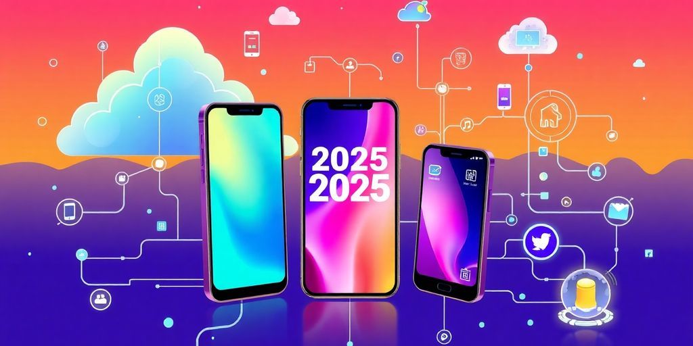

As we look ahead to 2025, the landscape of web and software development is shifting rapidly. New technologies, evolving user needs, and innovative practices are transforming how developers create and manage applications. This article explores the key trends and innovations that are set to shape the future of web and software development, providing insights that can help businesses and developers stay competitive in this fast-paced environment.

### Key Takeaways

*   AI is becoming a central part of development, automating tasks and improving user experiences.
*   Low-code and no-code platforms are making development accessible to non-developers, changing team dynamics.
*   Progressive Web Apps (PWAs) are gaining popularity for their speed and reliability across devices.
*   Accessibility is becoming a must-have, not just for compliance but for reaching more users.
*   Cybersecurity is evolving with new threats, making it essential for developers to integrate security from the start.
*   Serverless architecture is simplifying deployment and scaling, but comes with its own challenges.
*   Front-end technologies are focusing on dynamic, user-friendly designs enhanced by AI.
*   The rise of remote work is changing team collaboration and culture in development.

## The Rise of AI in Web and Software Development

AI is changing everything, and web and software development are no exception. It's not just hype; AI tools are becoming essential. They help with coding, testing, and even understanding what users want. Get ready, because AI is here to stay.

### How AI Is Changing the Game

AI is not just a tool; it's a _paradigm shift_. It's changing how we approach development. Think about it: AI can automate tasks, predict user behavior, and even write code. This means developers can focus on the bigger picture, like design and strategy. It's like having a super-powered assistant that never sleeps. Research indicates that [AI enhances productivity](https://hai.stanford.edu/ai-index/2025-ai-index-report) and generally reduces skill gaps within the workforce.

### AI-Powered Tools for Developers

There are many AI tools available. Some help with coding, others with testing, and some even help with design. **GitHub Copilot** is a great example. It suggests code snippets as you type, saving time and reducing errors. AI-powered website builders are also becoming popular. They let you create websites quickly and easily, even if you don't have much coding experience.

### Machine Learning in Action

Machine learning (ML) is a subset of AI that allows computers to learn from data without being explicitly programmed. In web development, ML can be used to personalize user experiences, improve search results, and even detect security threats. Imagine a website that adapts to each user's preferences in real-time. That's the power of ML.

### Predictive Analytics for User Experience

Predictive analytics uses data to forecast future outcomes. In web development, this means understanding what users will do next. By analyzing user behavior, you can predict what they want and need. This allows you to create more engaging and effective websites. It's like having a crystal ball for user experience.

### Chatbots and Customer Support

Chatbots are no longer just for answering simple questions. They can now handle complex tasks, such as troubleshooting technical issues and providing personalized recommendations. They can guide users, answer questions, and even help with navigation. This makes websites more interactive and user-friendly. Plus, they can gather data to help you understand what users want. They are available 24/7, providing instant support to users around the world. This improves customer satisfaction and reduces the workload on human support staff.

### Automating Routine Tasks with AI

AI excels at automating repetitive tasks. This frees up developers to focus on more creative and strategic work. For example, AI can automate code generation, testing, and deployment. This not only saves time but also reduces the risk of errors. It's like having a robot that handles all the boring stuff, so you can focus on the fun stuff.

> AI is not going to replace developers, but it will change the way they work. By automating routine tasks and providing intelligent assistance, AI will empower developers to be more productive and creative. The future of web and software development is one where humans and AI work together to build amazing things.

## Low-Code and No-Code Revolution

### What Are Low-Code and No-Code Platforms?

Okay, so what's the deal with low-code and no-code? Basically, they're like cheat codes for building apps. Instead of writing a ton of code, you use visual interfaces and pre-built stuff. Think drag-and-drop, but for [software development](https://colorwhistle.com/low-code-statistics/). **It makes building apps way faster and easier.**

### Benefits for Non-Developers

If you're not a coder, these platforms are a lifesaver. You can actually build stuff without needing to learn a complicated language. Want to automate some tasks? Build a simple app for your team? No problem. It's all about _accessibility_ and getting things done without relying on a developer. Here's why you should care:

*   **Speed**: Apps get done faster.
*   **Cost**: Less coding means less money spent.
*   **Accessibility**: Anyone can build, not just coders.

### How They’re Changing Development Teams

Even if you _are_ a developer, low-code and no-code can be super useful. They free you up from boring tasks, so you can focus on the really interesting stuff. Plus, they let non-developers contribute more, which can lead to better collaboration and faster [time-to-market](https://colorwhistle.com/low-code-statistics/).

### Integrating AI with Low-Code Solutions

AI and low-code? That's a power couple. Imagine using AI to automate parts of your low-code development process. AI can help with testing, debugging, and even suggesting improvements to your app. It's like having a super-smart assistant that knows how to code. AI tools can spot bugs before you even know they exist. They can also suggest fixes, saving you time and headaches. This means fewer late nights squashing bugs and more time building cool features.

### Future of No-Code Development

No-code is only going to get bigger. As the platforms get more powerful, you'll be able to build more complex apps without writing any code. We're talking about a future where anyone can be a [citizen developer](https://colorwhistle.com/low-code-statistics/), turning their ideas into reality without needing years of training.

### Real-World Success Stories

Companies are already using low-code and no-code to do some pretty amazing things. They're building apps faster, saving money, and empowering their employees. It's not just hype; it's a real trend that's changing how businesses operate. **Low-code/no-code solutions have already revolutionized web development by democratizing the creation of applications and digital solutions.**

> Low-code and no-code platforms are not just trends. They’re reshaping the landscape of software development, making it more accessible and efficient for everyone.

## Progressive Web Apps Taking Over

### Why PWAs Are the Future

Okay, so native apps are cool, but PWAs? They're changing the game. Think of them as websites that act like apps. You get the best of both worlds: instant access through a URL and app-like features such as offline access and push notifications. **PWAs are becoming the standard for businesses wanting a mobile-first approach.**

*   They load fast.
*   They work offline.
*   They don't need app store approval.

### Benefits of PWAs for Businesses

Why should businesses care? PWAs can seriously boost your bottom line. They are cheaper to develop than native apps. PWAs also increase user engagement. _Conversions_ can go up, and users stick around longer. It's a win-win.

> PWAs offer enhanced security, with fewer security vulnerabilities compared to traditional native apps. This makes them a compelling option for businesses looking to optimize their web applications.

### User Experience Enhancements

PWAs make users happy. They load quickly, feel responsive, and work even when the internet is spotty. This creates a smooth, engaging experience. Users are more likely to return to a site that feels fast and reliable. Plus, you can add them to your home screen, just like a regular app.

### Offline Capabilities and Performance

Imagine browsing your favorite site on the subway with no signal. PWAs make this possible. They use caching to store content, so you can access it even without an internet connection. This is a huge advantage over traditional websites. Performance is also top-notch, making for a snappy user experience.

### Comparing PWAs to Native Apps

| Feature | PWA | Native App |
| --- | --- | --- |
| Development Cost | Lower | Higher |
| Installation | No app store needed | Requires app store |
| Offline Access | Yes | Yes |
| Update Process | Automatic | Requires user update |
| Discoverability | Search engine friendly | Limited to app store search |

### Building PWAs: Tools and Frameworks

So, you want to build a PWA? Great! You have options. Frameworks like React, Angular, and Vue.js make it easier. Tools like Lighthouse help you optimize performance. It's all about using the right tech to create a fast, reliable, and engaging experience. Don't forget to check out the latest [JavaScript trends](https://jetthoughts.com/blog/exploring-future-of-frontend-technology-trends-innovations-for-2025/) to stay ahead of the curve.

## The Importance of Web Accessibility

### Understanding Web Accessibility

Web accessibility? It's all about making sure _everyone_ can use the web. Think about it: people with disabilities, older folks, people using different devices. **Accessibility means building websites that work for all of them.** It's not just a nice thing to do; it's often the law. Plus, you reach a bigger audience. Who would have thought?

### Legal Requirements and Compliance

Okay, so accessibility isn't just a suggestion. Many countries have laws about it. In the US, there's the Americans with Disabilities Act (ADA). Europe has EN 301 549. These laws say your website needs to be accessible. If you don't comply, you could face lawsuits. Nobody wants that, right? Staying on top of [legal requirements](https://jetthoughts.com/blog/exploring-best-platforms-for-software-development/) is key.

### Tools for Testing Accessibility

Don't worry, you don't have to guess if your site is accessible. Plenty of tools can help. Here are a few:

*   **Axe:** A browser extension that finds accessibility issues.
*   **WAVE:** Gives you visual feedback on accessibility.
*   **Lighthouse:** Google's tool that checks performance, SEO, and accessibility.

These tools run checks and point out problems. They save you time and effort. Use them often!

### Designing for All Users

Inclusive design means thinking about everyone from the start. Here are some tips:

1.  Use semantic HTML. This helps screen readers understand your content.
2.  Provide text alternatives. Images and videos need alt text or captions.
3.  Make sure people can navigate your site with a keyboard. Not everyone uses a mouse.

> Designing for all users isn't just a trend. It's the right thing to do. Plus, it makes your site better for everyone. Think about it: clear layouts, readable text, and easy navigation benefit all users.

### Benefits of an Accessible Web

Accessibility isn't just about compliance. It has real benefits:

*   **Better SEO:** Accessible sites often rank higher in search results.
*   **Wider audience:** You reach more people, including those with disabilities.
*   **Improved user experience:** Accessibility features often make sites easier to use for everyone.

It's a win-win-win!

### Future Trends in Accessibility

What's next for web accessibility? Here are a few trends to watch:

*   **AI-powered accessibility tools:** AI can help automate accessibility testing and fixes.
*   **More focus on cognitive accessibility:** Designing for people with cognitive disabilities.
*   **Integration with emerging technologies:** Making sure new technologies like AR/VR are accessible from the start.

Accessibility is always evolving. Stay informed and keep learning!

## Cybersecurity Innovations for Developers

### Emerging Threats in 2025

Cyber threats are getting smarter. Attackers now use AI to create malware and phishing scams. It's like they're leveling up their game, and we need to keep up. A [recent report](https://jetthoughts.com/blog/10-innovative-strategies-improve-developer-experience-in-2024/) shows AI-powered cybercrime is on the rise. To fight back, developers must think about security from the start. This means using strong encryption, multi-factor authentication, and AI threat detection. It's a tough job, but someone's gotta do it.

### Best Practices for Secure Development

To keep your code safe, follow these steps:

*   Always check your code for weaknesses.
*   Use strong passwords and [multi-factor authentication](https://jetthoughts.com/blog/10-innovative-strategies-improve-developer-experience-in-2024/).
*   Keep your software updated. Outdated software is like an open door for hackers.
*   Teach your team about security. Everyone needs to know how to spot a threat.

> Think of security as a team sport. Everyone needs to play their part to keep the game safe.

### Integrating Security into DevOps

DevSecOps is becoming a must. It means adding security to every step of development. Instead of treating security as an afterthought, bake it in from the beginning. This way, you can find and fix problems early. Tools for [vulnerability scanning](https://jetthoughts.com/blog/10-innovative-strategies-improve-developer-experience-in-2024/) and code analysis are key. They give developers feedback without slowing them down. Solutions like Snyk and Checkmarx scan code for risks. This lowers the chance of breaches from unpatched issues.

### AI in Cybersecurity

AI isn't just for the bad guys. We can use it to fight them too. AI can spot threats faster than humans. It can also learn from past attacks to get better over time. AI-powered tools can analyze network traffic and user behavior. This helps find suspicious activity. It's like having a super-smart security guard that never sleeps.

### User Privacy and Data Protection

People care about their privacy. You should too. Follow privacy-first approaches. Anonymize user data and collect only what you need. Industries like healthcare and finance already have strict rules. These rules will likely get even stricter. Developers who stay ahead of these changes will be in high demand. It's about building trust with your users. Plus, you avoid penalties. It's a win-win.

### Tools for Enhancing Security

There are many tools to help you improve security. Here are a few:

*   Static code analyzers: These tools check your code for common mistakes.
*   Dynamic analysis tools: These tools test your code while it's running.
*   [Vulnerability scanners](https://jetthoughts.com/blog/10-innovative-strategies-improve-developer-experience-in-2024/): These tools look for known weaknesses in your software.

| Tool | Description |
| --- | --- |
| Snyk | Scans for vulnerabilities in open-source code |
| Checkmarx | Analyzes code for security flaws |
| OWASP ZAP | Finds vulnerabilities in web applications |

Using the right tools can make a big difference. They help you find and fix problems before they cause trouble.

## The Shift to Serverless Architecture

Serverless is the new buzzword, but what does it even mean? Think of it as outsourcing the server stuff. You write the code, and someone else (usually a cloud provider) handles the servers. No more late-night server restarts! It's like magic, but with more code and less actual magic. Let's get into the details.

### What Is Serverless Computing?

Serverless computing means you don't manage servers. Seriously. You write code, deploy it, and the cloud provider handles the rest. They take care of scaling, patching, and all that boring stuff. You only pay for the compute time you use. It's like renting a super-powered computer only when you need it. This approach enhances [code protection](https://buzzclan.com/cloud/serverless-computing/) by abstracting away the underlying infrastructure.

### Benefits of Going Serverless

Why should you care about serverless? Here are a few reasons:

*   **Cost Savings**: You only pay for what you use. No more paying for idle servers.
*   **Scalability**: Serverless platforms scale automatically. Your app can handle sudden spikes in traffic without you lifting a finger.
*   **Faster Development**: Focus on code, not infrastructure. Deploy new features faster.

### Popular Serverless Platforms

So, where can you try this serverless thing? Here are some popular options:

1.  **AWS Lambda**: Amazon's serverless compute service. Super popular and powerful.
2.  **Azure Functions**: Microsoft's offering. Integrates well with other Azure services.
3.  **Google Cloud Functions**: Google's serverless platform. Great for apps that use other Google Cloud services.

### Use Cases for Serverless Applications

Serverless isn't just a cool tech; it's useful. Here are some use cases:

*   **APIs**: Build and deploy APIs without managing servers.
*   **Event-Driven Applications**: Process data in real-time based on events.
*   **Mobile Backends**: Create backends for mobile apps without the server hassle.

### Challenges and Considerations

Serverless isn't perfect. Here are some challenges:

*   **Cold Starts**: The first request to a serverless function can be slow.
*   **Debugging**: Debugging can be tricky without direct access to servers.
*   **Vendor Lock-In**: Choosing a serverless platform can lock you into that vendor's ecosystem.

> Serverless is a game-changer, but it's not a silver bullet. Consider the trade-offs before jumping in.

### Future of Serverless Development

Serverless is here to stay. Expect to see more tools and services that make serverless development easier. The future is serverless, or at least server-less-ish. _Serverless architecture_ is evolving rapidly, promising even greater efficiency and flexibility.

## The Evolution of Front-End Technologies

Front-end tech? It's like the ever-changing fashion scene, but for websites. What's hot today might be totally outdated tomorrow. So, buckle up, because we're diving into what's shaping the future of how we build the interfaces you see and use every day. Think faster, smoother, and way more interactive. It's gonna be a wild ride!

### Dynamic Interfaces and User Experience

Forget static pages. We're talking _dynamic_ everything. Users want sites that react instantly, feel alive, and anticipate their needs. Think animations that aren't annoying, transitions that are slick, and interactions that feel natural. It's all about making the user feel like the website is reading their mind. Or, at least, trying really hard to.

### Frameworks to Watch in 2025

Frameworks are the backbone of front-end development. They give you structure, tools, and a whole lot of pre-written code to make your life easier. React is still a big deal, but keep an eye on Svelte and Vue.js. They're lean, mean, and ready to take on the world. Plus, there are always new kids on the block trying to disrupt the game. It's like a constant battle for front-end supremacy.

### The Role of CSS in Modern Development

CSS: it's not just about making things pretty. It's about structure, performance, and accessibility. CSS is evolving with cool features like custom properties and grid layout. These features give you more control and flexibility than ever before. Plus, with tools like [Tailwind CSS](https://jetthoughts.com/blog/exploring-innovative-open-source-front-end/), you can write CSS faster and more efficiently. Who knew CSS could be so exciting?

### JavaScript Trends to Follow

JavaScript is the king of the front-end. It's what makes everything tick. Keep an eye on trends like:

*   ES modules
*   Async/await
*   WebAssembly

These technologies are changing how we write JavaScript and what we can do with it. Plus, with the rise of serverless functions, JavaScript is even making its way to the back-end. JavaScript is taking over the world, one line of code at a time.

### Responsive Design Best Practices

In 2025, if your site isn't responsive, you're doing it wrong. People are browsing on everything from smartwatches to giant TVs. Your site needs to look good and work well on all of them. That means using flexible layouts, scalable images, and media queries. It also means testing your site on a variety of devices. Don't be the person with the website that looks terrible on mobile. Nobody likes that person.

### Integrating AI into Front-End Development

AI is not just for robots anymore. It's also for front-end developers. AI-powered tools can help you with everything from code generation to user testing. Imagine an AI that can write your CSS for you or automatically test your site for accessibility. It sounds like science fiction, but it's becoming a reality. Get ready to welcome your new AI overlords... I mean, assistants.

## Back-End Development Trends

### Microservices Architecture Explained

Think of microservices as breaking down a huge app into smaller, manageable pieces. Each piece does one thing well. This makes updates easier and helps your app scale. It's like having a team of specialists instead of one person doing everything. **This approach enhances flexibility and resilience.**

### APIs and Their Growing Importance

APIs are the glue that holds the internet together. They let different apps talk to each other. _Good APIs_ mean your app can connect to other services easily. This opens up a world of possibilities. You can add features without building them yourself. It's all about teamwork.

### Database Innovations for 2025

Databases are getting smarter. New types of databases can handle different kinds of data. Some are faster, some are better at handling lots of traffic. Picking the right database is key. It can make or break your app's performance. Consider these points:

*   NewSQL databases offer scalability.
*   Graph databases manage relationships well.
*   Document databases handle unstructured data.

### Choosing the Right Back-End Framework

There are tons of back-end frameworks out there. Python's Django and JavaScript's Node.js are popular. Go and Ruby on Rails are also solid choices. The best framework depends on your project. Consider the language, community support, and features. Don't just pick the trendy one. Pick the right one for you. For example, [Python's extensive libraries](https://www.nucamp.co/blog/coding-bootcamp-backend-with-python-2025-the-ultimate-guide-to-backend-development-in-2025-trends-tools-and-techniques-for-python-sql-devops-and-cloud-services) are great for web development.

### Scalability and Performance Considerations

Your app needs to handle more users as it grows. Scalability is all about making sure your app can handle the load. Performance is about making sure it's fast. You don't want users waiting forever for pages to load.

> Think about caching, load balancing, and optimizing your code. These things can make a big difference. It's like tuning up a car. A little effort goes a long way.

### Future of Cloud-Based Back-End Solutions

The cloud is the future. More and more back-end services are moving to the cloud. This gives you more flexibility and scalability. You don't have to worry about managing servers. Cloud platforms like AWS, Azure, and Google Cloud are constantly evolving. They offer new services and features all the time. It's like having a super-powered computer at your fingertips.

## The Role of DevOps in Modern Development

So, you've heard about DevOps, right? It's not just a buzzword; it's a whole vibe shift in how we build and ship software. Think of it as the ultimate team-up between developers and operations folks. No more throwing code over the wall and hoping for the best! Let's get into it.

### What Is DevOps Anyway?

DevOps is all about breaking down silos. It's a culture, a philosophy, and a set of practices aimed at automating and improving the entire software development lifecycle. It's about _collaboration_, communication, and integration. Basically, it's about making sure everyone's on the same page, from the initial code commit to the final deployment. It's like a well-oiled machine, except instead of oil, it runs on coffee and shared goals.

### Benefits of a DevOps Culture

Why should you care about DevOps? Well, for starters, it speeds things up. Way up. Faster release cycles mean quicker feedback, which leads to better products. Plus, it reduces errors. Automation catches a lot of the silly mistakes we all make. And let's not forget improved collaboration. When everyone's working together, things just run smoother. It's like going from a chaotic kitchen to a Michelin-star restaurant. Here are some key benefits:

*   Faster time to market
*   Reduced deployment failures
*   Increased efficiency
*   Better communication

### Tools for Effective Collaboration

DevOps isn't just about good vibes; it's also about using the right tools. Think Slack, Microsoft Teams, or even good old email for communication. For project management, Jira and Trello are your friends. And for version control, Git is the undisputed king. These tools help teams stay connected, organized, and on track. It's like having a digital Swiss Army knife for your development process. You can also use [Kamal 2](https://jetthoughts.com/blog/tags/automation/) for automating deployments.

### Continuous Integration and Deployment

CI/CD is the heart of DevOps. Continuous Integration means frequently merging code changes into a central repository. Continuous Deployment means automatically releasing those changes to production. This combo ensures that code is always in a deployable state. It's like having a conveyor belt for your software, constantly moving it from development to the user's hands. It also helps with _software engineering_.

### Monitoring and Feedback Loops

DevOps isn't a set-it-and-forget-it kind of thing. You need to constantly monitor your systems and gather feedback. Tools like Prometheus, Grafana, and ELK stack help you keep an eye on things. Feedback loops ensure that you're always learning and improving. It's like having a doctor constantly checking your pulse and adjusting your medication.

### Future Trends in DevOps

So, what's next for DevOps? Expect to see more AI and machine learning in the mix. AI can help automate tasks, predict issues, and optimize performance. Also, look out for more serverless and cloud-native technologies. These trends will make DevOps even more efficient and scalable. **DevOps will continue to evolve, but its core principles of collaboration and automation will remain essential.**

> DevOps is not a role or a tool; it's a culture. It's about creating a shared responsibility for the entire software development lifecycle. It's about breaking down barriers and building bridges. It's about making software development less of a headache and more of a joy.

## User Experience Design Innovations

### The Importance of UX in Development

UX is no longer an afterthought; it's a core part of development. Think of it as the architect designing a building. You wouldn't build a house without a blueprint, right? Same goes for software. **Good UX makes your product usable and enjoyable.** _User experience_ directly impacts user satisfaction and, ultimately, your bottom line. A clunky, confusing app will send users running to your competitor.

### Trends in UX Research

UX research is evolving. Forget old-school surveys; it's all about understanding user behavior in real time. Here are some trends:

*   **Micro-surveys:** Quick, in-app polls to get immediate feedback.
*   **Eye-tracking:** Seeing where users actually look on a screen.
*   **A/B testing:** Comparing different designs to see which performs best.

> UX research helps you understand what users want before you even start building. It's like having a crystal ball that shows you exactly what your audience craves.

### Designing for Mobile First

Mobile isn't just a trend; it's the norm. More people browse the web on their phones than on desktops. If your site isn't mobile-friendly, you're losing users. **Mobile-first design means starting with the mobile version and then scaling up for larger screens.** It ensures a smooth experience for the majority of your audience. Mobile devices generated [website traffic](https://medium.com/@piaguruge/ui-ux-trends-for-2025-embracing-the-future-of-interaction-8d0a8b92832c) in Q4 2024.

### The Role of Prototyping Tools

Prototyping tools are essential for UX designers. They let you create interactive mockups of your product before writing a single line of code. This allows you to test ideas, gather feedback, and iterate quickly. Some popular tools include:

*   Figma
*   Adobe XD
*   Sketch

### User Testing and Feedback

User testing is crucial. Get your product in front of real users and watch them use it. You'll be surprised at what you learn. **Pay attention to their struggles, their frustrations, and their moments of delight.** _Feedback_ is gold. Use it to refine your design and make your product even better.

### Future of UX Design

The future of UX is exciting. Expect to see more AI-powered design tools, personalized experiences, and immersive interfaces. UX will become even more data-driven, with designers using analytics to make informed decisions. The goal? To create seamless, intuitive experiences that users love.

## The Impact of 5G on Web Development

5G is here, and it's not just about faster cat videos. It's changing the whole game for web developers. Think quicker load times, better user experiences, and new possibilities we haven't even thought of yet. Buckle up; it's gonna be a fast ride.

### What 5G Means for Developers

5G means _speed_. Like, seriously fast. We're talking about download speeds that make your current Wi-Fi look like dial-up. For developers, this means we can build more complex, data-heavy applications without worrying about lag. Imagine AR apps that actually work or real-time collaboration tools that don't make you want to throw your computer out the window. It's a new world, baby!

### Faster Load Times and User Experience

**Nobody likes waiting for a website to load.** With 5G, those days are (hopefully) over. Faster load times mean happier users, which means more engagement and conversions. Plus, it opens the door for richer, more interactive web experiences. Think high-res images, smooth animations, and seamless video playback. It's all about keeping users hooked.

### New Opportunities for Mobile Apps

Mobile apps are about to get a serious upgrade. 5G makes it possible to create apps that were previously too data-intensive for mobile networks. Think augmented reality games, [high-definition video](https://jetthoughts.com/blog/exploring-future-of-backend-technology-trends-innovations-for-2024/) streaming, and real-time collaboration tools. The possibilities are endless. Plus, with lower latency, mobile apps will feel more responsive and intuitive.

### Challenges with 5G Implementation

It's not all sunshine and rainbows. 5G implementation comes with its own set of challenges. For starters, 5G coverage isn't universal yet. You need to consider that some users will still be on older networks. Also, developing for 5G requires new skills and tools. But hey, that's what keeps things interesting, right?

> 5G is more than just a speed boost; it's a fundamental shift in how we think about web development. It allows for richer, more immersive experiences, but also requires developers to adapt to new challenges and opportunities. The future is fast, and it's wireless.

### Future of IoT and 5G

The Internet of Things (IoT) is about to explode, thanks to 5G. Imagine a world where all your devices are connected and communicating in real-time. 5G makes this possible by providing the bandwidth and low latency needed to support a massive number of connected devices. From smart homes to self-driving cars, the future of IoT is looking bright.

Here's a quick look at potential growth:

*   Smart homes become truly smart.
*   Cities become more efficient.
*   Industries become more automated.

### 5G and Augmented Reality

AR is finally ready for its close-up. With 5G, AR apps can deliver the immersive experiences we've been promised for years. No more lag, no more glitchy graphics, just seamless augmented reality that blends the digital and physical worlds. Get ready for AR-powered shopping, gaming, and education. It's gonna be wild.

## Blockchain Technology in Software Development

Blockchain is not just for Bitcoin anymore. It's changing how we think about security and trust online. Let's check out how it's shaking up software development.

### Understanding Blockchain Basics

Okay, so what's blockchain? It's like a digital record book that everyone can share. Each new transaction gets added as a "block," and these blocks link together to form a "chain." This makes it super hard to mess with the data. Think of it as a super secure, shared spreadsheet. **Each block contains a hash of the previous block, a timestamp, and transaction data.**

### Use Cases Beyond Cryptocurrency

Blockchain has uses way beyond just crypto. Think about supply chain tracking. You can track a product from the factory to your door, making sure it's legit. Or consider digital IDs. Blockchain can help you prove who you are online without handing over all your personal info. _Healthcare_ could use it to secure patient records. The possibilities are pretty wild.

### Smart Contracts and Their Applications

Smart contracts are like regular contracts, but they live on the blockchain. They automatically execute when certain conditions are met. Imagine a rental agreement that automatically sends payment when you get the keys. No middleman needed! This can streamline all sorts of processes and cut down on fraud. [software development](https://jetthoughts.com/blog/discover-best-it-companies-hiring-in/) is changing fast.

### Challenges in Blockchain Development

It's not all sunshine and roses. Blockchain development can be tricky. It's a new field, so there aren't as many experienced developers. Scalability is also a big issue. Some blockchains can only handle a few transactions per second. Plus, there are regulatory hurdles to jump through.

### Future of Decentralized Applications

Decentralized applications (dApps) are apps that run on a blockchain. They're not controlled by a single entity, which makes them more resistant to censorship. We might see dApps for social media, finance, and even gaming. It's all about giving users more control over their data.

### Integrating Blockchain with Existing Systems

How do you add blockchain to what you already have? It's a big question. You can't just flip a switch. It often involves creating APIs that connect your existing systems to the blockchain. It's a gradual process, but it can be worth it for the added security and transparency.

> Blockchain is more than just hype. It's a real technology with the potential to change how we do business. It's not a magic bullet, but it's definitely something to keep an eye on.

## The Growing Importance of Data Analytics

Data analytics is a big deal. You might think it's just for number-crunchers, but it's changing how we build websites and apps. Get ready, because it's only going to get bigger.

### Data-Driven Decision Making

Forget guessing! Data gives you the facts. Instead of wondering what users want, you can _see_ what they do. **This means better products and happier users.** It's like having a crystal ball, but with actual evidence.

### Tools for Data Visualization

Raw data is boring. Thankfully, tools exist to make it pretty. Think charts, graphs, and dashboards. These visuals help you spot trends and patterns fast. No more squinting at spreadsheets! [Data analytics systems](https://www.coherentsolutions.com/insights/the-future-and-current-trends-in-data-analytics-across-industries) are getting better all the time.

### Integrating Analytics into Development

Analytics shouldn't be an afterthought. Bake it into your development process from the start. This way, you can track how users interact with your app or site in real time. It's like having a built-in feedback loop.

### User Behavior Insights

Ever wonder why users drop off on a certain page? Analytics can tell you. By tracking clicks, scrolls, and time spent on each page, you can figure out what's working and what's not. Then, you can fix the problems and make your site more user-friendly.

### Predictive Analytics for Business Growth

Want to know what's going to happen next? Predictive analytics uses past data to forecast future trends. This can help you make smarter business decisions, like where to invest your resources. It's not magic, but it's pretty close.

### Future Trends in Data Analytics

Data analytics is always changing. Expect to see more AI-powered tools and real-time analysis. The future is all about getting insights faster and easier. Get ready to ride the wave!

## Sustainable Development Practices

### What Is Sustainable Development?

Sustainable development? It's about meeting our needs without messing things up for future generations. Think of it as not using all the cookies in the jar so there are some left for later. It touches everything from how we build software to how we use energy. It's a big deal because, well, we only have one planet, and we should probably take care of it. [Sustainable websites](https://jetthoughts.com/blog/essential-development-best-practices-for-modern/) will become more important.

### Green Coding Practices

Okay, so what's "green coding"? It's writing code that uses less energy and resources. This means:

*   Writing efficient algorithms. No one wants code that takes forever to run.
*   Using _lightweight_ frameworks. Keep it lean and mean.
*   Optimizing images and media. Smaller files mean faster load times and less data usage.

It's like choosing a fuel-efficient car instead of a gas guzzler. Every little bit helps!

### Tools for Measuring Sustainability

How do you know if you're actually making a difference? You measure it! There are tools out there that can help you track your website's energy consumption and carbon footprint. Think of them as your eco-friendly Fitbit. They give you the data you need to make informed decisions and improve your _sustainability_ efforts.

### The Role of Developers in Sustainability

Developers are key players in this whole sustainability thing. You're the ones building the websites and apps that people use every day. **Your choices can have a big impact.** By adopting green coding practices and advocating for sustainable solutions, you can help make the digital world a little bit greener. It's like being a superhero, but with a keyboard.

### Future of Eco-Friendly Tech

Eco-friendly tech is only going to get bigger. Expect to see more tools and frameworks designed with sustainability in mind. We might even see new programming languages that are optimized for energy efficiency. The future is green, baby!

### Case Studies in Sustainable Development

Let's look at some real-world examples. Some companies are already making strides in sustainable development. They're using renewable energy to power their data centers, optimizing their code for efficiency, and promoting eco-friendly practices throughout their organizations. These case studies show that it's possible to be both profitable and sustainable. It's not just a pipe dream; it's happening now.

> Adopting sustainable practices isn't just good for the planet; it's also good for business. Consumers are increasingly demanding eco-friendly products and services, so companies that prioritize sustainability are likely to have a competitive edge. Plus, it just feels good to do the right thing.

## The Future of Mobile Development

Mobile development is still a big deal. It's not slowing down anytime soon. Let's look at what's coming.

### Trends in Mobile App Development

Mobile apps are changing fast. We see new tech and new ways to build apps all the time. One big trend? More _cross-platform_ development. This means you can write one app that works on both iOS and Android. Saves time and money, right?

### Cross-Platform Development Tools

Speaking of cross-platform, there are more tools than ever. React Native and Flutter are still popular. These tools let you build apps for multiple platforms from a single codebase. It's like getting two birds with one stone. Plus, these tools keep getting better, making development easier. You can find [local software developer companies](https://jetthoughts.com/blog/discover-best-software-developer-companies-near/) that specialize in these tools.

### The Role of AI in Mobile Apps

AI is showing up everywhere, including mobile apps. Think about it: smarter search, better recommendations, and even AI-powered features inside apps. It's not just about adding a chatbot. It's about making apps that learn and adapt to what you need. AI can help with everything from image recognition to predictive text. It's pretty wild.

### User Experience in Mobile Design

UX is always important, but it's even more so on mobile. People expect apps to be easy to use and look good. Simple navigation, fast load times, and intuitive interfaces are key. If your app is clunky or confusing, people will ditch it fast. **Focus on making the experience smooth and enjoyable.**

### Challenges in Mobile Development

It's not all sunshine and rainbows. Mobile development has its challenges. Keeping up with new OS versions, dealing with different screen sizes, and ensuring security are tough. Plus, users expect a lot. They want apps that are fast, reliable, and don't drain their battery. It's a constant balancing act.

> Mobile development is a moving target. What works today might not work tomorrow. Staying flexible and learning new things is key to success.

### Future of Mobile Technologies

What's next? Expect to see more AR and VR in mobile apps. Also, 5G will make mobile experiences faster and more immersive. Foldable phones might become more common, which means apps need to adapt to new screen sizes. The future is exciting, but it also means developers need to stay on their toes.

## Emerging Programming Languages to Watch

It's 2025, and the world of programming languages keeps changing. Some languages are getting more popular. You should probably know about them.

### Languages Gaining Popularity

Some languages are becoming more popular. _Rust_ and Go are two examples. They solve problems that older languages don't. Also, new languages appear all the time. It's hard to keep up, but worth it.

### The Role of Rust and Go

Rust and Go are modern languages. They help make software better. Rust is good for safety. It stops many common mistakes. Go is good for speed. It works well for cloud apps. A [go-to for systems programming](https://jetthoughts.com/blog/10-essential-developer-best-practices-for/) is Rust.

### Trends in JavaScript Frameworks

JavaScript is still important. Frameworks like React and Vue make it easier to use. These frameworks change quickly. Keep an eye on new ones. Svelte is gaining popularity for its simplicity and speed in building user interfaces, offering a fresh approach to front-end development.

### Python’s Continued Relevance

Python is still useful. It is easy to read and has many libraries. People use it for AI and data science. Python [continues to lead in AI](https://jetthoughts.com/blog/10-essential-developer-best-practices-for/).

### Future of Functional Programming

Functional programming is a style of coding. It focuses on functions. Some languages make it easier to do. This style can make code simpler and easier to test. Functional programming is becoming more popular.

### Choosing the Right Language for Your Project

**Picking a language depends on what you're building.** Think about what you need. Consider speed, safety, and ease of use. Some languages are better for some jobs. Don't just pick the newest one. Pick the right one. For [rapid prototyping](https://jetthoughts.com/blog/10-essential-developer-best-practices-for/) you might want to use Python.

## The Impact of Remote Work on Development Teams

Remote work is here to stay, and it's changing how development teams function. You might be wondering how to make it work best for you. Let's look at some key aspects.

### How Remote Work Is Changing Collaboration

Remote work changes how teams connect. No more water cooler chats! Now, it's all about _digital tools_ and intentional communication. Think about how you can keep everyone on the same page. Are daily stand-ups still effective? Maybe try asynchronous updates. It's all about finding what works for your team's rhythm.

### Tools for Remote Development

So many tools, so little time! But seriously, the right tools can make or break a remote team. Here are a few must-haves:

*   Project management software (like Jira or Asana)
*   Communication platforms (Slack, Microsoft Teams)
*   Video conferencing (Zoom, Google Meet)
*   [Remote access software](https://www.splashtop.com/blog/remote-work-trends-2025?srsltid=AfmBOoqI2I0zFtTBnW494pREiZyEANvJVCELE5D1f1dSAJpcb8bZPGkW) (TeamViewer, AnyDesk)

Don't just pick tools at random. Get your team's input. What do they need to be productive? What integrates well with your existing workflow?

### Challenges of Remote Work

It's not all sunshine and rainbows. Remote work comes with its own set of problems. Isolation, burnout, and communication breakdowns are real issues. You need to address them head-on. Encourage breaks, promote social interaction (even if it's virtual), and make sure everyone feels heard.

### Building a Remote Team Culture

Culture isn't just about free snacks and office parties. It's about shared values and a sense of belonging. How do you create that when everyone's scattered? Be intentional. Schedule virtual team-building activities. Recognize achievements. And most importantly, communicate, communicate, communicate! **A strong remote culture can boost morale and productivity.**

### Future of Work in Tech

The future is flexible. Expect to see more hybrid models, where some team members are in the office and others are remote. The key is adaptability. Be ready to adjust your processes and tools as needed. The tech world never stands still, and neither should you.

### Success Stories from Remote Teams

Want some inspiration? Look at companies that have nailed remote work. GitLab, for example, is a fully remote company with a thriving culture. They've proven that it can be done. Learn from their successes (and their mistakes). What can you apply to your own team?

> Remote work isn't just a trend; it's a fundamental shift in how we work. Embrace the change, adapt your strategies, and you'll be well on your way to building a successful remote development team.

## The Role of Community in Development

Ever feel like coding is a lonely sport? It doesn't have to be! The development community is huge, helpful, and ready to welcome you. Seriously, it's like a giant digital hug waiting to happen. Let's look at why being part of this community is so important.

### Importance of Open Source Contributions

Open source is where the magic happens. It's like a massive collaborative art project, but with code. Contributing to open source projects lets you learn from the best, show off your skills, and build a portfolio that screams "hire me!" Plus, you're helping make software better for everyone. Think of it as coding karma. You put good code in, good things come back. It's also a great way to learn about [software engineering](https://jetthoughts.com/blog/develop-minimalistic-process-for-development-teams-innovate-startup-productivity/).

### Building a Developer Community

Starting your own community? Awesome! It could be a local meetup, an online forum, or even just a group of friends who code together. The key is to create a space where people feel safe to ask questions, share ideas, and learn from each other. Think of it as your own personal coding clubhouse. Make sure to have snacks. Virtual snacks count too.

### Networking and Collaboration Opportunities

Networking isn't just for business bros in suits. For developers, it's about connecting with people who share your passion. Attend conferences, join online groups, and strike up conversations. You never know when you'll find your next collaborator, mentor, or even just someone to bounce ideas off of. Plus, free swag at conferences is always a win.

### Mentorship in Tech

Being a mentor or mentee can seriously boost your career. Mentors get to solidify their knowledge and gain leadership skills. Mentees get personalized guidance and support. It's a win-win! If you're just starting out, find someone who's been there, done that, and is willing to share their wisdom. If you're experienced, pay it forward and help someone else climb the ladder.

### Future of Developer Communities

Developer communities are only going to get bigger and more important. As technology evolves, we'll need each other more than ever to navigate the changing landscape. Expect to see more specialized communities focused on specific technologies, industries, or even just shared interests. The future is collaborative, so get ready to join the party.

### Case Studies of Successful Communities

Want some inspiration? Look at communities like Stack Overflow, GitHub, and various open-source project groups. These communities thrive because they're built on a foundation of mutual respect, shared goals, and a commitment to helping each other. They show that when developers come together, amazing things can happen. **These platforms are essential for developers.**

> Communities provide a space for developers to share knowledge, collaborate on projects, and support each other. This collaborative environment accelerates learning, promotes innovation, and helps developers stay up-to-date with the latest trends and technologies. It's like having a giant brain trust at your fingertips.

## Trends in Software Testing and Quality Assurance

Software testing? QA? Still super important. Let's look at what's new and exciting in making sure your code doesn't explode on launch.

### The Importance of Testing in Development

Testing isn't just a formality; it's the backbone of solid software. Think of it as your safety net. Without it, you're basically coding blindfolded. Good testing catches bugs early, saves money, and keeps users happy. Plus, nobody wants to deal with a buggy app. **Solid testing makes for solid software.**

### Automated Testing Tools

Manual testing? So last decade. Automated testing tools are where it's at. They run tests faster and more consistently than any human ever could. This means quicker feedback, faster releases, and fewer headaches. Plus, you can set them up to run overnight. Wake up to results! Automation testing can [reduce development time](https://www.forbes.com/councils/forbesbusinesscouncil/2025/05/02/exploring-trends-that-are-redefining-software-testing/) and cost.

### User Acceptance Testing Best Practices

User Acceptance Testing (UAT) is when real users try out your software. It's like a sneak peek for your audience. Get their feedback before you fully launch. This helps catch issues you never would have thought of. _Real users, real problems, real solutions._

### Continuous Testing in DevOps

DevOps and continuous testing go together like peanut butter and jelly. Continuous testing means testing early and often throughout the development process. This approach finds problems sooner, when they're easier (and cheaper) to fix. It's all about speed and quality.

### Future of QA in Software Development

QA is evolving. AI and machine learning are starting to play a bigger role. Expect to see more smart tools that can predict bugs and automate even more of the testing process. The future is bright, and it's full of robots (testing robots, that is).

### Challenges in Software Testing

Testing isn't always easy. Keeping up with new technologies, dealing with complex systems, and making sure you have enough test coverage can be tough. But hey, no one said building great software was a walk in the park. Embrace the challenge, and your software will be better for it.

> Testing is not about finding fault, it's about preventing it. A proactive approach to testing ensures higher quality software and happier users. It's an investment, not an expense.

In today's fast-paced tech world, software testing and quality assurance are changing quickly. New tools and methods are making it easier to find and fix problems before they reach users. Companies are focusing more on automation to speed up testing and improve quality. If you want to learn more about how these trends can help your business, visit our website for expert insights and services!

## Wrapping It Up

So, as we wrap up our look at what’s coming in web and software development by 2025, it’s clear that things are changing fast. New tools and tech are popping up all over the place, making life easier for developers and users alike. Whether it’s AI stepping in to help or the rise of low-code platforms, there’s a lot to keep an eye on. The key takeaway? Stay curious and keep learning. The digital world isn’t slowing down, and neither should you. Embrace these trends, and you’ll be ready to tackle whatever comes next!

## Frequently Asked Questions

### What is the role of AI in web development?

AI helps developers by automating tasks, improving user experiences, and providing smart tools that make coding easier.

### What are low-code and no-code platforms?

These platforms let people create apps without needing to write a lot of code. They are great for those who aren't professional developers.

### Why are Progressive Web Apps (PWAs) important?

PWAs combine the best features of websites and apps, making them faster and more reliable, even when there's no internet.

### How can we ensure web accessibility?

Web accessibility means designing websites that everyone can use, including people with disabilities. This is important for reaching more users.

### What are some cybersecurity concerns for developers?

As technology evolves, new threats appear. Developers need to stay updated on best practices to keep user data safe.

### What is serverless computing?

Serverless computing allows developers to run applications without managing servers. It makes deployment easier and more efficient.

### What are microservices?

Microservices are a way to build software as a collection of small, independent services that work together. This makes apps easier to manage and scale.

### How does DevOps help in software development?

DevOps combines development and operations to improve collaboration and speed up the delivery of software.

### What is the importance of user experience (UX) design?

Good UX design ensures that users find websites easy to navigate and enjoyable to use, which can lead to more satisfied customers.

### How is 5G changing web development?

5G offers faster internet speeds, which means websites can load quicker and support more advanced features like augmented reality.

### What is the future of mobile app development?

Mobile app development is focusing on cross-platform tools and AI to create better user experiences and streamline the development process.

### Why is data analytics important for developers?

Data analytics helps developers understand user behavior, which can inform design choices and improve overall app performance.
