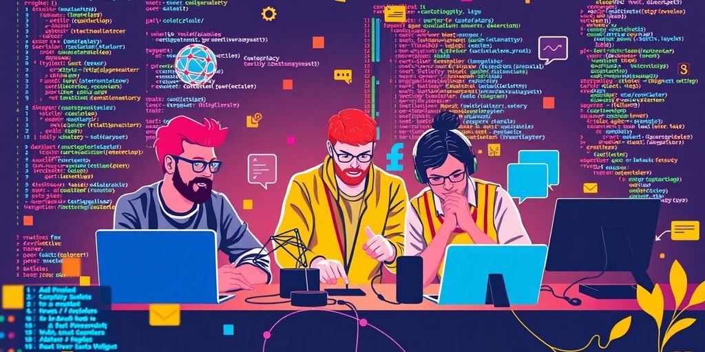

As we enter 2025, the field of front-end development is buzzing with opportunities for growth and learning. Open source projects are an excellent way to sharpen your skills, gain practical experience, and contribute to the community. Whether you're just starting out or looking to tackle more complex challenges, there are plenty of open source front end projects to explore. This article will guide you through essential steps to get started, highlight some exciting projects, and offer tips for making the most of your contributions.

### Key Takeaways

*   Evaluate your skills to find the right open source front end projects for you.
*   Start with simpler projects to build confidence before tackling more complex ones.
*   Use tools like Git and Visual Studio Code to streamline your development process.
*   Stay informed about new technologies and frameworks shaping front end development.
*   Network with other developers to share knowledge and find collaboration opportunities.

## Before Diving Into Open Source Front End Projects

So, you're thinking about jumping into open source front end projects? Awesome! It's a great way to level up your skills and contribute to the community. But before you [start a RESO API JavaScript client](https://jetthoughts.com/blog/how-start-an-open-source-project-building-reso-api-js-client-javascript-opensource/), let's make sure you're set up for success. Think of it as prepping your gear before a big hike. You wouldn't climb a mountain without the right shoes, would you?

### Skill Assessment Checklist

First things first: what skills do you _actually_ have? Be honest with yourself. It's okay if you're not a wizard yet. Open source is about learning, after all. But knowing where you stand helps you pick the right project. Here's a quick checklist:

*   HTML: Do you know your semantic tags from your divs?
*   CSS: Can you make things look pretty (or at least not ugly)?
*   JavaScript: Are you comfortable with the DOM? Can you write functions that don't break the internet?
*   Version Control: Git is your friend. Are you friends with Git?
*   Frameworks: React, Vue, Angular—do any of these sound familiar? If not, that's okay, but maybe start with a project that doesn't rely heavily on them.

### Understanding Project Difficulty Levels

Not all open source projects are created equal. Some are like building a simple to-do list app. Others are like rewriting the Linux kernel. **Choose wisely.** Beginner-friendly projects are a great way to get your feet wet. Look for projects with clear documentation and a welcoming community. Avoid projects that seem abandoned or have a million open issues. Trust me, you'll thank me later.

### Setting Realistic Goals

Okay, you've assessed your skills and picked a project. Now, set some goals. But not crazy goals. Realistic goals. Don't aim to rewrite the entire codebase in a week. Start small. Maybe fix a bug. Or improve the documentation. Every little bit helps. And it's way better to achieve a small goal than to fail at a big one. Plus, you get that sweet, sweet feeling of accomplishment. And who doesn't love that?

## Must-Try Open Source Front End Projects

Ready to get your hands dirty? These open source projects are perfect for boosting your front end skills. They're designed to be fun, challenging, and, most importantly, _educational_. Let's jump in!

### Building a Personal Portfolio Site

Time to show off! A personal portfolio site is a must for any front end developer. **It's your digital resume, your chance to shine.** This project lets you practice HTML, CSS, and JavaScript while showcasing your best work.

*   Choose a clean, modern design.
*   Make it responsive.
*   Include a blog section to write about [frontend technology](https://jetthoughts.com/blog/exploring-future-of-frontend-technology-trends-innovations-for-2025/).

> Think of your portfolio as a living document. Update it regularly with new projects and skills.

### Creating a Weather App with APIs

Want to learn about APIs? Build a weather app! This project involves fetching data from a weather API and displaying it in a user-friendly way. You'll get experience with asynchronous JavaScript, JSON, and handling external data. It's a practical way to learn how to work with real-world data sources. Plus, who doesn't want to know the weather?

*   Find a free weather API.
*   Use JavaScript to fetch the data.
*   Display the data in a clear format.

### Developing a Task Management Tool

Let's build something useful! A task management tool is a great project for learning about state management, user input, and data persistence. You can use a framework like React or Vue.js to build a dynamic and interactive interface. This project will help you understand how to build complex applications with multiple components and features. It's also something you can actually use to stay organized!

*   Implement features like adding, editing, and deleting tasks.
*   Use local storage to save the data.
*   Add a drag-and-drop interface for reordering tasks.

## Tools That Make Open Source Development Easier

Open source can seem daunting. But, with the right tools, you can make it easier. Let's look at some tools that can help.

### Version Control with Git

Git is _essential_ for version control. **It tracks changes to your code.** Think of it as a super-powered 'undo' button. If you mess something up, Git can help you revert to a previous version. It also lets multiple people work on the same project without overwriting each other's changes. It's like magic, but with code. You can use [Git for version control](https://jetthoughts.com/blog/enhancing-productivity-ultimate-developer-experience-tool-for-2024/) to manage your projects.

### Code Editing with Visual Studio Code

Visual Studio Code (VS Code) is a popular code editor. It has many features that make coding easier. These include:

*   Syntax highlighting
*   Debugging tools
*   Integrated terminal

VS Code also has many extensions. These extensions can add even more features. For example, there are extensions for linting, formatting, and code completion. It's a great [developer experience tool](https://jetthoughts.com/blog/enhancing-productivity-ultimate-developer-experience-tool-for-2024/) to have in your arsenal.

### Containerization with Docker

Docker helps you package your application and its dependencies into a container. This container can then be run on any machine that has Docker installed. This ensures that your application will run the same way, no matter where it's deployed. It eliminates the "it works on my machine" problem. Docker is like a shipping container for your code. It makes deployment much easier. It's a must for modern development. You can use Docker to simplify your [software engineering in 2025](https://jetthoughts.com/blog/enhancing-productivity-ultimate-developer-experience-tool-for-2024/) projects.

> Using these tools can make open source development much easier. They can help you manage your code, write better code, and deploy your applications more easily. So, give them a try and see how they can help you!

## Innovative Technologies Shaping Front End Development

Front end development is always changing. New tech pops up all the time. Let's look at some cool stuff that's changing how we build websites.

### The Rise of AI in Coding

AI is not just for robots anymore. It's helping us write code! Tools like [GitHub Copilot examples](https://medium.com/@ignatovich.dm/frontend-development-trends-in-2025-bef95f50aa2e) use AI to suggest code, fix bugs, and even design user interfaces. It's like having a super-smart coding buddy. AI can speed up development and help you learn new things. It's pretty wild.

### Exploring Low-Code Platforms

Want to build a website without writing a ton of code? Low-code platforms are here to help. These platforms let you drag and drop components to create websites and apps. It's great for simple projects or for quickly prototyping ideas. You can focus on the design and user experience without getting bogged down in code. It's like building with LEGOs, but for websites.

### Keeping Up with Framework Updates

React, Angular, Vue.js—these frameworks are always getting updates. It can be tough to keep up! But it's important to stay current. Updates often include performance improvements, new features, and security fixes. Make sure you're following the latest news and trying out new versions. Your projects will thank you for it.

## Contributing to the Open Source Community

So, you want to give back? Awesome! The open source community thrives on contributions from people like you. It's not just about coding; it's about being part of something bigger. Let's explore how you can jump in and make a real difference.

### Finding Projects That Need Help

Finding the right project is like finding the right puzzle. You want something that challenges you but doesn't overwhelm you. Start by exploring platforms like GitHub, GitLab, or SourceForge. Look for projects that align with your interests and skill level. A good starting point is to search for projects with the "good first issue" label. These are tasks specifically marked for newcomers. Don't be afraid to start small. Even fixing a typo can be a valuable contribution. Check out [Ruby on Rails open source projects](https://jetthoughts.com/blog/exploring-innovative-ruby-on-rails-open/) for some ideas.

### How to Make Meaningful Contributions

Okay, you've found a project. Now what? First, read the project's contributing guidelines. Seriously, read them. They're there for a reason. Next, check out the issue tracker. See if there are any open issues you can tackle. Before you start coding, communicate with the project maintainers. Let them know what you're working on. This prevents duplicate efforts and ensures your contribution aligns with the project's goals. Remember, _communication is key_. **Your first contribution doesn't have to be perfect.** It's about learning and growing.

> Contributing to open source is more than just writing code. It's about collaboration, learning, and giving back to the community. It's a chance to work on real-world problems and make a difference.

Here are some ways to contribute:

*   Fix bugs.
*   Write documentation.
*   Add new features.
*   Improve existing code.

### Networking with Other Developers

Open source is a team sport. It's a chance to connect with other developers from around the world. Get involved in the project's community. Join the mailing list, chat room, or forum. Ask questions, offer help, and share your knowledge. You'll be surprised how much you can learn from others. Plus, you might even make some new friends. Who knows, you might even find your next job through [open source collaboration](https://jetthoughts.com/blog/exploring-innovative-ruby-on-rails-open/).

## Learning Through Collaboration

Open source is not a solo act. It's more like a band where everyone brings their own instrument and plays together. You learn a lot faster when you work with others. Plus, it's way more fun than coding alone in your basement. Let's look at how you can learn through collaboration.

### Pair Programming Benefits

Pair programming is when two developers work on one computer. One person writes the code, and the other reviews it in real time. It's like having a second set of eyes to catch mistakes and offer suggestions. Here are some benefits:

*   Better code quality. Two brains are better than one, right?
*   Faster learning. You pick up new tricks and techniques from your partner.
*   Shared knowledge. Everyone on the team understands the code better.
*   Reduced bugs. Real-time review catches errors early.

Pair programming might feel weird at first, but it's a great way to [improve team focus](https://jetthoughts.com/blog/develop-minimalistic-process-for-development-teams-innovate-startup-productivity/) and write better code.

### Participating in Hackathons

Hackathons are events where developers get together to build something cool in a short amount of time. Think of it as a coding sprint. You work with a team to create a project from scratch. Here's why you should join one:

*   Learn new technologies. You're forced to learn quickly to meet the deadline.
*   Meet other developers. Hackathons are great for networking.
*   Build something real. You get to see your ideas come to life.
*   Have fun. It's a competition, but it's also a party.

### Joining Online Developer Communities

Online communities are a great way to connect with other developers. You can ask questions, share your work, and get feedback. Here are some popular communities:

*   GitHub. The go-to place for open source projects.
*   Stack Overflow. Ask any coding question and get answers fast.
*   Reddit. Subreddits like r/programming and r/webdev are full of helpful people.
*   Discord. Many projects have their own Discord servers for real-time chat.

> Being part of a community is like having a support group for your coding journey. You're not alone, and there are always people willing to help. Plus, you can enhance your web development skills by seeing what others are working on.

So, get out there and start collaborating! It's the best way to learn and grow as a developer.

## Showcasing Your Skills with Open Source Projects

So, you have put in the work. You have contributed to open source projects. Now, it is time to show off your skills. Let's get you noticed!

### Building a Strong GitHub Profile

Your GitHub profile is your digital resume. Make it shine! A good profile shows your coding skills and your commitment to the community.

*   Use a professional profile picture.
*   Write a clear and concise bio.
*   Pin your best projects to the top. This is like putting your best foot forward.

Make sure your [GitHub profile](https://jetthoughts.com/blog/exploring-best-rails-open-source-projects-for-developers-in-2025/) is up to date. It is the first thing people will see.

### Creating a Project Showcase

Do not let your contributions hide in the shadows. Create a showcase. This can be a website or a simple page on your portfolio. Highlight the projects you are most proud of. Explain your role and what you learned.

> A project showcase is more than just a list of projects. It tells a story. It shows your growth as a developer.

*   Include screenshots or demos.
*   Write a short description of each project.
*   Link to the project's repository.

### Leveraging Social Media for Exposure

Social media is not just for memes. Use it to your advantage. Share your projects on platforms like LinkedIn and Twitter. Engage with other developers. Get your work seen.

*   Share your project updates.
*   Participate in relevant discussions.
*   Connect with other developers and potential employers.

**Do not be afraid to promote your work.** If you do not, who will?

Getting involved in open source projects is a great way to show off your skills. You can learn a lot, meet new people, and even help others. Plus, it looks good on your resume! If you want to learn more about how to get started with open source, visit our website for tips and resources. Don't miss out on this chance to grow your skills!

## Wrapping It Up

So, that’s a wrap! As we look forward to 2025, the open source front-end scene is buzzing with awesome projects just waiting for you to jump in. Whether you’re just starting out or you’ve been around the block a few times, there’s definitely something here for everyone. These projects not only help you sharpen your skills but also connect you with a community of fellow developers. So, grab your laptop, pick a project that catches your eye, and start coding! Who knows? You might just create something amazing that others will use and love.

## Frequently Asked Questions

### What skills should I have for front-end projects in 2025?

To succeed in front-end projects, you need to know HTML, CSS, and JavaScript well. Understanding how to use frameworks like React can also help.

### How can I check my skills before starting a project?

You can use a checklist to see what you know about HTML, CSS, and JavaScript. This will help you find areas where you can improve.

### What are some beginner-friendly open source projects?

Some great beginner projects include making a personal portfolio website or a simple weather app using APIs.

### How can I make meaningful contributions to open source projects?

Look for projects that match your skills and interests. Start by fixing bugs or adding small features to get involved.

### What tools can help me in open source development?

Tools like Git for version control, Visual Studio Code for coding, and Docker for setting up applications are very useful.

### How can I showcase my open source projects?

You can create a strong GitHub profile, build a project showcase, and use social media to share your work with others.
