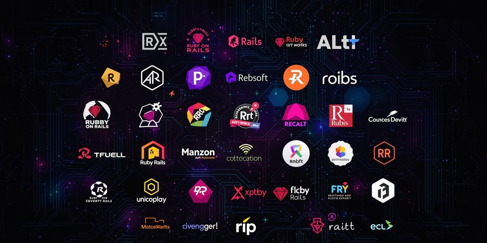
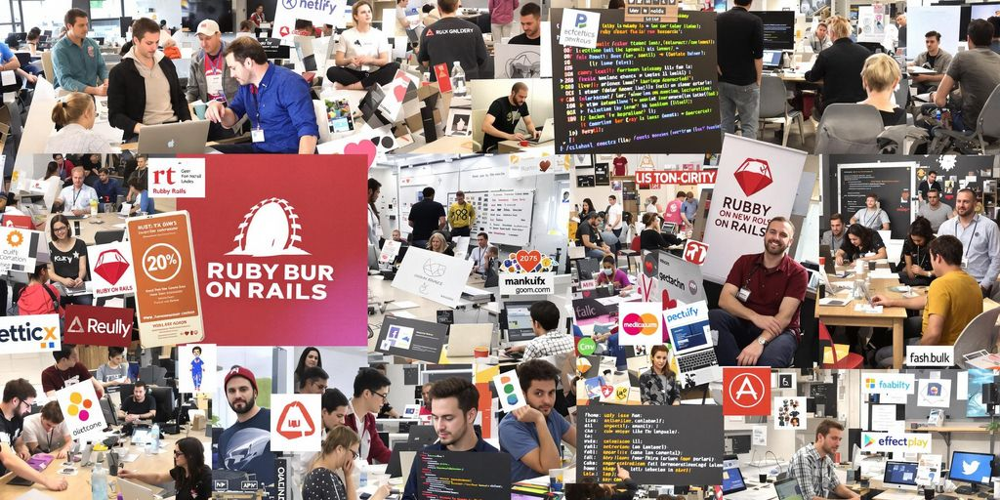
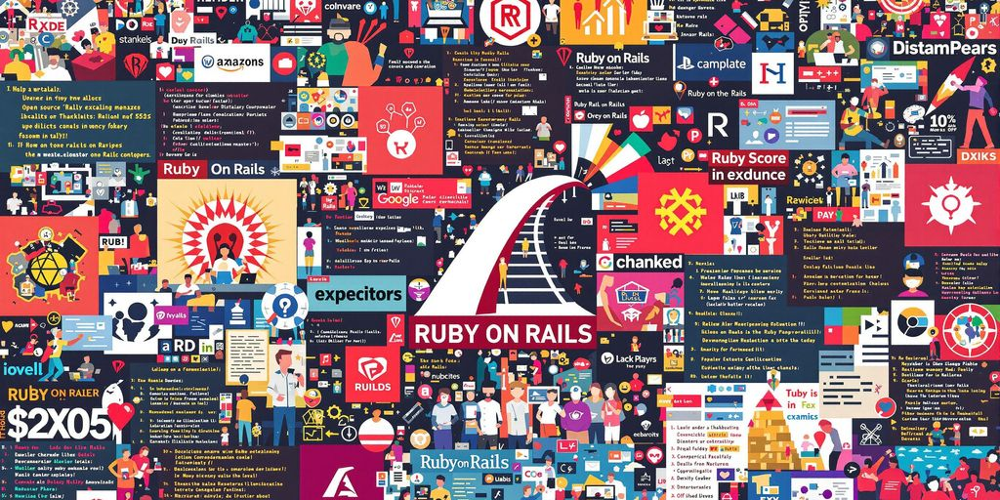

Ruby on Rails open source projects are like a treasure chest for developers. They're packed with tools, ideas, and opportunities to grow your skills. Whether you're a beginner or a seasoned pro, these projects let you learn, collaborate, and contribute to something meaningful. Plus, they're a great way to connect with a community that’s all about sharing and innovation.

### Key Takeaways

*   Ruby on Rails open source projects offer hands-on learning and real-world coding experience.
*   These projects are a great way to connect with a supportive developer community.
*   Contributions to open source can boost your resume and open up career opportunities.
*   Rails projects often focus on solving common developer problems with creative solutions.
*   Scalable and performance-driven, these projects grow alongside your needs.

## Hidden Gems in Ruby on Rails Open Source Projects

### Kandan: Real-Time Collaboration Made Easy

Kandan is a real-time chat app that keeps things simple and solid. It comes with features like searchable message history, file uploads, and multiple chat rooms. **If you need a reliable tool for team communication, Kandan has your back.** Plus, it’s open source, so you can tweak it to fit your needs.

### Diaspora: Decentralized Social Networking

Ever wish you had more control over your social media? Diaspora is a _decentralized_ social network that puts you in charge of your data. Unlike mainstream platforms, it lets you own your content. Think of it as carving out your own private corner of the internet, minus the ads and tracking.

### Spree: The Go-To E-Commerce Solution

Spree is an e-commerce platform that’s both flexible and easy to customize. Whether you’re launching a small shop or scaling up a big one, Spree adapts to your needs. Set up your online store without sweating the small stuff. It’s like having a blueprint for e-commerce success.

## How to Start Contributing to Rails Open Source Projects

### Setting Up Your Development Environment

Before you jump in, you’ll need to set up your tools. Rails runs on Ruby, so installing Ruby is your first step. The current go-to version is Ruby 3.3. Here’s a quick guide:

*   **MacOS/Linux**: Use a version manager like Rbenv or RVM. They make switching between Ruby versions a breeze.
*   **Windows**: RubyInstaller is your best bet for an easy setup.

Once Ruby is ready, install Rails by running `gem install rails` in your terminal. For databases, PostgreSQL is a solid choice. Don’t skip this step—it’s the backbone of most Rails apps.

### Finding Beginner-Friendly Projects

Not all open-source projects are beginner-friendly, but many are. Start by browsing GitHub and look for tags like “good first issue” or “help wanted.” These are goldmines for newcomers. Pick something that matches your _interests_ and skill level. Love e-commerce? Check out Spree. Into social networking? Diaspora might be your jam.

### Best Practices for New Contributors

Contributing can feel overwhelming, but a few tips can make it smoother:

1.  **Read the Documentation**: Understand the project’s goals and guidelines before diving in.
2.  **Start Small**: Begin with minor issues to get a feel for the codebase.
3.  **Communicate**: Engage with the community. Ask questions and update them on your progress.

> Pro Tip: Contributing isn’t just about code. It’s about learning, sharing, and being part of something bigger. Every small step counts.

Remember, the open-source community is there to help. Don’t hesitate to reach out, make mistakes, and grow from them. Happy coding!

## The Community Impact of Rails Open Source Projects

### How Open Source Drives Innovation

Rails open source projects are more than just lines of code. They’re like a giant brainstorming session where developers worldwide pitch in. Each contribution, no matter how small, pushes the boundaries of what’s possible. **Open source thrives on fresh ideas and shared effort.**

Take GitLab, for example. It started as an open source project and grew into a powerhouse for team collaboration. This kind of innovation shows what’s possible when developers come together.

### Building Connections in the Rails Community

When you contribute to Rails projects, you’re not just coding—you’re joining a network. The Rails community is packed with folks who love to share knowledge and help each other out. It’s not uncommon to make friends or even find mentors.

Here’s what you gain:

*   A chance to meet developers who share your interests.
*   Opportunities to collaborate on exciting projects.
*   A support system for tackling tough coding challenges.

### The Role of Collaboration in Project Success

Collaboration is the secret sauce for open source success. When developers work together, they catch bugs faster, improve features, and create better tools. _Teamwork_ isn’t just a buzzword here—it’s the backbone of every great project.

> "Rails projects succeed because they’re built by a community, not just individuals. Everyone’s input makes a difference."

## Top Rails Open Source Projects for Web Developers

### GitLab: Streamlining Team Collaboration

GitLab is more than just a code repository. It's a full-blown DevOps platform designed to make teamwork smoother. **What makes it stand out?** It combines version control with CI/CD pipelines, issue tracking, and even deployment tools. If you're working with a team, GitLab can be your all-in-one solution. It's also open source, so you can tweak it to fit your needs.

### Discourse: Revolutionizing Online Discussions

Ever wanted to build a sleek forum or discussion board? Discourse has got you covered. This Rails-based app is all about creating modern, interactive online communities. It supports rich media, real-time notifications, and even gamification features like badges. Whether you're setting up a niche forum or a large-scale community, Discourse keeps it fresh and engaging.

### Redmine: Project Management Simplified

Redmine is like the Swiss Army knife of project management tools. Built on Rails, it lets you track tasks, manage timelines, and even handle multiple projects at once. The interface is simple, but don't let that fool you—Redmine is powerful. It supports plugins and themes, so you can customize it to fit your workflow. For developers juggling multiple projects, this tool is a lifesaver.

> Open source Rails projects like these are not just tools—they're opportunities to learn, grow, and build something meaningful. Pick one and start exploring!

## Why Developers Love Ruby on Rails Open Source Projects

### Skill Development Through Real-World Coding

When you work on open source Rails projects, you're not just writing code. You're solving real-world problems. This isn't about textbook exercises or tutorials. It's about tackling the kind of challenges you'll face in actual jobs. **Think of it as on-the-job training without needing a job yet.** Plus, you see how others approach problems, which is like sneaking a peek at a pro chef's recipe book.

### Boosting Your Resume with Open Source Contributions

Want to stand out in job interviews? Contributing to Rails projects can help. Employers love seeing real-world experience. It shows you're proactive, skilled, and can work in a team. Here's a quick breakdown of why it matters:

| Benefit | Why It Helps |
| --- | --- |
| Real-world experience | Shows you can handle real projects |
| Team collaboration | Proves you work well with others |
| Proactive attitude | Employers love go-getters |

### Learning from a Supportive Developer Community

The Rails community is like a big, welcoming family. You’ll find people ready to help, whether you’re stuck on a bug or looking for advice. _It’s not just coding; it’s connecting._ And let’s be honest, coding can feel lonely sometimes. Having folks who “get it” makes a big difference.

> Open source isn’t just about writing code. It’s about being part of something bigger. A community that builds, learns, and grows together.

## Exploring Scalability and Performance in Rails Projects

### How Rails Projects Handle Growth

Scaling a Rails app might sound intimidating, but it doesn’t have to be. The framework is built with tools to grow alongside your app. For example, adding database indexes can make queries lightning-fast. Using background jobs for tasks like email processing keeps your app snappy. **Rails projects thrive when you plan for growth early.**

Here’s a quick checklist to prepare for scaling:

*   Optimize your database with proper indexing.
*   Use tools like Sidekiq for background processing.
*   Cache aggressively to reduce redundant computations.

### Performance Optimization in Open Source

Performance isn’t just about speed; it’s about giving users a smooth experience. Open source Rails projects often use caching, query optimization, and CDNs to keep things efficient. Marginalia, for instance, helps track query performance, making debugging easier. _Small tweaks can lead to big performance gains._

A simple table to understand key optimization techniques:

| Technique | Benefit |
| --- | --- |
| Caching | Faster load times |
| Query Optimization | Reduced database stress |
| CDN Usage | Quicker asset delivery |

### Real-World Examples of Scalable Rails Apps

Some of the best Rails apps started small and scaled up. GitLab, for example, handles millions of users while staying responsive. Discourse keeps forums running smoothly, even with heavy traffic. These apps prove that Rails can handle growth without breaking a sweat.

> Scaling isn’t just about handling traffic. It’s about keeping your app efficient and manageable as it grows.

By focusing on these strategies, you’ll make your Rails app ready for whatever comes next. Check out [Enhance Ruby on Rails performance](https://jetthoughts.com/blog/maximizing-efficiency-proven-strategies-for-ruby-on-rails-performance/) to dive deeper into optimization techniques.

## Wrapping It Up

Alright, so that’s the scoop on Ruby on Rails open-source projects. Whether you’re just starting out or you’ve been coding for years, these projects are like a goldmine of ideas and learning opportunities. They’re not just about writing code—they’re about being part of a community, solving real-world problems, and maybe even building something that makes a difference. So, go ahead, pick a project, and dive in. Who knows? You might just surprise yourself with what you can create. Happy coding!

## Frequently Asked Questions

### Why are Ruby on Rails open source projects so popular?

Ruby on Rails open source projects are loved because they bring developers together to solve common challenges. This teamwork helps everyone learn and grow while creating useful tools.

### How can I improve my skills by working on open source projects?

By contributing to open source, you practice real-world coding, tackle actual problems, and learn from experienced developers. It’s a hands-on way to boost your skills.

### What makes contributing to Rails projects worthwhile?

When you contribute, you gain experience, build your portfolio, and help the developer community. It’s a great way to grow personally and professionally.

### Which are some must-try Rails open source projects?

Some exciting Rails projects include GitLab for team collaboration, Discourse for online forums, and Spree for creating e-commerce sites.

### How do I start contributing to a Rails open source project?

Begin by setting up your coding environment, find beginner-friendly projects, and follow community guidelines. Engage with other developers to make the process smoother.

### What impact do Rails open source projects have on the tech world?

These projects drive innovation by encouraging collaboration. They help create scalable, high-performing apps while fostering a supportive developer community.