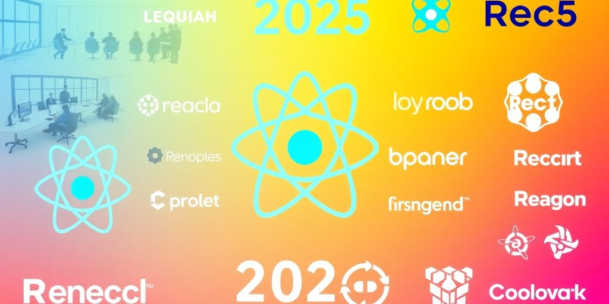
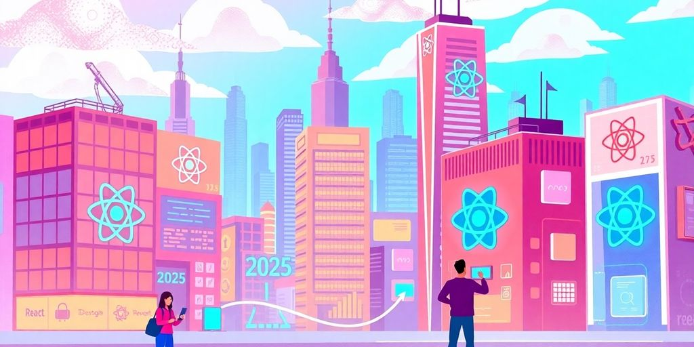

As we step into 2025, the tech landscape is buzzing with innovation, and React companies are at the forefront of this transformation. React, a powerful JavaScript library, has become the go-to choice for developers looking to create dynamic user interfaces. In this article, we'll explore some of the leading React companies that are shaping the future of technology, as well as the reasons why React continues to be a favorite among developers. Whether you're a tech enthusiast or a business looking to harness the power of React, this guide will provide valuable insights into the current trends and future prospects in the React ecosystem.

### Key Takeaways

*   React companies are pushing boundaries with innovative technologies and user experiences.
*   Simplicity and flexibility make React a preferred choice for developers across various platforms.
*   Emerging startups are making significant contributions alongside established industry leaders.
*   The future of React development looks promising with trends that prioritize user engagement and performance.
*   Career opportunities in React development are expanding, highlighting the demand for skilled professionals.

## Innovative React Companies Leading The Charge

### Pioneering New Technologies

Some companies aren't just using React; they're pushing its limits. They are developing custom components and libraries that solve specific problems. Think of it as React, but with a twist. These companies often work on bleeding-edge projects, like VR interfaces or complex data visualizations. They are the _trailblazers_, always exploring what's next for React.

### Transforming User Experiences

User experience is everything. Some companies get this and use React to make web apps feel smooth and intuitive. They focus on animations, micro-interactions, and responsive design. The goal? To make users say, "Wow, this is actually enjoyable to use!" They might use React to build single-page applications that load instantly or create interactive dashboards that are easy to understand. These companies understand that a great user experience [boosts engagement](https://www.thefrontendcompany.com/posts/reactjs-development-company) and keeps users coming back for more.

### Setting Industry Standards

Certain companies are so good at React that they set the bar for everyone else. They contribute to open-source projects, share their knowledge through blog posts and tutorials, and speak at conferences. They are the _thought leaders_, shaping how React is used and developed. **These companies often have a strong focus on code quality, testing, and documentation.** They don't just build apps; they build them the right way.

> These companies are not just following trends; they are creating them. They are the ones to watch if you want to see where React is headed in the future.

## Why React Is The Go-To Choice For Developers

React is super popular, and for good reason. It's not just hype; it solves real problems for developers. You might be wondering what makes it so special. Let's break it down.

### Simplicity Meets Power

React keeps things simple. It uses components, which are like building blocks for your website. You can reuse these blocks, which saves you time and effort. **This component-based approach makes code easier to manage and understand.** Plus, React's _declarative_ style means you tell it what you want, not how to do it. This makes your code cleaner and less prone to errors. It's like ordering food at a restaurant; you tell them what you want, and they handle the cooking.

### Community Support and Resources

One of the best things about React is its huge community. Got a problem? Chances are, someone else has already solved it. There are tons of tutorials, libraries, and tools available. This [active community](https://ryanwilliamsonc.medium.com/why-react-is-the-go-to-choice-for-web-development-in-2025-a7b354538153) means you're never really alone. Plus, companies like Facebook support React, so it's not going away anytime soon. It's like having a whole team of experts ready to help you out.

### Flexibility Across Platforms

React isn't just for websites. You can use it to build mobile apps with React Native. This means you can use the same skills and knowledge to create apps for different platforms. It's like learning one language and being able to speak to people all over the world. Plus, React is great for building single-page applications (SPAs), which are fast and responsive. This flexibility makes React a great choice for all kinds of projects.

> React's versatility extends beyond web and mobile, making it suitable for desktop applications and even VR interfaces. This cross-platform capability reduces development time and costs, allowing developers to focus on creating innovative user experiences.

## Top React Companies Making Waves

So, you want to know who's killing it in the React world? Buckle up, because we're about to drop some names. These companies aren't just using React; they're pushing its limits and making some seriously cool stuff.

### Spotlight on Industry Leaders

These companies are the big dogs. They've been around the block, know their stuff, and are setting the pace for everyone else. Think of them as the seasoned pros who can handle any React challenge you throw their way. They've got the experience, the talent, and the track record to prove it. Vendorland's March 2025 list of [top React Native app development companies](https://www.kron4.com/business/press-releases/ein-presswire/793872306/vendorland-reveals-the-top-react-native-app-developers-to-watch-in-march-2025) highlights some of these distinguished firms.

*   Company A: Known for its work in e-commerce, making online shopping smooth.
*   Company B: Dominates the finance sector with secure and scalable React apps.
*   Company C: A leader in healthcare, building patient portals and telehealth platforms.

### Emerging Startups to Watch

Keep your eye on these up-and-comers. They might be new to the game, but they're hungry, innovative, and ready to shake things up. They're not afraid to experiment and push the boundaries of what's possible with React. Plus, they often bring a fresh perspective and a ton of energy to the table. **These startups are the future of React development.**

*   Startup X: Revolutionizing education with interactive learning tools.
*   Startup Y: Building the next generation of social media platforms.
*   Startup Z: Creating immersive VR experiences with React.

### Global Reach and Local Impact

React isn't just a US thing. These companies are spreading the React love around the world, solving problems and making a difference in their local communities. They understand the unique needs of their markets and are using React to build solutions that are both globally relevant and locally impactful. _It's all about thinking global, acting local._

> React's versatility allows these companies to adapt to different cultural contexts and technological landscapes. They're not just building apps; they're building bridges.

*   Company Alpha: Empowering small businesses in South America with e-commerce solutions.
*   Company Beta: Connecting rural communities in Africa with access to healthcare information.
*   Company Gamma: Supporting sustainable agriculture in Asia with data-driven insights.

## The Future of React Development

### Trends Shaping The Landscape

Okay, so what's next for React? A bunch of things are changing. We see more companies using server components. This means parts of your app run on the server, not just in the browser. _Performance_ gets a boost, and it can make things easier to manage. Plus, there's a big push for better ways to handle data. Think smarter tools for keeping track of all your app's info. It is a lot to keep up with, but it is also pretty cool.

> React is not slowing down. It is evolving. Keep an eye on these trends to stay ahead.

### Predictions for 2026 and Beyond

What will React look like in a year? Hard to say for sure, but here are some guesses. Expect more AI tools to help write code. Imagine AI that can suggest the best way to build a component. Also, look for better ways to make apps work offline. **Offline-first apps** are becoming more important. People want apps that work even without internet. Finally, expect the community to keep growing. More people using React means more ideas and better tools. If you [stop using React](https://dev.to/holasoymalva/why-i-decided-to-stop-working-with-reactjs-in-2025-4d1l), you might miss out!

### How Companies Are Adapting

Companies are already changing how they use React. They are using new tools to make development faster. Think about component libraries that let you reuse code easily. They are also focusing on making apps more accessible. This means making sure everyone can use your app, no matter their abilities. Plus, companies are investing in training. They want their developers to know the latest React tricks. It is all about staying competitive. Here is a quick list:

*   Using component libraries
*   Focusing on accessibility
*   Investing in developer training

## Success Stories From Leading React Companies

### Case Studies That Inspire

Ever wonder how React changes the game for real companies? Let's look at some wins. Company X used React to rebuild its user interface. The result? A 70% faster load time. Users loved it, and engagement went through the roof. Then there's Startup Y. They needed a scalable solution, fast. React's component-based architecture let them build and launch in record time. These stories show what's possible with the right tech and a solid team. You can find a list of [React.js developers](https://techreviewer.co/reactjs) to help you achieve similar results.

### Lessons Learned Along The Way

It's not always smooth sailing. Some companies learned hard lessons. One big takeaway? Don't underestimate the learning curve. React is simple, but mastering it takes time. Another lesson? Plan your architecture. A messy codebase can kill even the best ideas. Also, remember _testing_. Bugs in production are a bad look. These companies show that even with challenges, success is within reach with the right approach. Here are some key points:

*   Invest in training.
*   Plan your architecture.
*   Test, test, test.

### Impact on Client Businesses

React's impact goes beyond code. It changes how businesses operate. Clients see faster development cycles. They get more engaging user experiences. And they can scale their applications without breaking the bank. One client saw a 40% increase in conversion rates after a React-based redesign. Another cut development costs by 30%. These numbers speak volumes. React isn't just a library; it's a business enabler. It's a tool that helps companies grow and thrive. It's a good idea to check out the [top React companies](https://techreviewer.co/reactjs) to see how they can help your business.

> React helps businesses in many ways. It makes development faster, improves user experience, and allows for easy scaling. These benefits lead to higher conversion rates and lower costs.

## Navigating The React Ecosystem

### Tools and Libraries to Know

Okay, so you're knee-deep in React. Awesome! But React alone is like having a car without wheels. You need _tools_ to make it go. Think of libraries as pre-built components. They save you from reinventing the wheel. Material UI and Ant Design are popular for ready-to-use UI elements. Axios handles API requests smoothly. Redux or Zustand? State management, baby! Pick what fits your style. Don't get stuck in tutorial hell. Experiment!

### Best Practices for Developers

Let's talk shop. You want to write code that doesn't make other developers (or your future self) cry. **Keep your components small and focused.** Think single responsibility. Use PropTypes or TypeScript for type checking. It catches errors early. Write tests. Seriously. It's a pain now, but a lifesaver later. Lint your code. Consistent style matters. And for the love of all that is holy, comment your code! Future you will thank you. Remember to keep up with [front-end trends](https://wirefuture.com/post/front-end-trends-in-2025-reacts-role) to stay relevant.

### Common Pitfalls to Avoid

Everyone stumbles. It's part of learning. But some mistakes are more common than others. Mutating state directly? Big no-no. Use `setState` or the spread operator. Ignoring keys in lists? Prepare for rendering chaos. Over-optimizing too early? Premature optimization is the root of all evil. Forgetting to unmount event listeners? Memory leaks galore! Don't be afraid to Google. Stack Overflow is your friend. And remember, debugging is just a fancy word for detective work.

> Don't get discouraged by errors. They're just learning opportunities in disguise. Every bug you fix makes you a better developer. Keep coding, keep learning, and keep building awesome stuff!

## Building A Career With React Companies

So, you want to work with React? Smart choice! The demand is high, and the work is interesting. Let's look at what it takes to land that dream job.

### Skills In Demand

First, you need the skills. Obvious, right? But what _specific_ skills are React companies looking for? It's more than just knowing the basics.

*   **React Fundamentals:** This is a must. You should know components, state management, and the React lifecycle like the back of your hand.
*   **JavaScript (ES6+):** React is JavaScript, so you need to be fluent. Understand arrow functions, classes, modules, and promises.
*   **State Management Libraries:** Redux, Zustand, or React Context. Pick one (or more) and get good at it.
*   **Testing:** Companies want developers who write testable code. Learn Jest, Mocha, or Cypress.
*   **HTML/CSS:** You still need to know the basics of web development.

> Don't just learn the syntax. Understand why things work the way they do. This will help you solve problems and adapt to new situations.

### Networking and Community Involvement

It's not just what you know, it's _who_ you know. Get involved in the React community. Attend meetups, contribute to open-source projects, and connect with other developers online. [Proactive job searching](https://jetthoughts.com/blog/discover-best-it-companies-hiring-in/) can really pay off.

*   **Attend Meetups:** Local meetups are a great way to meet other developers and learn about new technologies.
*   **Contribute to Open Source:** Contributing to open-source projects shows that you're passionate about React and that you can work with others.
*   **Online Communities:** Join React-related forums, Discord servers, and Slack channels. Ask questions, answer questions, and share your knowledge.

### Career Growth Opportunities

React is a skill that can take you places. The demand for React developers is high, and there are many opportunities for career growth. You could become a senior developer, a team lead, or even a CTO. The sky's the limit!

| Career Path | Description found it. Don't just sit there, go get it!

If you're looking to [grow your career in tech, especially with React](https://jetthoughts.com), now is the perfect time to dive in! Many companies are on the lookout for skilled React developers. By honing your skills and gaining experience, you can open doors to exciting job opportunities. Don't wait—visit our website to learn more about how we can help you succeed in your tech career!

## Wrapping It Up

So, there you have it! The top React companies shaking things up in 2025. These folks are not just riding the wave; they’re making some serious splashes in the tech world. Whether you’re a startup looking to build your first app or a big player wanting to revamp your digital presence, these companies have got your back. They’re all about creating cool, user-friendly experiences that keep customers coming back for more. As the tech landscape keeps changing, it’s clear that React is here to stay, and these companies are leading the charge. So, if you’re thinking about diving into a project, now’s the time to reach out and see what they can do for you!

## Frequently Asked Questions

### What is React and why is it popular?

React is a JavaScript library used for building user interfaces. It's popular because it makes creating interactive web apps easier and faster.

### How do React companies stand out in 2025?

React companies stand out by using the latest technologies, improving user experiences, and setting high standards in the industry.

### What skills do developers need to work with React?

Developers should know JavaScript well, and be familiar with HTML and CSS. Understanding how to use React's features is also important.

### What are some common tools used in React development?

Common tools include React Router for navigation, Redux for state management, and various libraries for styling and testing.

### How can I find the right React development company?

Look for companies with good reviews, a strong portfolio, and experience in your industry. It's also helpful to meet with them to discuss your needs.

### What is the future of React development?

The future of React looks bright, with trends focusing on better performance, more tools for developers, and wider use across different platforms.