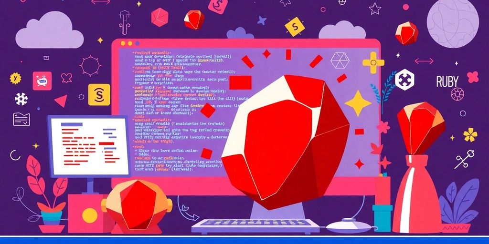

Ruby has carved out a significant niche in the world of web development, particularly when it comes to creating modern web applications. Its elegant syntax and powerful frameworks make it a favorite among developers. In this article, we will explore how Ruby fits into the frontend landscape, the frameworks that enhance its capabilities, and the best practices for integrating Ruby with JavaScript. Whether you're a seasoned developer or just starting out, understanding Ruby's role in frontend development can help you build better applications.

### Key Takeaways

*   Ruby's simplicity and elegance make it a strong choice for web development.
*   Combining Ruby with JavaScript frameworks like React and Vue.js can enhance application interactivity.
*   Ruby on Rails offers robust tools for integrating modern frontend technologies.
*   Utilizing GraphQL with Ruby can optimize data handling and improve performance.
*   Staying connected with the Ruby community is essential for keeping up with new trends and resources.

## Understanding Ruby’s Role In Modern Development

Ruby is a big deal in today's software world. It helps developers make strong apps quickly. It's a favorite for many reasons.

### Why Ruby Stands Out

Ruby is known for being easy to read and write. Its syntax is clean, which makes coding less of a headache. **This means you can get more done with less code.** Plus, Ruby has a huge community that's always creating new tools and libraries. These tools help you solve problems faster and make your apps better. It also allows for [custom software integration](https://jetthoughts.com/blog/how-effectively-hire-ruby-developers-for-your-next-project/), further enhancing application performance.

### The Power of Ruby on Rails

Ruby on Rails is a framework that makes web development faster and easier. It follows the idea of "convention over configuration," which means you spend less time setting things up and more time building features. Rails is great for making all kinds of web apps, from simple blogs to complex e-commerce sites. Over 3 million websites use Ruby on Rails. It focuses on how developers feel when using it. Its syntax is easy to understand. This speeds up development and helps team members work together better.

### Ruby for Rapid Prototyping

Need to build something fast? Ruby is your friend. Its simple syntax and powerful frameworks let you create prototypes quickly. This is great for testing ideas and getting feedback early in the development process. Plus, Ruby's flexibility means you can easily change your prototype as you learn more. Research shows that using Ruby on Rails for backend services can reduce development time by up to 40%.

> Ruby's ability to quickly create and modify prototypes makes it ideal for startups and businesses that need to adapt to changing market conditions. It allows for faster iteration and quicker response to user feedback, giving you a competitive edge.

## Frameworks That Make Ruby Frontend Shine

So, you want your Ruby frontend to really _pop_? Good choice. Let's look at some frameworks that can make that happen. It's all about picking the right tools for the job, and trust me, there are some gems out there.

### Rails and React: A Dynamic Duo

Rails and React? It's like peanut butter and jelly. They just work. **Rails handles the backend like a champ, while React makes your frontend interactive and smooth.** Think single-page applications that load in a snap. Plus, with Rails' API mode, you can keep things nice and separate. It's a win-win.

*   Component-based architecture
*   Virtual DOM for performance
*   Large community support

> Using Rails for your backend can cut development time. This lets you focus on making the frontend awesome.

### Vue.js for Ruby Developers

Vue.js is the friendly face of frontend frameworks. It's easy to learn, flexible, and plays well with Ruby. If you're looking to add some interactivity without a huge learning curve, Vue.js is your friend. Plus, it's great for smaller projects or adding features to existing apps. It's like the Swiss Army knife of frontend tools.

*   Simple syntax
*   Reactive data binding
*   Easy integration with existing projects

### Exploring Sinatra and Hanami

Want to keep things lean and mean? Sinatra is your answer. It's a lightweight framework perfect for APIs and microservices. Need something more structured? Hanami offers a modular architecture that keeps your code clean and organized. Both are great choices depending on your project's needs. Think of Sinatra as a nimble sports car and Hanami as a well-organized toolbox.

| Framework | Use Case | Key Feature |
| --- | --- | --- |
| Sinatra | APIs, Microservices | Lightweight |
| Hanami | Large, Complex Apps | Modular Architecture |

Sinatra is a [minimalistic framework](https://www.lambdatest.com/blog/best-ruby-frameworks/) for building rack apps. Rails offers robust mechanisms for seamless frontend framework integration.

## Integrating Ruby with JavaScript Frameworks

So, you want to mix Ruby with JavaScript? Smart move! It's like peanut butter and jelly—two great tastes that taste great together. Let's explore how to make this happen.

### The Benefits of Combining Forces

Why bother mixing Ruby and JavaScript? Well, each has its strengths. Ruby shines on the backend, handling data and logic with elegance. JavaScript dominates the frontend, creating interactive user interfaces. **Together, they form a powerful team.** Think of Ruby as the brains and JavaScript as the face—both are needed for a complete package.

*   Faster development: Ruby on Rails can cut backend development time.
*   Better user experience: JavaScript frameworks make your site interactive.
*   More innovation: Combining the two encourages creative solutions.

> Integrating Ruby and JavaScript lets you build robust applications with a clear separation of concerns. Ruby handles the data and logic, while JavaScript manages the presentation and user interaction. It's a win-win!

### Popular JavaScript Frameworks to Use

Okay, so you're sold on the idea. Which JavaScript frameworks play nice with Ruby? Here are a few top contenders:

*   React: A popular choice for building dynamic UIs. It works well with Rails through tools like Webpacker. React is great for single-page applications.
*   Vue.js: Known for its simplicity and ease of use. Vue.js integrates smoothly with Ruby backends. It's a good option if you're new to JavaScript frameworks.
*   Angular: A comprehensive framework for building complex applications. Angular can be used with Ruby, but the setup might be more involved. It's suitable for large projects.

Rails has created mechanisms for [seamless frontend framework integration](https://jetthoughts.com/blog/how-hire-ruby-on-rails-developer/), offering flexibility in building dynamic web experiences.

### Best Practices for Integration

Making Ruby and JavaScript work together smoothly requires some planning. Here are a few tips to keep in mind:

1.  Use APIs: RESTful APIs provide clear communication between the backend and frontend.
2.  Consider GraphQL: GraphQL can reduce data over-fetching, improving performance.
3.  Document everything: Good API documentation is _essential_ for team collaboration.

| Practice | Benefit |
| --- | --- |
| RESTful APIs | Clear communication |
| GraphQL | Reduced data over-fetching |
| API Documentation | Better understanding and collaboration |

Don't forget about security! Protect your APIs and validate data on both the frontend and backend. Happy coding!

## Enhancing User Experience with Ruby

### Optimizing Performance Metrics

Let's talk speed. No one likes a slow website. With Ruby, you can make things _zippy_. A well-tuned Rails app can respond super fast, which makes users happy. It's all about keeping people engaged and not clicking away in frustration. Think of it like this: a fast site is a friendly site. You can use Ruby to handle data efficiently and streamline operations. This helps improve [performance in Ruby on Rails](https://jetthoughts.com/blog/best-practices-for-optimizing-ruby-on-rails-performance/).

*   Optimize database queries.
*   Use caching strategies.
*   Monitor server performance.

### Creating Interactive Applications

Ruby plays well with JavaScript. This is a big deal because JavaScript is what makes websites interactive. Ruby handles the backend, and JavaScript handles the frontend. This combo lets you build cool stuff without lag. Think real-time updates and dynamic content. It's like having a super team for your website. Plus, Ruby's syntax is easy to read, which helps developers work together better. **This makes building complex features easier.**

> By using Ruby effectively, you can make sure developers and designers communicate well. This is key for making a final product that works well and looks good.

### Leveraging GraphQL for Efficiency

GraphQL can change how you get data from the server. It lets you ask for exactly what you need, which means less data gets sent. This makes things faster. Some apps using GraphQL have seen response times improve by up to 30%. It's like ordering exactly what you want from a menu instead of getting the whole buffet. This is a great way to improve [restaurant feedback software](https://jetthoughts.com/blog/best-practices-for-optimizing-ruby-on-rails-performance/) and other applications.

Here's a quick look at how GraphQL compares:

| Feature | GraphQL |
| --- | --- |
| Data Fetching | Asks for specific data |
| Over-fetching | Avoids getting extra data |
| Response Times | Faster in many cases |

## Community and Resources for Ruby Frontend Development

### Joining the Ruby Community

The Ruby community? It's huge. Seriously, it's like a giant, friendly coding family. You'll find people of all skill levels, from total newbies to seasoned pros. The best part? Everyone's usually super willing to help each other out. Find a local [Ruby meetup](https://jetthoughts.com/blog/exploring-innovative-ruby-on-rails-open/) or an online forum. Ask questions. Share your code. Don't be shy. We were all beginners once.

### Top Resources and Tutorials

Okay, so you want to learn more about Ruby frontend development? Awesome! There are tons of resources out there. Here are a few ideas:

*   **Official Ruby Documentation:** This is your bible. Get to know it.
*   **Online Courses:** Sites like Udemy and Coursera have great courses. Look for ones specifically on Ruby and frontend frameworks.
*   **Blogs and Articles:** Keep an eye on popular Ruby blogs. They often have tutorials and tips.

> Don't just read. Code. Seriously, the best way to learn is by doing. Build small projects. Experiment. Break things. Fix them. That's how you really learn.

### Staying Updated with Trends

The world of web development moves fast. Like, _really_ fast. What's hot today might be old news tomorrow. So, how do you keep up? Here's the deal:

*   **Follow Key People on Social Media:** Find Ruby developers and thought leaders on Twitter or LinkedIn.
*   **Read Industry Newsletters:** Sign up for newsletters that focus on Ruby and frontend development.
*   **Attend Conferences (Virtual or In-Person):** Conferences are a great way to learn about new trends and network with other developers. Plus, free swag!

**Staying current is key.** Don't get stuck using outdated tools or techniques. Embrace the new stuff. Experiment. Have fun. And remember, the Ruby community is here to help you along the way. You got this!

## Common Challenges in Ruby Frontend Development

### Navigating Integration Issues

So, you're trying to get your Ruby backend to play nice with your fancy JavaScript frontend? Cool. It's not always a walk in the park. One common issue? _Version conflicts_. Make sure your gems and npm packages are friends, not enemies. It's like trying to fit a square peg in a round hole if they don't match up.

> Keep your dependencies in check. Use tools like Bundler and npm to manage versions. This helps avoid unexpected errors and keeps your project stable.

### Debugging Tips and Tricks

Debugging can feel like searching for a needle in a haystack. Here are a few tricks to make it less painful:

*   Use `binding.pry` in your Ruby code to pause execution and inspect variables. It's like having a superpower.
*   Leverage your browser's developer tools for JavaScript debugging. Console logs are your friends.
*   Check your server logs for errors. They often hold clues to what's going wrong.

**Don't be afraid to ask for help**. Seriously, Stack Overflow is your buddy. Someone has probably faced the same issue.

### Balancing Backend and Frontend Work

Ah, the age-old question: backend or frontend? It's tough to be a master of both. Here's how to strike a balance:

*   Clearly define roles and responsibilities within your team. Who owns what?
*   Use [frontend development agency](https://jetthoughts.com/blog/choosing-right-frontend-development-agency-for/) to streamline communication between backend and frontend developers. Miscommunication is a project killer.
*   Prioritize tasks based on user needs. What will provide the most value to your users?

It's like juggling chainsaws. You need focus, skill, and maybe a little bit of luck. Remember, teamwork makes the dream work. Or at least makes the project less of a nightmare.

## Future Trends in Ruby Frontend Development

### Emerging Technologies to Watch

Frontend tech changes fast. What's cool today might be old news tomorrow. For Ruby developers, keeping an eye on new stuff is key. _Micro frontends_ are gaining traction. They let you break up your frontend into smaller, manageable pieces. This makes scaling and team collaboration easier. Think of it as building with LEGOs instead of one giant block. Also, watch for advancements in WebAssembly. It could bring near-native performance to web apps.

### The Rise of Augmented Reality

AR is not just for games anymore. It's finding its way into web applications. Imagine using your phone to see how furniture fits in your living room before you buy it. Or getting step-by-step instructions overlaid on real-world objects. Ruby can play a role here, especially on the backend. It can handle the data and logic that power these AR experiences. The growing trend towards [ar development](https://jetthoughts.com/blog/exploring-future-of-frontend-technology-trends-innovations-for-2025/) highlights the need for adaptable technologies.

### Sustainability in Development Practices

Being green is not just a trend; it's a responsibility. Web development has a carbon footprint. Optimizing code, reducing data transfer, and using energy-efficient servers can make a difference. Think about it: smaller JavaScript bundles mean faster load times and less energy used. Ruby developers can contribute by writing clean, efficient code and choosing sustainable hosting options. Consider these points:

*   Use efficient algorithms.
*   Optimize images and assets.
*   Choose green hosting providers.

> Sustainable development is about meeting the needs of the present without compromising the ability of future generations to meet their own needs. This applies to web development too. We need to build websites and applications that are not only functional and user-friendly but also environmentally responsible.

**Focus on performance.** Faster sites use less energy. Use tools to measure your site's carbon footprint. Every little bit helps. Also, consider using [restaurant feedback software](https://jetthoughts.com/blog/exploring-future-of-frontend-technology-trends-innovations-for-2025/) to improve your services.

As we look ahead, [Ruby is set to play a bigger role in frontend development.](https://jetthoughts.com) With new tools and libraries emerging, developers can create even more dynamic and engaging web applications. This shift will not only enhance user experiences but also streamline the development process. If you're curious about how these trends can benefit your projects, visit our website for more insights and resources!

## Wrapping It Up

So, there you have it! Ruby frontend development is all about finding the right tools and practices that work for you. Whether you’re using Rails with React or trying out Vue.js, the key is to keep experimenting and learning. Don’t stress if things don’t click right away; it takes time to get comfortable with these integrations. Just remember, the Ruby community is super supportive, so don’t hesitate to reach out for help or share your experiences. Dive into some projects, play around with the frameworks, and before you know it, you’ll be building awesome web apps like a pro. Happy coding!

## Frequently Asked Questions

### What makes Ruby a good choice for web development?

Ruby is known for being easy to read and write, which helps developers build applications quickly. Its frameworks, like Ruby on Rails, make it even faster to create web apps.

### How do Ruby and JavaScript work together?

Ruby is often used for the backend, while JavaScript is used for the frontend. This combination allows developers to create dynamic and interactive user experiences.

### What are some popular frameworks for Ruby frontend development?

Some popular frameworks include Ruby on Rails for backend work, and React or Vue.js for frontend interactions. These tools help developers build modern web applications.

### How can I improve my skills in Ruby frontend development?

Practice is key! Try building small projects and experiment with different frameworks. Joining the Ruby community can also provide support and resources.

### What challenges might I face when using Ruby for frontend work?

You might encounter issues with integrating Ruby and JavaScript frameworks, or debugging code. Balancing backend and frontend tasks can also be tricky.

### What are some future trends in Ruby frontend development?

Some trends to watch include the rise of augmented reality applications and a focus on sustainable development practices. Staying updated with new tools is important.